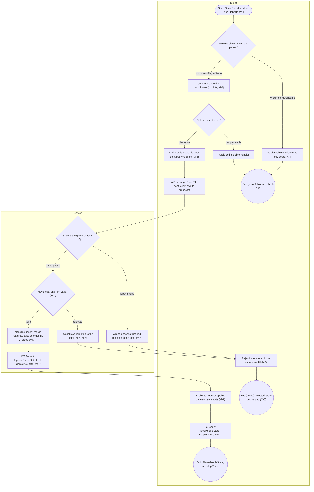
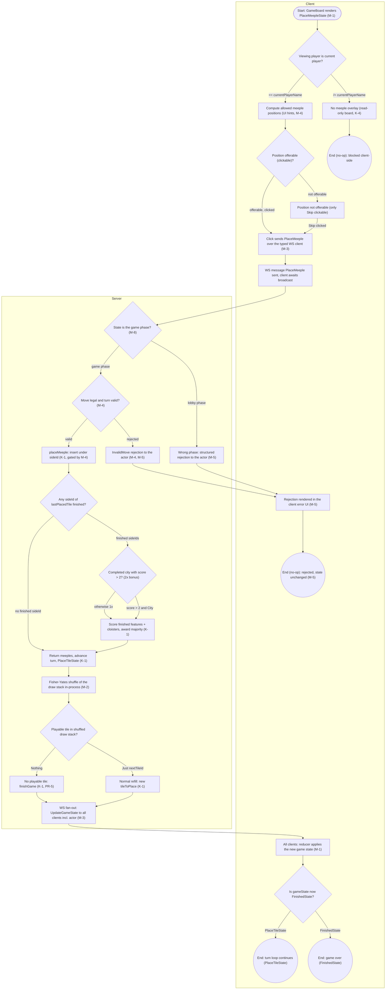
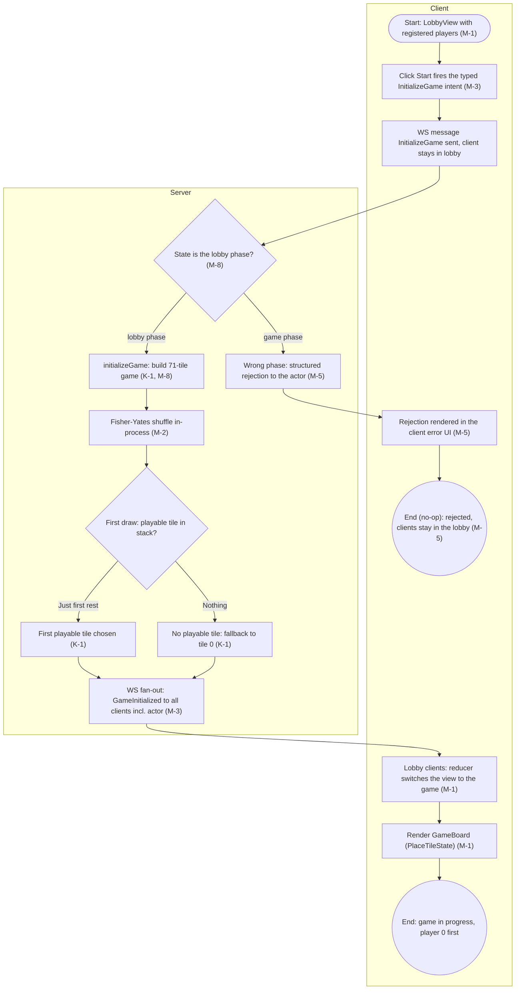
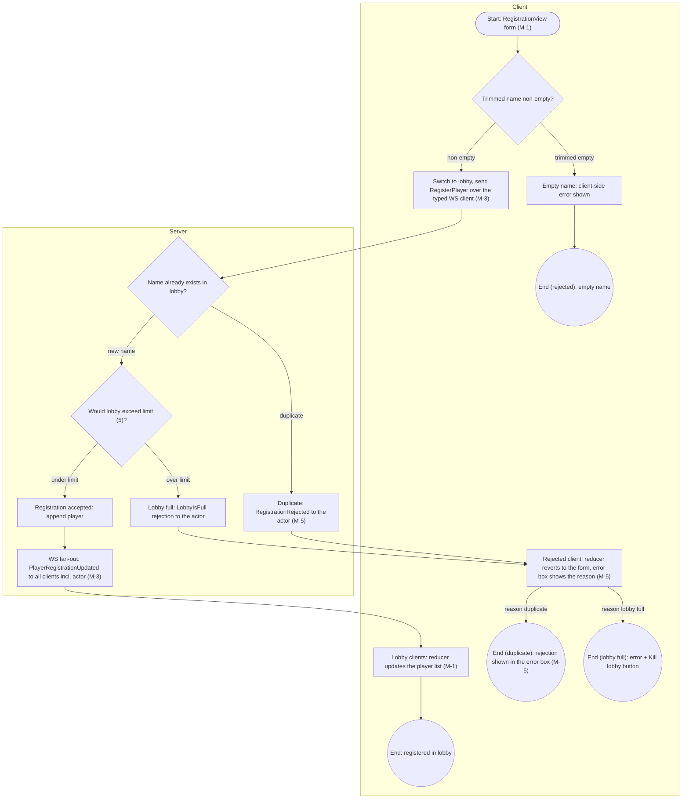
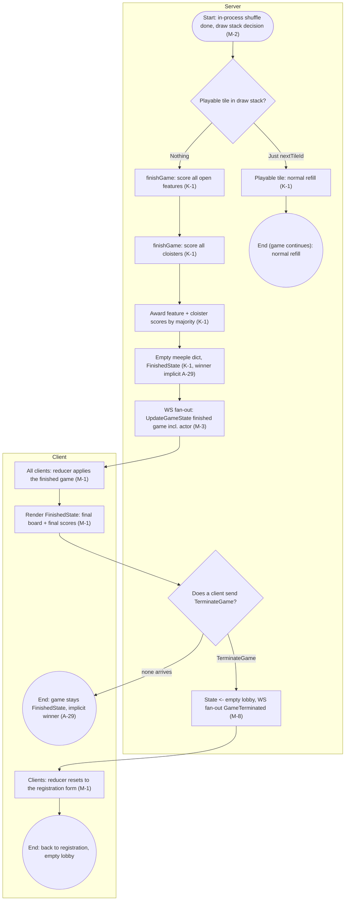

# Guide: Activity Diagrams for Full-Stack Software Programs — Carcassonne (MODERNIZED)

* **Source:** `output/Carcassonne` (legacy code at pinned commit `ca2797745a863243fa6ce96af63435b0d67bf2ab`)
* **Modernization plan:** `modernization-plan.json` (decisions M-1..M-8; directives D-1..D-2)
* **Generated by:** the modernize-modeler skill from the codebase-modeler output.
Legacy citations `path:line` point at the pre-modernization code; `Artifact.md:line`
citations point at the source artifact; `(M-n)` references the modernization plan.

An activity diagram is a behavioral UML diagram that illustrates the flow of control or data from one activity to another. For this full-stack program it is invaluable for visualizing how the browser frontend, the Node.js WebSocket backend, and the in-memory state store interact to complete each end-to-end user process. Per directives D-1/D-2 ("rewrite it into the most modern javascript/typescript framework!"), the whole Elm + Lamdera stack is rewritten: a TypeScript 5.x + React 19 (react 19.x / react-dom 19.x) SPA built with Vite 7 on the client (M-1), a Node.js 24 LTS + TypeScript + ws 8.x WebSocket server owning one authoritative in-memory state on the server (M-2), a zod-validated typed JSON protocol replacing the Lamdera message ADTs (M-3), server-side revalidation of every move (M-4), structured rejection payloads (M-5), and a single TypeScript state shape with the Evergreen snapshot layer retired (M-8). The Carcassonne rule core (K-1) and the single shared authoritative game-state design (K-4) are kept. Full system description: [`./Specification.md`](./Specification.md) (modernized).

## Overview: the 5 modelled processes

| ID | Process | Legacy entry point(s) | Modernized entry (plan refs) | Modernization |
| :-- | :-- | :-- | :-- | :-- |
| PR-1 | Placing a tile on the board (turn step 1) | `src/Views/GameView.elm:318-329`, `src/Backend.elm:160-168`, `src/Helpers/GameLogic.elm:323-370` | React `GameBoard` cell click → typed `PlaceTile` WS message → zod check + server revalidation → `placeTile` | M-1, M-3, M-4, M-5, M-8 (rules kept, K-1) |
| PR-2 | Placing a meeple with immediate feature scoring (turn step 2) | `src/Views/GameView.elm:524-539`, `src/Views/GameView.elm:382-396`, `src/Backend.elm:170-178`, `src/Helpers/GameLogic.elm:383-508` | React meeple-circle click → typed `PlaceMeeple` WS message → server revalidation → `placeMeeple` + in-process shuffle | M-1, M-2, M-3, M-4, M-5, M-8 (scoring kept, K-1) |
| PR-3 | Game initialization with shuffled tile draw (lobby to game) | `src/Views/PlayerLobbyView.elm:20-23`, `src/Frontend.elm:67-68`, `src/Backend.elm:140-148`, `src/Types/Game.elm:53-73` | React `LobbyView` "Start" click → typed `InitializeGame` WS message → `initializeGame` + in-process shuffle | M-1, M-2, M-3, M-5, M-8 (init kept, K-1) |
| PR-4 | Player registration and lobby join | `src/Views/PlayerRegistrationView.elm:11-46`, `src/Frontend.elm:50-62`, `src/Backend.elm:93-118` | React `RegistrationView` submit → typed `RegisterPlayer` WS message → structured rejections | M-1, M-3, M-5 (lobby rules kept) |
| PR-5 | End-of-game final scoring | `src/Backend.elm:61-84`, `src/Helpers/GameLogic.elm:511-556`, `src/Backend.elm:180-183` | draw-stack decision after the in-process shuffle → `finishGame` → typed `TerminateGame` WS message | M-1, M-2, M-3, M-8 (scoring kept, K-1) |

Every flow now follows the same typed WebSocket loop: React event handler → typed client→server JSON message → zod validation on receipt → server revalidation of move legality and turn ownership (M-4) → pure-TypeScript domain core (K-1) → full-state WS broadcast to every connected client including the acting one (M-3) → client reducer (M-1) → re-render. The two legacy asynchronous re-entries over the Elm Cmd channel — `Random.generate InitializeGameAndTileDrawStackShuffled` (`src/Backend.elm:147`) and `Random.generate TileDrawStackShuffled` (`src/Backend.elm:177`) — are replaced (M-2) by in-process Fisher-Yates shuffles inside the same server handler (source artifact: `ActivityDiagram.md:19`).

## 1. Core Elements of the Diagram

Every process diagram below uses the standard UML activity-diagram elements:

*   **Initial State (Start Node):** stadium shape `([...])` — the state the system is in when the process begins (e.g. "Start: `GameBoard` renders `PlaceTileState`").
*   **Final State (End Node):** double circle `((...))` — one or more terminal states per process; rejection no-ops are modelled explicitly as terminal states (M-5).
*   **Action States (Activities):** rectangles `[...]` — UI renders, WS message sends, server handlers, scoring steps, broadcasts.
*   **Control Flow (Arrows):** `-->` edges; cross-lane arrows cross subgraph boundaries and cross the WebSocket channel (client ↔ server, M-3).
*   **Decision Nodes (Diamonds):** `{...}` — conditional branches. All decision diamonds have >= 2 guarded outgoing edges; guards appear on the arrows (short form) and in full form in the edge tables below. The legacy client-side render guard `if Set.member coord coordinatesToBePlacedOn` (`src/Views/GameView.elm:320`) is kept as a UI hint (M-4), and the legacy server catch-all `_ -> ( model, Cmd.none )` (`src/Backend.elm:185-186`) is no longer an unguarded terminal exit: wrong-phase messages now follow an explicit rejection branch (M-5).
*   **Forks and Joins:** none exist in the modernized system either. The legacy Elm `update` loops were strictly sequential (a single `case ( msg, model ) of` analysis per message, `src/Frontend.elm:44-46`, `src/Backend.elm:37-39`); the rewritten Node server processes one message per event with the same sequential discipline, the WS broadcast is a single fan-out *action* inside the Server lane (M-3), and the in-process shuffle (M-2) removes the two legacy async `Random` re-entries that the source diagram modelled as annotated action nodes.

Node IDs inside the diagrams are the legacy evidence IDs (`PR-x-Ny`) from the source artifact's flow evidence, kept stable across the modernization so every change is traceable: a row marked `kept` carries over verbatim, `M-n` means the node was modernized by decision M-n, and `added (M-n)` marks nodes the plan introduces, continuing the numbering (`PR-1-N18..N20`, `PR-2-N27..N29`, `PR-3-N16`).

## 2. Full-Stack Specifics: Swimlanes (Partitions)

Each diagram is divided into swimlanes as Mermaid `subgraph`s. The modernized system has **two lanes: Client and Server**. The legacy **External** lane (Lamdera platform + Elm runtime, `ActivityDiagram.md:42`) is replaced (M-2): the platform `broadcast`/`sendToFrontend` fan-out (`src/Backend.elm:6`) becomes the ws server's in-process send loop, and the two `Random.generate` shuffle re-entries (`src/Backend.elm:147`, `src/Backend.elm:177`) become in-process Fisher-Yates shuffles. **There is still no database lane**: the legacy state already lived in-memory in the Lamdera backend model (`src/Types.elm:11-17`), and M-8 defines the modern data layer explicitly — one in-memory TypeScript state shape, no DBMS, no migration tool, restart = new empty lobby (`src/Evergreen/Migrate/V10.elm:3` dropped). No diagram therefore contains a Database or External subgraph.

### A. The Client / Frontend (Presentation Layer)

*   **Actor:** the User.
*   **System:** browser; TypeScript 5.x + React 19 (react 19.x / react-dom 19.x) single-page app built with Vite 7 (M-1) — one React component per legacy Elm view (`RegistrationView`, `LobbyView`, `GameBoard`), a typed WebSocket client class (M-3), reducer-based client state mirroring the server-pushed whole state (M-1, K-4), plain CSS modules replacing `src/Styles.elm:1`.
*   **Typical Actions:** rendering UI, client-side UI-hint guards (turn ownership, placeable cells, non-empty name — kept for UX while the server becomes authoritative, M-4), sending typed JSON messages, applying server-pushed full state in the reducer, rendering structured rejections in the error UI (M-5).

### B. The Server / Backend (Business Logic Layer)

*   **System:** Node.js 24 LTS + TypeScript process with a ws 8.x WebSocket server (M-2) owning one authoritative in-memory state — a TypeScript discriminated union of a lobby phase and a game phase (M-8); zod 3.x+ runtime validation of every incoming message before dispatch (M-3); server-side revalidation of moves and turn ownership with the WebSocket session bound to the registered player (M-4); the ported pure-TypeScript domain core (K-1); structured logging only — the legacy `Debug.log` on the connection hot path (`src/Backend.elm:40-42`) is gone (M-2).
*   **Typical Actions:** validating messages with zod before dispatch, revalidating move legality and turn ownership (M-4), applying the game rules (`placeTile`, `placeMeeple`, `initializeGame`, `finishGame` — K-1), shuffling the draw stack in-process (M-2), broadcasting the full state to every connected client including the acting one (M-3), sending structured rejections for failures (M-5).

### C. The Database (Data Layer)

*   **System:** **absent** (M-8). State is a single in-memory TypeScript shape defined once in the domain core; no DBMS, no ORM, no migration tool; restart semantics are explicitly "new empty lobby". The compiler-generated Evergreen snapshot/migration layer (`src/Evergreen/Migrate/V10.elm:3`) is dropped, so no diagram contains a Database subgraph.

### D. External Services / APIs (Optional but common)

*   **System:** **absent.** The modernized system is fully self-hosted: first-party WebSocket transport, no third-party APIs, no platform services. The legacy External lane (Lamdera platform + Elm runtime) is replaced (M-2) by in-process server actions.

## 3. Checklist for a Complete Diagram

- [x] **Clear Scope:** each of the 5 diagrams focuses on a single end-to-end process (registration, game init, tile step, meeple step, end-of-game) rather than the whole application. Low-priority flows (tile rotation, lobby kick/kill, mid-game rejoin) remain excluded per the source scope note (`ActivityDiagram.md:547`); of these, only the lobby kick/kill flow is cross-referenced in this document (the red "kick" link on `PR-4-N11`, the "Kill lobby" affordance on `PR-4-N12`, and the "Kill lobby" button on `PR-4-N16`), while tile rotation and mid-game rejoin are documented solely as out-of-scope exclusions.
- [x] **Defined Start and End:** every process has exactly one cited start node (`PR-x-N1`) and 2-4 terminal nodes; terminal IDs are listed in the node maps. Rejection no-ops are explicit terminal states (M-5) instead of silent server drops (`src/Backend.elm:185-186`).
- [x] **Swimlanes utilized:** every node sits in the `Client` or `Server` subgraph; the legacy `External` lane is replaced (M-2) and the `Database` lane remains absent (M-8).
- [x] **Guard Conditions:** all decision diamonds have explicitly labeled outgoing paths (e.g. `|== currentPlayerName|`, `|game phase|`); guards are reproduced in the edge tables.
- [x] **Error Handling:** failure paths are modelled and now observable — client-side blocks (not your turn / invalid cell / empty name), wrong-phase rejections, duplicate-name rejection with a visible error (M-5), lobby-full rejection, server revalidation rejections for invalid/out-of-turn moves (M-4), the first-draw fallback to tile 0, and the draw-stack-exhaustion game-over branch (K-1).
- [x] **State Changes:** significant model changes are represented as action nodes — lobby phase -> game phase (was `BePlayerRegistration` -> `BeGamePlayed`, `src/Backend.elm:140-148`; the TS discriminated union, M-8), `PlaceTileState` -> `PlaceMeepleState` (`src/Helpers/GameLogic.elm:367`, K-1), turn advance (`src/Helpers/GameLogic.elm:502-508`, K-1), `FinishedState` (`src/Helpers/GameLogic.elm:552-555`, K-1), termination to an empty lobby (`src/Backend.elm:180-183`, M-8).

## 4. Tool for Creation

Diagrams are authored as **Mermaid.js** `flowchart` code blocks (one per process, five in total), each with `subgraph` swimlanes. Labels containing parentheses or other punctuation are double-quoted (`["..."]`, `{"..."}`); edge guards are kept to short condition text (<= 30 characters); plan references appear in labels as `(M-n)`.

## 5. Process Diagrams

### PR-1 — Placing a tile on the board (turn step 1)

**Description (modernized).** The current player clicks a highlighted grid cell while in `PlaceTileState`. Legacy: validity was enforced **only client-side** — `placeTile` documented "Does not check whether the move is valid" (`src/Helpers/GameLogic.elm:311-314`) and the backend handler carried no sender or turn-ownership check (flagged as I-1). Modernized: the ported `tileCanBePlaced` / `getCoordinatesToBePlacedOn` checks run **server-side as the authoritative revalidation** (M-4) with the WebSocket session bound to the registered player, while the client keeps the same checks for UI hints. Invalid or out-of-turn moves get a structured `InvalidMove { reason }` rejection instead of being applied (M-4, M-5). The `placeTile` rule semantics are unchanged (K-1): renumber `sideIds`, insert the tile, merge adjacent features across the tile grid and the meeple dict, `gameState -> PlaceMeepleState`. All clients converge on the WS full-state broadcast, which now explicitly includes the acting client (M-3, A-13).

**Entry points (legacy):** `src/Views/GameView.elm:318-329` (cell click), `src/Backend.elm:160-168` (server handler), `src/Helpers/GameLogic.elm:323-370` (`placeTile`).
**Entry points (modernized):** React `GameBoard` cell-click handler (M-1) → typed `PlaceTile` WS message (M-3) → zod validation + server revalidation (M-3, M-4) → ported `placeTile` (K-1).
**Start:** `PR-1-N1`. **Ends:** `PR-1-N15`, `PR-1-N16`, `PR-1-N17`.

**Error paths** (visible in the diagram):

- Not the current player's turn: no placeable overlay rendered; the board is read-only (kept, K-4) (`src/Views/GameView.elm:58`, `src/Views/GameView.elm:73-74`).
- Coordinate not in the placeable set: cell rendered without a click handler — blocked client-side as a UI hint and now additionally rejected by the server revalidation (M-4) (`src/Views/GameView.elm:331-332`, `src/Helpers/FrontendHelpers.elm:48-85`).
- Server not in the game phase: structured rejection to the actor (M-5) — was a silent `Cmd.none` drop (`src/Backend.elm:185-186`).
- Server revalidation rejects the move (session not the turn owner, or illegal placement): structured `InvalidMove { reason }` to the actor, state unchanged (added, M-4/M-5) — the legacy gap was the missing check itself (`src/Helpers/GameLogic.elm:311-314`, `ActivityDiagram.md:542`).

**Node map** (every node in the diagram above):

| Node | Element | Code Reference | Modernization |
| :-- | :-- | :-- | :-- |
| `PR-1-N1` | start — `PlaceTileState` rendered in the current player's browser: board + placeable overlay + drawn tile in sidebar | `src/Views/GameView.elm:28-29`, `src/Types/GameState.elm:4-7`, `src/Views/GameView.elm:727-734` | M-1 (Elm `GameView` → React `GameBoard` component) |
| `PR-1-N2` | decision — is the viewing player the current player? (`playerName == currentPlayerName`) | `src/Views/GameView.elm:58-59`, `src/Views/GameView.elm:24-26` | kept |
| `PR-1-N3` | action — not the current player's turn: no placeable overlay rendered; non-acting clients render the board read-only | `src/Views/GameView.elm:73-74` | kept (K-4) |
| `PR-1-N4` | action — compute placeable coordinates (`getCoordinatesToBePlacedOn`) for UI hints; the ported check now also runs server-side as the authoritative revalidation | `src/Views/GameView.elm:60-62`, `src/Helpers/FrontendHelpers.elm:89-110`, `src/Helpers/FrontendHelpers.elm:48-85` | M-4 |
| `PR-1-N5` | decision — is the rendered cell in the placeable set? (`Set.member coord coordinatesToBePlacedOn`) | `src/Views/GameView.elm:318-332` | kept |
| `PR-1-N6` | action — invalid placement: cell rendered **without** a click handler; move blocked client-side (UI hint; the server would now reject it too, M-4) | `src/Views/GameView.elm:331-332`, `src/Helpers/FrontendHelpers.elm:48-85` | kept |
| `PR-1-N7` | action — valid placement: click fires the typed `PlaceTile` message over the WS client (was `FrontendMsg FePlaceTile coord`) | `src/Views/GameView.elm:318-329` | M-3 |
| `PR-1-N8` | action — the WS client sends `PlaceTile { coordinates }`; local state awaits the authoritative broadcast (was `sendToBackend`) | `src/Frontend.elm:76-77`, `src/Types.elm:56` | M-3 |
| `PR-1-N9` | decision (server) — is the state the game phase? (zod-validated message, phase guard; was the `(PlaceTile _, BeGamePlayed { game })` pattern match) | `src/Backend.elm:160`, `src/Backend.elm:185-186` | M-8 |
| `PR-1-N10` | action — wrong phase: structured rejection sent to the actor (was: silent `Cmd.none` drop with no reply) | `src/Backend.elm:185-186` | M-5 |
| `PR-1-N18` | decision (server) — does the ported revalidation accept the move? (`tileCanBePlaced` + turn ownership: the session's player is `currentPlayer`) | `src/Helpers/GameLogic.elm:311-314`, `src/Helpers/FrontendHelpers.elm:48-110` | added (M-4) |
| `PR-1-N19` | action — rejected move: structured `InvalidMove { reason }` to the actor; state unchanged (legacy gap: the check was missing entirely, I-1) | `src/Helpers/GameLogic.elm:311-314`, `ActivityDiagram.md:542` | added (M-4, M-5) |
| `PR-1-N11` | action — `placeTile`: renumber `sideIds`, insert tile at (x,y), merge adjacent features, `lastPlacedTile = (x,y)`, `gameState -> PlaceMeepleState` (rule semantics unchanged; now runs after server revalidation) | `src/Helpers/GameLogic.elm:323-370`, `src/Helpers/GameLogic.elm:102-131`, `src/Helpers/GameLogic.elm:136-162`, `src/Backend.elm:160-168` | (K-1, gated by M-4) |
| `PR-1-N12` | action — WS fan-out: send full-state `UpdateGameState` to all connected clients including the actor (was the single Lamdera `broadcast` cmd) | `src/Backend.elm:167`, `src/Backend.elm:6` | M-3 |
| `PR-1-N13` | action — all clients: the reducer replaces the client-side game state (the single convergence point for every in-game broadcast; was `updateFromBackend`) | `src/Frontend.elm:143-150` | M-1 |
| `PR-1-N14` | action — re-render in `PlaceMeepleState`: new tile on board, meeple-placement overlay, sidebar "Now playing" + current scores | `src/Frontend.elm:168-169`, `src/Views/GameView.elm:92-157`, `src/Views/GameView.elm:122-129` | M-1 |
| `PR-1-N15` | end — `gameState == PlaceMeepleState`; the same player now places a meeple or skips (process PR-2) | `src/Helpers/GameLogic.elm:367`, `src/Types/GameState.elm:6` | kept (K-1) |
| `PR-1-N16` | end (no-op) — placement blocked client-side (not your turn / invalid coordinate); no WS message was ever sent; state identical to start | `src/Views/GameView.elm:73-74`, `src/Views/GameView.elm:331-332` | kept (K-4) |
| `PR-1-N17` | end (no-op) — rejected with a structured rejection; state unchanged (was: client never received a reply, `Cmd.none`) | `src/Backend.elm:185-186` | M-5 |
| `PR-1-N20` | action — client renders the rejection in its error UI (the error box the registration view already had, now with real content on every rejection type) | `src/Views/PlayerRegistrationView.elm:40-45` | added (M-5) |

**Edge guards** (decision exits; short guard = the label on the arrow above, full guard = the evidence text):

| Edge | From -> To | Guard (evidence) | Code Reference | Modernization |
| :-- | :-- | :-- | :-- | :-- |
| `PR-1-E2` | `PR-1-N2` -> `PR-1-N3` | `playerName !== currentPlayerName` | `src/Views/GameView.elm:58`, `src/Views/GameView.elm:73-74` | kept |
| `PR-1-E3` | `PR-1-N2` -> `PR-1-N4` | `playerName === currentPlayerName` | `src/Views/GameView.elm:58-62` | kept |
| `PR-1-E6` | `PR-1-N5` -> `PR-1-N6` | `not (coord in placeable set)` | `src/Views/GameView.elm:320`, `src/Views/GameView.elm:331-332` | kept |
| `PR-1-E7` | `PR-1-N5` -> `PR-1-N7` | `coord in placeable set` | `src/Views/GameView.elm:320-329` | kept |
| `PR-1-E11` | `PR-1-N9` -> `PR-1-N10` | state is not the game phase (was: catch-all `_ -> ( model, Cmd.none )`) | `src/Backend.elm:185-186` | M-5 |
| `PR-1-E12` | `PR-1-N9` -> `PR-1-N18` | state is the game phase (zod-validated `PlaceTile` payload) | `src/Backend.elm:160-164` | M-3 |
| `PR-1-E18` | `PR-1-N18` -> `PR-1-N19` | server revalidation rejects (session player is not `currentPlayer`, or `tileCanBePlaced` fails) | `src/Helpers/GameLogic.elm:311-314`, `src/Helpers/FrontendHelpers.elm:48-110` | added (M-4) |
| `PR-1-E19` | `PR-1-N18` -> `PR-1-N11` | server revalidation passes | `src/Helpers/FrontendHelpers.elm:48-110` | added (M-4) |
| `PR-1-E20` | `PR-1-N10` -> `PR-1-N20` | rejection delivered over the WS connection | `src/Backend.elm:185-186` | added (M-5) |
| `PR-1-E21` | `PR-1-N19` -> `PR-1-N20` | rejection delivered over the WS connection | `src/Helpers/GameLogic.elm:311-314` | added (M-5) |
| `PR-1-E22` | `PR-1-N20` -> `PR-1-N17` | state unchanged; the client frame stays as-is | — | added (M-5) |

### PR-2 — Placing a meeple with immediate feature scoring (turn step 2)

**Description (modernized).** After `placeTile` (PR-1), the same player may drop a meeple on a side/cloister of the last-placed tile or skip. The client offers only unoccupied sides (+ cloister center) as UI hints; with 0 meeples left only `Skip` is offered (kept). Legacy: the server never validated the position or the turn owner and applied `placeMeeple` unconditionally (`src/Helpers/GameLogic.elm:373-376`). Modernized: the ported `getMeeplePositionsToBePlacedOn` position check and the session→player turn-ownership check now run server-side as the authoritative revalidation (M-4); rejected moves get a structured `InvalidMove { reason }` (M-5). The scoring semantics are unchanged (K-1): `placeMeeple` inserts the meeple, scores every newly **FINISHED** feature by tile count (2x bonus for completed cities with score > 2), adds cloister scores, awards points to majority owners, returns finished meeples, decrements the placer's meeple count (unless `Skip`), advances `currentPlayer` and sets `PlaceTileState`. The legacy async shuffle re-entry (`Random.generate TileDrawStackShuffled`, `src/Backend.elm:177`) is replaced (M-2) by an in-process Fisher-Yates shuffle: the shuffled stack either yields a playable tile (normal refill) or — if none exists — triggers `finishGame` (PR-5), all inside the same handler.

**Entry points (legacy):** `src/Views/GameView.elm:524-539` (position circle), `src/Views/GameView.elm:382-396` (Skip button), `src/Backend.elm:170-178` (server handler), `src/Helpers/GameLogic.elm:383-508` (`placeMeeple`), `src/Backend.elm:61-84` (shuffle re-entry).
**Entry points (modernized):** React `GameBoard` circle/Skip click (M-1) → typed `PlaceMeeple` WS message (M-3) → zod + revalidation (M-3, M-4) → ported `placeMeeple` (K-1) → in-process shuffle (M-2).
**Start:** `PR-2-N1`. **Ends:** `PR-2-N23`, `PR-2-N24`, `PR-2-N25`, `PR-2-N26`.

**Error paths** (visible in the diagram):

- Not the current player's turn: no meeple overlay rendered, board read-only (kept, K-4) (`src/Views/GameView.elm:140-141`).
- Position not offerable (side already has a meeple / `sideId -1` / 0 meeples left): only other rendered positions or the Skip button are clickable (kept; now also rejected server-side, M-4) (`src/Helpers/FrontendHelpers.elm:32-43`, `src/Views/GameView.elm:538-539`).
- Backend not in the game phase: structured rejection to the actor (M-5) — was a silent `Cmd.none` drop (`src/Backend.elm:185-186`).
- Server revalidation rejects the move (illegal position / wrong turn owner): structured `InvalidMove { reason }`, state unchanged (added, M-4/M-5) (`src/Helpers/GameLogic.elm:373-376`, `ActivityDiagram.md:542`).
- Draw-stack refill yields no playable tile: the game ends via `finishGame` instead of continuing (K-1) (`src/Backend.elm:76-84`).

**Node map** (every node in the diagram above):

| Node | Element | Code Reference | Modernization |
| :-- | :-- | :-- | :-- |
| `PR-2-N1` | start — `gameState == PlaceMeepleState` (set by `placeTile`); `lastPlacedTile` set; `currentPlayer` owns the turn | `src/Types/GameState.elm:6`, `src/Helpers/GameLogic.elm:367-369`, `src/Views/GameView.elm:92-93` | M-1 |
| `PR-2-N2` | decision — is the viewing player the current player?; meeple overlay rendered only for the acting player | `src/Views/GameView.elm:121-122`, `src/Views/GameView.elm:24-26` | kept |
| `PR-2-N3` | action — not the current player's turn: no meeple overlay rendered; board read-only | `src/Views/GameView.elm:140-141` | kept (K-4) |
| `PR-2-N4` | action — `getMeeplePositionsToBePlacedOn` for UI hints: sides without an existing meeple + cloister center; only `[Skip]` at 0 meeples; the ported check now also runs server-side | `src/Views/GameView.elm:122-129`, `src/Helpers/FrontendHelpers.elm:27-43` | M-4 |
| `PR-2-N5` | decision — is this position rendered as a clickable circle? | `src/Views/GameView.elm:524-539` | kept |
| `PR-2-N6` | action — position not offerable (side has a meeple, `sideId == -1`, or 0 meeples left): no click target; remaining options are other circles or the Skip button | `src/Views/GameView.elm:538-539`, `src/Helpers/FrontendHelpers.elm:32-43`, `src/Views/GameView.elm:382-396` | kept |
| `PR-2-N7` | action — click: sends the typed `PlaceMeeple { position }` message (side/cloister circle or `Skip`) over the WS client | `src/Views/GameView.elm:533`, `src/Views/GameView.elm:393` | M-3 |
| `PR-2-N8` | action — the WS client sends the message; local state awaits the broadcast (was `sendToBackend (PlaceMeeple position)`) | `src/Frontend.elm:79-80`, `src/Types.elm:57` | M-3 |
| `PR-2-N9` | decision (server) — is the state the game phase? (was the `(PlaceMeeple _, BeGamePlayed { game })` pattern match) | `src/Backend.elm:170`, `src/Backend.elm:185-186` | M-8 |
| `PR-2-N10` | action — wrong phase: structured rejection to the actor (was: silent `Cmd.none` drop) | `src/Backend.elm:185-186` | M-5 |
| `PR-2-N27` | decision (server) — does the ported revalidation accept the move? (position offerable per `getMeeplePositionsToBePlacedOn` + session's player is `currentPlayer`) | `src/Helpers/GameLogic.elm:373-376`, `src/Helpers/FrontendHelpers.elm:27-43` | added (M-4) |
| `PR-2-N28` | action — rejected move: structured `InvalidMove { reason }` to the actor; state unchanged (legacy gap: the check was missing entirely, I-1) | `src/Helpers/GameLogic.elm:373-376`, `ActivityDiagram.md:542` | added (M-4, M-5) |
| `PR-2-N11` | action — `placeMeeple`: build meeple (owner = `currentPlayer`, coordinates = `lastPlacedTile`); insert under the position's `sideId`; `Skip` leaves the meeple dict unchanged (now runs after server revalidation; was unconditional) | `src/Helpers/GameLogic.elm:384-416` | M-4 |
| `PR-2-N12` | decision — do any sideIds of `lastPlacedTile` pass `isFeatureFinished`? | `src/Helpers/GameLogic.elm:418-422`, `src/Helpers/GameLogic.elm:193-203`, `src/Types/Tile.elm:42-45` | kept (K-1) |
| `PR-2-N13` | decision (per finished feature) — completed city with score > 2? (2x points for cities larger than 2 tiles when completed before game end) | `src/Helpers/GameLogic.elm:431-435`, `src/Helpers/GameLogic.elm:300-308` | kept (K-1) |
| `PR-2-N14` | action — score finished features: `countFeature` with 2x for qualifying cities; append cloister scores (8 neighbours, score 9); award to majority owners via `getFeatureOwners` into `playerScores` | `src/Helpers/GameLogic.elm:418-450`, `src/Helpers/GameLogic.elm:170-188`, `src/Helpers/GameLogic.elm:211-251`, `src/Helpers/GameLogic.elm:256-290` | kept (K-1) |
| `PR-2-N15` | action — remove finished features from the meeple dict (meeples returned, +1 to `playerMeeples`); placer's count -1 unless `Skip`; `currentPlayer <- getNextPlayer` (wraps to 0); `gameState <- PlaceTileState` | `src/Helpers/GameLogic.elm:440-508`, `src/Types/Game.elm:78-84`, `src/Types/Game.elm:61` | kept (K-1) |
| `PR-2-N16` | action — Fisher-Yates shuffle of `tileDrawStack` in-process (replaces the `Random.generate TileDrawStackShuffled` cmd and its async Cmd-channel re-entry) | `src/Backend.elm:177`, `src/Backend.elm:37-38` | M-2 |
| `PR-2-N17` | decision — does the shuffled draw stack yield a playable tile? (`getPlayableTileFromDrawstack` -> `(Just nextTileId, drawStack)` or `(Nothing, _)`); unplaceable tiles are skipped and dropped | `src/Backend.elm:61-63`, `src/Helpers/FrontendHelpers.elm:132-143`, `src/Helpers/FrontendHelpers.elm:120-127` | kept (K-1) |
| `PR-2-N18` | action — normal refill: `tileToPlace <- getTile nextTileId`; `tileDrawStack <-` remaining (playable) tiles | `src/Backend.elm:63-70`, `src/Helpers/TileMapper.elm:9-10` | kept (K-1) |
| `PR-2-N19` | action — game-over branch: no playable tile in the draw stack — `finishGame` scores all remaining features and cloisters, empties the meeple dict, `gameState <- FinishedState` (detailed in PR-5) | `src/Backend.elm:76-84`, `src/Helpers/GameLogic.elm:511-556` | kept (K-1) |
| `PR-2-N20` | action — WS fan-out: send full-state `UpdateGameState` to all connected clients including the actor; emitted by both the refill and the `finishGame` branch | `src/Backend.elm:73`, `src/Backend.elm:83`, `src/Backend.elm:6` | M-3 |
| `PR-2-N21` | action — all clients: the reducer applies the new game state (new scores, new `currentPlayer`, new `tileToPlace` or finished game) | `src/Frontend.elm:143-150` | M-1 |
| `PR-2-N22` | decision (client re-render) — is the received game in `FinishedState` or `PlaceTileState`? | `src/Views/GameView.elm:28-29`, `src/Types/GameState.elm:4-7` | kept |
| `PR-2-N23` | end — `gameState == FinishedState`: final board and scores rendered, no further moves possible (PR-5) | `src/Views/GameView.elm:159-194` | kept |
| `PR-2-N24` | end — `gameState == PlaceTileState`: turn loop continues; the (next) player places the newly drawn tile (PR-1) | `src/Helpers/GameLogic.elm:502-508`, `src/Views/GameView.elm:28-90` | kept |
| `PR-2-N25` | end (no-op) — meeple placement blocked client-side (not your turn / position not offerable and Skip not clicked); state unchanged | `src/Views/GameView.elm:140-141`, `src/Views/GameView.elm:538-539` | kept (K-4) |
| `PR-2-N26` | end (no-op) — rejected with a structured rejection; state unchanged (was: client never received a reply) | `src/Backend.elm:185-186` | M-5 |
| `PR-2-N29` | action — client renders the rejection in its error UI (M-5 structured payload, explicit feedback instead of a silent drop) | `src/Views/PlayerRegistrationView.elm:40-45` | added (M-5) |

**Edge guards** (decision exits plus the Skip-button exit; short guard = the label on the arrow above):

| Edge | From -> To | Guard (evidence) | Code Reference | Modernization |
| :-- | :-- | :-- | :-- | :-- |
| `PR-2-E2` | `PR-2-N2` -> `PR-2-N3` | `playerName !== currentPlayerName` | `src/Views/GameView.elm:121`, `src/Views/GameView.elm:140-141` | kept |
| `PR-2-E3` | `PR-2-N2` -> `PR-2-N4` | `playerName === currentPlayerName` | `src/Views/GameView.elm:121-129` | kept |
| `PR-2-E6` | `PR-2-N5` -> `PR-2-N6` | `not (position in positionsToBePlacedOn)` | `src/Views/GameView.elm:526`, `src/Views/GameView.elm:538-539` | kept |
| `PR-2-E7` | `PR-2-N5` -> `PR-2-N7` | `position in positionsToBePlacedOn` and the circle is clicked | `src/Views/GameView.elm:526-534` | kept |
| `PR-2-E8` | `PR-2-N6` -> `PR-2-N7` | Skip button clicked (the only option at 0 meeples) | `src/Views/GameView.elm:382-396`, `src/Helpers/FrontendHelpers.elm:42-43` | kept |
| `PR-2-E11` | `PR-2-N9` -> `PR-2-N10` | state is not the game phase (was: catch-all `_ -> ( model, Cmd.none )`) | `src/Backend.elm:185-186` | M-5 |
| `PR-2-E12` | `PR-2-N9` -> `PR-2-N27` | state is the game phase (zod-validated `PlaceMeeple` payload) | `src/Backend.elm:170-174` | M-3 |
| `PR-2-E15` | `PR-2-N12` -> `PR-2-N13` | at least one sideId passes `isFeatureFinished` | `src/Helpers/GameLogic.elm:421-422` | kept (K-1) |
| `PR-2-E16` | `PR-2-N12` -> `PR-2-N15` | no sideId passes `isFeatureFinished` (nothing scored, nothing returned) | `src/Helpers/GameLogic.elm:421-422`, `src/Helpers/GameLogic.elm:193-203` | kept (K-1) |
| `PR-2-E17` | `PR-2-N13` -> `PR-2-N14` | `score > 2 && City` -> 2x | `src/Helpers/GameLogic.elm:431-432` | kept (K-1) |
| `PR-2-E18` | `PR-2-N13` -> `PR-2-N14` | otherwise 1x | `src/Helpers/GameLogic.elm:434-435` | kept (K-1) |
| `PR-2-E21` | `PR-2-N16` -> `PR-2-N17` | plain in-process continuation (was: unguarded Elm Cmd-channel re-entry of the shuffled stack) | `src/Backend.elm:37-38`, `src/Backend.elm:177` | replaced (M-2) |
| `PR-2-E22` | `PR-2-N17` -> `PR-2-N18` | `(Just nextTileId, drawStack)` | `src/Backend.elm:63-64` | kept (K-1) |
| `PR-2-E23` | `PR-2-N17` -> `PR-2-N19` | `(Nothing, _)` | `src/Backend.elm:76-77` | kept (K-1) |
| `PR-2-E27` | `PR-2-N27` -> `PR-2-N28` | server revalidation rejects (position illegal / session not the turn owner) | `src/Helpers/GameLogic.elm:373-376`, `src/Helpers/FrontendHelpers.elm:27-43` | added (M-4) |
| `PR-2-E30` | `PR-2-N27` -> `PR-2-N11` | server revalidation passes | `src/Helpers/FrontendHelpers.elm:27-43` | added (M-4) |
| `PR-2-E31` | `PR-2-N10` -> `PR-2-N29` | rejection delivered over the WS connection | `src/Backend.elm:185-186` | added (M-5) |
| `PR-2-E32` | `PR-2-N28` -> `PR-2-N29` | rejection delivered over the WS connection | `src/Helpers/GameLogic.elm:373-376` | added (M-5) |
| `PR-2-E33` | `PR-2-N29` -> `PR-2-N26` | state unchanged; the client frame stays as-is | — | added (M-5) |
| `PR-2-E28` | `PR-2-N22` -> `PR-2-N23` | `gameState == FinishedState` | `src/Views/GameView.elm:159` | kept |
| `PR-2-E29` | `PR-2-N22` -> `PR-2-N24` | `gameState == PlaceTileState` | `src/Views/GameView.elm:29` | kept |

Note: the legacy unguarded edge `PR-2-E21` (`PR-2-N16 -> PR-2-N17`) was the Elm Cmd-channel re-entry — the runtime delivered the shuffled stack as `BackendMsg TileDrawStackShuffled` into `Backend.update` (`src/Backend.elm:37-38`, `src/Backend.elm:61-62`). Replaced (M-2): the Fisher-Yates shuffle runs synchronously inside the same handler, so the edge is now a plain in-process continuation.

### PR-3 — Game initialization with shuffled tile draw (lobby to game)

**Description (modernized).** Any lobby player clicks "Start"; the server builds the game with `initializeGame` (71-tile draw stack from `initializeDrawStack`, starting grid with tile 0 at (0,0), 7 meeples per player, `currentPlayer 0`, `PlaceTileState` — seed data ported verbatim, K-1/M-8), switches the state to the game phase (M-8) and shuffles the draw stack in-process with Fisher-Yates (M-2; replaces `Random.generate InitializeGameAndTileDrawStackShuffled`, `src/Backend.elm:147`). On the first draw, `getPlayableTileFromDrawstack` skips unplaceable tiles to pick the first playable tile (or falls back to tile 0 — "First move should be always possible", K-1), then the server broadcasts `GameInitialized` to every connected client including the acting one (M-3) so every lobby client switches to the game view. A "Start" click that arrives in the wrong phase now gets a structured rejection instead of a silent drop (M-5).

**Entry points (legacy):** `src/Views/PlayerLobbyView.elm:20-23` ("Start" click), `src/Frontend.elm:67-68` (`Frontend.update`), `src/Backend.elm:140-148` (server handler), `src/Backend.elm:44-59` (shuffle re-entry), `src/Types/Game.elm:53-73` (`initializeGame`).
**Entry points (modernized):** React `LobbyView` "Start" click (M-1) → typed `InitializeGame` WS message (M-3) → phase guard (M-8) → ported `initializeGame` (K-1) → in-process shuffle (M-2).
**Start:** `PR-3-N1`. **Ends:** `PR-3-N14`, `PR-3-N15`.

**Error paths** (visible in the diagram):

- Server not in the lobby phase: structured rejection to the actor (M-5) — was `InitializeGame` dropped with `Cmd.none` (`src/Backend.elm:185-186`).
- First draw: no playable tile in the shuffled stack (should not happen): `tileToPlace` falls back to tile 0 (K-1) (`src/Backend.elm:52`, `src/Backend.elm:56-57`).

**Node map** (every node in the diagram above):

| Node | Element | Code Reference | Modernization |
| :-- | :-- | :-- | :-- |
| `PR-3-N1` | start — clients in the lobby view (1-5 registered players; `playerLimit = 5`); server in the lobby phase; the lobby view shows the player list and a "Start" button | `src/Types.elm:25-28`, `src/Views/PlayerLobbyView.elm:11-24`, `src/Types/Game.elm:43-45` | M-1 |
| `PR-3-N2` | action — a lobby player clicks "Start" | `src/Views/PlayerLobbyView.elm:20-23` | kept |
| `PR-3-N3` | action — the typed `InitializeGame` WS message is sent; local state stays in the lobby until the broadcast arrives (was `sendToBackend InitializeGame`) | `src/Frontend.elm:67-68`, `src/Types.elm:54` | M-3 |
| `PR-3-N4` | decision (server) — is the state the lobby phase? (was the `(InitializeGame, BePlayerRegistration { players })` pattern match; a second "Start" during a running game takes the rejection branch) | `src/Backend.elm:140`, `src/Backend.elm:185-186` | M-8 |
| `PR-3-N5` | action — wrong phase: structured rejection to the actor (was: silent `Cmd.none` drop) | `src/Backend.elm:185-186` | M-5 |
| `PR-3-N6` | action — `initializeGame(players)`: 71-tile draw stack, starting grid with tile 0 at (0,0), `playerScores 0` and `playerMeeples 7` per player, `currentPlayer 0`, `gameState PlaceTileState`; state <- game phase; seed data ported verbatim | `src/Backend.elm:140-146`, `src/Types/Game.elm:53-73`, `src/Types/Game.elm:120-147`, `src/Types/Game.elm:102-104` | kept (K-1) |
| `PR-3-N7` | action — Fisher-Yates shuffle of `tileDrawStack` in-process (replaces `Random.generate InitializeGameAndTileDrawStackShuffled` and its async Cmd-channel re-entry) | `src/Backend.elm:147`, `src/Backend.elm:37-38` | M-2 |
| `PR-3-N8` | decision (first draw) — does the shuffled draw stack contain a tile playable anywhere? (playability = `tileCanBePlacedAnywhere` across 4 rotations); unplaceable top tiles are skipped and dropped | `src/Backend.elm:44-47`, `src/Helpers/FrontendHelpers.elm:132-143`, `src/Helpers/FrontendHelpers.elm:120-127` | kept (K-1) |
| `PR-3-N9` | action — playable first tile: `tileToPlace <- getTile first`; `tileDrawStack <-` remaining tiles | `src/Helpers/FrontendHelpers.elm:136-137`, `src/Backend.elm:49-54`, `src/Helpers/TileMapper.elm:9-10` | kept (K-1) |
| `PR-3-N10` | action — no playable tile (should not happen for the first draw): fallback to tile 0; code comment: "First move should be always possible" | `src/Backend.elm:52`, `src/Backend.elm:56-57` | kept (K-1) |
| `PR-3-N11` | action — WS fan-out: send `GameInitialized` to all connected clients including the actor (was the single Lamdera `broadcast` cmd) | `src/Backend.elm:58-59`, `src/Backend.elm:6` | M-3 |
| `PR-3-N12` | action — all lobby clients: the reducer switches the view from lobby to game (was `updateFromBackend (GameInitialized ...)`); clients in another state stay unchanged | `src/Frontend.elm:134-141`, `src/Frontend.elm:155-156` | M-1 |
| `PR-3-N13` | action — render the game view: `PlaceTileState` board with placeable overlay for the first player, drawn first tile in the sidebar, "Now playing" on player 0 | `src/Frontend.elm:168-169`, `src/Views/GameView.elm:28-90`, `src/Views/GameView.elm:686-693` | M-1 |
| `PR-3-N14` | end — game in progress: player index 0 places the first tile (PR-1); game phase with `PlaceTileState` | `src/Types/Game.elm:63-67` | kept |
| `PR-3-N15` | end (no-op) — rejected with a structured rejection; clients stay in the lobby (was: silent drop, no reply) | `src/Backend.elm:185-186` | M-5 |
| `PR-3-N16` | action — client renders the rejection in its error UI (M-5 structured payload) | `src/Views/PlayerRegistrationView.elm:40-45` | added (M-5) |

**Edge guards** (decision exits; short guard = the label on the arrow above):

| Edge | From -> To | Guard (evidence) | Code Reference | Modernization |
| :-- | :-- | :-- | :-- | :-- |
| `PR-3-E4` | `PR-3-N4` -> `PR-3-N5` | state is not the lobby phase (was: catch-all `_ -> ( model, Cmd.none )`) | `src/Backend.elm:185-186` | M-5 |
| `PR-3-E5` | `PR-3-N4` -> `PR-3-N6` | state is the lobby phase (zod-validated `InitializeGame`) | `src/Backend.elm:140-145` | M-8 |
| `PR-3-E8` | `PR-3-N7` -> `PR-3-N8` | plain in-process continuation (was: unguarded Cmd-channel re-entry of the shuffled stack) | `src/Backend.elm:37-38`, `src/Backend.elm:44-45` | replaced (M-2) |
| `PR-3-E9` | `PR-3-N8` -> `PR-3-N9` | `(Just first, rest)` from `getPlayableTileFromDrawstack` | `src/Helpers/FrontendHelpers.elm:136-137` | kept (K-1) |
| `PR-3-E10` | `PR-3-N8` -> `PR-3-N10` | `(Nothing, _)` from `getPlayableTileFromDrawstack` (empty stack) | `src/Helpers/FrontendHelpers.elm:142-143`, `src/Backend.elm:52` | kept (K-1) |
| `PR-3-E16` | `PR-3-N5` -> `PR-3-N16` | rejection delivered over the WS connection | `src/Backend.elm:185-186` | added (M-5) |
| `PR-3-E17` | `PR-3-N16` -> `PR-3-N15` | state unchanged; clients stay in the lobby | — | added (M-5) |

Note: the legacy unguarded edge `PR-3-E8` (`PR-3-N7 -> PR-3-N8`) was the Elm Cmd-channel re-entry: the runtime delivered the shuffled stack as `BackendMsg InitializeGameAndTileDrawStackShuffled` into `Backend.update` (`src/Backend.elm:37-38`, `src/Backend.elm:44-45`). Replaced (M-2): the shuffle runs synchronously inside the same handler.

### PR-4 — Player registration and lobby join

**Description (modernized).** A fresh client (init -> registration form on page load; a client connecting mid-lobby receives the current roster from the server's connect handler — legacy `ClientConnected` hook, `src/Backend.elm:40-42`) submits a name. Client-side (kept): the trimmed name must be non-empty. Server-side: duplicate names are now rejected with a structured `RegistrationRejected { reason }` payload rendered in the client's error box (M-5) — legacy behaviour re-sent the EXISTING player list with no explicit error, the silent-rejection gap flagged as I-2 (`src/Backend.elm:99-102`). A full lobby (`playerLimit = 5`, kept) is rejected with `LobbyIsFull`, which kicks the requesting client back to the registration form with a "Lobby is full." error and a "Kill lobby" button (kept). On success the player is appended and the updated list is broadcast to all connected clients (M-3), which re-render the lobby.

**Entry points (legacy):** `src/Views/PlayerRegistrationView.elm:11-46` (form + "Join" click), `src/Frontend.elm:50-62` (`Register` handling), `src/Backend.elm:93-118` (server handler).
**Entry points (modernized):** React `RegistrationView` submit (M-1) → typed `RegisterPlayer { name }` WS message (M-3) → zod validation + duplicate/limit checks with structured rejections (M-5).
**Start:** `PR-4-N1`. **Ends:** `PR-4-N13`, `PR-4-N14`, `PR-4-N15`, `PR-4-N16`.

**Error paths** (visible in the diagram):

- Empty/whitespace name: client-side error "Name cannot be empty.", no backend call (kept) (`src/Frontend.elm:56-57`).
- Duplicate name: server-side check; a structured `RegistrationRejected { reason }` is now sent and displayed in the client's error box (M-5) — legacy: only the existing player list was re-sent, no explicit duplicate error (`src/Backend.elm:99-102`, `ActivityDiagram.md:544`).
- Lobby full (more than `playerLimit = 5`): `LobbyIsFull` rejection to the actor; client reverts to registration with "Lobby is full." + "Kill lobby" button (kept; the payload is now part of the typed rejection surface, M-5) (`src/Backend.elm:110-118`, `src/Frontend.elm:112-115`, `src/Views/PlayerRegistrationView.elm:29-37`).

**Node map** (every node in the diagram above):

| Node | Element | Code Reference | Modernization |
| :-- | :-- | :-- | :-- |
| `PR-4-N1` | start — fresh client at the registration form (name input + "Join" button); keystrokes clear any previous error; a client connecting mid-lobby receives the current roster from the connect handler | `src/Frontend.elm:34-41`, `src/Views/PlayerRegistrationView.elm:11-28`, `src/Backend.elm:40-42` | M-1 |
| `PR-4-N2` | decision (client) — is the trimmed name non-empty? (form submit and "Join" button both produce the `Register` intent) | `src/Frontend.elm:50-57`, `src/Views/PlayerRegistrationView.elm:15-27` | kept |
| `PR-4-N3` | action — empty name: error "Name cannot be empty."; stay in the registration form; no backend call | `src/Frontend.elm:56-57`, `src/Views/PlayerRegistrationView.elm:40-45` | kept |
| `PR-4-N4` | action — non-empty name: local state <- lobby view; the typed `RegisterPlayer { name }` WS message is sent — the client optimistically leaves the form before the server answers | `src/Frontend.elm:59-62`, `src/Types.elm:51` | M-3 |
| `PR-4-N5` | decision (server) — does the name already exist in the lobby? | `src/Backend.elm:93-99` | kept |
| `PR-4-N6` | action — duplicate name: model unchanged; a structured `RegistrationRejected { reason }` is sent to the actor (legacy: only the existing list was re-sent with no explicit error — I-2) | `src/Backend.elm:99-102`, `ActivityDiagram.md:544` | M-5 |
| `PR-4-N7` | decision (server) — would the lobby exceed the limit? (`playerLimit = 5`) | `src/Backend.elm:105-110`, `src/Types/Game.elm:43-45` | kept |
| `PR-4-N8` | action — registration accepted: append the player to the lobby | `src/Backend.elm:106-111` | kept |
| `PR-4-N9` | action — lobby full: model unchanged (players stay at the limit); `LobbyIsFull` rejection to the actor | `src/Backend.elm:115-118` | kept |
| `PR-4-N10` | action — WS fan-out: send `PlayerRegistrationUpdated { players }` to all connected clients (was the single Lamdera `broadcast` cmd) | `src/Backend.elm:112`, `src/Backend.elm:6` | M-3 |
| `PR-4-N11` | action — all clients in the lobby: the reducer updates the player list; the lobby view re-renders the updated list with a red "kick" link per player and the "Start" button | `src/Frontend.elm:95-96`, `src/Views/PlayerLobbyView.elm:11-39` | M-1 |
| `PR-4-N12` | action — rejected client: the reducer reverts to the registration form and renders the rejection reason in the error box (M-5); the full-lobby client additionally gets the "Kill lobby" affordance (kept) | `src/Frontend.elm:112-115`, `src/Views/PlayerRegistrationView.elm:29-37`, `src/Frontend.elm:85-86`, `src/Backend.elm:135-138` | M-5 |
| `PR-4-N13` | end (rejected client-side) — "Name cannot be empty." shown; registration form stays | `src/Frontend.elm:56-57` | kept |
| `PR-4-N14` | end (duplicate name) — the rejection reason is shown in the error box (legacy: the client silently saw the unchanged lobby list, no error — I-2 closed by M-5) | `src/Backend.elm:99-102`, `src/Views/PlayerRegistrationView.elm:40-45` | M-5 |
| `PR-4-N15` | end — player is registered: lobby view shows the updated list; "Start" begins the game (PR-3) | `src/Views/PlayerLobbyView.elm:20-23` | kept |
| `PR-4-N16` | end (lobby full) — "Lobby is full." error + "Kill lobby" button shown in the registration form | `src/Frontend.elm:107-115`, `src/Views/PlayerRegistrationView.elm:29-37` | kept |

**Edge guards** (decision exits; short guard = the label on the arrow above):

| Edge | From -> To | Guard (evidence) | Code Reference | Modernization |
| :-- | :-- | :-- | :-- | :-- |
| `PR-4-E2` | `PR-4-N2` -> `PR-4-N3` | `String.isEmpty (String.trim nameInput)` | `src/Frontend.elm:52-57` | kept |
| `PR-4-E3` | `PR-4-N2` -> `PR-4-N4` | trimmed name non-empty | `src/Frontend.elm:59-62` | kept |
| `PR-4-E6` | `PR-4-N5` -> `PR-4-N6` | name already exists in the lobby | `src/Backend.elm:95-99` | kept |
| `PR-4-E7` | `PR-4-N5` -> `PR-4-N7` | name not in the lobby | `src/Backend.elm:99-104` | kept |
| `PR-4-E9` | `PR-4-N7` -> `PR-4-N8` | `List.length newPlayers <= playerLimit (5)` | `src/Backend.elm:110-111` | kept |
| `PR-4-E10` | `PR-4-N7` -> `PR-4-N9` | `List.length newPlayers > playerLimit (5)` | `src/Backend.elm:110`, `src/Backend.elm:116-118` | kept |
| `PR-4-E11` | `PR-4-N6` -> `PR-4-N12` | rejection delivered over the WS connection (legacy: the existing player list was re-sent without an error) | `src/Backend.elm:99-102` | added (M-5) |
| `PR-4-E12` | `PR-4-N9` -> `PR-4-N12` | `LobbyIsFull` rejection delivered over the WS connection | `src/Backend.elm:115-118` | kept |
| `PR-4-E17` | `PR-4-N12` -> `PR-4-N14` | reason: duplicate name | `src/Backend.elm:99-102` | added (M-5) |
| `PR-4-E18` | `PR-4-N12` -> `PR-4-N16` | reason: lobby full | `src/Backend.elm:115-118` | added (M-5) |

### PR-5 — End-of-game final scoring

**Description (modernized).** Triggered inside the draw-stack decision after the in-process shuffle issued at the end of every turn's meeple placement (M-2; legacy: the `TileDrawStackShuffled` async re-entry, see PR-2): when `getPlayableTileFromDrawstack` yields `Nothing` — the shuffled draw stack holds no tile placeable in any of 4 rotations — the server runs `finishGame` instead of refilling (K-1). `finishGame` scores ALL still-open features and ALL cloisters, awards them by majority, empties the meeple dict and sets `FinishedState`; the finished game is broadcast like any full-state update to every connected client including the acting one (M-3). **The winner is NOT explicitly computed** — final scores are simply displayed, so the winner is implicit (highest score); the legacy open question on this node is accepted as-is per A-29 (explicit winner determination would be a gameplay change the directive does not ask for). Afterward a client may click "Terminate Game" (typed WS message, M-3) to reset the server state to an empty lobby — the documented restart semantics (M-8) — and return every client to the registration form.

**Entry points (legacy):** `src/Backend.elm:61-84` (re-entry + `Nothing` branch), `src/Helpers/GameLogic.elm:511-556` (`finishGame`), `src/Backend.elm:180-183` (`TerminateGame` handler).
**Entry points (modernized):** in-process shuffle → draw-stack decision (M-2) → ported `finishGame` (K-1) → typed `TerminateGame` WS message (M-3).
**Start:** `PR-5-N1`. **Ends:** `PR-5-N14`, `PR-5-N15`, `PR-5-N16`.

**Error paths / alternate branches** (visible in the diagram):

- Alternate branch: the shuffled stack DOES contain a playable tile — normal refill, the game continues instead of ending (K-1) (`src/Backend.elm:63-74`).
- Post-game: no winner is computed or announced; if no client terminates the game the `FinishedState` scoreboard simply remains — winner determination stays display-only (accepted per A-29, K-1) (`src/Views/GameView.elm:694`).

**Node map** (every node in the diagram above):

| Node | Element | Code Reference | Modernization |
| :-- | :-- | :-- | :-- |
| `PR-5-N1` | start — after the in-process shuffle issued at the end of a turn's meeple placement; the draw-stack decision follows directly inside the same handler (legacy: the `TileDrawStackShuffled` Cmd re-entry after the async shuffle cmd) | `src/Backend.elm:61`, `src/Backend.elm:177`, `src/Backend.elm:37-38` | M-2 |
| `PR-5-N2` | decision — does the shuffled draw stack yield a playable tile?; the `(Nothing, _)` arm is the game-over trigger | `src/Backend.elm:62-63`, `src/Helpers/FrontendHelpers.elm:132-143` | kept (K-1) |
| `PR-5-N3` | action — alternate branch: a playable tile exists — normal refill and the game continues (PR-2 happy path) | `src/Backend.elm:63-74` | kept (K-1) |
| `PR-5-N4` | action — `finishGame` step 1: score every still-open feature (for each sideId in the meeple dict, `countFeature`) | `src/Helpers/GameLogic.elm:514-518`, `src/Helpers/GameLogic.elm:170-188` | kept (K-1) |
| `PR-5-N5` | action — `finishGame` step 2: score every cloister (`countCloister` per cloister tile, max 9) | `src/Helpers/GameLogic.elm:520-527`, `src/Helpers/GameLogic.elm:211-224` | kept (K-1) |
| `PR-5-N6` | action — `finishGame` step 3: award feature + cloister scores to the majority owners; ties are shared | `src/Helpers/GameLogic.elm:529-550`, `src/Helpers/GameLogic.elm:256-290` | kept (K-1) |
| `PR-5-N7` | action — `finishGame` step 4: empty the meeple dict, `gameState <- FinishedState`; no winner is computed or stored — the winner stays implicit (highest score) — the legacy open question is accepted per A-29 | `src/Helpers/GameLogic.elm:552-555`, `src/Types/GameState.elm:7` | kept (K-1) |
| `PR-5-N8` | action — WS fan-out: send full-state `UpdateGameState` (finished game) to all connected clients including the actor; clients distinguish "finished" via `game.gameState` | `src/Backend.elm:82-84`, `src/Backend.elm:6` | M-3 |
| `PR-5-N9` | action — all clients: the reducer applies the finished game | `src/Frontend.elm:143-150` | M-1 |
| `PR-5-N10` | action — render `FinishedState`: final board (no overlays) + sidebar with final scores and remaining meeple counts; no further moves possible (winner implicit, A-29 accepted) | `src/Views/GameView.elm:159-194`, `src/Views/GameView.elm:663-710` | M-1 |
| `PR-5-N11` | decision (server) — does a `TerminateGame` WS message arrive in the game phase? (optional post-game cleanup — if no client ever clicks, the game stays in `FinishedState`) | `src/Backend.elm:180`, `src/Views/GameView.elm:743-745`, `src/Frontend.elm:82-83` | kept |
| `PR-5-N12` | action — state <- empty lobby (players = []); WS fan-out `GameTerminated` to all connected clients; the finished game is discarded — the documented "restart = new empty lobby" semantics (M-8) | `src/Backend.elm:180-183` | M-8 |
| `PR-5-N13` | action — all clients: the reducer resets to the registration form; a new game can start via PR-4 -> PR-3 | `src/Frontend.elm:152-153`, `src/Frontend.elm:34-41` | M-1 |
| `PR-5-N14` | end (game continues) — a playable tile was found: the turn loop continues with the newly drawn tile (PR-1/PR-2) | `src/Backend.elm:63-74` | kept |
| `PR-5-N15` | end — game remains in `FinishedState`: final scores stay displayed; no winner announcement is made (winner = implicit highest score — accepted per A-29) | `src/Views/GameView.elm:159-194`, `src/Views/GameView.elm:694` | kept (K-1) |
| `PR-5-N16` | end — all clients return to the registration form; the server is an empty lobby; a new game can start | `src/Frontend.elm:152-153`, `src/Backend.elm:181` | kept |

**Edge guards** (decision exits; short guard = the label on the arrow above):

| Edge | From -> To | Guard (evidence) | Code Reference | Modernization |
| :-- | :-- | :-- | :-- | :-- |
| `PR-5-E2` | `PR-5-N2` -> `PR-5-N3` | `(Just nextTileId, drawStack)` | `src/Backend.elm:63-64` | kept (K-1) |
| `PR-5-E3` | `PR-5-N2` -> `PR-5-N4` | `(Nothing, _)` | `src/Backend.elm:76-80` | kept (K-1) |
| `PR-5-E12` | `PR-5-N11` -> `PR-5-N15` | no `TerminateGame` msg arrives — players keep viewing the `FinishedState` scoreboard | `src/Views/GameView.elm:159-194` | kept |
| `PR-5-E13` | `PR-5-N11` -> `PR-5-N12` | `TerminateGame` message arrives in the game phase (typed WS message) | `src/Backend.elm:180-183` | M-3 |

## Modernization Decisions (this document)

| Ref | Decision | Applied to | Legacy evidence |
| :-- | :-- | :-- | :-- |
| M-1 | TypeScript 5.x + React 19 (react 19.x / react-dom 19.x) SPA built with Vite 7; one React component per legacy Elm view (`RegistrationView`, `LobbyView`, `GameBoard`); reducer-based client state; CSS modules replace the Elm CSS module | Client lane of all 5 diagrams; all render/state nodes: `PR-1-N1/N13/N14`, `PR-2-N1/N21`, `PR-3-N1/N12/N13`, `PR-4-N1/N11`, `PR-5-N9/N10/N13` | `elm.json:4-13`, `src/Frontend.elm:17-31`, `src/Styles.elm:1`, `ActivityDiagram.md:40` |
| M-2 | Node.js 24 LTS + TypeScript + ws 8.x WebSocket server owning one authoritative in-memory state; in-process Fisher-Yates shuffle replaces the two `Random.generate` re-entries; structured logging, no `Debug.log` | Server lane of all 5 diagrams; shuffle nodes `PR-2-N16`, `PR-3-N7`; start node `PR-5-N1` | `src/Backend.elm:147`, `src/Backend.elm:177`, `src/Backend.elm:40-42`, `src/Backend.elm:18-25` |
| M-3 | Typed WebSocket JSON protocol (TypeScript discriminated unions, zod 3.x+ validated server-side before dispatch); broadcast = send to every connected client including the actor (closes A-13) | Transport nodes: `PR-1-N7/N8/N12`, `PR-2-N7/N8/N20`, `PR-3-N3/N11`, `PR-4-N4/N10`, `PR-5-N8/N11`; edge guards `PR-1-E12`, `PR-2-E12`, `PR-3-E5`, `PR-5-E13` | `src/Types.elm:50-58`, `src/Types.elm:67-86`, `src/Backend.elm:6`, `ActivityDiagram.md:543` |
| M-4 | Server-side revalidation: ported `tileCanBePlaced` / `getCoordinatesToBePlacedOn` / `getMeeplePositionsToBePlacedOn` run server-side as the authoritative checks; turn ownership bound to the WS session; client keeps the same checks for UI hints (closes I-1) | Added validation nodes `PR-1-N18`, `PR-2-N27` and their rejection exits; client hint nodes `PR-1-N4`, `PR-2-N4`; gated apply nodes `PR-1-N11`, `PR-2-N11` | `src/Helpers/GameLogic.elm:311-314`, `src/Helpers/GameLogic.elm:373-376`, `src/Helpers/FrontendHelpers.elm:48-110`, `ActivityDiagram.md:542` |
| M-5 | Structured error/rejection payloads (duplicate player name, lobby full, invalid move, out-of-turn, wrong phase); clients render explicit feedback in the error UI; wrong-phase messages get a rejection instead of a silent drop (closes I-2) | Modernized rejection nodes `PR-1-N10/N17`, `PR-2-N10/N26`, `PR-3-N5/N15`, `PR-4-N6/N12/N14`; added client-side render nodes `PR-1-N20`, `PR-2-N29`, `PR-3-N16` and rejection edges | `src/Backend.elm:99-102`, `src/Backend.elm:185-186`, `Specification.md:151`, `ActivityDiagram.md:544` |
| M-8 | One typed TypeScript state shape (discriminated union: lobby phase / game phase) in the domain core; Evergreen snapshot/migration layer dropped; in-process memory only, restart = new empty lobby; no DBMS | Phase-guard nodes `PR-1-N9`, `PR-2-N9`, `PR-3-N4`; init node `PR-3-N6`; terminate/reset node `PR-5-N12`; the Database lane stays absent (Section 2.C) | `src/Evergreen/Migrate/V10.elm:3`, `src/Types.elm:11-17`, `src/Backend.elm:180-183`, `DatabaseModel.md:639-644` |
| replaced (M-2) | The legacy **External swimlane** (Lamdera platform + Elm runtime) and the two unguarded async Cmd-channel re-entry edges are retired: the platform broadcast fan-out and the shuffles become in-process Server-lane actions | Swimlane legend (Section 2); edges `PR-2-E21` (`PR-2-N16 -> PR-2-N17`) and `PR-3-E8` (`PR-3-N7 -> PR-3-N8`) | `src/Backend.elm:37-38`, `src/Backend.elm:6`, `ActivityDiagram.md:19` |
| K-1 (kept) | Carcassonne rule core re-implemented as a pure TypeScript domain layer — rule semantics unchanged | Scoring/init/final nodes: `PR-1-N11` (gated by M-4)/`PR-1-N15`, `PR-2-N12/N13/N14/N15/N17/N18/N19`, `PR-3-N6/N8/N9/N10`, `PR-5-N2/N3/N4/N5/N6/N7/N14/N15` | `src/Helpers/GameLogic.elm:1-556`, `src/Types/Game.elm:28-40` |
| K-4 (kept) | Single shared authoritative game state: one in-memory model, at most one concurrent game, full-state broadcast to every client; non-acting clients render read-only; reconnect = re-register with the same name | Read-only/no-op nodes `PR-1-N3/N16`, `PR-2-N3/N25`; full-state broadcast nodes `PR-1-N12`, `PR-2-N20`, `PR-3-N11`, `PR-5-N8` | `src/Backend.elm:14-15`, `src/Frontend.elm:143-150`, `src/Backend.elm:120-123` |

## Resolved Assumptions & Issues

The source artifact's Section 6 (`ActivityDiagram.md:534-545`) listed six open gaps; the ones in this document's scope are closed below with the terminal status assigned by the modernization plan. Gaps outside this scope (the 71-tile draw-stack count correction, the no-database-lane note) are closed by sibling modernized artifacts — the 71-tile seed is ported verbatim under M-8 (visible on `PR-3-N6`), and the database-lane absence is re-asserted in Section 2.C.

| Ref | Source | Original marker | Status | Resolution / Reason |
| :-- | :-- | :-- | :-- | :-- |
| A-13 | `Specification.md` | "Whether broadcast reaches the acting client is inferred from Lamdera broadcast semantics; not verifiable from the repo alone" (also `ActivityDiagram.md:543`) | resolved | M-3 defines the semantics explicitly: the ws server sends every full-state update to all connected clients **including the acting one**, and the plan's E2E test gate verifies the behaviour. Visible in this document on the broadcast nodes `PR-1-N12`, `PR-2-N20`, `PR-3-N11`, `PR-4-N10`, `PR-5-N8`, all labelled "incl. actor (M-3)". |
| A-29 | `DomainModel.md` | "No winner determination (UNVERIFIED) — finishGame only finalizes scores" (also flagged on nodes `PR-5-N7`/`PR-5-N15` at `ActivityDiagram.md:541`) | accepted | The winner remains implicit from the displayed scores (legacy behaviour, K-1); explicit winner determination is a gameplay change the directive does not ask for. Visible on `PR-5-N7`, `PR-5-N10` and `PR-5-N15`, which state "winner implicit (A-29)" instead of an open question. |
| I-1 | `Specification.md` | "Client-trusted rules — a tampered client could place invalid tiles or meeples (no server-side turn/validity enforcement)" (also `ActivityDiagram.md:542`) | resolved | M-4 revalidates move legality and turn ownership server-side (session bound to the player, ported pure-domain checks) and M-5 returns structured rejections for rejected moves. Visible on the added validation nodes `PR-1-N18/N19` and `PR-2-N27/N28` and the gated apply nodes `PR-1-N11`, `PR-2-N11`. |
| I-2 | `Specification.md` | "there are no error payloads — a duplicate registration name is rejected silently (unchanged player list re-sent)" (also `ActivityDiagram.md:544`) | resolved | M-5 adds structured error/rejection payloads (duplicate name, full lobby, invalid move, out-of-turn, wrong phase) with explicit client-side display. Visible on `PR-4-N6/N12/N14`, the added rejection-render nodes `PR-1-N20`, `PR-2-N29`, `PR-3-N16`, and the rejection terminal states `PR-1-N17`, `PR-2-N26`, `PR-3-N15`. |
