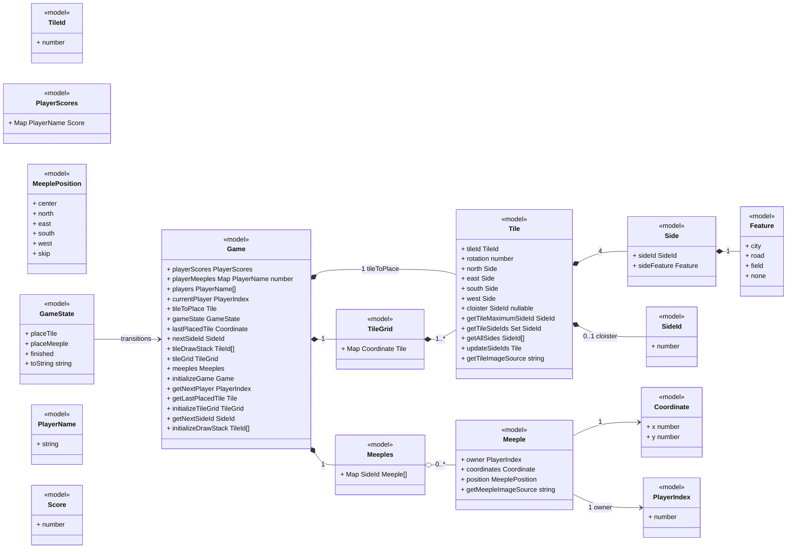
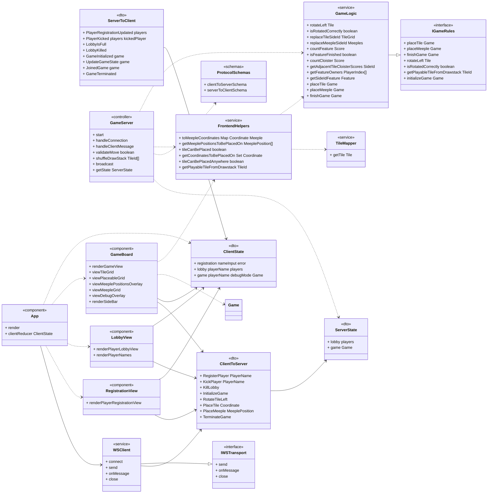

# Carcassonne — Class Model (MODERNIZED)

* **Source:** `output/Carcassonne` (legacy code at pinned commit `ca2797745a863243fa6ce96af63435b0d67bf2ab`)
* **Modernization plan:** `modernization-plan.json` (decisions M-1..M-8; directives D-1..D-2)
* **Generated by:** the modernize-modeler skill from the codebase-modeler output.
Legacy citations `path:line` point at the pre-modernization code; `Artifact.md:line`
citations point at the source artifact; `(M-n)` references the modernization plan.

A well-structured Class Model, represented via UML Class Diagrams (mermaid.js), is the blueprint of a full-stack application. Unlike a backend-only or frontend-only model, a full-stack class model must illustrate how data and logic flow from the server, across the network, and into the user interface. This document is the **modernized** class model of the **Carcassonne** repository: it shows how the authoritative in-memory game state on the Node.js server, the typed WebSocket JSON protocol, and the React client UI are related as classes. Every element of the legacy model (33 class elements, 33 relationships — `ClassModel.md:7`) is carried into the modern stack, updated per the modernization plan, and traceable to the pinned legacy code. For the program specification and overall architecture, see [./Specification.md](./Specification.md).

**Stack (modernized, verbatim from the plan).** The legacy pure **Elm 0.19.1 + Lamdera** full-stack app (`src/Frontend.elm:17-31`, `elm.json:6`, `src/Backend.elm:18-25`, `elm.json:17-18`, `ClassModel.md:5`) becomes:

* **Frontend:** "TypeScript 5.x + React 19 (react 19.x, react-dom 19.x) single-page app built with Vite 7 (M-1); plain CSS modules replace Styles.elm; client state via reducer over server-pushed state" — one React component per legacy view (`RegistrationView`, `LobbyView`, `GameBoard`), replacing the three Elm view modules (`src/Views/GameView.elm:1`, `src/Views/PlayerLobbyView.elm:1`, `src/Views/PlayerRegistrationView.elm:1`) and the hand-written `Styles.elm` CSS module (`src/Styles.elm:1`).
* **Backend:** "Node.js 24 LTS + TypeScript + ws 8.x WebSocket server owning one authoritative in-memory state (lobby | game) (M-2); zod-validated typed JSON protocol (M-3); server-side move/turn revalidation (M-4); structured logging, no Debug.log" — replacing the Lamdera backend program (`src/Backend.elm:18-25`) whose client-connection path logged via `Debug.log` (`src/Backend.elm:40-42`).
* **Database:** "None (no DBMS) — a single typed in-memory state shape in TypeScript; the Evergreen snapshot/migration layer is dropped; explicit restart=new-lobby semantics (M-8)" — the legacy compiler-generated Evergreen snapshots under `src/Evergreen/` (`src/Evergreen/Migrate/V10.elm:3`) are retired.
* **Quality gates (M-6):** Vitest 3.x unit + integration tests, ESLint 9.x, `tsc --noEmit`, Playwright 1.x E2E smoke — replacing elm-test (`elm.json:16`), elm-review and the `lamdera make compile` CI gates (`.github/workflows/test.yaml:33-45`).

**Modeling note.** The legacy document noted that Elm has no classes, inheritance, or visibility, so a "class" was a type declaration or a behavior-owning module (`ClassModel.md:7`). In the modern TypeScript model that gap is closed: a "class" is an `interface`/`type` declaration (domain values, DTOs), a concrete `class` (`GameServer`, `WSClient`), or an interface seam (`IGameRules`, `IWSTransport`) (M-1). Inheritance now exists where it adds value: `GameLogic` implements `IGameRules` and `WSClient` implements `IWSTransport`. The model covers **37 class elements** (the 33 legacy elements `CL-1`..`CL-33` — 28 modernized, 5 replaced — plus 4 added elements `CL-34`..`CL-37`) and **39 relationships** (the legacy 33 `CL-R1`..`CL-R33` plus 6 added `CL-R34`..`CL-R39`), every one cited to the pinned legacy code and the source artifact.

---

## 1. Core Elements of a Class (TypeScript Adaptation)

For every major class in this model, the template's core elements map to the modern stack as follows (legacy mapping: `ClassModel.md:11-18`):

* **Class Name:** PascalCase TypeScript type or class name. Examples: `Game`, `GameServer`, `WSClient`.
* **Attributes (Properties/State):** interface fields with their TypeScript types, e.g. `+ tileGrid: TileGrid`. Legacy Elm types map 1:1: `Dict K V` → `Map<K, V>`, `List T` → `T[]`, `Array T` → `readonly T[]`, `Maybe T` → `T | null`, `Set T` → `Set<T>`, `Int`/`String`/`Bool` → `number`/`string`/`boolean`. For union types the variant names are listed; for type aliases the wrapped target type is listed.
* **Methods (Operations/Behaviors):** class or module methods with parameters and return type, e.g. `+ placeTile(game: Game, coordinate: Coordinate): Game`.
* **Visibility Modifiers:** TypeScript's `public`/`private`/`protected` now exist (the Elm "everything public by construction" fact, `ClassModel.md:18`, is no longer a language constraint). In this model every modeled member is `+` public: the domain core, the protocol and the components expose their surface by design; server-internal implementation details are deliberately not modeled as classes.

### 1.1 Class Inventory

| ID | Name (legacy → modern) | Kind | Layer | Legacy location | Modernization |
| :-- | :-- | :-- | :-- | :-- | :-- |
| `CL-1` | `Game` → `Game` (interface) | class | model (domain core) | `src/Types/Game.elm:28-40` | M-1 |
| `CL-2` | `Tile` → `Tile` (interface) | class | model (domain core) | `src/Types/Tile.elm:21-29` | M-1 |
| `CL-3` | `Side` → `Side` (interface) | class | model (domain core) | `src/Types/Tile.elm:15-18` | M-1 |
| `CL-4` | `TileId` → `TileId` (branded number) | class | model (domain core) | `src/Types/Tile.elm:7-8` | M-1 |
| `CL-5` | `SideId` → `SideId` (branded number) | class | model (domain core) | `src/Types/Tile.elm:11-12` | M-1 |
| `CL-6` | `TileGrid` → `TileGrid` (alias) | class | model (domain core) | `src/Types/Game.elm:20-21` | M-1 |
| `CL-7` | `PlayerScores` → `PlayerScores` (alias) | class | model (domain core) | `src/Types/Game.elm:16-17` | M-1 |
| `CL-8` | `Meeples` → `Meeples` (alias) | class | model (domain core) | `src/Types/Game.elm:24-25` | M-1 |
| `CL-9` | `Meeple` → `Meeple` (interface) | class | model (domain core) | `src/Types/Meeple.elm:17-23` | M-1 |
| `CL-10` | `MeeplePosition` → `MeeplePosition` (union) | class | model (domain core) | `src/Types/Meeple.elm:8-14` | M-1 |
| `CL-11` | `Feature` → `Feature` (union) | class | model (domain core) | `src/Types/Feature.elm:4-8` | M-1 |
| `CL-12` | `GameState` → `GameState` (union) | class | model (domain core) | `src/Types/GameState.elm:4-7` | M-1 |
| `CL-13` | `Coordinate` → `Coordinate` (interface) | class | model (domain core) | `src/Types/Coordinate.elm:4-5` | M-1 |
| `CL-14` | `PlayerIndex` → `PlayerIndex` (branded number) | class | model (domain core) | `src/Types/PlayerIndex.elm:4-5` | M-1 |
| `CL-15` | `PlayerName` → `PlayerName` (alias) | class | model (domain core) | `src/Types/PlayerName.elm:4-5` | M-1 |
| `CL-16` | `Score` → `Score` (alias) | class | model (domain core) | `src/Types/Score.elm:4-5` | M-1 |
| `CL-17` | `FrontendModel` → `ClientState` (union) | class | dto (client state) | `src/Types.elm:20-33` | M-1 |
| `CL-18` | `BackendModel` → `ServerState` (union) | class | dto (server state) | `src/Types.elm:11-17` | M-8 |
| `CL-19` | `FrontendMsg` → React event handlers + `clientReducer` actions | class (removed) | dto | `src/Types.elm:36-47` | replaced (M-1) |
| `CL-20` | `ToBackend` → `ClientToServer` (union) | class | dto (wire) | `src/Types.elm:50-58` | M-3 |
| `CL-21` | `BackendMsg` → in-process calls + ws events | class (removed) | dto | `src/Types.elm:61-65` | replaced (M-2) |
| `CL-22` | `ToFrontend` → `ServerToClient` (union) | class | dto (wire) | `src/Types.elm:67-86` | M-3 |
| `CL-23` | `GameLogic` → `GameLogic` (pure TS module, implements `IGameRules`) | class | service (domain core) | `src/Helpers/GameLogic.elm:1` | M-1, M-4 |
| `CL-24` | `TileMapper` → `TileMapper` (TS module) | class | service (domain core) | `src/Helpers/TileMapper.elm:1` | M-1 |
| `CL-25` | `FrontendHelpers` → `FrontendHelpers` (shared TS module) | class | service (domain core) | `src/Helpers/FrontendHelpers.elm:1` | M-1, M-4 |
| `CL-26` | `Frontend` → `App` (React root) + `clientReducer` | class | controller (client app) | `src/Frontend.elm:1` | M-1 |
| `CL-27` | `Backend` → `GameServer` (Node 24 + ws 8.x) | class | controller (server) | `src/Backend.elm:1` | M-2, M-4 |
| `CL-28` | `GameView` → `GameBoard` (React component) | class | component | `src/Views/GameView.elm:1` | M-1 |
| `CL-29` | `PlayerLobbyView` → `LobbyView` (React component) | class | component | `src/Views/PlayerLobbyView.elm:1` | M-1 |
| `CL-30` | `PlayerRegistrationView` → `RegistrationView` (React component) | class | component | `src/Views/PlayerRegistrationView.elm:1` | M-1 |
| `CL-31` | `Styles` → plain CSS modules (co-located, no class) | class (removed) | component | `src/Styles.elm:1` | replaced (M-1) |
| `CL-32` | Evergreen Lamdera state snapshots (V1/V3/V5/V10) → dropped | class_group (removed) | model | `src/Evergreen/Migrate/V10.elm:3` | replaced (M-8) |
| `CL-33` | Unit tests (GameLogicTests, MeepleTests) → Vitest 3.x suites | class_group | test | `tests/GameLogicTests.elm:1`, `tests/MeepleTests.elm:1` | replaced (M-6) |
| `CL-34` | — → `WSClient` (typed WebSocket client) | class | service (client) | added (M-3; gap marked at `ClassModel.md:674`) | added (M-3) |
| `CL-35` | — → `ProtocolSchemas` (zod 3.x+ schemas) | class | dto (wire) | added (M-3; gap marked at `ClassModel.md:473`) | added (M-3) |
| `CL-36` | — → `IGameRules` (domain-core operations interface) | interface | service (domain core) | added (M-1; gap marked at `ClassModel.md:1116`) | added (M-1) |
| `CL-37` | — → `IWSTransport` (WebSocket transport interface) | interface | service (client) | added (M-1; gap marked at `ClassModel.md:1116`) | added (M-1) |

**Reading the table.** The `Modernization` column is the traceability key: `M-n` = re-rendered in the modern form per that decision, `replaced (M-n)` = the element disappears or is superseded by its modern counterpart under that decision (no silent deletion — see Section 6 and the Modernization Decisions table), `added (M-n)` = introduced by that decision. Rule-core semantics are preserved per K-1 and K-2; wire message semantics per K-6; the implicit modeling choices per K-7.

---

## 2. Backend (Server-Side) Architecture

The backend of a full-stack application is typically the most class-heavy part, adhering to MVC or N-Tier architecture. In the modernized Carcassonne the "backend" is a **Node.js 24 LTS + TypeScript process running a ws 8.x WebSocket server** (`GameServer`) plus the **pure TypeScript domain core** shared with the client (M-1, M-2). As in the legacy system there is no ORM: the authoritative state is a single in-memory TypeScript value (`ServerState`, legacy `BackendModel`, `src/Backend.elm:14-15`, `ClassModel.md:62`). The template's tiers map as follows — domain models are the shared state types, services are the pure rule modules, and the WebSocket handler plays the controller role.

### A. Domain Models / Entities (In-Memory State, No ORM)

These classes directly represent the shared game state. There are no database tables in the legacy system (`src/Backend.elm:14-15`) and none in the modernized one: M-8 defines the data layer as a single typed in-memory state shape with no DBMS and no persistence — restart = new empty lobby. The legacy Evergreen snapshots that serialized the Lamdera model (`src/Evergreen/Migrate/V10.elm:3`, `ClassModel.md:66`) are dropped (replaced by M-8; see Section 8, `CL-32`). All 16 model elements below are the same rule-core values re-declared as TypeScript types in the shared domain core (M-1); gameplay semantics are unchanged (K-1).

#### CL-1 `Game` `<<model>>` — legacy `src/Types/Game.elm:28-40` (`ClassModel.md:68-101`)

Root state record of the whole board game: players, scores, remaining meeples, turn order, the pending tile, the tile grid, the meeple placement dict and the draw stack (M-1: `interface Game` in the domain core). K-7 preserved: a `Player` is still a name-keyed cluster of fields inside the record — there is no standalone `Player` type (`src/Types/Game.elm:29-32`).

**Attributes**

| Attribute | Legacy type | Modern type | Visibility | Legacy citation | Modernization |
| :-- | :-- | :-- | :--: | :-- | :-- |
| `playerScores` | `PlayerScores` (Dict PlayerName Score) | `Map<PlayerName, Score>` | + | `src/Types/Game.elm:29` | M-1 |
| `playerMeeples` | `Dict PlayerName Int` | `Map<PlayerName, number>` | + | `src/Types/Game.elm:30` | M-1 |
| `players` | `Array PlayerName` | `readonly PlayerName[]` | + | `src/Types/Game.elm:31` | M-1 |
| `currentPlayer` | `PlayerIndex` | `PlayerIndex` | + | `src/Types/Game.elm:32` | M-1 |
| `tileToPlace` | `Tile` | `Tile` | + | `src/Types/Game.elm:33` | M-1 |
| `gameState` | `GameState` | `GameState` | + | `src/Types/Game.elm:34` | M-1 |
| `lastPlacedTile` | `Coordinate` | `Coordinate` | + | `src/Types/Game.elm:35` | M-1 |
| `nextSideId` | `SideId` | `SideId` | + | `src/Types/Game.elm:36` | M-1 |
| `tileDrawStack` | `List TileId` | `readonly TileId[]` | + | `src/Types/Game.elm:37` | M-1 |
| `tileGrid` | `TileGrid` (Dict Coordinate Tile) | `TileGrid` | + | `src/Types/Game.elm:38` | M-1 |
| `meeples` | `Meeples` (Dict SideId (List Meeple)) | `Meeples` | + | `src/Types/Game.elm:39` | M-1 |

**Methods**

| Method | Parameters | Returns | Visibility | Legacy citation | Modernization |
| :-- | :-- | :-- | :--: | :-- | :-- |
| `initializeGame` | `List PlayerName` | `Game` | + | `src/Types/Game.elm:53-73` | M-1 |
| `getNextPlayer` | `Game` | `PlayerIndex` | + | `src/Types/Game.elm:78-84` | M-1 |
| `getLastPlacedTile` | `Game` | `Tile` | + | `src/Types/Game.elm:89-94` | M-1 |
| `initializeTileGrid` | — | `TileGrid` | + | `src/Types/Game.elm:102-104` | M-1 |
| `getNextSideId` | `TileGrid` | `SideId` | + | `src/Types/Game.elm:109-115` | M-1 |
| `initializeDrawStack` | — | `List TileId` | + | `src/Types/Game.elm:120-147` | M-1 |

**Notes:** constant `playerLimit = 5` and each player starting with 7 meeples are preserved (K-1; `src/Types/Game.elm:43-45`, `src/Types/Game.elm:61`); `initializeDrawStack` reuses the code-verified 71-entry draw stack and `initializeTileGrid` the starting tile 0 at `(0,0)` unchanged (K-2; `src/Types/Game.elm:102-104`, `src/Types/Game.elm:120-147`). Modern signatures keep names and arity: `initializeGame(players: readonly PlayerName[]): Game`, `initializeDrawStack(): readonly TileId[]`.

#### CL-2 `Tile` `<<model>>` — legacy `src/Types/Tile.elm:21-29` (`ClassModel.md:103-131`)

A physical Carcassonne tile: identity, current rotation (degrees, +90 per counter-clockwise turn) and the four cardinal sides plus an optional cloister (Mönch) side (M-1: `interface Tile`).

**Attributes**

| Attribute | Legacy type | Modern type | Visibility | Legacy citation | Modernization |
| :-- | :-- | :-- | :--: | :-- | :-- |
| `tileId` | `TileId` (Int) | `TileId` | + | `src/Types/Tile.elm:22` | M-1 |
| `rotation` | `Int` | `number` | + | `src/Types/Tile.elm:23` | M-1 |
| `north` | `Side` | `Side` | + | `src/Types/Tile.elm:24` | M-1 |
| `east` | `Side` | `Side` | + | `src/Types/Tile.elm:25` | M-1 |
| `south` | `Side` | `Side` | + | `src/Types/Tile.elm:26` | M-1 |
| `west` | `Side` | `Side` | + | `src/Types/Tile.elm:27` | M-1 |
| `cloister` | `Maybe SideId` | `SideId \| null` | + | `src/Types/Tile.elm:28` | M-1 |

**Methods**

| Method | Parameters | Returns | Visibility | Legacy citation | Modernization |
| :-- | :-- | :-- | :--: | :-- | :-- |
| `getTileMaximumSideId` | `Tile` | `SideId` | + | `src/Types/Tile.elm:34-37` | M-1 |
| `getTileSideIds` | `Tile` | `Set SideId` | + | `src/Types/Tile.elm:42-45` | M-1 |
| `getAllSides` | `Tile` | `List SideId` | + | `src/Types/Tile.elm:50-57` | M-1 |
| `updateSideIds` | `SideId, Tile` | `Tile` | + | `src/Types/Tile.elm:62-81` | M-1 |
| `getTileImageSource` | `TileId` | `String` | + | `src/Types/Tile.elm:84-86` | M-1 |

**Notes:** sideId `-1` still marks a field-only side (K-1; `src/Helpers/TileMapper.elm:17`).

#### CL-3 `Side` `<<model>>` — legacy `src/Types/Tile.elm:15-18` (`ClassModel.md:133-146`)

One edge of a tile: a globally-unique feature identifier (`sideId`, `-1` for open field) and the kind of feature (City/Road/Field) (M-1: `interface Side`).

**Attributes**

| Attribute | Legacy type | Modern type | Visibility | Legacy citation | Modernization |
| :-- | :-- | :-- | :--: | :-- | :-- |
| `sideId` | `SideId` (Int) | `SideId` | + | `src/Types/Tile.elm:16` | M-1 |
| `sideFeature` | `Feature` | `Feature` | + | `src/Types/Tile.elm:17` | M-1 |

No exported methods.

#### CL-4 `TileId` `<<model>>` — legacy `src/Types/Tile.elm:7-8` (`ClassModel.md:148-160`)

Newtype over `Int` identifying a tile variant in the 24-tile base set (0..23) (M-1: branded `type TileId = number` — K-2: the id range 0–23 is reused verbatim, `src/Helpers/TileMapper.elm:9-253`).

**Attributes**

| Attribute | Legacy type | Modern type | Visibility | Legacy citation | Modernization |
| :-- | :-- | :-- | :--: | :-- | :-- |
| (newtype target) | `Int` | `number` (branded) | + | `src/Types/Tile.elm:7-8` | M-1 |

No exported methods.

#### CL-5 `SideId` `<<model>>` — legacy `src/Types/Tile.elm:11-12` (`ClassModel.md:162-174`)

Newtype over `Int` used as the global identifier of a connected feature (road/city/field/cloister chain) across the tile grid; `-1` denotes an unconnected field side (M-1: branded `type SideId = number`; K-1/K-7: the SideId-based implicit feature modeling is preserved — features are implicit via shared SideIds, not an aggregate object, `src/Helpers/GameLogic.elm:170-188`).

**Attributes**

| Attribute | Legacy type | Modern type | Visibility | Legacy citation | Modernization |
| :-- | :-- | :-- | :--: | :-- | :-- |
| (newtype target) | `Int` | `number` (branded) | + | `src/Types/Tile.elm:11-12` | M-1 |

No exported methods.

#### CL-6 `TileGrid` `<<model>>` — legacy `src/Types/Game.elm:20-21` (`ClassModel.md:176-188`)

The board: a dictionary from grid coordinates to placed tiles (1..* tiles) (M-1: `type TileGrid = Map<CoordinateKey, Tile>`, coordinate-keyed).

**Attributes**

| Attribute | Legacy type | Modern type | Visibility | Legacy citation | Modernization |
| :-- | :-- | :-- | :--: | :-- | :-- |
| (alias target) | `Dict Coordinate Tile` | `Map<CoordinateKey, Tile>` | + | `src/Types/Game.elm:20-21` | M-1 |

No exported methods.

#### CL-7 `PlayerScores` `<<model>>` — legacy `src/Types/Game.elm:16-17` (`ClassModel.md:190-202`)

Running score per player (M-1: `type PlayerScores = Map<PlayerName, Score>`).

**Attributes**

| Attribute | Legacy type | Modern type | Visibility | Legacy citation | Modernization |
| :-- | :-- | :-- | :--: | :-- | :-- |
| (alias target) | `Dict PlayerName Score` | `Map<PlayerName, Score>` | + | `src/Types/Game.elm:16-17` | M-1 |

No exported methods.

#### CL-8 `Meeples` `<<model>>` — legacy `src/Types/Game.elm:24-25` (`ClassModel.md:204-216`)

All meeples currently on the board, keyed by feature `SideId` to the list of meeples placed on that feature (0..* meeples per feature) (M-1: `type Meeples = Map<SideId, Meeple[]>`).

**Attributes**

| Attribute | Legacy type | Modern type | Visibility | Legacy citation | Modernization |
| :-- | :-- | :-- | :--: | :-- | :-- |
| (alias target) | `Dict SideId (List Meeple)` | `Map<SideId, Meeple[]>` | + | `src/Types/Game.elm:24-25` | M-1 |

No exported methods.

#### CL-9 `Meeple` `<<model>>` — legacy `src/Types/Meeple.elm:17-23` (`ClassModel.md:218-238`)

A placed meeple: its owner's player index, the tile coordinate it sits on and the position on that tile (center for cloisters, cardinal for sides, `Skip` = no placement) (M-1: `interface Meeple`).

**Attributes**

| Attribute | Legacy type | Modern type | Visibility | Legacy citation | Modernization |
| :-- | :-- | :-- | :--: | :-- | :-- |
| `owner` | `PlayerIndex` | `PlayerIndex` | + | `src/Types/Meeple.elm:18` | M-1 |
| `coordinates` | `Coordinate` | `Coordinate` | + | `src/Types/Meeple.elm:19` | M-1 |
| `position` | `MeeplePosition` | `MeeplePosition` | + | `src/Types/Meeple.elm:20` | M-1 |

**Methods**

| Method | Parameters | Returns | Visibility | Legacy citation | Modernization |
| :-- | :-- | :-- | :--: | :-- | :-- |
| `getMeepleImageSource` | `Int` | `String` | + | `src/Types/Meeple.elm:37-42` | M-1 |

**Notes:** the player-index-to-color mapping (0..4 → red/blue/green/yellow/black) is preserved (K-1; `src/Types/Meeple.elm:26-34`).

#### CL-10 `MeeplePosition` `<<model>>` — legacy `src/Types/Meeple.elm:8-14` (`ClassModel.md:240-257`)

The six possible placements of a meeple on the last placed tile (M-1: string-literal union; K-1: the six placements are preserved, `Center` is still used for cloister tiles, `src/Helpers/GameLogic.elm:412-413`).

**Attributes (constructors)**

| Attribute | Legacy type | Modern type | Visibility | Legacy citation | Modernization |
| :-- | :-- | :-- | :--: | :-- | :-- |
| `Center` | (no payload) | `"center"` | + | `src/Types/Meeple.elm:9` | M-1 |
| `North` | (no payload) | `"north"` | + | `src/Types/Meeple.elm:10` | M-1 |
| `East` | (no payload) | `"east"` | + | `src/Types/Meeple.elm:11` | M-1 |
| `South` | (no payload) | `"south"` | + | `src/Types/Meeple.elm:12` | M-1 |
| `West` | (no payload) | `"west"` | + | `src/Types/Meeple.elm:13` | M-1 |
| `Skip` | (no payload) | `"skip"` | + | `src/Types/Meeple.elm:14` | M-1 |

No exported methods.

#### CL-11 `Feature` `<<model>>` — legacy `src/Types/Feature.elm:4-8` (`ClassModel.md:259-274`)

The four feature kinds a tile side can carry (M-1: string-literal union; K-7: `Feature` stays a per-side enum value, not an aggregate object).

**Attributes (constructors)**

| Attribute | Legacy type | Modern type | Visibility | Legacy citation | Modernization |
| :-- | :-- | :-- | :--: | :-- | :-- |
| `City` | (no payload) | `"city"` | + | `src/Types/Feature.elm:5` | M-1 |
| `Road` | (no payload) | `"road"` | + | `src/Types/Feature.elm:6` | M-1 |
| `Field` | (no payload) | `"field"` | + | `src/Types/Feature.elm:7` | M-1 |
| `NoFeature` | (no payload) | `"none"` | + | `src/Types/Feature.elm:8` | M-1 |

No exported methods.

#### CL-12 `GameState` `<<model>>` — legacy `src/Types/GameState.elm:4-7` (`ClassModel.md:276-294`)

The per-turn state machine: place tile → place meeple → finished (M-1: string-literal union; K-1: the turn machine is preserved, `src/Helpers/GameLogic.elm:367`, `src/Helpers/GameLogic.elm:507`).

**Attributes (constructors)**

| Attribute | Legacy type | Modern type | Visibility | Legacy citation | Modernization |
| :-- | :-- | :-- | :--: | :-- | :-- |
| `PlaceTileState` | (no payload) | `"placeTile"` | + | `src/Types/GameState.elm:5` | M-1 |
| `PlaceMeepleState` | (no payload) | `"placeMeeple"` | + | `src/Types/GameState.elm:6` | M-1 |
| `FinishedState` | (no payload) | `"finished"` | + | `src/Types/GameState.elm:7` | M-1 |

**Methods**

| Method | Parameters | Returns | Visibility | Legacy citation | Modernization |
| :-- | :-- | :-- | :--: | :-- | :-- |
| `toString` | `GameState` | `String` | + | `src/Types/GameState.elm:10-20` | M-1 |

#### CL-13 `Coordinate` `<<model>>` — legacy `src/Types/Coordinate.elm:4-5` (`ClassModel.md:296-308`)

Grid coordinate; `(0,0)` is the starting tile (M-1: `interface Coordinate { x: number; y: number }`, replacing the newtype over `(Int, Int)`).

**Attributes**

| Attribute | Legacy type | Modern type | Visibility | Legacy citation | Modernization |
| :-- | :-- | :-- | :--: | :-- | :-- |
| (newtype target) | `(Int, Int)` | `{ x: number; y: number }` | + | `src/Types/Coordinate.elm:4-5` | M-1 |

No exported methods.

#### CL-14 `PlayerIndex` `<<model>>` — legacy `src/Types/PlayerIndex.elm:4-5` (`ClassModel.md:310-322`)

Positional index of a player in `Game.players` (also the `Meeple.owner`) (M-1: branded `type PlayerIndex = number`).

**Attributes**

| Attribute | Legacy type | Modern type | Visibility | Legacy citation | Modernization |
| :-- | :-- | :-- | :--: | :-- | :-- |
| (newtype target) | `Int` | `number` (branded) | + | `src/Types/PlayerIndex.elm:4-5` | M-1 |

No exported methods.

#### CL-15 `PlayerName` `<<model>>` — legacy `src/Types/PlayerName.elm:4-5` (`ClassModel.md:324-336`)

The player's display name, used as key in score/meeple dicts and in lobby state (M-1: `type PlayerName = string`; name-only identity semantics preserved, `src/Types/PlayerName.elm:4-5`).

**Attributes**

| Attribute | Legacy type | Modern type | Visibility | Legacy citation | Modernization |
| :-- | :-- | :-- | :--: | :-- | :-- |
| (newtype target) | `String` | `string` | + | `src/Types/PlayerName.elm:4-5` | M-1 |

No exported methods.

#### CL-16 `Score` `<<model>>` — legacy `src/Types/Score.elm:4-5` (`ClassModel.md:338-350`)

Points accumulated by a player (M-1: `type Score = number`).

**Attributes**

| Attribute | Legacy type | Modern type | Visibility | Legacy citation | Modernization |
| :-- | :-- | :-- | :--: | :-- | :-- |
| (newtype target) | `Int` | `number` | + | `src/Types/Score.elm:4-5` | M-1 |

No exported methods.

### B. Data Access Objects (DAOs) / Repositories

**Absent by design — accepted (A-14).** The source artifact documented this template subsection as a gap (`ClassModel.md:354`, `ClassModel.md:1114`). The modernized system is still database-less: `GameServer` owns the in-memory `ServerState` directly (M-8), so there is no DAO/repository layer to model — the absence is an architectural fact, not a defect (plan status: `accepted`). The closest analogs to CRUD "access" operations remain the domain-core mutators `initializeGame` / `placeTile` / `placeMeeple` / `finishGame`, which transform the in-memory `Game` value (`src/Types/Game.elm:53-73`, `src/Helpers/GameLogic.elm:323-370`, `src/Helpers/GameLogic.elm:383-508`, `src/Helpers/GameLogic.elm:511-556`). No repository class is invented.

### C. Services (Business Logic Layer)

The core of the application. In the modernized system these are **pure TypeScript modules in the shared domain core** — no I/O, fully testable (M-1, K-1) — now additionally the *server-side* rule authority (M-4). A new interface seam `IGameRules` (CL-36) names the domain-core operations, closing the "no interfaces" gap of the legacy model (A-16, M-1).

#### CL-23 `GameLogic` `<<service>>` — legacy `src/Helpers/GameLogic.elm:1` (`ClassModel.md:360-386`)

Core game-rule service: owns all pure domain behavior on `Game` — tile rotation, rotation validation, tile placement with feature (sideId) merging, meeple placement with scoring of finished features, and end-of-game scoring (M-1: ported as a pure TS module implementing `IGameRules`; K-1: all rules re-implemented unchanged). M-4 adds two behaviors: the ported `isRotatedCorrectly` is asserted as a runtime invariant on the server rotation path, and the legacy "Does not check whether the move is valid" contract (`src/Helpers/GameLogic.elm:311-314`, `src/Helpers/GameLogic.elm:373-376`) is no longer the server's story — `GameServer` revalidates before applying (see §2.D).

**Attributes:** none (stateless module; operates on `Game`/`TileGrid`/`Meeples` values).

**Methods** (ported 1:1, names and signatures preserved — K-1)

| Method | Parameters | Returns | Visibility | Legacy citation | Modernization |
| :-- | :-- | :-- | :--: | :-- | :-- |
| `rotateLeft` | `Tile` | `Tile` | + | `src/Helpers/GameLogic.elm:21-40` | M-1 |
| `isRotatedCorrectly` | `Tile` | `Bool` | + | `src/Helpers/GameLogic.elm:45-94` | M-1, M-4 |
| `replaceTileSideId` | `Maybe SideId, SideId, TileGrid` | `TileGrid` | + | `src/Helpers/GameLogic.elm:102-131` | M-1 |
| `replaceMeepleSideId` | `Maybe SideId, SideId, Meeples` | `Meeples` | + | `src/Helpers/GameLogic.elm:136-162` | M-1 |
| `countFeature` | `TileGrid, SideId` | `Score` | + | `src/Helpers/GameLogic.elm:170-188` | M-1 |
| `isFeatureFinished` | `TileGrid, SideId` | `Bool` | + | `src/Helpers/GameLogic.elm:193-203` | M-1 |
| `countCloister` | `TileGrid, Coordinate` | `Score` | + | `src/Helpers/GameLogic.elm:211-224` | M-1 |
| `getAdjacentTileCloisterScores` | `TileGrid, Coordinate` | `List (SideId, Score)` | + | `src/Helpers/GameLogic.elm:230-251` | M-1 |
| `getFeatureOwners` | `Meeples, SideId` | `List PlayerIndex` | + | `src/Helpers/GameLogic.elm:256-290` | M-1 |
| `getSideIdFeature` | `SideId, TileGrid` | `Feature` | + | `src/Helpers/GameLogic.elm:300-308` | M-1 |
| `placeTile` | `Game, Coordinate` | `Game` | + | `src/Helpers/GameLogic.elm:323-370` | M-1 |
| `placeMeeple` | `Game, MeeplePosition` | `Game` | + | `src/Helpers/GameLogic.elm:383-508` | M-1 |
| `finishGame` | `Game` | `Game` | + | `src/Helpers/GameLogic.elm:511-556` | M-1 |

**Notes:** `placeTile` switches `gameState` to the place-meeple state and `placeMeeple` back to place-tile (K-1; `src/Helpers/GameLogic.elm:367`, `src/Helpers/GameLogic.elm:507`); cities larger than 2 tiles score double when finished mid-game (K-1; `src/Helpers/GameLogic.elm:430-432`); placing a non-skip meeple decrements the player's meeple count (K-1; `src/Helpers/GameLogic.elm:493-500`).

#### CL-24 `TileMapper` `<<service>>` — legacy `src/Helpers/TileMapper.elm:1` (`ClassModel.md:388-402`)

Tile-catalog service: maps each `TileId` 0..23 to its canonical `Tile` (sides, features, cloister); unknown ids fall back to tile 0 (M-1: ported TS module; K-2: the 24 hand-written tile designs are reused verbatim).

**Attributes:** none (static tile catalog).

**Methods**

| Method | Parameters | Returns | Visibility | Legacy citation | Modernization |
| :-- | :-- | :-- | :--: | :-- | :-- |
| `getTile` | `TileId` | `Tile` | + | `src/Helpers/TileMapper.elm:9-253` | M-1 |

**Notes:** only tiles 3 and 4 carry a cloister (K-2; `src/Helpers/TileMapper.elm:49`, `src/Helpers/TileMapper.elm:59`); the fallthrough to tile 0 is preserved (`src/Helpers/TileMapper.elm:252-253`); the legacy module exposed only `getTile` (`src/Helpers/TileMapper.elm:1`) — the modern module keeps that surface.

#### CL-25 `FrontendHelpers` `<<service>>` — legacy `src/Helpers/FrontendHelpers.elm:1` (`ClassModel.md:404-423`)

Placement-feasibility service: computes where the current tile can legally be placed, where a meeple may go, and draws the next playable tile from the draw stack. In the legacy system it was UI-side enforcement only; in the modernized system **the same ported functions run server-side as the authoritative checks** while the client keeps using them for UI hints (M-4; legacy client-only enforcement: `src/Helpers/FrontendHelpers.elm:48-110`, `ClassModel.md:1121`). The legacy name is kept for traceability; the module now lives in the shared domain core (M-1).

**Attributes:** none (stateless module).

**Methods**

| Method | Parameters | Returns | Visibility | Legacy citation | Modernization |
| :-- | :-- | :-- | :--: | :-- | :-- |
| `toMeepleCoordinates` | `Meeples` | `Dict Coordinate Meeple` | + | `src/Helpers/FrontendHelpers.elm:16-22` | M-1 |
| `getMeeplePositionsToBePlacedOn` | `PlayerName, Dict PlayerName Int, Meeples, Tile` | `List MeeplePosition` | + | `src/Helpers/FrontendHelpers.elm:27-43` | M-1, M-4 |
| `tileCanBePlaced` | `TileGrid, Tile, Coordinate` | `Bool` | + | `src/Helpers/FrontendHelpers.elm:48-84` | M-1, M-4 |
| `getCoordinatesToBePlacedOn` | `TileGrid, Tile` | `Set Coordinate` | + | `src/Helpers/FrontendHelpers.elm:89-110` | M-1, M-4 |
| `tileCanBePlacedAnywhere` | `TileGrid, Tile` | `Bool` | + | `src/Helpers/FrontendHelpers.elm:120-127` | M-1, M-4 |
| `getPlayableTileFromDrawstack` | `TileGrid, List TileId` | `(Maybe TileId, List TileId)` | + | `src/Helpers/FrontendHelpers.elm:132-143` | M-1 |

**Notes:** `tileCanBePlaced` enforces matching side features on all four neighbors and an empty target cell (K-1; `src/Helpers/FrontendHelpers.elm:67-84`); `getMeeplePositionsToBePlacedOn` returns `[Skip]` when the player has no meeples left (K-1; `src/Helpers/FrontendHelpers.elm:42-43`).

#### CL-36 `IGameRules` `<<interface>>` — added (M-1; gap marked at `ClassModel.md:1116`)

The domain-core operations interface (A-16 resolution: "TypeScript provides interfaces (M-1): the modernized ClassModel models interface seams (domain-core operations, WS transport) where Elm had none"). Declares the rule-core surface: `placeTile`, `placeMeeple`, `finishGame`, `rotateLeft`, `isRotatedCorrectly`, `getPlayableTileFromDrawstack`, `initializeGame` — implemented by the `GameLogic`/`FrontendHelpers` modules. It is the substitution seam the template's "Interface Over Implementation" practice now applies: `GameServer` and the test suites can depend on the interface rather than the concrete modules (M-1, M-6). Legacy rationale: the source flagged the absence of interfaces/abstractions (`ClassModel.md:1116`; Elm has no interfaces or subtyping).

### D. Controllers / Protocol Entry Points

In a REST app these are HTTP route handlers. In the modernized Carcassonne the entry point is the **WebSocket handler of `GameServer`**: it validates incoming JSON with `ProtocolSchemas` (zod), revalidates move legality and turn ownership (M-4), applies the move through the domain core (M-2), and broadcasts the resulting full state to all connected clients including the acting one (M-3).

#### CL-27 `GameServer` `<<controller>>` — legacy `src/Backend.elm:1` (`ClassModel.md:429-447`)

Node.js 24 LTS + TypeScript process with a ws 8.x WebSocket server (M-2). The single source of truth for the shared game state: owns `ServerState` (lobby | game), applies validated `ClientToServer` requests through `GameLogic`/`FrontendHelpers`, and broadcasts `ServerToClient` state. Owns lobby management (register/kick/kill, 5-player limit, `src/Backend.elm:93-138`), in-process draw-stack shuffling (Fisher–Yates, replacing the two legacy `Random.generate` re-entries, `src/Types.elm:63-64`, `src/Backend.elm:147`, `src/Backend.elm:177`), and structured logging on the connection path (M-2 — the legacy `Debug.log` on client connections is gone, `src/Backend.elm:40-42`).

**Attributes:** the authoritative `ServerState` value (legacy: state in `Model = BackendModel`, `src/Backend.elm:14-15`); the per-socket session → registered-player binding used for turn-ownership checks (M-4).

**Methods**

| Method | Parameters | Returns | Visibility | Legacy counterpart | Modernization |
| :-- | :-- | :-- | :--: | :-- | :-- |
| `start` | `port: number` | `Promise<void>` | + | `app` (`src/Backend.elm:18-25`) | M-2 |
| `handleConnection` | `socket: WebSocket` | `void` | + | `subscriptions`/`Lamdera.onConnect` (`src/Backend.elm:189-191`) | M-2 |
| `handleClientMessage` | `socket: WebSocket, raw: string` | `void` | + | `updateFromFrontend` (`src/Backend.elm:90-186`) | M-2, M-3 |
| `validateMove` | `session: Session, msg: ClientToServer` | `boolean` | + | none (gap, `src/Helpers/GameLogic.elm:311-314`) | added (M-4) |
| `shuffleDrawStack` | `stack: readonly TileId[]` | `readonly TileId[]` | + | `Random.generate` re-entries (`src/Backend.elm:147`, `src/Backend.elm:177`) | M-2 |
| `broadcast` | `msg: ServerToClient` | `void` | + | `broadcast` (`src/Backend.elm:157`, `src/Backend.elm:167`, `src/Backend.elm:182`) | M-3 |
| `getState` | — | `ServerState` | + | `Model` (`src/Backend.elm:14-15`) | M-8 |

**Notes:** lobby limit enforced via `playerLimit` (K-6 state gating; `src/Backend.elm:110-118`); a late `RegisterPlayer` during a game receives `JoinedGame` with the current state — the reconnect path (K-6; `src/Backend.elm:120-123`); when no tile from the shuffled draw stack is playable, the game is finished and the final state pushed (K-1; `src/Backend.elm:76-84`); `TerminateGame` resets to an empty lobby and broadcasts `GameTerminated` (K-6; `src/Backend.elm:180-183`) — M-8 makes the analogous restart semantics explicit: process restart = new empty lobby. `handleClientMessage` flow (M-3, M-4): zod-parse → dispatch → for move messages `validateMove` (session bound to the registered player; `tileCanBePlaced`/`getMeeplePositionsToBePlacedOn` as authoritative checks, M-4) → `rotateLeft` asserts `isRotatedCorrectly` (M-4) → apply → `broadcast` the full state to **every connected client including the acting one** (M-3).

---

## 3. Cross-Boundary Data (The Network Layer)

Because full-stack apps send data across a network, this section models the data structures used for that communication. In the legacy Carcassonne the boundary was the **Lamdera protocol** (WebSocket-backed, codecs generated from the Elm types, `ClassModel.md:473`); the wire-facing types were `ToBackend` / `ToFrontend`. In the modernized system the boundary is a **typed WebSocket JSON protocol**: TypeScript discriminated unions for the client→server and server→client messages, runtime validation with zod 3.x+ on the server before dispatch, and an explicit full-state broadcast (M-3). Sensitive-leak concern remains not applicable (there are no credentials or secrets in this app's state, `ClassModel.md:473`).

### Data Transfer Objects (DTOs)

Request payloads, response payloads, the state machines that wrap them, and the schema registry that guards the boundary.

#### CL-20 `ClientToServer` `<<dto>>` — legacy `ToBackend`, `src/Types.elm:50-58` (`ClassModel.md:479-498`)

Requests a client sends to the server over the WebSocket (`WSClient.send`); the wire-facing half of a game move or lobby action (M-3: discriminated union with a message-type discriminator, zod-checked server-side; K-6: the 8 client→server messages keep their payloads and state gating — names retained verbatim for traceability).

**Attributes (variants)**

| Variant | Payload | Visibility | Legacy citation | Modernization |
| :-- | :-- | :--: | :-- | :-- |
| `RegisterPlayer` | `PlayerName` | + | `src/Types.elm:51` | M-3 |
| `KickPlayer` | `PlayerName` | + | `src/Types.elm:52` | M-3 |
| `KillLobby` | (no payload) | + | `src/Types.elm:53` | M-3 |
| `InitializeGame` | (no payload) | + | `src/Types.elm:54` | M-3 |
| `RotateTileLeft` | (no payload) | + | `src/Types.elm:55` | M-3 |
| `PlaceTile` | `Coordinate` | + | `src/Types.elm:56` | M-3 |
| `PlaceMeeple` | `MeeplePosition` | + | `src/Types.elm:57` | M-3 |
| `TerminateGame` | (no payload) | + | `src/Types.elm:58` | M-3 |

No methods. The legacy fire-and-forget transport with no error payloads (`ClassModel.md:473`) is replaced: malformed or out-of-state messages are rejected by `ProtocolSchemas`/`GameServer.validateMove` instead of silently dropped (M-3, M-4).

#### CL-22 `ServerToClient` `<<dto>>` — legacy `ToFrontend`, `src/Types.elm:67-86` (`ClassModel.md:500-519`)

Responses the server broadcasts/sends to clients: lobby updates and full game-state pushes (M-3: discriminated union, zod-checked, broadcast = send to all connected clients including the actor; K-6: payloads and state gating preserved, names retained verbatim).

**Attributes (variants)**

| Variant | Payload | Visibility | Legacy citation | Modernization |
| :-- | :-- | :--: | :-- | :-- |
| `PlayerRegistrationUpdated` | `{ players : List PlayerName }` | + | `src/Types.elm:68-70` | M-3 |
| `PlayerKicked` | `{ players, kickedPlayer }` | + | `src/Types.elm:71-74` | M-3 |
| `LobbyIsFull` | (no payload) | + | `src/Types.elm:75` | M-3 |
| `LobbyKilled` | (no payload) | + | `src/Types.elm:76` | M-3 |
| `GameInitialized` | `{ game : Game }` | + | `src/Types.elm:77-79` | M-3 |
| `UpdateGameState` | `{ game : Game }` | + | `src/Types.elm:80-82` | M-3 |
| `JoinedGame` | `{ game : Game }` | + | `src/Types.elm:83-85` | M-3 |
| `GameTerminated` | (no payload) | + | `src/Types.elm:86` | M-3 |

No methods. K-7 preserved: game finish is still delivered as a full-state `UpdateGameState` push — no dedicated end-of-game event (`src/Types.elm:80-82`). **Note on the plan's message count:** the plan (M-3) names the modern surface "8 client→server and 9 server→client messages"; the code-verified legacy surface has the 8 variants above (`src/Types.elm:67-86`), and this document models exactly those 8. The plan's error-handling decision (M-5), which is outside this document's scope (decisions M-1, M-2, M-3, M-4, M-6, M-8) and is not modeled here, adds **two** typed server→client rejection messages to the same `ServerToClient` union: `RegistrationRejected { reason }`, replacing the legacy silent-drop of duplicate registrations (`src/Backend.elm:99-102`), and `InvalidMove { reason }`, replacing the legacy silent-drop of messages arriving in the wrong backend state (`src/Backend.elm:185-186`); the modern server→client surface is therefore 10 (8 legacy + 2 M-5 additions), as modeled by the sibling documents.

#### CL-18 `ServerState` `<<dto>>` — legacy `BackendModel`, `src/Types.elm:11-17` (`ClassModel.md:521-534`)

The server-side state machine: either the lobby is open (player registration list) or a game is in progress (full `Game` state) (M-8: **the single TypeScript state shape, defined once in the domain core** — discriminated union `lobby phase { players } | game phase { game }`; in-process memory only, no migration tool, no DBMS; explicit restart = new empty lobby). Replaces the `Model = BackendModel` alias (`src/Backend.elm:14-15`) and the frozen Evergreen copies of it (replaced by M-8; `src/Evergreen/Migrate/V10.elm:3`).

**Attributes (variants)**

| Variant | Payload | Visibility | Legacy citation | Modernization |
| :-- | :-- | :--: | :-- | :-- |
| `lobby` (legacy `BePlayerRegistration { players }`) | `players : readonly PlayerName[]` | + | `src/Types.elm:12-14` | M-8 |
| `game` (legacy `BeGamePlayed { game }`) | `game : Game` | + | `src/Types.elm:15-17` | M-8 |

No methods.

#### CL-17 `ClientState` `<<dto>>` — legacy `FrontendModel`, `src/Types.elm:20-33` (`ClassModel.md:536-550`)

The client-side state machine: which screen the local client is on (registration form, lobby, game) and its per-screen data (M-1: discriminated union held by the `clientReducer`; mirrors the legacy per-screen data `src/Types.elm:21-33`, replaced the `Model = FrontendModel` alias `src/Frontend.elm:13-14`).

**Attributes (variants)**

| Variant | Payload | Visibility | Legacy citation | Modernization |
| :-- | :-- | :--: | :-- | :-- |
| `registration` (legacy `FePlayerRegistration`) | `nameInput : string, error : string \| null` | + | `src/Types.elm:21-24` | M-1 |
| `lobby` (legacy `FeLobby`) | `playerName : PlayerName, players : readonly PlayerName[]` | + | `src/Types.elm:25-28` | M-1 |
| `game` (legacy `FeGamePlayed`) | `playerName : PlayerName, debugMode : boolean, game : Game` | + | `src/Types.elm:29-33` | M-1 |

No methods. The registration variant's `error` field (legacy `Maybe String`) now receives rejection text from the server's structured rejections — in the legacy client `Frontend.update` set it on the empty-name validation (`src/Frontend.elm:57`) and when the server's `LobbyIsFull` message arrived (`src/Frontend.elm:108`, `src/Frontend.elm:113`); the view itself only read it to render the kill-lobby button (`src/Views/PlayerRegistrationView.elm:29-33`).

#### CL-19 `FrontendMsg` → React handlers + `clientReducer` actions `<<dto>>` — legacy `src/Types.elm:36-47` (`ClassModel.md:552-574`) — **replaced (M-1)**

The legacy client-side user-intent messages of the Elm architecture loop (11 constructors, `src/Types.elm:36-47`) are **replaced by M-1**: in the React 19 app there is no single intent ADT — user intents are component event handlers (onSubmit/onClick/onInput) that call typed `clientReducer` actions and/or send `ClientToServer` messages via `WSClient` (M-1, M-3). The wire-facing subset of the legacy intents maps 1:1 onto the `ClientToServer` variants (K-6); the local-only intents (`NameInputChanged`, `ChangeDebugMode`, `FNoop` — `src/Types.elm:37`, `src/Types.elm:43`, `src/Types.elm:47`) become plain reducer/local state.

#### CL-21 `BackendMsg` → in-process calls + ws events `<<dto>>` — legacy `src/Types.elm:61-65` (`ClassModel.md:576-590`) — **replaced (M-2)**

The legacy backend-internal messages (client-connection notifications and shuffled draw-stack results from `Random.generate`/`Lamdera.onConnect`, `src/Types.elm:61-65`) are **replaced by M-2**: the two shuffle-result re-entries (`src/Types.elm:63-64`) become a direct in-process Fisher–Yates call (`GameServer.shuffleDrawStack`), and the `ClientConnected` notification becomes the ws `connection` event handled by `GameServer.handleConnection` (`src/Backend.elm:189-191`). No internal message ADT remains.

#### CL-35 `ProtocolSchemas` `<<schemas>>` — added (M-3; gap marked at `ClassModel.md:473`)

Zod 3.x+ schema registry guarding the WebSocket boundary (M-3: "runtime validation with zod on the server"). Two exported schemas: `clientToServerSchema` (the 8-variant discriminated union, `src/Types.elm:50-58`) and `serverToClientSchema` (the legacy 8-variant union, `src/Types.elm:67-86`, plus the two M-5 rejection variants — `RegistrationRejected { reason }` for duplicate registrations (legacy silent-drop at `src/Backend.elm:99-102`) and `InvalidMove { reason }` for wrong-state messages (legacy silent-drop at `src/Backend.elm:185-186`) — i.e. the 10-variant modern server→client surface). `GameServer.handleClientMessage` parses and validates with `clientToServerSchema` **before dispatch** (M-3); zod restores, at the trust boundary, the compile-time type safety Elm provided inside one language (M-3 rationale). Legacy rationale: the Lamdera protocol was fire-and-forget with no error payloads (`ClassModel.md:473`).

---
## 4. Frontend (Client-Side) Architecture

The legacy frontend was component-driven via Elm's architecture pattern: typed state (`FrontendModel`), a single `update` loop, and view modules producing typed `Html` trees (`ClassModel.md:596`). The modernized frontend is a **TypeScript 5.x + React 19 (react 19.x, react-dom 19.x) single-page app built with Vite 7** (M-1): one React component per legacy view (`RegistrationView`, `LobbyView`, `GameBoard`), client state in a `useReducer` fed by typed WebSocket updates, plain CSS modules replacing `Styles.elm`.

### A. UI Components / Views

The three screen components (M-1: React function components mirroring the legacy views). Each reads its screen's slice of `ClientState` and dispatches reducer actions / `ClientToServer` sends from event handlers.

#### CL-28 `GameBoard` `<<component>>` — legacy `GameView`, `src/Views/GameView.elm:1` (`ClassModel.md:602-622`)

Main game screen component: renders the tile grid, meeple overlay, placeable-cell overlay, meeple-placement overlay, debug SideId overlay and the score sidebar; branches on `GameState`; dispatches game-move intents from click handlers (M-1: React component consuming `ClientState.game : Game`).

**Methods** (legacy render functions → JSX sections + event handlers inside `GameBoard`)

| Method | Parameters | Returns | Visibility | Legacy citation | Modernization |
| :-- | :-- | :-- | :--: | :-- | :-- |
| `renderGameView` | `PlayerName, Game, Bool (debugMode)` | `Html FrontendMsg` | + | `src/Views/GameView.elm:21-194` | M-1 |
| `viewTileGrid` | `TileGrid` | `Html FrontendMsg` | + | `src/Views/GameView.elm:197-245` | M-1 |
| `viewPlaceableGrid` | `TileGrid, Set Coordinate` | `Html FrontendMsg` | + | `src/Views/GameView.elm:268-317` | M-1 |
| `viewMeeplePositionsOverlay` | `TileGrid, Coordinate, List MeeplePosition` | `Html FrontendMsg` | + | `src/Views/GameView.elm:335-398` | M-1 |
| `viewMeepleGrid` | `TileGrid, Meeples` | `Html FrontendMsg` | + | `src/Views/GameView.elm:426-479` | M-1 |
| `viewDebugOverlay` | `TileGrid` | `Html FrontendMsg` | + | `src/Views/GameView.elm:542-592` | M-1 |
| `renderSideBar` | `Game, PlayerName` | `Html FrontendMsg` | + | `src/Views/GameView.elm:641-750` | M-1 |

**Notes:** state read — `Game.tileGrid`, `Game.meeples`, `Game.playerMeeples`, `Game.playerScores`, `Game.currentPlayer`, `Game.players`, `Game.gameState`, `Game.lastPlacedTile`, `Game.tileToPlace` (`src/Views/GameView.elm:49`, `src/Views/GameView.elm:56`, `src/Views/GameView.elm:62`, `src/Views/GameView.elm:125-129`); dispatches — place-tile (`src/Views/GameView.elm:327`), place-meeple incl. skip (`src/Views/GameView.elm:393`, `src/Views/GameView.elm:533`), rotate (`src/Views/GameView.elm:741`), terminate (`src/Views/GameView.elm:744`), debug toggle (`src/Views/GameView.elm:747`) — now `WSClient.send(ClientToServer)` calls (M-3). Overlay layers render only for the current player, and non-acting clients render the board read-only (legacy behavior preserved; `src/Views/GameView.elm:58`, `src/Views/GameView.elm:121`). The debug SideId overlay stays a non-interactive visual layer (`pointer-events: none`, `src/Views/GameView.elm:582`). Placeable-cell and meeple-position overlays are computed with the ported `FrontendHelpers` as **UI hints** — the authoritative checks now run server-side (M-4; `src/Views/GameView.elm:62`, `src/Views/GameView.elm:129`).

#### CL-29 `LobbyView` `<<component>>` — legacy `PlayerLobbyView`, `src/Views/PlayerLobbyView.elm:1` (`ClassModel.md:624-639`)

Lobby screen component: shows registered players, a per-player kick link and the Start button (M-1: React component reading `ClientState.lobby`).

**Methods**

| Method | Parameters | Returns | Visibility | Legacy citation | Modernization |
| :-- | :-- | :-- | :--: | :-- | :-- |
| `renderPlayerLobbyView` | `String, List PlayerName` | `Html FrontendMsg` | + | `src/Views/PlayerLobbyView.elm:11-24` | M-1 |
| `renderPlayerNames` | `List PlayerName` | `Html FrontendMsg` | + | `src/Views/PlayerLobbyView.elm:27-39` | M-1 |

**Notes:** state read — own `PlayerName` + `players` from the lobby variant (`src/Types.elm:25-28`); dispatches — start game (`src/Views/PlayerLobbyView.elm:21`) and kick (`src/Views/PlayerLobbyView.elm:35`) — now `WSClient.send` (M-3).

#### CL-30 `RegistrationView` `<<component>>` — legacy `PlayerRegistrationView`, `src/Views/PlayerRegistrationView.elm:1` (`ClassModel.md:641-655`)

Registration screen component: name input form with Join button, error box, and a Kill-lobby button when the lobby is full (M-1: React component reading `ClientState.registration`).

**Methods**

| Method | Parameters | Returns | Visibility | Legacy citation | Modernization |
| :-- | :-- | :-- | :--: | :-- | :-- |
| `renderPlayerRegistrationView` | `PlayerName, Maybe String (error)` | `Html FrontendMsg` | + | `src/Views/PlayerRegistrationView.elm:11-46` | M-1 |

**Notes:** state read — `nameInput` + `error` from the registration variant (`src/Types.elm:21-24`); dispatches — register via onSubmit/onClick (`src/Views/PlayerRegistrationView.elm:16`, `src/Views/PlayerRegistrationView.elm:26`), name-input change via onInput (`src/Views/PlayerRegistrationView.elm:21`), kill-lobby only when the error is the full-lobby message (`src/Views/PlayerRegistrationView.elm:29-33`) — the non-empty trimmed-name validation the legacy client did before registering (`src/Frontend.elm:50-62`) moves into the `WSClient`/reducer path (M-1). The error box now displays server rejections (structured rejection payloads, M-3 note above; legacy `Maybe String`, `src/Types.elm:21-24`).

#### CL-31 `Styles` → CSS modules `<<component>>` — legacy `src/Styles.elm:1` (`ClassModel.md:657-670`) — **replaced (M-1)**

The legacy shared styling helper — named `Html.Attribute` lists (`container`, `inputBox`, `buttonMain`, `errorBox`, `playerList`, `playerItem`, `src/Styles.elm:7-15`, `src/Styles.elm:19-28`, span `src/Styles.elm:1-73`) — is **replaced by M-1**: plain CSS modules co-located with the three components ("CSS modules for the existing styling", M-1 `to`). Styling is no longer a modeled class; the class box is retired, not renamed.

### B. API Clients / HTTP Services

The source artifact documented this subsection as a gap — no HTTP client wrappers existed because the Lamdera runtime provided `sendToBackend`/`sendToFrontend`/`broadcast` (`ClassModel.md:674`, `ClassModel.md:1115`). **M-3 fills it**: the frontend exposes a **typed WebSocket client class** (WS transport + typed message codecs) (A-15 resolution).

#### CL-34 `WSClient` `<<service>>` — added (M-3; gap marked at `ClassModel.md:674`)

Typed WebSocket client class in the frontend (M-3: "frontend exposes a typed WS client class (closes A-15)"). Wraps the ws 8.x browser WebSocket: JSON encode/decode of the K-6 payloads, typed `send`/`onMessage` over the discriminated unions, and the reconnect affordance (re-register with the same name; the server answers `JoinedGame` with the current state, K-6; `src/Backend.elm:120-123`). Replaces the legacy `sendToBackend` import (`src/Frontend.elm:4`).

**Attributes:** connection URL, open/closed state, the pending session identity (registered player name).

**Methods**

| Method | Parameters | Returns | Visibility | Legacy counterpart | Modernization |
| :-- | :-- | :-- | :--: | :-- | :-- |
| `connect` | `url: string` | `Promise<void>` | + | Lamdera runtime connect (`src/Frontend.elm:17-31`) | added (M-3) |
| `send` | `msg: ClientToServer` | `void` | + | `sendToBackend` (`src/Frontend.elm:4`, `src/Frontend.elm:50-89`) | added (M-3) |
| `onMessage` | `handler: (msg: ServerToClient) => void` | `() => void` | + | `updateFromBackend` input (`src/Frontend.elm:92-156`) | added (M-3) |
| `close` | — | `void` | + | — | added (M-3) |

**Notes:** implements `IWSTransport` (CL-37) so tests can substitute a fake transport (M-1, M-6).

#### CL-37 `IWSTransport` `<<interface>>` — added (M-1; gap marked at `ClassModel.md:1116`)

The WebSocket transport interface (A-16 resolution — the WS-transport seam): `send(msg: ClientToServer): void`, `onMessage(handler): () => void`, `close(): void`. `WSClient` implements it; `clientReducer` consumers and the Vitest suites depend on the interface, enabling swap-in of a deterministic test double (M-1, M-6). Legacy rationale: the source flagged the absence of interfaces/abstractions (`ClassModel.md:1116`).

### C. State Management (Stores)

The legacy client had no Redux-style store: the global client state was the single Elm `Model` value aliased to `FrontendModel`, updated exclusively by `Frontend.update`/`Frontend.updateFromBackend` (`src/Frontend.elm:44-89`, `src/Frontend.elm:92-156`, `ClassModel.md:678`). The modernized client keeps the same architecture, modernized (M-1): **`clientReducer` over `ClientState`** — a `useReducer` in the `App` root, fed by typed `ServerToClient` updates from `WSClient` (K-6: full-state pushes drive the reducer; per-screen state properties preserved: `nameInput`/`error`, `playerName`/`players`, `playerName`/`debugMode`/`game` — `src/Types.elm:21-33`). A pure-logic board game needs no heavy state library — the reducer mirrors the Elm architecture 1:1 (M-1 rationale).

### D. Client-Side Models

The frontend keeps a **full copy of the domain entity `Game`** (`CL-1`) inside `ClientState.game`, refreshed by the server's `GameInitialized` / `UpdateGameState` / `JoinedGame` pushes applied by the reducer (legacy: `src/Types.elm:77-85`, `src/Frontend.elm:92-156`; `ClassModel.md:682`). As in the legacy shared-language architecture, there are no separate client-side mirror types for `Tile`, `Meeple`, etc. — the shared `src/Types/*` modules become the shared **domain-core TypeScript package** imported by both sides, so the client-side model *is* the domain model (an honest deviation from the template's "map DTOs into client types" guidance, now structural rather than language-forced; `ClassModel.md:682`).

---

## 5. Relationships and Associations

The model defines how these classes interact using standard UML notations. Unlike the legacy model — where inheritance edges were "absent by language fact, not by omission" (`ClassModel.md:688`) — TypeScript provides real interfaces, so **generalization (implementation) edges now exist**: `GameLogic --|> IGameRules` and `WSClient --|> IWSTransport` (added, M-1). All 33 legacy relationships are carried over with a Modernization column; 6 new relationships (CL-R34..CL-R39) cover the added elements.

| UML Notation | Meaning | Used In This Model (examples) |
| :-- | :-- | :-- |
| Composition (filled diamond) | "Part-of" — field owns the value | `Game` → `TileGrid`, `Tile` → `Side` (4) |
| Aggregation (empty diamond) | "Has-a" — container reference that can be empty | `Meeples` → `Meeple` (0..* per feature) |
| Association (line) | "Knows about" | `Meeple` → `PlayerIndex` / `Coordinate`; components → `ClientState` |
| Directed Association (arrow) | One-way knowledge / state flow | `GameState` → `Game` (transitions); wire → state |
| Dependency (dashed arrow) | Uses temporarily — module import/call | `GameServer` → `GameLogic`, `GameBoard` → `FrontendHelpers` |
| Inheritance (empty triangle) | "Is-a" / implements | `GameLogic` → `IGameRules`, `WSClient` → `IWSTransport` (added, M-1) |

All 39 relationships (legacy `CL-R1`..`CL-R33` from `evidence/classes.json`, `ClassModel.md:701-735`, plus added `CL-R34`..`CL-R39`):

| ID | From → To | Type | Multiplicity | Evidence (proving citation) | Description | Modernization |
| :-- | :-- | :-- | :-- | :-- | :-- | :-- |
| `CL-R1` | `Game` → `TileGrid` | composition | 1 | `src/Types/Game.elm:38` | `Game` holds exactly one `TileGrid` (its board); identical field in the TS interface (K-1). | kept (K-1) |
| `CL-R2` | `TileGrid` → `Tile` | composition | 1..* | `src/Types/Game.elm:20-21`, `src/Types/Game.elm:102-104` | `TileGrid` maps coordinates to `Tile`; a board holds 1..* placed tiles (starts with the single `(0,0)` tile, K-2). | kept (K-1) |
| `CL-R3` | `Game` → `Meeples` | composition | 1 | `src/Types/Game.elm:39` | `Game` holds exactly one `Meeples` dictionary of placed meeples. | kept (K-1) |
| `CL-R4` | `Meeples` → `Meeple` | aggregation | 0..* | `src/Types/Game.elm:24-25`, `src/Types/Game.elm:72` | `Meeples` maps feature `SideId`s to lists of `Meeple` (0..* per feature; empty at game start). | kept (K-1) |
| `CL-R5` | `Tile` → `Side` | composition | 4 | `src/Types/Tile.elm:24-27` | every `Tile` owns exactly four `Side` values (north, east, south, west). | kept (K-1) |
| `CL-R6` | `Tile` → `SideId` | composition (optional) | 0..1 | `src/Types/Tile.elm:28`, `src/Helpers/TileMapper.elm:49` | optional: `Tile.cloister` is `Maybe SideId` — 0..1 cloister side (tiles 3 and 4 in the base set, K-2). | kept (K-1) |
| `CL-R7` | `Side` → `Feature` | composition | 1 | `src/Types/Tile.elm:17` | each `Side` carries one `Feature` describing what borders that edge. | kept (K-1) |
| `CL-R8` | `Meeple` → `PlayerIndex` | association | 1 | `src/Types/Meeple.elm:18`, `src/Helpers/GameLogic.elm:388` | `Meeple.owner` references the positional index of its owner in `Game.players`. | kept (K-1) |
| `CL-R9` | `Meeple` → `Coordinate` | association | 1 | `src/Types/Meeple.elm:19`, `src/Helpers/GameLogic.elm:389` | `Meeple.coordinates` references the tile coordinate it sits on (set to `Game.lastPlacedTile` at placement). | kept (K-1) |
| `CL-R10` | `Game` → `TileMapper` | dependency | 1 | `src/Types/Game.elm:5`, `src/Types/Game.elm:66`, `src/Types/Game.elm:104` | the `Game` module imports `TileMapper` and builds the initial tile/draw stack via `getTile` (starting tile at `(0,0)` is `getTile 0`, K-2). | kept (K-2) |
| `CL-R11` | `GameLogic` → `TileMapper` | dependency | 1 | `src/Helpers/GameLogic.elm:5`, `src/Helpers/GameLogic.elm:50` | `GameLogic` imports `getTile` and compares the rotated tile against the canonical one in `isRotatedCorrectly`. | kept (K-1) |
| `CL-R12` | `GameLogic` → `Game` | dependency | 1..* | `src/Helpers/GameLogic.elm:10`, `src/Helpers/GameLogic.elm:323`, `src/Helpers/GameLogic.elm:383`, `src/Helpers/GameLogic.elm:511` | `GameLogic` implements `Game -> Game` transformations (`placeTile`, `placeMeeple`, `finishGame`). | kept (K-1) |
| `CL-R13` | `GameServer` → `GameLogic` | dependency | 1..* | `src/Backend.elm:4`, `src/Backend.elm:80`, `src/Backend.elm:154`, `src/Backend.elm:164`, `src/Backend.elm:174` | `GameServer` applies game moves by calling `GameLogic.placeTile`, `placeMeeple`, `rotateLeft` and `finishGame` **after M-4 revalidation**, then broadcasts the resulting state. | M-2, M-4 |
| `CL-R14` | `GameServer` → `FrontendHelpers` | dependency | 1..* | `src/Backend.elm:3`, `src/Backend.elm:47`, `src/Backend.elm:62` | legacy `Backend` used `getPlayableTileFromDrawstack` for the next tile after each shuffle; modernized: the server also runs `tileCanBePlaced`/`getMeeplePositionsToBePlacedOn` as the authoritative validity checks (M-4). | M-4 |
| `CL-R15` | `GameServer` → `ServerState` | dependency | 1 | `src/Backend.elm:9`, `src/Backend.elm:14-15` | the server owns the single authoritative state shape (lobby | game) and mutates it under validated messages (M-8 shape, M-2 ownership). | M-8 |
| `CL-R16` | `App` → `ClientState` | dependency | 1 | `src/Frontend.elm:6`, `src/Frontend.elm:13-14` | the React root holds the client state machine in `clientReducer` (legacy: `Model = FrontendModel` alias). | M-1 |
| `CL-R17` | `App` → `GameBoard` | dependency | 1 | `src/Frontend.elm:8`, `src/Frontend.elm:168-169` | `App` renders the game screen (legacy: `Frontend.view` delegated `FeGamePlayed` to `renderGameView`). | M-1 |
| `CL-R18` | `App` → `LobbyView` | dependency | 1 | `src/Frontend.elm:9`, `src/Frontend.elm:165-166` | `App` renders the lobby screen (legacy: `FeLobby` → `renderPlayerLobbyView`). | M-1 |
| `CL-R19` | `App` → `RegistrationView` | dependency | 1 | `src/Frontend.elm:10`, `src/Frontend.elm:162-163` | `App` renders the registration screen (legacy: `FePlayerRegistration` → `renderPlayerRegistrationView`). | M-1 |
| `CL-R20` | components → `ClientToServer` | association (across the wire) | 1..* | `src/Frontend.elm:50-89` | `Frontend.update` translated user intents into `ToBackend` requests via `sendToBackend`; modernized: component handlers send the same 8 message semantics via `WSClient.send` (K-6), zod-checked server-side (M-3). | M-3 |
| `CL-R21` | `ServerToClient` → `ClientState` | association (across the wire) | 1..* | `src/Frontend.elm:92-156` | `Frontend.updateFromBackend` applied `ToFrontend` messages to `FrontendModel`; modernized: the reducer applies `ServerToClient` messages to `ClientState` (lobby updates, game-state pushes, screen transitions; K-6). | M-3 |
| `CL-R22` | `ClientToServer` → `ServerState` | association (across the wire) | 1..* | `src/Backend.elm:90-186` | `Backend.updateFromFrontend` applied `ToBackend` requests to the shared model and replied via `broadcast`/`sendToFrontend`; modernized: `GameServer.handleClientMessage` validates (M-3, M-4) then applies and broadcasts. | M-3 |
| `CL-R23` | `GameBoard` → `FrontendHelpers` | dependency | 1..* | `src/Views/GameView.elm:5`, `src/Views/GameView.elm:62`, `src/Views/GameView.elm:129` | `GameView` imported `Helpers.FrontendHelpers` to highlight legal placements/meeple positions; modernized: `GameBoard` uses the same ported functions for UI hints (authoritative checks are now server-side, M-4). | kept (K-1) |
| `CL-R24` | `GameBoard` → `Game` | dependency | 1 | `src/Views/GameView.elm:13`, `src/Views/GameView.elm:21-28` | the game component consumes the full `Game` record and branches on `gameState`. | M-1 |
| `CL-R25` | `LobbyView` → `ClientState` | association | 0..* | `src/Views/PlayerLobbyView.elm:7`, `src/Views/PlayerLobbyView.elm:21`, `src/Views/PlayerLobbyView.elm:35` | the lobby view emitted intents (`FeInitializeGame`, `Kick`); modernized: it dispatches reducer actions and sends `InitializeGame`/`KickPlayer` (K-6). | M-1 |
| `CL-R26` | `RegistrationView` → `ClientState` | association | 0..* | `src/Views/PlayerRegistrationView.elm:7`, `src/Views/PlayerRegistrationView.elm:16`, `src/Views/PlayerRegistrationView.elm:21` | the registration view emitted intents (`NameInputChanged`, `Register`, `FeKillLobby`); modernized: input handlers + `RegisterPlayer`/`KillLobby` sends (K-6). | M-1 |
| `CL-R27` | `GameBoard` → `ClientState` | association | 0..* | `src/Views/GameView.elm:11`, `src/Views/GameView.elm:327`, `src/Views/GameView.elm:533`, `src/Views/GameView.elm:741` | the game view emitted game-move intents; modernized: handlers send `RotateTileLeft`/`PlaceTile`/`PlaceMeeple`/`TerminateGame` (K-6) and toggle local `debugMode`. | M-1 |
| `CL-R28` | `FrontendHelpers` → `GameLogic` | dependency | 1..* | `src/Helpers/FrontendHelpers.elm:4`, `src/Helpers/FrontendHelpers.elm:123-125` | `FrontendHelpers` imports `rotateLeft` to test all four rotations in `tileCanBePlacedAnywhere`. | kept (K-1) |
| `CL-R29` | `FrontendHelpers` → `TileMapper` | dependency | 1..* | `src/Helpers/FrontendHelpers.elm:5`, `src/Helpers/FrontendHelpers.elm:136` | `FrontendHelpers` imports `getTile` to materialize candidate tiles from the draw stack in `getPlayableTileFromDrawstack`. | kept (K-1) |
| `CL-R30` | `Game` → `Tile` | composition | 1 | `src/Types/Game.elm:33`, `src/Types/Game.elm:7-13` | `Game` holds the pending tile to place as a direct field (`tileToPlace`). | kept (K-1) |
| `CL-R31` | Vitest suites → `GameLogic` | dependency (test) | 1 | `tests/GameLogicTests.elm:4-6`, `tests/GameLogicTests.elm:14`, `tests/GameLogicTests.elm:60`, `tests/GameLogicTests.elm:162` | test dependency: the legacy suites pinned `isRotatedCorrectly`, `tileCanBePlaced` and `getCoordinatesToBePlacedOn`; modernized: ported to Vitest 3.x with the same pins plus new rule-surface coverage (M-4 checks). | M-6 |
| `CL-R32` | Vitest suites → `GameLogic` | dependency (test) | 1 | `tests/MeepleTests.elm:5`, `tests/MeepleTests.elm:12` | test dependency: `MeepleTests` pinned `getFeatureOwners` majority/owner computation; ported to Vitest 3.x (M-6). | M-6 |
| `CL-R33` | `GameState` → `Game` | directed (state machine) | 1..* | `src/Helpers/GameLogic.elm:367`, `src/Helpers/GameLogic.elm:507`, `src/Helpers/GameLogic.elm:555`, `src/Views/GameView.elm:28-29` | `placeTile`/`placeMeeple`/`finishGame` drive the state machine; `GameBoard` renders per state (K-1). | kept (K-1) |
| `CL-R34` | `WSClient` → `IWSTransport` | generalization (implements) | 1 | `ClassModel.md:674`, `src/Frontend.elm:4` | added by M-3/M-1: the typed WS client implements the transport interface (A-15/A-16 seams). | added (M-3) |
| `CL-R35` | `App` → `WSClient` | association | 1 | `ClassModel.md:674` | added by M-3: the React root owns the WS client; reconnect = re-register with the same name (K-6, `JoinedGame`). | added (M-3) |
| `CL-R36` | `WSClient` → `ClientToServer` | association (across the wire) | 1..* | `src/Types.elm:50-58`, `ClassModel.md:479-497` | added by M-3: the client sends the 8 typed message variants (K-6 semantics). | added (M-3) |
| `CL-R37` | `ServerToClient` → `ClientState` | association (across the wire) | 1..* | `src/Types.elm:67-86`, `ClassModel.md:500-519` | added by M-3: server pushes (broadcast incl. the acting client) are applied by the reducer (K-6). | added (M-3) |
| `CL-R38` | `GameServer` → `ProtocolSchemas` | dependency | 1 | `ClassModel.md:473` | added by M-3: zod validation of every incoming message before dispatch. | added (M-3) |
| `CL-R39` | `GameLogic` → `IGameRules` | generalization (implements) | 1 | `ClassModel.md:1116`, `src/Helpers/GameLogic.elm:1` | added by M-1: the domain-core operations interface (A-16 seam); `GameServer` and tests depend on it. | added (M-1) |

---

## 6. Best Practices for Full-Stack Class Modeling

How the template's practices (`imobilothon2/templates/ClassModel.md`, section 6) apply to the modernized Carcassonne — each practice is annotated with the decision that makes it real; the legacy citations document the "was" (legacy §6: `ClassModel.md:739-747`):

1. **Separation of Concerns (M-1, M-2, M-4).** `GameLogic` remains a pure, I/O-free rules module, fully unit-testable (legacy `src/Helpers/GameLogic.elm:1`, pinned by `tests/GameLogicTests.elm:1` and `tests/MeepleTests.elm:1`); `GameServer` only orchestrates the ws protocol, the lobby, validation and broadcasting (legacy `src/Backend.elm:1`); the React components only render and dispatch (legacy `src/Views/GameView.elm:1`, `src/Views/PlayerLobbyView.elm:1`, `src/Views/PlayerRegistrationView.elm:1`). M-4 sharpens the split: the authoritative move validation moves out of the UI-side `FrontendHelpers` (legacy client-only enforcement, `src/Helpers/FrontendHelpers.elm:48-110`) into `GameServer.validateMove` (added, M-4) — so no component contains rule authority and no controller touches rendering.
2. **Keep DTOs and Entities Separate (M-3).** The wire protocol uses dedicated discriminated unions `ClientToServer` / `ServerToClient` (legacy `src/Types.elm:50-58`, `src/Types.elm:67-86`), now guarded at the trust boundary by the zod `ProtocolSchemas` (CL-35, added M-3). **Honest caveat (kept):** the domain entity `Game` itself crosses the wire inside `GameInitialized` / `UpdateGameState` / `JoinedGame` (legacy `src/Types.elm:77-85`) because the Lamdera model was the shared state and the client needs the full `Game` to render — the full-state push semantics are kept (K-7) — and there is no server-only sensitive data to hide, so a separate `GameDTO` copy still does not exist; the DTO/entity separation now lives in the protocol + schemas layer rather than a copy of the entity.
3. **Interface Over Implementation (M-1).** Now real, not "not applicable": legacy Elm had no interfaces or subtyping, so the practice did not apply (the absence was flagged as a gap at `ClassModel.md:1116`; module boundaries and the `Model`/message aliases were the only seams, `src/Backend.elm:14-15`, `src/Frontend.elm:13-14`). TypeScript provides interfaces (A-16 resolution): `GameLogic` implements `IGameRules` (CL-36) and `WSClient` implements `IWSTransport` (CL-37) — substitution seams the `GameServer` and the Vitest suites depend on (M-1, M-6).
4. **Don't Overcomplicate the UI Model (M-1).** The UI is modeled as exactly three screen components (legacy `src/Views/GameView.elm:1`, `src/Views/PlayerLobbyView.elm:1`, `src/Views/PlayerRegistrationView.elm:1`) — no class box per button or input field; individual widgets live inside the components' JSX (legacy: inside the views' `Html` construction, e.g. the sidebar at `src/Views/GameView.elm:641-750`). The legacy shared `Styles` class (CL-31, `src/Styles.elm:1`) is replaced (M-1) by plain CSS modules co-located with the components — styling is no longer a modeled class.
5. **Standardize Naming Conventions (M-3).** The legacy `Be*` / `Fe*` constructor prefixes and the `ToBackend` / `ToFrontend` direction encoding (`src/Types.elm:11-33`, `src/Types.elm:50`, `src/Types.elm:67`) are replaced by TypeScript conventions: wire-direction PascalCase unions `ClientToServer` / `ServerToClient` (M-3), `I`-prefixed interfaces (`IGameRules`, `IWSTransport`), and camelCase methods. The domain names (`Game`, `Tile`, `Meeple`, `SideId`, …) stay identical on both sides because both sides import the shared domain-core package (K-1) — the same shared-language property the legacy app had via the shared `src/Types/*` modules.

---

## 7. Class Diagrams

The 32 modeled classes are split into two `classDiagram` parts: **Part 1 — State & data types** (the domain-core value types, `CL-1`..`CL-16`) and **Part 2 — Behavior & UI modules** (services, controllers, protocol DTOs, interface seams and components, `CL-17`/`CL-18`/`CL-20`/`CL-22`/`CL-23`..`CL-30`/`CL-34`..`CL-37`). The five replaced elements (`CL-19`, `CL-21`, `CL-31`, `CL-32`, `CL-33`) are not diagrammed — see Sections 1.1 and 8. Single source of truth: every class is defined once, in the part that owns it; cross-part references (e.g. `Game`, `Tile` in Part 2) render as empty stub boxes and resolve to the Part 1 definitions. Member lines show `+` visibility and type only; full parameter/return signatures live in the tables of Sections 2–4. Edge semantics (same as the legacy diagram, `ClassModel.md:753`): `*--` composition (whole/containing class on the left), `o--` aggregation, `-->` directed association, `..>` module dependency — plus, new versus the legacy diagram (generalization was "absent by language fact, not by omission", `ClassModel.md:688`), `--|>` generalization (implements) for the two added interface seams (M-1, A-16).

### Part 1 — State & data types

**Node map (Part 1)** — every class id in the block above:

| Node | Element | Code Reference |
| :-- | :-- | :-- |
| `Game` | `CL-1` — root game-state record + initialization/turn functions, re-declared as a TS interface in the domain core | `src/Types/Game.elm:28-40` (M-1) |
| `Tile` | `CL-2` — physical tile (id, rotation, four sides, optional cloister) | `src/Types/Tile.elm:21-29` (M-1) |
| `Side` | `CL-3` — one tile edge (feature id + feature kind) | `src/Types/Tile.elm:15-18` (M-1) |
| `TileId` | `CL-4` — branded `number` (tile variant 0..23) | `src/Types/Tile.elm:7-8` (M-1) |
| `SideId` | `CL-5` — branded `number` (global feature id, -1 = open field) | `src/Types/Tile.elm:11-12` (M-1) |
| `TileGrid` | `CL-6` — alias `Map Coordinate Tile` (the board) | `src/Types/Game.elm:20-21` (M-1) |
| `PlayerScores` | `CL-7` — alias `Map PlayerName Score` | `src/Types/Game.elm:16-17` (M-1) |
| `Meeples` | `CL-8` — alias `Map SideId Meeple[]` | `src/Types/Game.elm:24-25` (M-1) |
| `Meeple` | `CL-9` — placed meeple (owner, coordinates, position) | `src/Types/Meeple.elm:17-23` (M-1) |
| `MeeplePosition` | `CL-10` — six placement options (center/north/east/south/west/skip) | `src/Types/Meeple.elm:8-14` (M-1) |
| `Feature` | `CL-11` — four feature kinds (city/road/field/none) | `src/Types/Feature.elm:4-8` (M-1) |
| `GameState` | `CL-12` — per-turn state machine (placeTile/placeMeeple/finished) | `src/Types/GameState.elm:4-7` (M-1) |
| `Coordinate` | `CL-13` — `{ x, y }` grid coordinate (`(0,0)` is the starting tile, K-2) | `src/Types/Coordinate.elm:4-5` (M-1) |
| `PlayerIndex` | `CL-14` — branded `number` (positional player index) | `src/Types/PlayerIndex.elm:4-5` (M-1) |
| `PlayerName` | `CL-15` — alias `string` (display name) | `src/Types/PlayerName.elm:4-5` (M-1) |
| `Score` | `CL-16` — alias `number` (points) | `src/Types/Score.elm:4-5` (M-1) |

### Part 2 — Behavior & UI modules

**Node map (Part 2)** — every class id in the block above (including the Part 1 stubs it references):

| Node | Element | Code Reference |
| :-- | :-- | :-- |
| `ServerState` | `CL-18` — server state machine (lobby vs game); the single TS state shape in the domain core | `src/Types.elm:11-17` (M-8) |
| `ClientState` | `CL-17` — client state machine (registration/lobby/game) held by the `clientReducer` | `src/Types.elm:20-33` (M-1) |
| `ClientToServer` | `CL-20` — wire requests, client → server (8 variants, K-6) | `src/Types.elm:50-58` (M-3) |
| `ServerToClient` | `CL-22` — wire responses, server → client (8 legacy variants, K-6) | `src/Types.elm:67-86` (M-3) |
| `ProtocolSchemas` | `CL-35` — zod 3.x+ schema registry guarding the WebSocket boundary (added M-3; gap marked at `ClassModel.md:473`) | `src/Types.elm:50-58` (M-3) |
| `IGameRules` | `CL-36` — domain-core operations interface (added M-1; gap marked at `ClassModel.md:1116`) | `src/Helpers/GameLogic.elm:1` (M-1) |
| `GameLogic` | `CL-23` — core game-rule service (pure, 13 ported operations, K-1) | `src/Helpers/GameLogic.elm:1` (M-1, M-4) |
| `TileMapper` | `CL-24` — tile-catalog service (24 designs, K-2) | `src/Helpers/TileMapper.elm:1` (M-1) |
| `FrontendHelpers` | `CL-25` — placement-feasibility service (6 ported functions; server-authoritative under M-4) | `src/Helpers/FrontendHelpers.elm:1` (M-1, M-4) |
| `GameServer` | `CL-27` — Node 24 + ws 8.x WebSocket server, single source of truth | `src/Backend.elm:1` (M-2, M-4) |
| `WSClient` | `CL-34` — typed WebSocket client class (added M-3; gap marked at `ClassModel.md:674`) | `src/Frontend.elm:4` (M-3) |
| `IWSTransport` | `CL-37` — WebSocket transport interface (added M-1; gap marked at `ClassModel.md:1116`) | `src/Frontend.elm:4` (M-1) |
| `App` | `CL-26` — React 19 root + `clientReducer` (replaces the Lamdera frontend controller) | `src/Frontend.elm:1` (M-1) |
| `GameBoard` | `CL-28` — main game screen component (7 legacy render functions) | `src/Views/GameView.elm:1` (M-1) |
| `LobbyView` | `CL-29` — lobby screen component | `src/Views/PlayerLobbyView.elm:1` (M-1) |
| `RegistrationView` | `CL-30` — registration screen component | `src/Views/PlayerRegistrationView.elm:1` (M-1) |
| `Game` (stub) | `CL-1` — defined once in Part 1; referenced by the `GameBoard ..> Game` edge and the `ServerState`/`ClientState`/`GameLogic`/`IGameRules`/`ServerToClient` member types | `src/Types/Game.elm:28-40` (M-1) |
| `Tile` (stub) | `CL-2` — defined once in Part 1; referenced by `GameLogic` / `TileMapper` / `IGameRules` member types | `src/Types/Tile.elm:21-29` (M-1) |
| `TileId` (stub) | `CL-4` — defined once in Part 1; referenced by `GameServer.shuffleDrawStack` / `FrontendHelpers.getPlayableTileFromDrawstack` | `src/Types/Tile.elm:7-8` (M-1) |
| `SideId` (stub) | `CL-5` — defined once in Part 1; referenced by `GameLogic.getAdjacentTileCloisterScores` | `src/Types/Tile.elm:11-12` (M-1) |
| `TileGrid` (stub) | `CL-6` — defined once in Part 1; referenced by `GameLogic` / `FrontendHelpers` member types | `src/Types/Game.elm:20-21` (M-1) |
| `Meeples` (stub) | `CL-8` — defined once in Part 1; referenced by `GameLogic.replaceMeepleSideId` / `FrontendHelpers` | `src/Types/Game.elm:24-25` (M-1) |
| `Meeple` (stub) | `CL-9` — defined once in Part 1; referenced by `FrontendHelpers.toMeepleCoordinates` | `src/Types/Meeple.elm:17-23` (M-1) |
| `MeeplePosition` (stub) | `CL-10` — defined once in Part 1; referenced by `ClientToServer.PlaceMeeple` / `FrontendHelpers` | `src/Types/Meeple.elm:8-14` (M-1) |
| `Feature` (stub) | `CL-11` — defined once in Part 1; referenced by `GameLogic.getSideIdFeature` | `src/Types/Feature.elm:4-8` (M-1) |
| `Coordinate` (stub) | `CL-13` — defined once in Part 1; referenced by `ClientToServer.PlaceTile` / `FrontendHelpers` | `src/Types/Coordinate.elm:4-5` (M-1) |
| `PlayerIndex` (stub) | `CL-14` — defined once in Part 1; referenced by `GameLogic.getFeatureOwners` | `src/Types/PlayerIndex.elm:4-5` (M-1) |
| `PlayerName` (stub) | `CL-15` — defined once in Part 1; referenced by `ClientToServer` / `ServerState` / `ClientState` | `src/Types/PlayerName.elm:4-5` (M-1) |
| `Score` (stub) | `CL-16` — defined once in Part 1; referenced by `GameLogic.countFeature` / `countCloister` | `src/Types/Score.elm:4-5` (M-1) |

*Note:* `Game`, `Tile` and the other Part 1 names are intentionally not redefined in Part 2 (single source of truth — see Part 1); the `GameBoard ..> Game` edge is drawn to the Part 1 name exactly as in the legacy diagram (`ClassModel.md:1047`, `ClassModel.md:1076`).

---

## 8. Group Elements (Not Expanded)

Two elements are modeled as groups rather than individual classes; per the evidence they are intentionally **not** expanded into the main diagrams of Section 7 (legacy §8: `ClassModel.md:1083-1107`):

| ID | Element | Legacy form | Modernization |
| :-- | :-- | :-- | :-- |
| `CL-32` | Evergreen Lamdera state snapshots (V1/V3/V5/V10) `class_group` `<<model>>` | 27 compiler-generated snapshot/migration files under `src/Evergreen/` (`ClassModel.md:1089`) | replaced (M-8) |
| `CL-33` | Unit tests (GameLogicTests, MeepleTests) `class_group` `<<service>>` | two elm-test suites (296 lines, `ClassModel.md:1095-1099`) | replaced (M-6) (ported to Vitest 3.x suites) |

### CL-32 — Evergreen Lamdera state snapshots (V1/V3/V5/V10) `class_group` `<<model>>` — **replaced (M-8)**

Compiler-generated Lamdera "Evergreen" snapshot copies of the live types (`FrontendModel`/`BackendModel`/`FrontendMsg`/`ToBackend`/`BackendMsg`/`ToFrontend` plus the `Game`/`Tile`/`Meeple`/`Feature`/`GameState`/`Coordinate`/`PlayerName` subtrees) at versions V1, V3, V5 and V10, with per-version migration stubs in `Evergreen.Migrate`. They mirror the current types and exist for Lamdera state versioning/migration, so they are modeled as one group rather than individual classes. 27 files (3 Migrate stubs + 4 version-level Types.elm + 20 per-type subtree files) live under `src/Evergreen/`.

Evidence: `src/Evergreen/Migrate/V10.elm:3` ("This migration file was automatically generated by the lamdera compiler."), `src/Evergreen/V10/Types.elm:11-88`, `src/Evergreen/Migrate/V3.elm:1`, `src/Evergreen/Migrate/V5.elm:1`.

**Frozen-snapshot proof:** the V10 snapshot carries extra constructors not present in the live types — `FrontendMsg.ClearError` (`src/Evergreen/V10/Types.elm:47`) and `BackendMsg.NoOpBackendMsg` (`src/Evergreen/V10/Types.elm:66`) — confirming they are frozen copies, not the live definitions.

**Modernization (M-8):** the whole layer is retired. The modernized data layer is a single typed state shape in TypeScript — `ServerState` (CL-18), the discriminated union `lobby phase { players } | game phase { game }` defined once in the domain core — in-process memory only, no migration tool, no DBMS, and explicit restart = new empty lobby. The frozen-snapshot problem above (drift past V10, the V10 model reset at `src/Evergreen/Migrate/V10.elm:36-43`) can no longer occur: the single TS type is its own definition and cannot drift from it. No snapshot class is carried into the diagrams (legacy treatment: `ClassModel.md:1087-1093`).

### CL-33 — Unit tests (GameLogicTests, MeepleTests) `class_group` `<<service>>` — **replaced (M-6)** (ported to Vitest 3.x suites)

elm-test suites pinning core rule behavior: `GameLogicTests` covers `isRotatedCorrectly` (rotation/feature consistency), `tileCanBePlaced` (neighbor feature matching) and `getCoordinatesToBePlacedOn` (legal placement set); `MeepleTests` covers `getFeatureOwners` (majority ownership, including ties).

Evidence: `tests/GameLogicTests.elm:1`, `tests/MeepleTests.elm:1`.

| Pinned behavior | Code Reference |
| :-- | :-- |
| `isRotatedCorrectly` | `tests/GameLogicTests.elm:14-16` |
| `tileCanBePlaced` | `tests/GameLogicTests.elm:60-62` |
| `getCoordinatesToBePlacedOn` | `tests/GameLogicTests.elm:162-164` |
| `getFeatureOwners` | `tests/MeepleTests.elm:12-14` |

**Modernization (M-6):** the two elm-test suites are ported 1:1 to Vitest 3.x with the same pins, plus new coverage of the rule surface (the M-4 server-side checks and the structured rejections) and Vitest-driven server integration tests; ESLint 9.x and `tsc --noEmit` replace elm-review and `lamdera make compile`, with an optional Playwright 1.x E2E smoke (legacy gates: `.github/workflows/test.yaml:36-45`) and an 80% line-coverage target on the domain core. The test dependency on the rule core is now routed through the `IGameRules` seam (CL-36; `CL-R31`, `CL-R32`).

---

## 9. Sources & Cross-References

* **Repository:** `Carcassonne`, pinned commit `ca2797745a863243fa6ce96af63435b0d67bf2ab` (read-only; consulted only to spot-check citations). Scope: `src/` (46 `.elm` files) + `tests/`; `review/` excluded (separate elm-review tooling project); `src/Evergreen/` treated as compiler-generated snapshots.
* **Source artifact (legacy):** `output/Carcassonne/ClassModel.md` (33 class elements + 33 relationships — `ClassModel.md:7`, `ClassModel.md:701-735`); its two-part `classDiagram` structure (`ClassModel.md:751-753`) is the structural seed of Section 7 here.
* **Modernization plan:** `modernized/Carcassonne/modernization-plan.json` — decisions M-1..M-8, kept elements K-1..K-7, and the assumption/issue ledger closed by the two honesty sections below (this document's scope: M-1, M-2, M-3, M-4, M-6, M-8; A-14, A-15, A-16; I-1, I-4; K-1, K-2, K-6, K-7).
* **Sister artifacts (modernized):** [./Specification.md](./Specification.md) (program specification and architecture overview), [./DomainModel.md](./DomainModel.md), [./DatabaseModel.md](./DatabaseModel.md), [./UseCaseModel.md](./UseCaseModel.md), [./ActivityDiagram.md](./ActivityDiagram.md) — all share the same pin and this plan.
* **Template:** `imobilothon2/templates/ClassModel.md` — section order and headings mirrored; wording adapted to the modern stack.

---

## Modernization Decisions (this document)

One row per decision and kept element in this document's plan scope (`modernization-plan.json`, `artifact_scopes["ClassModel.md"]`):

| Ref | Decision | Applied to | Legacy evidence |
| :-- | :-- | :-- | :-- |
| `M-1` | Frontend re-rendered as a TypeScript 5.x + React 19 (Vite 7) SPA: `RegistrationView` / `LobbyView` / `GameBoard` replace the three Elm views; `FrontendModel` → `ClientState`, `Frontend` → `App` + `clientReducer`; `FrontendMsg` (CL-19) and `Styles` (CL-31) replaced; the interface seams `IGameRules` (CL-36) and `IWSTransport` (CL-37) added (A-16) | §1.1, §2.A–C (CL-1..CL-16, CL-23..CL-25, CL-36), §4 (CL-17, CL-19, CL-26, CL-28–CL-31, CL-37), §6 items 1, 3, 4, 5, §7 both parts | `elm.json:4-13`, `src/Frontend.elm:17-31`, `src/Views/GameView.elm:1`, `src/Styles.elm:1` |
| `M-2` | Backend re-rendered as a Node.js 24 LTS + TypeScript + ws 8.x WebSocket server (`GameServer`, CL-27): one authoritative in-memory `ServerState`; in-process Fisher–Yates shuffle (replaces the two `Random.generate` re-entries); structured logging, no `Debug.log` on the connection path | §2.D (CL-27), §3 (CL-21 replaced), §5 (CL-R15), §7 Part 2 | `elm.json:17-18`, `src/Backend.elm:18-25`, `src/Backend.elm:40-42`, `src/Types.elm:63-64` |
| `M-3` | Typed WebSocket JSON protocol replaces the Lamdera ADT transport: `ClientToServer` (CL-20) / `ServerToClient` (CL-22) discriminated unions; zod `ProtocolSchemas` (CL-35) validates every incoming message before dispatch; typed `WSClient` (CL-34) implements `IWSTransport` (CL-37); broadcast = send to all connected clients including the acting one | §3 (CL-20, CL-22, CL-35), §4.B (CL-34, CL-37), §5 (CL-R34..CL-R38), §6 item 2, §7 Part 2 | `src/Types.elm:50-58`, `src/Types.elm:67-86`, `src/Backend.elm:6` |
| `M-4` | Server-side revalidation: `GameServer.validateMove` (added) validates tile/meeple legality and turn ownership (session bound to the registered player) before applying any move; the ported `tileCanBePlaced` / `getMeeplePositionsToBePlacedOn` run server-side as the authoritative checks; `isRotatedCorrectly` becomes a runtime invariant on the rotation path | §2.C (CL-23, CL-25), §2.D (`validateMove`, CL-R13, CL-R14), §6 item 1, §7 Part 2 (`GameServer` box) | `src/Helpers/GameLogic.elm:311-314`, `src/Helpers/GameLogic.elm:373-376`, `src/Helpers/FrontendHelpers.elm:48-110`, `src/Backend.elm:150-183` |
| `M-6` | Quality gates re-rendered: Vitest 3.x ports the legacy pinned tests (CL-33) with new rule-surface coverage and an 80% line-coverage target on the domain core; ESLint 9.x replaces elm-review, `tsc --noEmit` replaces `lamdera make compile`, optional Playwright 1.x E2E smoke | §8 (CL-33), §5 (CL-R31, CL-R32), §2.C (suites depend on the `IGameRules` seam) | `elm.json:16`, `tests/GameLogicTests.elm:1`, `tests/MeepleTests.elm:1`, `.github/workflows/test.yaml:36-45` |
| `M-8` | Evergreen snapshot/migration layer retired (CL-32): the data layer is a single typed in-memory state shape `ServerState` (CL-18) defined once in the domain core; no DBMS, no persistence — restart = new empty lobby; the code-verified seed data is ported unchanged (K-2) | §2.A (CL-18, §2.B note), §5 (CL-R15), §8 (CL-32), §7 Part 2 (`ServerState` box) | `src/Evergreen/Migrate/V10.elm:3`, `src/Evergreen/Migrate/V10.elm:36-43`, `src/Types/Game.elm:102-104`, `DatabaseModel.md:639-644` |
| `K-1` | kept (K-1) — the Carcassonne rule core re-implemented unchanged as a pure TypeScript domain layer: 13 `GameLogic` operations, `FrontendHelpers` checks, turn machine, majority-with-tie scoring, 2x city bonus, cloister scoring, 7-meeples economy, placeability-based game end | §2.A–C (CL-1..CL-16, CL-23, CL-25), §6 item 1, §7 Part 1 | `src/Helpers/GameLogic.elm:1-556`, `src/Helpers/FrontendHelpers.elm:27-143`, `DomainModel.md:265-283` |
| `K-2` | kept (K-2) — tileset seed data reused verbatim: 24 hand-written tile designs (ids 0–23), the 71-tile draw stack, and the starting tile 0 at `(0,0)` | §2.A (CL-1 notes, CL-4), §2.C (CL-24), §7 Part 1 | `src/Helpers/TileMapper.elm:9-253`, `src/Types/Game.elm:120-147` |
| `K-6` | kept (K-6) — message-surface semantics: the 8 client→server and 8 legacy server→client variants keep their payloads and state gating; names retained verbatim in the TS protocol | §3 (CL-20, CL-22), §5 (CL-R20..CL-R22), §7 Part 2 | `src/Types.elm:50-58`, `src/Types.elm:67-86`, `src/Backend.elm:180-183` |
| `K-7` | kept (K-7) — implicit domain modeling: features are implicit via shared `SideId`s (no Feature aggregate), game finish is delivered as a full-state `UpdateGameState` push (no dedicated event), `Player` is a name-keyed field cluster inside `Game` (no standalone type) | §2.A (CL-1, CL-5, CL-11), §3 (CL-22 note), §6 item 2 | `src/Helpers/GameLogic.elm:170-188`, `src/Types.elm:80-82`, `src/Types/Game.elm:29-32` |

---

## Resolved Assumptions & Issues

Closed by this document per `modernization-plan.json` (this document's scope: A-14, A-15, A-16, I-1, I-4). Statuses and reasons are taken verbatim in substance from the plan ledger; the original markers quote the source artifact's language.

| Ref | Source | Original marker | Status | Resolution / Reason |
| :-- | :-- | :-- | :-- | :-- |
| `A-14` | `ClassModel.md` | "UNVERIFIED — Data Access Objects / Repositories (template §2.B) are absent" | accepted | accepted: the modernized system is still database-less: the server owns the single authoritative in-memory state directly (M-8), so there is no DAO/repository layer to model; the absence is an architectural fact, not a defect. Visible as the §2.B gap note. |
| `A-15` | `ClassModel.md` | "UNVERIFIED — API Clients / HTTP Services (template §4.B) are absent" | resolved | resolved: M-3 introduces a typed WebSocket client class (WS transport + typed message codecs) in the frontend; the modernized ClassModel fills the API-clients section with it — `WSClient` (CL-34) in §4.B and the Part 2 diagram (M-3). |
| `A-16` | `ClassModel.md` | "UNVERIFIED — Interfaces / abstractions (template §6.3) are absent. Elm has no interfaces or subtyping" | resolved | resolved: TypeScript provides interfaces (M-1): the modernized ClassModel models interface seams (domain-core operations, WS transport) where Elm had none — `IGameRules` (CL-36, §2.C) and `IWSTransport` (CL-37, §4.B), both diagrammed in Part 2 with `--|>` implementation edges (M-1). |
| `I-1` | `Specification.md` | "Client-trusted rules — a tampered client could place invalid tiles or meeples (no server-side turn/validity enforcement)" | resolved | resolved: M-4 revalidates move legality and turn ownership server-side (session bound to the registered player; the ported pure-domain checks run as the authoritative validation); the plan's companion error-handling decision supplies the structured rejection payloads for rejected moves. Visible as `GameServer.validateMove` (§2.D) and the `CL-R13` / `CL-R14` modernization columns (M-4). |
| `I-4` | `Specification.md` | "only 2 test files (296 lines) against ~3,524 lines of src; coverage is thin relative to the rule surface" | resolved | resolved: M-6 ports the pinned tests to Vitest, targets 80% line coverage on the domain core, and adds integration/E2E tests. Visible as CL-33 (§8), `CL-R31` / `CL-R32` (§5), and the `IGameRules` seam the suites depend on (§2.C, §7 Part 2) (M-6). |
