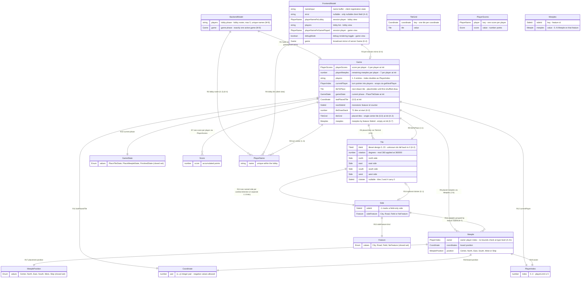

# Database Model Specification Document — Carcassonne (MODERNIZED)

* **Source:** `output/Carcassonne` (legacy code at pinned commit `ca2797745a863243fa6ce96af63435b0d67bf2ab`)
* **Modernization plan:** `modernization-plan.json` (decisions M-1..M-8; directives D-1..D-2)
* **Generated by:** the modernize-modeler skill from the codebase-modeler output.
Legacy citations `path:line` point at the pre-modernization code; `Artifact.md:line`
citations point at the source artifact; `(M-n)` references the modernization plan.

*The "database" of the modernized application is still absent by design: the data layer is a single typed in-memory state shape in TypeScript, owned by the server and broadcast in full to every client. No database engine, ORM, or migration tool exists in the modernized system (M-8).*

---

## 1. Project & System Overview

* **System Name:** Carcassonne — multiplayer tile-and-meeple board game, modernized per directive D-1 into a TypeScript single-page client plus a Node.js WebSocket server that owns the single authoritative in-memory state. The legacy form was an Elm 0.19 + Lamdera full-stack app (`DatabaseModel.md:9`, `src/Backend.elm:14-15`).
* **Version:** Modernized specification v1.0.0, derived from `modernization-plan.json`; the legacy baseline remains pinned at commit `ca2797745a863243fa6ce96af63435b0d67bf2ab` (no version field was declared in the legacy repo manifest `elm.json`; `DatabaseModel.md:10`).
* **Author/Lead Data Architect:** Modernize Modeler network — the DatabaseModel.md modernizer, rendering the codebase-modeler output against the modernization plan.
* **Description:** A browser-based multiplayer Carcassonne game where up to 5 players register in a lobby, take turns placing tiles and meeples on a shared board, and are scored by majority per feature. The role of this "database" is the persistence shape of the single in-memory state: one server-owned TypeScript state shape — a discriminated union of a lobby phase and a game phase — defined once in the domain core and broadcast in full to every connected client (K-4, M-8). There is no cross-restart persistence: restart = new empty lobby (M-8). See the full program specification at `./Specification.md` for the behavioral context (flows, use cases, domain rules).

## 2. Database Architecture & Technology Stack

The modernized stack follows the plan's database target verbatim: **None (no DBMS)** — a single typed in-memory state shape in TypeScript; the Evergreen snapshot/migration layer is dropped; explicit restart=new-lobby semantics (M-8).

| Concern | Modernized form | Was (legacy) | Modernization |
| :--- | :--- | :--- | :--- |
| **Database Type** | None — no DBMS. The data layer is a single typed in-memory state shape in TypeScript: a discriminated union of lobby phase `{ players }` and game phase `{ game }`, defined once in the domain core (M-8) | A single in-memory Elm value (the backend `Model`) whose shape was versioned by compiler-generated Evergreen snapshots; "tables" were Elm records/ADTs (`src/Backend.elm:14-15`, `DatabaseModel.md:16`) | `M-8` |
| **DBMS (Database Management System)** | None — no SQL, no ORM, no connection strings. State lives only in the server process's memory and is explicitly discarded on restart (M-8) | Lamdera in-memory backend model with platform-managed serialization; the only "connection" was the Lamdera backend registration (`src/Backend.elm:18-25`, `DatabaseModel.md:17`) | `M-8` |
| **Hosting/Cloud Provider** | Docker multi-stage image: a Vite static-build stage plus a Node.js 24 server stage serving the SPA and the WebSocket endpoint; the hosting-provider choice is left open (no provider directive) (M-7) | Lamdera platform — hosting, auto-deploy via git remote, and Evergreen state storage across redeploys (`readme.md:139-151`, `DatabaseModel.md:18`) | `replaced (M-7)` |
| **ORM / Query Builder** | None — direct typed value composition; there is no persistence abstraction layer | None — direct Elm value composition; there was no persistence abstraction layer (`src/Backend.elm:18-25`, `DatabaseModel.md:19`) | `kept` |
| **Migration Tool** | None — no migration tool and no snapshot files; restart semantics are documented as "new empty lobby" (M-8) | Lamdera Evergreen — compiler-generated snapshot and migration files under `src/Evergreen/` (`src/Evergreen/Migrate/V10.elm:3`); history V1 → V3 (ModelReset), V3 → V5 (field-level), V5 → V10 (ModelReset) (`DatabaseModel.md:20`) | `replaced (M-8)` |

The storage-medium question that the source left open (A-17) is closed here: the modernized data layer is explicitly in-process memory only, so there is no storage backend — Lamdera Cloud, local, or otherwise — to configure or verify (M-8).

## 3. Global Naming Conventions & Standards

The legacy Elm conventions carry over 1:1 to TypeScript: PascalCase type names, camelCase fields, no primary/foreign keys, no timestamps. The names below are stable — the modernization changes the language of the definition, not the naming identity (M-8, K-7).

| Concern | Modernized convention | Legacy basis | Modernization |
| :--- | :--- | :--- | :--- |
| **Types ("tables")** | `PascalCase` TypeScript interfaces/aliases for every state shape: `Game`, `Tile`, `Meeple`, `Side`, `Feature`, `GameState`, `MeeplePosition`, `Score`, `Coordinate`, `PlayerIndex`, `PlayerName`, `TileGrid`, `PlayerScores`, `Meeples`; the top-level `BackendModel` is a discriminated union (M-8) | `PascalCase` singular Elm type names for every persisted record/ADT (`src/Types/Game.elm:28`, `src/Types/Tile.elm:21`, `src/Types/Meeple.elm:17`, `src/Types.elm:11`, `DatabaseModel.md:24`) | `kept (K-7)` |
| **Columns/Fields** | `camelCase` fields: `playerScores`, `tileToPlace`, `lastPlacedTile`; the `Game` record keeps its eleven field names and semantics (M-8) | `camelCase` Elm record fields; value types exposed via their module name (`src/Types/Game.elm:29-39`, `src/Types/PlayerName.elm:4-5`, `DatabaseModel.md:25`) | `kept (K-7)` |
| **Primary Keys** | None — no database primary keys exist (no DBMS, M-8). Identity is provided by keyed collections: `tileGrid` keyed by `Coordinate`, `playerScores` keyed by `PlayerName`, `meeples` keyed by feature `SideId` | Elm `Dict` key types and value fields; the tileset is addressed by `TileId` 0..23 with a fallback to tile 0 (`src/Types/Game.elm:20-21`, `src/Types/Game.elm:16-17`, `src/Types/Game.elm:24-25`, `src/Helpers/TileMapper.elm:252-253`, `DatabaseModel.md:26`) | `kept (K-7)` |
| **Foreign Keys** | None — no foreign-key columns; relationships are value composition; `Meeple.owner` remains an index with no type-level bounds check (accepted, A-21) | `Meeple.owner` was a `PlayerIndex` into `Game.players` with no type-level or runtime bounds check (`src/Types/Meeple.elm:18`, `src/Types/Game.elm:31`, `DatabaseModel.md:27`) | `kept` |
| **Boolean Fields** | Plain `boolean` fields with semantic names; no `is_`/`has_` prefix convention; the only persisted `Bool` is `debugMode` (per session) | Same: the only persisted `Bool` was `debugMode` (`src/Types.elm:31`, `DatabaseModel.md:28`) | `kept` |
| **Timestamps** | No table carries `created_at`/`updated_at` — the state shapes contain no timestamp fields; temporal ordering is expressed through game turn state (`currentPlayer`, `gameState`), not clocks | Same: no timestamp fields in the state records (`src/Types/Game.elm:28-40`, `DatabaseModel.md:29`) | `kept` |
| **Nullability** | Elm total types map to total TypeScript types; the only nullable surfaces are `Tile.cloister` (`number | undefined`) and the client's `error` (`string | null`) | Total types throughout; the only nullable-equivalent fields were `error : Maybe String` and `cloister : Maybe SideId` (`src/Types.elm:23`, `src/Types/Tile.elm:28`, `DatabaseModel.md:30`) | `kept` |

## 4. Entity-Relationship Diagram (ERD)

> **Note — no DBMS:** The diagram below is the schema of the *typed in-memory state*, not of a database (M-8). Each "entity" is a TypeScript interface/alias that participates in the server state, each attribute is a field, and each relationship is value composition (there is no referential enforcement — see §6 and A-21).

**Link to Diagram:** Inline Mermaid `erDiagram` below (as in the source artifact, `DatabaseModel.md:36`; no external diagram service is used for this artifact).



### Element map

| Node | Element (modern role) | Legacy code reference | Modernization |
| :--- | :--- | :--- | :--- |
| `BackendModel` | Entity — top-level server state; TypeScript discriminated union: lobby phase `{ players }` \| game phase `{ game }`, defined once in the domain core (M-8) | `src/Types.elm:11-17` | `M-8` |
| `FrontendModel` | Entity — per-session client state; mirror of the broadcast full state (K-4) | `src/Types.elm:20-33` | `kept (K-4)` |
| `Game` | Entity — core game-state interface; part of the single typed state definition (M-8) | `src/Types/Game.elm:28-40` | `M-8` |
| `TileGrid` | Entity — placed tiles, keyed by `Coordinate` (one tile per coordinate) | `src/Types/Game.elm:20-21` | `kept` |
| `PlayerScores` | Entity — score per player, keyed by `PlayerName` (K-7) | `src/Types/Game.elm:16-17` | `kept (K-7)` |
| `Meeples` | Entity — meeples grouped by feature `SideId` (implicit features, K-7) | `src/Types/Game.elm:24-25` | `kept (K-7)` |
| `Tile` | Entity — placed or pending tile | `src/Types/Tile.elm:21-29` | `kept` |
| `Side` | Entity — one side of a tile | `src/Types/Tile.elm:15-18` | `kept` |
| `Meeple` | Entity — a player's meeple | `src/Types/Meeple.elm:17-23` | `kept` |
| `Feature` | Entity — feature-kind union (4 values) | `src/Types/Feature.elm:4-8` | `kept` |
| `GameState` | Entity — game-phase union (3 values) | `src/Types/GameState.elm:4-7` | `kept` |
| `MeeplePosition` | Entity — meeple-position union (6 values) | `src/Types/Meeple.elm:8-14` | `kept` |
| `Score` | Entity — `number` point total | `src/Types/Score.elm:4-5` | `kept` |
| `Coordinate` | Entity — `(x, y)` number pair; negative values allowed | `src/Types/Coordinate.elm:4-5` | `kept` |
| `PlayerIndex` | Entity — `number` (0..4) turn-order position | `src/Types/PlayerIndex.elm:4-5` | `kept` |
| `PlayerName` | Entity — `string`, unique within the lobby | `src/Types/PlayerName.elm:4-5` | `kept` |
| `BackendModel ||--o| Game` | Relationship R1 — the game phase holds exactly one active game | `src/Types.elm:11-17` | `M-8` |
| `BackendModel ||--o{ PlayerName` | Relationship R2 — lobby roster, 0..5 players, capped by `playerLimit` (K-4) | `src/Types.elm:12-14`, `src/Backend.elm:110-118` | `kept (K-4)` |
| `FrontendModel ||--o| Game` | Relationship R3 — per-session mirror of the server Game (K-4) | `src/Types.elm:29-33` | `kept (K-4)` |
| `FrontendModel ||--o{ PlayerName` | Relationship R4 — client lobby view's `players` list mirrors the lobby roster (K-4) | `src/Types.elm:25-28` | `kept` |
| `Game ||--o{ Tile` | Relationship R5 — placed tiles via `Game.tileGrid` | `src/Types/Game.elm:38` | `kept` |
| `Game ||--o{ Meeple` | Relationship R6 — placed meeples via `Game.meeples`; bounded by 7 × players | `src/Types/Game.elm:39` | `kept` |
| `Game ||--o{ Score` | Relationship R7 — one score per player via `Game.playerScores` (K-7) | `src/Types/Game.elm:29` | `kept (K-7)` |
| `Game ||--o{ PlayerName` | Relationship R8 — turn roster; `Game.players` is the ordered 1..5 roster that `currentPlayer` indexes into | `src/Types/Game.elm:31` | `kept` |
| `Game ||--|| Tile` | Relationship R9 — `Game.tileToPlace`, the next drawn tile awaiting placement/rotation | `src/Types/Game.elm:33` | `kept` |
| `Game ||--|| GameState` | Relationship R10 — `Game.gameState`, the current phase | `src/Types/Game.elm:34` | `kept` |
| `Game ||--|| Coordinate` | Relationship R11 — `Game.lastPlacedTile`, the most recent placement | `src/Types/Game.elm:35` | `kept` |
| `Game ||--|| PlayerIndex` | Relationship R12 — `Game.currentPlayer`, the turn pointer | `src/Types/Game.elm:32` | `kept` |
| `Tile ||--|| Side` | Relationship R13 — one named side per cardinal direction (4 links); rotation permutes them | `src/Types/Tile.elm:24-27` | `kept` |
| `Tile |o--o| Side` | Relationship R14 — optional cloister feature, 0..1 (tileset tiles 3 and 4) | `src/Types/Tile.elm:28` | `kept` |
| `Side ||--|| Feature` | Relationship R15 — `Side.sideFeature` classifies the feature the side borders (K-7) | `src/Types/Tile.elm:16-17` | `kept (K-7)` |
| `Side ||--o{ Meeple` | Relationship R16 — meeples grouped under the feature `SideId` they occupy (K-7) | `src/Types/Game.elm:24-25` | `kept (K-7)` |
| `Meeple ||--|| MeeplePosition` | Relationship R17 — `Meeple.position` is its placement relative to a tile | `src/Types/Meeple.elm:20` | `kept` |
| `Meeple ||--|| Coordinate` | Relationship R18 — `Meeple.coordinates` is its board position | `src/Types/Meeple.elm:19` | `kept` |
| `Meeple ||--|| PlayerIndex` | Relationship R19 — owner; each player starts with 7 meeples | `src/Types/Meeple.elm:18`, `src/Types/Game.elm:61` | `kept` |

### Quick reference (optional slot)

DBML is **not applicable — no DBMS** (M-8). The quick reference for the modernized data layer is the TypeScript shape sketch instead (anchored by M-8; the modernized code does not exist yet, so no code citation is given):

```ts
// M-8: one typed state definition in the domain core.
// In-process memory only; no DBMS; no migration layer; restart = new empty lobby.
type BackendModel =
  | { phase: "lobby"; players: PlayerName[] }  // lobby phase: max 5, unique names
  | { phase: "game";  game: Game }             // game phase: exactly one active game
```

## 5. Core Entities (Data Dictionary)

Sixteen typed "tables" (TypeScript interfaces, keyed-collection aliases, unions, and value types) participate in the modernized state. The top-level `BackendModel` is a discriminated union: exactly one phase (lobby or game) is live at a time (M-8, K-4).

### 5.1. Entity: `BackendModel`
**Description:** Top-level server state — the modernized successor of the Lamdera backend `Model` alias (`src/Backend.elm:14-15`, `DatabaseModel.md:303-304`). It is now a TypeScript discriminated union with two variants, defined once in the domain core (M-8): the lobby phase holds the player roster and the game phase holds the active `Game`; exactly one variant holds at a time, and the game is dropped when the lobby is reset (same variant-exclusivity semantics as the legacy ADT, `src/Types.elm:11-17`). The compiler-generated snapshot and migration files that used to version this type are retired (M-8; closes I-5 and A-20).

| Column Name | Data Type | Constraints / Modifiers | Description | Code Reference (legacy) | Modernization |
| :--- | :--- | :--- | :--- | :--- | :--- |
| `players` (lobby phase) | `PlayerName[]` (`string[]`) | NOT NULL; max 5 entries (`playerLimit`); duplicates rejected | Registered lobby players; starts as `[]` at server init | `src/Types.elm:13`, `src/Backend.elm:110-118` | `M-8` |
| `game` (game phase) | `Game` | NOT NULL; exclusive of the lobby phase | The active game | `src/Types.elm:16` | `M-8` |

### 5.2. Entity: `FrontendModel`
**Description:** Per-session client state — the mirror of the server view for one player. In the modernized system it lives in the client SPA's state and is replaced by full-state pushes (K-4: full-state broadcast to every client; non-acting clients render the board read-only; reconnect = re-register with the same name). The legacy shape had three variants — registration, lobby, game played (`src/Types.elm:20-33`, `DatabaseModel.md:311-312`); the modern form keeps the same fields as TypeScript members of the client state.

| Column Name | Data Type | Constraints / Modifiers | Description | Code Reference (legacy) | Modernization |
| :--- | :--- | :--- | :--- | :--- | :--- |
| `nameInput` | `string` | NOT NULL | Text buffer of the player-name input field (registration view) | `src/Types.elm:22` | `kept (K-4)` |
| `error` | `string | null` | Nullable (only nullable client field) | Registration error message shown in the registration view | `src/Types.elm:23` | `kept (K-4)` |
| `playerName` (lobby) | `PlayerName` (`string`) | NOT NULL | This session's player, once registered | `src/Types.elm:26` | `kept (K-4)` |
| `players` (lobby) | `PlayerName[]` (`string[]`) | NOT NULL; mirrors server roster | Lobby player list as seen by this session | `src/Types.elm:27` | `kept (K-4)` |
| `playerName` (game) | `PlayerName` (`string`) | NOT NULL | This session's player during an active game | `src/Types.elm:30` | `kept (K-4)` |
| `debugMode` | `boolean` | NOT NULL | Per-session debug rendering toggle (game view) | `src/Types.elm:31` | `kept (K-4)` |
| `game` (game) | `Game` | NOT NULL; replaced by full-state broadcasts | Client copy of the `Game` record (game view) | `src/Types.elm:32` | `kept (K-4)` |

### 5.3. Entity: `Game`
**Description:** The core game-state interface: player scores, remaining meeples, ordered player list, current turn, the tile about to be placed, phase, last placed tile, next feature id counter, shuffled tile draw stack, the placed-tile grid, and the meeples grouped by feature (`src/Types/Game.elm:28-40`, `DatabaseModel.md:324-325`). The eleven field names and their semantics are preserved verbatim; the definition is now a single TypeScript type in the domain core (M-8). The state is authoritative and server-owned (K-4): a move is applied only after server-side revalidation of placement legality and turn ownership (M-4) — the legacy backend applied moves with no validation (`src/Helpers/GameLogic.elm:311-314`, `src/Backend.elm:150-183`). "Defaults" are runtime initializers from `initializeGame`, not storage defaults (accepted, A-22).

| Column Name | Data Type | Constraints / Modifiers | Description | Code Reference (legacy) | Modernization |
| :--- | :--- | :--- | :--- | :--- | :--- |
| `playerScores` | `PlayerName → Score` keyed map (`string` → `number`) | NOT NULL; default 0 per player at `initializeGame` | Score per player, keyed by name (K-7: name-keyed cluster, no standalone Player type) | `src/Types/Game.elm:29`, `src/Types/Game.elm:60` | `M-8` |
| `playerMeeples` | `PlayerName → number` keyed map | NOT NULL; default 7 per player at `initializeGame` | Remaining meeple count per player, keyed by name | `src/Types/Game.elm:30`, `src/Types/Game.elm:61` | `M-8` |
| `players` | `PlayerName[]` (`string[]`) | NOT NULL; 1..5 entries; must not be empty (doc comment); unique names | Ordered turn list; index doubles as `PlayerIndex` | `src/Types/Game.elm:31`, `src/Types/Game.elm:48-51` | `M-8` |
| `currentPlayer` | `PlayerIndex` (`number`) | NOT NULL; 0..`players.length - 1`; default 0 at init | Index of the player whose turn it is; wraps around via `getNextPlayer` | `src/Types/Game.elm:32`, `src/Types/Game.elm:78-84` | `M-8` |
| `tileToPlace` | `Tile` | NOT NULL; placeholder `getTile 0`, replaced by first shuffled draw | The tile currently on the table to be placed (next draw from `tileDrawStack`) | `src/Types/Game.elm:33`, `src/Backend.elm:44-59` | `M-8` |
| `gameState` | `GameState` | NOT NULL; default `PlaceTileState` at init | Current phase of the turn | `src/Types/Game.elm:34`, `src/Types/GameState.elm:4-7` | `M-8` |
| `lastPlacedTile` | `Coordinate` (`{ x, y }`) | NOT NULL; default (0, 0) at init | Coordinate of the most recently placed tile; basis for meeple placement and adjacency checks | `src/Types/Game.elm:35`, `src/Helpers/GameLogic.elm:393-413` | `M-8` |
| `nextSideId` | `SideId` (`number`) | NOT NULL; default = max existing SideId over the grid at init | Monotonic feature-id counter so globally connected features keep a stable id (K-7) | `src/Types/Game.elm:36`, `src/Types/Game.elm:109-115` | `M-8` |
| `tileDrawStack` | `TileId[]` (`number[]`) | NOT NULL; 71 entries at start (K-2); consumed as the game progresses — not explicitly cleared by `finishGame` (`src/Helpers/GameLogic.elm:511-556`), so a non-empty stack is possible at game end | Shuffled remaining tile pool; reshuffled after game init and each meeple placement | `src/Types/Game.elm:37`, `src/Backend.elm:147` | `M-8` |
| `tileGrid` | `TileGrid` (`Coordinate → Tile` keyed map) | NOT NULL; default = single center tile (0,0) = `getTile 0` (K-2) | The placed tiles on the board | `src/Types/Game.elm:38`, `src/Types/Game.elm:102-104` | `M-8` |
| `meeples` | `Meeples` (`SideId → Meeple[]` keyed map) | NOT NULL; default empty map at init | All placed meeples grouped by the feature (SideId) they occupy (K-7) | `src/Types/Game.elm:39` | `M-8` |

### 5.4. Entity: `TileGrid`
**Description:** Collection of placed tiles: a keyed map by board `Coordinate`; grows as tiles are placed; seeded with the center starting tile (id 0: City/Road/Field/Road sides, no cloister — the cloister tiles are ids 3 and 4) at (0,0) (`src/Helpers/TileMapper.elm:12-20`, `src/Helpers/TileMapper.elm:42-60`, K-2). Modeled as a key/value "table" (there is no per-record row shape beyond the value type) (`src/Types/Game.elm:20-21`, `src/Types/Game.elm:102-104`, `DatabaseModel.md:341-342`).

| Column Name | Data Type | Constraints / Modifiers | Description | Code Reference (legacy) | Modernization |
| :--- | :--- | :--- | :--- | :--- | :--- |
| `coordinate` (key) | `Coordinate` (`{ x, y }`) | UNIQUE (map key) | Board position; negative coordinates allowed | `src/Types/Game.elm:20-21`, `src/Types/Coordinate.elm:4-5` | `kept` |
| `tile` (value) | `Tile` | NOT NULL | The tile placed at that coordinate | `src/Types/Game.elm:20-21` | `kept` |

### 5.5. Entity: `PlayerScores`
**Description:** Player score table: a keyed map by `PlayerName` with `Score` (`number`) values. Initialized to 0 per player at game start; updated at feature completion (K-7: the player is a name-keyed cluster of fields inside `Game`, not a standalone Player type) (`src/Types/Game.elm:16-17`, `src/Types/Game.elm:60`, `DatabaseModel.md:349-350`).

| Column Name | Data Type | Constraints / Modifiers | Description | Code Reference (legacy) | Modernization |
| :--- | :--- | :--- | :--- | :--- | :--- |
| `player` (key) | `PlayerName` (`string`) | UNIQUE (map key) | The scored player | `src/Types/Game.elm:16-17`, `src/Types/PlayerName.elm:4-5` | `kept (K-7)` |
| `score` (value) | `Score` (`number`) | NOT NULL; default 0 at init | Accumulated points | `src/Types/Score.elm:4-5` | `kept (K-7)` |

### 5.6. Entity: `Meeples`
**Description:** Meeple registry grouped by feature: a keyed map by `SideId` (feature id), each entry a list of `Meeple` on that feature (K-7: features are implicit via shared SideIds — there is no Feature aggregate object). Started empty; entries are inserted when meeples are placed (`src/Helpers/GameLogic.elm:401-413`) and removed per-feature when a feature is scored (`src/Helpers/GameLogic.elm:440-442`), with the whole map cleared at game end (`src/Helpers/GameLogic.elm:554`) (`src/Types/Game.elm:24-25`, `src/Helpers/GameLogic.elm:256-262`, `DatabaseModel.md:357-358`).

| Column Name | Data Type | Constraints / Modifiers | Description | Code Reference (legacy) | Modernization |
| :--- | :--- | :--- | :--- | :--- | :--- |
| `sideId` (key) | `SideId` (`number`) | UNIQUE (map key) | Feature id the group belongs to | `src/Types/Game.elm:24-25` | `kept (K-7)` |
| `meeples` (value) | `Meeple[]` | 0..N entries | Meeples occupying that feature | `src/Types/Game.elm:24-25`, `src/Helpers/GameLogic.elm:401-413` | `kept (K-7)` |

### 5.7. Entity: `Tile`
**Description:** A placed or pending tile instance: its tileset id, current rotation (degrees), four cardinal sides (north/east/south/west), and an optional Cloister side reference. Rotation is normalized to [0,360) after 360000 degrees to prevent overflow (`src/Types/Tile.elm:21-29`, `src/Helpers/GameLogic.elm:21-40`, `DatabaseModel.md:365-366`). The `tileId` domain 0..23 is part of the code-verified tileset data kept verbatim (K-2).

| Column Name | Data Type | Constraints / Modifiers | Description | Code Reference (legacy) | Modernization |
| :--- | :--- | :--- | :--- | :--- | :--- |
| `tileId` | `TileId` (`number`) | NOT NULL; defined domain 0..23; unknown ids fall back to tile 0 (K-2) | Identity of this tile's tileset definition | `src/Types/Tile.elm:22`, `src/Helpers/TileMapper.elm:9-12`, `src/Helpers/TileMapper.elm:252-253` | `kept` |
| `rotation` | `number` | NOT NULL; default 0; kept in 0..359 by `modBy 360` when ≥ 360000; the ported rotation check is asserted as a runtime invariant on the server rotation path (M-4) | Current rotation in degrees (0/90/180/270) | `src/Types/Tile.elm:23`, `src/Helpers/GameLogic.elm:24-31` | `kept` |
| `north` | `Side` | NOT NULL | North side of the tile | `src/Types/Tile.elm:24` | `kept` |
| `east` | `Side` | NOT NULL | East side of the tile | `src/Types/Tile.elm:25` | `kept` |
| `south` | `Side` | NOT NULL | South side of the tile | `src/Types/Tile.elm:26` | `kept` |
| `west` | `Side` | NOT NULL | West side of the tile | `src/Types/Tile.elm:27` | `kept` |
| `cloister` | `SideId \| undefined` (`number \| undefined`) | Nullable; `undefined` for most tiles; `0` for tileset tiles 3 and 4 (K-2) | SideId of the Cloister feature on this tile, if any (2 of the 24 tileset tiles carry one) | `src/Types/Tile.elm:28`, `src/Helpers/TileMapper.elm:49`, `src/Helpers/TileMapper.elm:59` | `kept` |

### 5.8. Entity: `Side`
**Description:** One side of a tile: a feature id (`SideId`; -1 marks a field side that does not belong to a named feature) and the `Feature` it borders. SideIds are renumbered globally (`updateSideIds`) so connected features across tiles share an id (K-7) (`src/Types/Tile.elm:15-18`, `src/Types/Tile.elm:62-81`, `DatabaseModel.md:378-379`).

| Column Name | Data Type | Constraints / Modifiers | Description | Code Reference (legacy) | Modernization |
| :--- | :--- | :--- | :--- | :--- | :--- |
| `sideId` | `SideId` (`number`) | NOT NULL; -1 = field-only side; otherwise a globally unique feature id | Feature id this side belongs to | `src/Types/Tile.elm:16`, `src/Types/Tile.elm:62-81` | `kept` |
| `sideFeature` | `Feature` | NOT NULL; union: `City`, `Road`, `Field`, `NoFeature` | The kind of feature this side borders | `src/Types/Tile.elm:17`, `src/Types/Feature.elm:4-8` | `kept` |

### 5.9. Entity: `Meeple`
**Description:** A player's meeple: owning player index, board coordinate, and position (`Center`/`North`/`East`/`South`/`West`/`Skip`). The record comment notes room for expansion properties (large meeple, pig, ...) (`src/Types/Meeple.elm:17-23`, `DatabaseModel.md:386-387`). The `owner` index keeps its unbounded form (accepted, A-21).

| Column Name | Data Type | Constraints / Modifiers | Description | Code Reference (legacy) | Modernization |
| :--- | :--- | :--- | :--- | :--- | :--- |
| `owner` | `PlayerIndex` (`number`) | NOT NULL; no type-level bounds check (A-21) | `PlayerIndex` of the player who owns this meeple | `src/Types/Meeple.elm:18` | `kept` |
| `coordinates` | `Coordinate` (`{ x, y }`) | NOT NULL | Board position of the meeple | `src/Types/Meeple.elm:19`, `tests/MeepleTests.elm:29` | `kept` |
| `position` | `MeeplePosition` | NOT NULL; union: `Center`, `North`, `East`, `South`, `West`, `Skip` | Meeple placement position relative to the last placed tile | `src/Types/Meeple.elm:20`, `src/Types/Meeple.elm:8-14` | `kept` |

### 5.10. Entity: `Feature`
**Description:** Closed union of the kinds of Carcassonne features a tile side can border; rendered row-per-value as in the source (K-7: no Feature aggregate object exists — features are implicit via shared SideIds) (`src/Types/Feature.elm:4-8`, `DatabaseModel.md:395-396`).

| Column Name | Data Type | Constraints / Modifiers | Description | Code Reference (legacy) | Modernization |
| :--- | :--- | :--- | :--- | :--- | :--- |
| `City` | union member | Closed set (4 values) | City feature | `src/Types/Feature.elm:4-8` | `kept` |
| `Road` | union member | Closed set (4 values) | Road feature | `src/Types/Feature.elm:4-8` | `kept` |
| `Field` | union member | Closed set (4 values) | Field feature | `src/Types/Feature.elm:4-8` | `kept` |
| `NoFeature` | union member | Closed set (4 values) | No feature on this side | `src/Types/Feature.elm:4-8` | `kept` |

### 5.11. Entity: `GameState`
**Description:** Closed union of the current game phase: placing a tile, placing a meeple, or finished (`src/Types/GameState.elm:4-7`, `DatabaseModel.md:405-406`). Game finish is still delivered as a full-state push, not a dedicated event (K-7).

| Column Name | Data Type | Constraints / Modifiers | Description | Code Reference (legacy) | Modernization |
| :--- | :--- | :--- | :--- | :--- | :--- |
| `PlaceTileState` | union member | Closed set (3 values) | Tile placement phase | `src/Types/GameState.elm:4-7` | `kept` |
| `PlaceMeepleState` | union member | Closed set (3 values) | Meeple placement phase | `src/Types/GameState.elm:4-7` | `kept` |
| `FinishedState` | union member | Closed set (3 values) | Game over | `src/Types/GameState.elm:4-7` | `kept` |

### 5.12. Entity: `MeeplePosition`
**Description:** Closed union of where a meeple is placed relative to the last placed tile (or `Skip` to decline placement) (`src/Types/Meeple.elm:8-14`, `DatabaseModel.md:414-415`).

| Column Name | Data Type | Constraints / Modifiers | Description | Code Reference (legacy) | Modernization |
| :--- | :--- | :--- | :--- | :--- | :--- |
| `Center` | union member | Closed set (6 values) | Center (cloister) placement | `src/Types/Meeple.elm:8-14` | `kept` |
| `North` | union member | Closed set (6 values) | North-edge placement | `src/Types/Meeple.elm:8-14` | `kept` |
| `East` | union member | Closed set (6 values) | East-edge placement | `src/Types/Meeple.elm:8-14` | `kept` |
| `South` | union member | Closed set (6 values) | South-edge placement | `src/Types/Meeple.elm:8-14` | `kept` |
| `West` | union member | Closed set (6 values) | West-edge placement | `src/Types/Meeple.elm:8-14` | `kept` |
| `Skip` | union member | Closed set (6 values) | Decline meeple placement for this turn | `src/Types/Meeple.elm:8-14` | `kept` |

### 5.13. Entity: `Score`
**Description:** Value type: a player's accumulated points as a `number` (`src/Types/Score.elm:4-5`, `DatabaseModel.md:426-427`).

| Column Name | Data Type | Constraints / Modifiers | Description | Code Reference (legacy) | Modernization |
| :--- | :--- | :--- | :--- | :--- | :--- |
| `score` | `number` | NOT NULL; default 0 at `initializeGame` | Point total | `src/Types/Score.elm:4-5`, `src/Types/Game.elm:60` | `kept` |

### 5.14. Entity: `Coordinate`
**Description:** Value type: a board grid position as an `{ x, y }` pair of numbers; negative coordinates are used (the grid extends in all four directions from the center) (`src/Types/Coordinate.elm:4-5`, `tests/MeepleTests.elm:29`, `DatabaseModel.md:433-434`).

| Column Name | Data Type | Constraints / Modifiers | Description | Code Reference (legacy) | Modernization |
| :--- | :--- | :--- | :--- | :--- | :--- |
| `coordinate pair` | `{ x: number, y: number }` | NOT NULL; any integer pair; composite key for `TileGrid` | (x, y) grid position | `src/Types/Coordinate.elm:4-5` | `kept` |

### 5.15. Entity: `PlayerIndex`
**Description:** Value type: a player's position in the turn-order array (0-based). Domain is 0..4, enforced by `playerLimit = 5` (`src/Types/PlayerIndex.elm:4-5`, `src/Types/Game.elm:43-45`, `DatabaseModel.md:440-441`).

| Column Name | Data Type | Constraints / Modifiers | Description | Code Reference (legacy) | Modernization |
| :--- | :--- | :--- | :--- | :--- | :--- |
| `player index` | `number` | NOT NULL; domain 0..playerLimit-1 (`playerLimit = 5`) | 0-based turn-order position | `src/Types/PlayerIndex.elm:4-5`, `src/Types/Game.elm:43-45` | `kept` |

### 5.16. Entity: `PlayerName`
**Description:** Value type: a player's unique display name (`string`). Uniqueness across the lobby is enforced at registration (K-4/K-7 identity semantics) (`src/Types/PlayerName.elm:4-5`, `src/Backend.elm:95-101`, `DatabaseModel.md:447-448`).

| Column Name | Data Type | Constraints / Modifiers | Description | Code Reference (legacy) | Modernization |
| :--- | :--- | :--- | :--- | :--- | :--- |
| `player name` | `string` | NOT NULL; UNIQUE within the lobby (enforced at registration) | Player's display name; the cross-record player identity | `src/Types/PlayerName.elm:4-5`, `src/Backend.elm:95-101` | `kept` |

## 6. Relationships & Cardinality

All relationships are value composition inside typed values; there are no database foreign keys and no referential actions — **On Delete: N/A for every relationship** (no DBMS, M-8; accepted, A-21). The relationship set R1–R19 is unchanged from the source (`DatabaseModel.md:454-456`).

| Ref | Relationship | Cardinality | Modern form (value composition) | On Delete | Code reference (legacy) | Modernization |
| :--- | :--- | :--- | :--- | :--- | :--- | :--- |
| R1 | BackendModel to Game | 1:1 (max) | The game phase of the `BackendModel` union holds at most one active `Game` | N/A — no DBMS (M-8) | `src/Types.elm:11-17` | `M-8` |
| R2 | BackendModel to PlayerName | 1:N (0..5) | The lobby phase's `players` list is the lobby roster; capped at `playerLimit` (5) with a full-lobby signal on overflow (K-4) | N/A — value composition | `src/Types.elm:12-14`, `src/Backend.elm:110-118` | `kept (K-4)` |
| R3 | FrontendModel to Game | 1:1 (max) | The client state mirrors the server `Game` (full-state pushes replace it) (K-4) | N/A — value composition | `src/Types.elm:29-33` | `kept (K-4)` |
| R4 | FrontendModel to PlayerName | 1:N (0..5) | The client lobby list mirrors the lobby roster for the session | N/A — value composition | `src/Types.elm:25-28` | `kept` |
| R5 | Game to Tile | 1:N | `Game.tileGrid` maps each `Coordinate` to a `Tile`; one tile per coordinate, growing over the game | N/A — dropping the game phase drops the whole grid | `src/Types/Game.elm:38`, `src/Types/Game.elm:20-21` | `kept` |
| R6 | Game to Meeple | 1:N | `Game.meeples` maps each feature `SideId` to its 0..N `Meeple` list; total bounded by 7 × players (K-7) | N/A — value composition | `src/Types/Game.elm:39`, `src/Types/Game.elm:24-25` | `kept (K-7)` |
| R7 | Game to Score | 1:N | `Game.playerScores` maps each `PlayerName` to a `Score` (K-7) | N/A — value composition | `src/Types/Game.elm:29`, `src/Types/Game.elm:16-17` | `kept (K-7)` |
| R8 | Game to PlayerName | 1:N (1..5) | `Game.players` is the ordered roster that `currentPlayer` indexes into | N/A — value composition | `src/Types/Game.elm:31`, `src/Types/Game.elm:78-84` | `kept` |
| R9 | Game to Tile — `tileToPlace` | 1:1 | `Game.tileToPlace` is the next drawn tile awaiting placement/rotation | N/A — value composition | `src/Types/Game.elm:33` | `kept` |
| R10 | Game to GameState | 1:1 | `Game.gameState` selects the current phase | N/A — value composition | `src/Types/Game.elm:34` | `kept` |
| R11 | Game to Coordinate — `lastPlacedTile` | 1:1 | `Game.lastPlacedTile` points into the `TileGrid` at the most recent placement | N/A — the coordinate is not enforced to exist in the grid at the type level | `src/Types/Game.elm:35`, `src/Types/Game.elm:87-94` | `kept` |
| R12 | Game to PlayerIndex — `currentPlayer` | 1:1 | `Game.currentPlayer` is a `PlayerIndex` into `Game.players` | N/A — no type-level bounds check against `players.length` | `src/Types/Game.elm:32` | `kept` |
| R13 | Tile to Side (4 links) | 1:1 × 4 | Each tile has exactly four named sides (`north`/`east`/`south`/`west`); rotation permutes them rather than reordering storage | N/A — sides exist only inside their `Tile` | `src/Types/Tile.elm:24-27`, `src/Helpers/GameLogic.elm:24-40` | `kept` |
| R14 | Tile to Side — cloister | 0..1 | `Tile.cloister` is optional: 0..1 cloister feature per tile (tileset tiles 3 and 4 carry it, K-2) | N/A — value composition | `src/Types/Tile.elm:28`, `src/Helpers/TileMapper.elm:49` | `kept` |
| R15 | Side to Feature | 1:1 | `Side.sideFeature` classifies the feature the side borders; `sideId` groups sides into the same connected feature (K-7) | N/A — value composition | `src/Types/Tile.elm:16-17` | `kept (K-7)` |
| R16 | Side (feature SideId) to Meeple | 1:N | The `Meeples` map groups 0..N meeples under the `SideId` of the feature they occupy; `getFeatureOwners` reports distinct owners per feature id (K-7) | N/A — entries are removed per-feature when a feature is scored (`src/Helpers/GameLogic.elm:440-442`), and the map is cleared at game end (`src/Helpers/GameLogic.elm:554`) | `src/Types/Game.elm:24-25`, `src/Helpers/GameLogic.elm:256-262` | `kept (K-7)` |
| R17 | Meeple to MeeplePosition | 1:1 | `Meeple.position` is its placement relative to a tile | N/A — value composition | `src/Types/Meeple.elm:20` | `kept` |
| R18 | Meeple to Coordinate | 1:1 | `Meeple.coordinates` is its board position | N/A — no type-level guarantee the coordinate is occupied in the grid | `src/Types/Meeple.elm:19` | `kept` |
| R19 | Meeple to PlayerIndex — `owner` | 1:1 (owner side) | `Meeple.owner` is the `PlayerIndex` of its owner; each player starts with 7 meeples (`playerMeeples`); the unbounded index is preserved (A-21) | N/A — an index with no bounds check at the type level | `src/Types/Meeple.elm:18`, `src/Types/Game.elm:61` | `kept` |

## 7. Indexing & Performance Strategy

**Index strategy: not applicable — no DBMS (M-8).** No database indexes exist in the modernized system. The lookup structures are keyed maps and collections inside the typed state; the keying structures below carry over from the legacy design with their identities preserved (all unique by construction; none supports full-text search) (`DatabaseModel.md:541-547`).

| Key / Index | Table ("on") | Keyed Column(s) | Structure (modern) | Usage / Code reference (legacy) | Modernization |
| :--- | :--- | :--- | :--- | :--- | :--- |
| TileGrid primary key | `TileGrid` | `Coordinate` (composite x, y) | Keyed map, unique by construction | One tile per coordinate; neighbor-adjacency placement checks — `src/Types/Game.elm:20-21`, `src/Helpers/GameLogic.elm:350` | `kept` |
| PlayerScores primary key | `PlayerScores` | `PlayerName` | Keyed map, unique by construction (K-7) | One score row per player — `src/Types/Game.elm:16-17` | `kept (K-7)` |
| Meeples primary key | `Meeples` | `SideId` (feature id) | Keyed map, unique by construction (K-7) | One feature id maps to its 0..N meeples — `src/Types/Game.elm:24-25`, `src/Helpers/GameLogic.elm:401-413` | `kept (K-7)` |
| playerMeeples primary key | `Game.playerMeeples` | `PlayerName` | Keyed map, unique by construction | Remaining-meeple counts per player — `src/Types/Game.elm:30`, `src/Helpers/GameLogic.elm:480` | `kept` |
| players turn-order key | `Game.players` | `PlayerIndex` + `PlayerName` (composite: index positions the name) | Array (O(1) index access), unique names | Positional player identity; `currentPlayer` is an index into it — `src/Types/Game.elm:31-32`, `src/Types/Game.elm:43-45` | `kept` |
| Tile natural key | `Tile` | `TileId` (0..23) | Value field; lookup via `getTile` with fallback to tile 0 (K-2) | Tileset definition identity; every `TileId` is resolvable — `src/Types/Tile.elm:22`, `src/Helpers/TileMapper.elm:9-12`, `src/Helpers/TileMapper.elm:252-253` | `kept (K-2)` |
| PlayerName lobby key | `BackendModel` lobby | `PlayerName` | List membership check at registration; kick targets a name (K-4) | Lobby-level player identity; duplicate names rejected — `src/Backend.elm:95-101`, `src/Backend.elm:125-133` | `kept (K-4)` |
| tileGrid lookup index | `TileGrid` | `Coordinate` | Keyed map, point lookups | 8-neighborhood adjacency checks, last-placed-tile retrieval, feature-connectivity scans — `src/Helpers/GameLogic.elm:198-201`, `src/Helpers/GameLogic.elm:232-240` | `kept` |
| meeples lookup index | `Meeples` | `SideId` | Keyed map, point lookups (K-7) | Feature-owner queries (`getFeatureOwners`, `src/Helpers/GameLogic.elm:256-262`), meeple insert on placement (`src/Helpers/GameLogic.elm:401-413`), removal per scored feature (`src/Helpers/GameLogic.elm:440-442`), map cleared at game end (`src/Helpers/GameLogic.elm:554`) | `kept (K-7)` |
| meepleColorDictionary lookup | (not persisted) | `PlayerIndex` (0..4) | Static constant map | Player-index-to-color mapping (0=red, 1=blue, 2=green, 3=yellow, 4=black; unknown → black) used to pick a meeple image; not part of the persisted state — `src/Types/Meeple.elm:26-42` | `kept` |

No composite database indexes, unique constraints, or full-text search indexes are defined — there is no DBMS to index (M-8).

## 8. Security & Data Compliance

The source verified that the legacy data layer had **no security or compliance mechanisms** (`DatabaseModel.md:564`). The modernized data layer answers each template concern honestly:

* **Data Encryption at Rest:** Not applicable — there is no persistent store. The modernized data layer is in-process memory only (M-8): there is no storage medium to encrypt, no key material, and no store settings. This closes the source's open question about the concrete storage backend (A-17; legacy: platform-managed medium, `src/Evergreen/Migrate/V10.elm:3-18`, `elm.json:17-18`, `DatabaseModel.md:566`). *Modernization: `replaced (M-8)`.*
* **Row-Level Security (RLS):** Not applicable at the storage level — no DBMS (M-8). Every connected client still receives the same full-state broadcast (K-4). At the protocol level, the modernized system adds the access gate the legacy lacked: the server revalidates every move — tile/meeple placement legality and turn ownership, with the WebSocket session bound to the registered player — before applying it, and rejects invalid or out-of-turn moves with structured errors (M-4). The legacy backend applied moves with no sender or turn-ownership check (`src/Helpers/GameLogic.elm:311-314`, `src/Helpers/GameLogic.elm:373-376`, `src/Backend.elm:150-183`, `DatabaseModel.md:567`). *Modernization: `added (M-4)`.*
* **PII (Personally Identifiable Information):** Limited to free-form player names — `PlayerName` = `string`, with name-only identity and no login, session, or role system (kept by design; `src/Types/PlayerName.elm:4-5`, `src/Backend.elm:95-101`, `DatabaseModel.md:568`).
* **Audit Log:** None — no audit or event-log structure exists in the state, and there is no store to log to (M-8). M-4 validation failures surface to the acting client as structured rejection payloads rather than silent drops.
* **Soft Deletes vs. Hard Deletes:** Not applicable at the storage level (no rows, no retention policy, M-8). At the state level, the whole game is discarded wholesale when the server returns to the lobby (the single variant swap, kept — `src/Types.elm:11-17`). The legacy `ModelReset` state-loss boundaries (V1→V3, V5→V10, `src/Evergreen/Migrate/V3.elm:27-54`, `src/Evergreen/Migrate/V10.elm:36-63`, `DatabaseModel.md:570`) are gone: restart is now the explicit, documented "new empty lobby", and no hidden state-loss boundary is introduced (M-8; closes I-6). *Modernization: `replaced (M-8)`.*

## 9. Seed Data & Environments

All seed data in the modernized system is **code-embedded** (TypeScript constants and initializers in the domain core); there are no seed scripts, fixture files, or dummy-data generators. The tileset seed data is the code-verified set kept verbatim (K-2) — the "74-tile" planner figure is discarded (A-19) (`DatabaseModel.md:574`).

| Seed | Purpose | Counts | Code reference (legacy) | Modernization |
| :--- | :--- | :--- | :--- | :--- |
| Tileset (24 unique tiles) | Immutable tile-definition lookup (`TileId` → `Tile`): ids 0..23, each with 4 sides and optional cloister; unknown ids fall back to tile 0. The immutable reference data behind every `Tile` instance (K-2) | 24 defined tiles (ids 0-23); 2 carry a cloister (ids 3, 4) | `src/Helpers/TileMapper.elm:9-253` | `kept (K-2)` |
| Tile draw stack composition | Initial shuffled tile pool for a game: 71 `TileId` entries, shuffled at game start and after each meeple placement (K-2) | 71 tile instances across 24 unique tile ids | `src/Types/Game.elm:120-147`, `src/Backend.elm:147` | `kept (K-2)` |
| Starting tile grid | Initial `TileGrid` state: a single center starting tile (tile id 0: City/Road/Field/Road sides, no cloister) at coordinate (0,0) (K-2) | 1 tile at (0,0) | `src/Types/Game.elm:102-104`, `src/Helpers/TileMapper.elm:12-20` | `kept (K-2)` |
| `initializeGame` defaults | Fresh `Game` per new game: 0 score and 7 meeples per player, `currentPlayer` 0, phase `PlaceTileState`, `lastPlacedTile` (0,0), `nextSideId` from grid max, empty meeples map; `tileToPlace` is a `getTile 0` placeholder replaced by the first draw. Runtime initializers, not storage defaults (A-22) | 7 meeples/player, 0 score/player | `src/Types/Game.elm:53-73`, `src/Backend.elm:44-59` | `kept` |
| Server initial state | Server init state: lobby phase with an empty player list — the server always starts in the lobby; restart = new empty lobby (explicit semantics, M-8) | 0 players | `src/Backend.elm:28-34` | `M-8` |
| Meeple color table | Display constant for meeple rendering: static player-index-to-color mapping (0=red, 1=blue, 2=green, 3=yellow, 4=black; unknown → black). Not persisted state | 5 entries (one per allowed player index) | `src/Types/Meeple.elm:26-42` | `kept` |

### Tile draw stack composition

The 71-entry draw pool, per tile id (code-verified count; the planner's "74-tile" discrepancy is resolved by the code-verified numbers, A-19, K-2; `DatabaseModel.md:585-587`):

| Tile ID | Copies in draw stack | Code reference (legacy) | Modernization |
| :--- | ---: | :--- | :--- |
| 0 | 3 | `src/Types/Game.elm:120-147` | `kept (K-2)` |
| 1 | 9 | `src/Types/Game.elm:120-147` | `kept (K-2)` |
| 2 | 8 | `src/Types/Game.elm:120-147` | `kept (K-2)` |
| 3 | 4 | `src/Types/Game.elm:120-147` | `kept (K-2)` |
| 4 | 2 | `src/Types/Game.elm:120-147` | `kept (K-2)` |
| 5 | 1 | `src/Types/Game.elm:120-147` | `kept (K-2)` |
| 6 | 3 | `src/Types/Game.elm:120-147` | `kept (K-2)` |
| 7 | 1 | `src/Types/Game.elm:120-147` | `kept (K-2)` |
| 8 | 1 | `src/Types/Game.elm:120-147` | `kept (K-2)` |
| 9 | 2 | `src/Types/Game.elm:120-147` | `kept (K-2)` |
| 10 | 3 | `src/Types/Game.elm:120-147` | `kept (K-2)` |
| 11 | 5 | `src/Types/Game.elm:120-147` | `kept (K-2)` |
| 12 | 3 | `src/Types/Game.elm:120-147` | `kept (K-2)` |
| 13 | 2 | `src/Types/Game.elm:120-147` | `kept (K-2)` |
| 14 | 2 | `src/Types/Game.elm:120-147` | `kept (K-2)` |
| 15 | 1 | `src/Types/Game.elm:120-147` | `kept (K-2)` |
| 16 | 2 | `src/Types/Game.elm:120-147` | `kept (K-2)` |
| 17 | 3 | `src/Types/Game.elm:120-147` | `kept (K-2)` |
| 18 | 2 | `src/Types/Game.elm:120-147` | `kept (K-2)` |
| 19 | 3 | `src/Types/Game.elm:120-147` | `kept (K-2)` |
| 20 | 3 | `src/Types/Game.elm:120-147` | `kept (K-2)` |
| 21 | 3 | `src/Types/Game.elm:120-147` | `kept (K-2)` |
| 22 | 4 | `src/Types/Game.elm:120-147` | `kept (K-2)` |
| 23 | 1 | `src/Types/Game.elm:120-147` | `kept (K-2)` |
| **Total** | **71** | `src/Types/Game.elm:120-147` | `kept (K-2)` |

### Environments

* **Development/Local:** No dummy-data generator exists (the template's "Faker.js-style population does not apply). Test code constructs state directly (`tests/MeepleTests.elm:29`); the same code-embedded seed data runs in every environment (K-2). `DatabaseModel.md:619`
* **Staging:** Deferred — no environments directive; a staging environment is out of scope for this rewrite (A-23). `DatabaseModel.md:620`
* **Production Seed:** Minimal essential data, identical to dev: the code-embedded tileset and initializers, with the server starting in the empty lobby — restart semantics are the documented "new empty lobby" (M-8). `src/Backend.elm:28-34`, `DatabaseModel.md:621`
* **State versioning (deployment migration history):** Replaced (M-8). The Lamdera platform's Evergreen history — V1 (lobby only) → V3 (`ModelReset` — no data carried over) → V5 (field-level migration) → V10 (`ModelReset` — meeple model redesigned to feature-keyed grouping) (`src/Evergreen/V1/Types.elm:7-49`, `src/Evergreen/Migrate/V3.elm:27-54`, `src/Evergreen/Migrate/V5.elm:36-43`, `src/Evergreen/Migrate/V10.elm:36-63`, `DatabaseModel.md:622`) — is retired: the modernized system has no snapshot files, no migration tool, and no version boundaries. The live-model drift the source flagged (A-20, I-5: `NoOpBackendMsg`/`ClearError` gone past the V10 snapshot, `src/Evergreen/V10/Types.elm:47`, `src/Evergreen/V10/Types.elm:66`) can no longer occur — a single TypeScript state type cannot drift from its own definition (M-8).

## 10. Future Scalability Considerations

No scaling mechanisms (sharding, replicas, caching) exist in the modernized system; the items below are observations grounded in the evidence, not planned work (`DatabaseModel.md:624-626`).

* **Single shared model is the bottleneck (kept):** The entire game — players, grid, scores, draw stack — lives in one in-process state owned by the server (K-4). The legacy bottleneck was a single in-memory `BackendModel` held by a single backend process (`src/Backend.elm:14-15`, `DatabaseModel.md:628`); any horizontal scaling would first require splitting that state, and no such seam exists.
* **Hardcoded player cap (kept):** `playerLimit = 5` is a module constant in the data layer (`src/Types/Game.elm:43-45`), mirroring the physical game; raising it would ripple into the lobby cap (`src/Backend.elm:110-118`) and the meeple color table (`src/Types/Meeple.elm:26-42`), which defines only 5 entries. `DatabaseModel.md:629`
* **State-loss boundaries (replaced, M-8):** The legacy `ModelReset` boundaries (V1→V3, V5→V10, `src/Evergreen/Migrate/V3.elm:27-54`, `src/Evergreen/Migrate/V10.elm:36-63`, `DatabaseModel.md:630`) are gone. The only loss boundary in the modernized system is the documented restart = new empty lobby (M-8; closes I-6) — an explicit design decision, not a migration accident, and a restart with no recoverable snapshot is no longer a scenario because there is no snapshot.
* **Random draw (kept behavior):** Draw-stack shuffling ran through platform `Random.generate` re-entries in the legacy backend (`src/Backend.elm:147`, `src/Backend.elm:177`, `DatabaseModel.md:631`); the full-pool re-shuffle behavior is preserved in the modernized system, where the shuffle is an ordinary in-process function of the D-1 rewrite rather than a platform-executed command.

## Modernization Decisions (this document)

| Ref | Decision | Applied to | Legacy evidence |
| :--- | :--- | :--- | :--- |
| M-4 | Server-side revalidation: placement legality and turn ownership (WebSocket session bound to the registered player) are validated server-side before any move is applied; invalid/out-of-turn moves are rejected with structured errors; the ported rotation check becomes a runtime invariant on the rotation path | §2 (stack context), §5.3 (`Game` update path), §5.7 (`rotation` note), §8 (RLS row, audit note) | `src/Helpers/GameLogic.elm:311-314`, `src/Helpers/GameLogic.elm:373-376`, `src/Helpers/FrontendHelpers.elm:48-110`, `src/Backend.elm:150-183`, `DatabaseModel.md:566-570` |
| M-7 | Deployment: Lamdera platform hosting (git-remote auto-deploy) is replaced by a Docker multi-stage image — Vite static build + Node.js 24 server serving static assets and the WebSocket endpoint; CI modernized; hosting-provider choice left open (no provider directive) | §2 (Hosting row), §9 (Environments) | `readme.md:139-151`, `.github/workflows/test.yaml:33-34`, `DatabaseModel.md:18` |
| M-8 | Data model: the compiler-generated Evergreen snapshot/migration layer is retired; the data layer is a single TypeScript state shape (discriminated union: lobby phase `{ players }` \| game phase `{ game }`) defined once in the domain core; in-process memory only, no migration tool, no DBMS; restart semantics documented as "new empty lobby"; seed constants (tileset ids 0–23, 71-entry draw stack, tile 0 at (0,0)) reused verbatim | §1–§6 (state shape, naming, ERD, entities, relationships), §7 (no DB indexes), §8 (no store, no ModelReset boundaries), §9 (seeds, state versioning), §10 (state-loss boundaries) | `src/Evergreen/Migrate/V10.elm:3`, `src/Evergreen/Migrate/V10.elm:36-43`, `src/Evergreen/V10/Types.elm:47`, `src/Types/Game.elm:28-40`, `DatabaseModel.md:639-644` |
| K-2 | Kept element — tileset seed data: 24 hand-written tile designs (ids 0–23), the 71-tile draw stack, and the starting tile (tile 0 at (0,0)); reused verbatim, replacing the erroneous "74-tile" figure | §5.7 (`tileId`/`cloister` notes), §6 (R14), §7 (Tile natural key), §9 (seed table + draw-stack composition) | `src/Helpers/TileMapper.elm:9-253`, `src/Types/Game.elm:102-104`, `src/Types/Game.elm:120-147`, `DatabaseModel.md:641` |
| K-4 | Kept element — single shared authoritative state: one in-memory model (lobby phase or game phase), at most one concurrent game, full-state broadcast to every client; non-acting clients render read-only; reconnect = re-register with the same name | §1 (description), §4 (R1–R3, `FrontendModel`), §5.1–5.2, §6 (R2, R3), §7 (PlayerName lobby key), §8 (broadcast row) | `src/Backend.elm:14-15`, `src/Types.elm:11-17`, `src/Frontend.elm:143-150`, `src/Backend.elm:120-123` |
| K-7 | Kept element — implicit domain modeling: features are implicit via shared SideIds (no Feature aggregate); game finish is delivered as a full-state push (no dedicated event); Player is a name-keyed cluster of fields inside the `Game` record (no standalone Player type) | §3 (types, fields, keys), §5.3–5.6, §6 (R6, R7, R15, R16), §7 (PlayerScores, Meeples keys) | `src/Types/Game.elm:29-32`, `src/Types.elm:80-82` |

## Resolved Assumptions & Issues

Every item below is a ledger entry scoped to this document by `modernization-plan.json`; the terminal status comes from the plan. The word UNVERIFIED appears only in the quoted original markers.

| Ref | Source | Original marker | Status | Resolution / Reason |
| :--- | :--- | :--- | :--- | :--- |
| A-17 | `DatabaseModel.md` | "The concrete storage backend (Lamdera Cloud vs. local) is UNVERIFIED" (`DatabaseModel.md:639`) | resolved | M-8 removes the platform store: persistence is explicitly in-process memory only, so there is no storage medium to configure or verify — visible in §2 (DBMS/Hosting rows) and §8 (encryption at rest). |
| A-18 | `DatabaseModel.md` | "No security/compliance mechanisms — no authentication beyond player-name uniqueness, no authorization rules, no audit log" (`DatabaseModel.md:640`) | resolved | M-4 closes the primary gap (server-side move/turn validation with the session bound to the player); no authentication is by design (name-only identity); encryption-at-rest is N/A because M-8 leaves no persistent store — visible in §8. |
| A-19 | `DatabaseModel.md` | "Planner '74-tile tileset' claim is wrong — the code defines 24 unique tile definitions and a 71-entry draw stack" (`DatabaseModel.md:641`) | resolved | Spot-verified against the pinned repo (`src/Helpers/TileMapper.elm:9-253`, `src/Types/Game.elm:120-147`); the modernized data layer reuses the code-verified 24/71/72 numbers verbatim (K-2, M-8) and discards the "74" figure — visible in §9. |
| A-20 | `DatabaseModel.md` | "Live model drifted past the V10 snapshot — NoOpBackendMsg and ClearError gone; no V11 migration exists in the repo" (`DatabaseModel.md:642`) | resolved | M-8 drops the Evergreen layer entirely; the single TypeScript state type is the source of truth and cannot drift from its own definition — visible in §5.1 and §9 (state versioning). |
| A-21 | `DatabaseModel.md` | "on_delete / referential-action semantics are inapplicable — Elm has no database" (`DatabaseModel.md:643`) | accepted | The modernized system has no DBMS either (M-8); value composition without referential enforcement (e.g. `Meeple.owner` as an unbounded index, `src/Types/Meeple.elm:18`) is preserved by design — visible in §3, §5.9, and §6 (On Delete column). |
| A-22 | `DatabaseModel.md` | "Column 'defaults' are runtime initializers, not storage defaults" (`DatabaseModel.md:644`) | accepted | There is no storage layer in the modernized system (M-8); `initializeGame` (`src/Types/Game.elm:53-73`) remains the runtime initializer of the `Game` record — visible in §5.3 and §9 (`initializeGame` defaults row). |
| A-23 | `DatabaseModel.md` | "Staging: No staging environment, snapshot, or anonymization tooling exists in the repo — UNVERIFIED" (`DatabaseModel.md:620`) | deferred | No environments directive; a staging environment is out of scope for this rewrite — visible in §9 (Environments, Staging bullet). |
| I-5 | `DatabaseModel.md` | "Live model drifted past the V10 snapshot — NoOpBackendMsg and ClearError gone; no V11 migration exists in the repo" (`DatabaseModel.md:642`) | resolved | M-8 drops the Evergreen snapshot/migration layer; a single TypeScript state type cannot drift from its own definition — visible in §5.1, §9 (state versioning), and the §10 state-loss bullet. |
| I-6 | `DatabaseModel.md` | "State-loss boundaries: ModelReset migrations discard all previously persisted state at the migration boundary" (`DatabaseModel.md:630`) | resolved | M-8 removes the migration boundaries entirely; restart semantics are explicit (new empty lobby) and no new state-loss boundary is introduced — visible in §8 (soft/hard deletes), §9 (state versioning), and §10 (state-loss boundaries bullet). |
