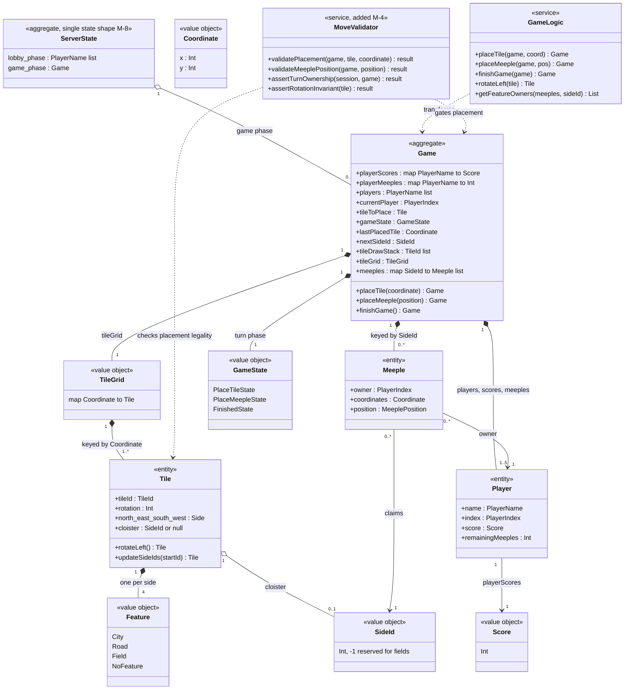

# Full-Stack Domain Model Outline — Carcassonne (MODERNIZED)

* **Source:** `output/Carcassonne` (legacy code at pinned commit `ca2797745a863243fa6ce96af63435b0d67bf2ab`)
* **Modernization plan:** `modernization-plan.json` (decisions M-1..M-8; directives D-1..D-2)
* **Generated by:** the modernize-modeler skill from the codebase-modeler output.
Legacy citations `path:line` point at the pre-modernization code; `Artifact.md:line`
citations point at the source artifact; `(M-n)` references the modernization plan.

This document is the modernized domain model of the Carcassonne networked board game, transformed from the source artifact `DomainModel.md` (340 lines) according to decisions M-1, M-2, M-4, and M-8 in `modernization-plan.json`, under directives D-1/D-2 ("rewrite it into the most modern javascript/typescript framework!"). The Carcassonne rule core (K-1) is re-implemented in TypeScript as a pure domain layer with names, responsibilities, and rule semantics preserved exactly; what changes is how the domain is hosted — a Node.js 24 LTS + TypeScript process with a ws 8.x WebSocket server (M-2) serving a TypeScript 5.x + React 19 (react 19.x, react-dom 19.x) single-page app built with Vite 7 (M-1) — who validates moves (M-4 adds server-side revalidation of placement legality and turn ownership), and the removal of the compiler-generated Evergreen snapshot/migration layer (M-8). Companion document: [`./Specification.md`](./Specification.md).

---

## 1. Introduction and Scope

- **System Name:** Carcassonne — a browser multiplayer implementation of the Carcassonne tile-placement board game, now a TypeScript 5.x + React 19 (react 19.x, react-dom 19.x) single-page app built with Vite 7 (M-1) on the client and a Node.js 24 LTS + TypeScript process with a ws 8.x WebSocket server (M-2) on the server (was: Elm 0.19.1 + Lamdera — `elm.json:6`, `elm.json:17-18`, `src/Backend.elm:18-25`)
- **Purpose:** Let up to 5 named players play a full Carcassonne game in synchronized browsers: draw and place tiles, connect features through shared SideIds, claim features with meeples, score finished features by majority, and settle all remaining features at game end (purpose kept unchanged, K-1). `src/Types/Game.elm:28-40`, `src/Helpers/GameLogic.elm:323-508`
- **Scope:**
  - **In scope:** the game domain — the `Game` aggregate and its parts (tiles, meeples, players, scores, draw stack, turn-phase state machine) re-implemented as a pure TypeScript domain layer with no I/O (K-1); the tileset seed data (K-2); the lobby/registration context (K-3); domain events (whole-state pushes broadcast to clients, K-4); the domain services; and the server-side revalidation added by M-4.
  - **Deliberately excluded:** rendering/HTML details and styling (see `ClassModel.md`), the wire-protocol message surface (see `ClassModel.md`), persistence (there is no database — the state lives only in the in-memory server state, and this is now explicit rather than platform-opaque, M-8; was: `src/Backend.elm:14-15`, `src/Evergreen/Migrate/V10.elm:3`), and the separate `review/` elm-review tooling project. `inventory.md`

## 2. Ubiquitous Language (Glossary)

Shared vocabulary of the domain, used by both developers and domain experts. Each term as it is used in this system, with its definition in code. Definitions of kept elements preserve the source wording (K-1, K-2, K-3); the modern form is noted where a decision changes it, and every row carries a `Modernization` value.

| # | Term | Definition in this system | Code Reference | Modernization |
| :-- | :-- | :-- | :-- | :-- |
| 1 | **Tile** | A square map piece with four sides (north/east/south/west), each carrying a `SideId` and a `Feature`, plus an optional central cloister (`Maybe SideId` in Elm; `SideId`-or-null in the TS domain core); a tile also carries its `TileId` (tileset design, used for rendering) and a rotation in degrees | `src/Types/Tile.elm:21-29`, `readme.md:97-103` | kept (K-1) |
| 2 | **Tileset** | The canonical collection of 24 tile designs (`TileId` 0–23) whose copy counts define the 72-tile game set: 71 tiles in the draw stack plus the single starting tile (Tile 0 — city on the north side, roads on the east and west sides, field on the south, placed at `(0,0)`); the seed data is ported unchanged into the TS domain core (K-2; reused by M-8) | `src/Helpers/TileMapper.elm:9-253`, `src/Types/Game.elm:102-104`, `src/Types/Game.elm:120-147` | kept (K-2) |
| 3 | **Feature** | The terrain kind on a tile side: `City`, `Road`, `Field`, or `NoFeature`; sides of the same `Feature` are the same connected feature when their `SideIds` are equal; features stay implicit via shared `SideId`s — there is no Feature aggregate object (K-7) | `src/Types/Feature.elm:4-8`, `src/Helpers/TileMapper.elm:12-20` | kept (K-1) |
| 4 | **SideId** | A unique integer identifying one feature instance on the board; equal `SideIds` on touching tile sides mean the features are connected (merged into one); `-1` marks a field side, which has no identity; allocated sequentially from `nextSideId` when a tile is placed | `src/Types/Tile.elm:11-12`, `src/Helpers/GameLogic.elm:102-131`, `src/Helpers/GameLogic.elm:329`, `src/Helpers/GameLogic.elm:366`, `src/Types/Tile.elm:62-81`, `readme.md:101` | kept (K-1) |
| 5 | **Meeple** | A player figure claiming a feature: recorded with its owner (`PlayerIndex`), the board coordinate it sits on, and a placement position (`North`/`East`/`South`/`West`/`Center`); its claim is keyed by the `SideId` of the feature it occupies | `src/Types/Meeple.elm:17-23`, `readme.md:105-112` | kept (K-1) |
| 6 | **Player** | Identified only by a string name; seat order in the `Game.players` array (`PlayerIndex`) determines turn order and meeple color (red/blue/green/yellow/black for seats 0–4); the Player is a name-keyed cluster of fields inside the `Game` record — there is no standalone type (K-7) | `readme.md:89-91`, `src/Types/Game.elm:31`, `src/Types/Meeple.elm:26-34` | kept (K-3) |
| 7 | **Game** | One live game instance: the tile grid, all placed meeples, per-player scores and meeple counts, the current player, the tile to be placed, the turn phase, the last placed tile, the next `SideId`, and the draw stack; modern form: a TypeScript interface of the pure domain core (K-1), owned by the single authoritative in-memory state of the Node.js 24 server (M-2), inside the single typed state shape (M-8) | `src/Types/Game.elm:28-40` | M-2 |
| 8 | **TileGrid** | The board itself: a mapping from board coordinate to placed tile; the first (starting) tile occupies `(0, 0)` | `src/Types/Game.elm:20-21`, `src/Types/Game.elm:102-104` | kept (K-1) |
| 9 | **Coordinate** | A board cell as an `(x, y)` integer pair; the starting tile is at `(0, 0)` | `src/Types/Coordinate.elm:4-5`, `src/Types/Game.elm:104` | kept (K-1) |
| 10 | **Draw stack** | The list of tiles not yet placed, shuffled at game start and after every turn — modern: an in-process Fisher–Yates shuffle on the Node server (M-2), was the platform-executed `Random.generate Random.List.shuffle` re-entry; the first tile that can be placed in some rotation becomes the current player's `tileToPlace`; unplaceable tiles are skipped and dropped (K-1) | `src/Types/Game.elm:37`, `src/Backend.elm:147`, `src/Backend.elm:170-178` | M-2 |
| 11 | **Turn** | One player's complete action sequence: place the drawn tile, then optionally place a meeple on it (or skip), after which the turn passes to the next player in seat order, wrapping around; the turn machine has no timers or timeouts (A-34 deferred — the behavior is now explicit under M-2) | `readme.md:56-62`, `src/Helpers/GameLogic.elm:367`, `src/Helpers/GameLogic.elm:502-508`, `src/Types/Game.elm:78-84` | kept (K-1) |
| 12 | **GameState (turn phase)** | The three phases of the turn machine: `PlaceTileState` (current player must place the drawn tile), `PlaceMeepleState` (they may place a meeple on the just placed tile), `FinishedState` (no playable tile remains; final scoring has run) | `src/Types/GameState.elm:4-7`, `readme.md:113-117` | kept (K-1) |
| 13 | **Last placed tile** | The tile the current player just placed (its cell tracked as `lastPlacedTile`); it anchors meeple placement, `SideId` merging, and cloister-completion checks | `src/Types/Game.elm:35`, `src/Types/Game.elm:89-94` | kept (K-1) |
| 14 | **Cloister** | An optional center feature of a tile, stored as `Maybe SideId` in Elm / `SideId`-or-null in TS; a completed cloister (all 8 surrounding cells filled) is worth 9 points; at game end it is worth 1 per adjacent tile plus 1 for itself | `src/Types/Tile.elm:28`, `src/Types/Tile.elm:52-57`, `src/Helpers/GameLogic.elm:211-251` | kept (K-1) |
| 15 | **Finished feature** | A feature whose every open side is bordered by an already placed tile; only finished features score during play (when the placing of a tile or meeple completes them) | `src/Helpers/GameLogic.elm:193-203`, `src/Helpers/GameLogic.elm:418-422` | kept (K-1) |
| 16 | **Majority** | The ownership rule for scoring: the player with the most meeples on a finished feature takes its points; if several players tie for the most, every tied player scores | `src/Helpers/GameLogic.elm:256-290`, `tests/MeepleTests.elm:47-58`, `readme.md:66-68` | kept (K-1) |
| 17 | **Score** | A player's total points (`Int`), credited in `placeMeeple` and `finishGame` when features finish | `src/Types/Score.elm:4-5`, `src/Types/Game.elm:29` | kept (K-1) |
| 18 | **Lobby** | The pre-game room: players register by name (unique and non-empty, at most 5), a player may kick another, the lobby can be killed, and `InitializeGame` starts the game; identity semantics preserved (K-3) | `src/Types.elm:11-17`, `src/Backend.elm:93-148` | kept (K-3) |
| 19 | **Server-side revalidation** | The pre-application check the server runs before applying any move: tile/meeple placement legality, meeple availability, and turn ownership (the WebSocket session is bound to the registered player); the ported pure-domain checks from the legacy `FrontendHelpers` run server-side as the authoritative checks, while the client keeps its own copy for UI hints (new element introduced by M-4) | `DomainModel.md:316`, `src/Helpers/FrontendHelpers.elm:48-110` | added (M-4) |

*Rule of thumb applied:* any term that means something specific to this game (a "feature" here is not a software feature; a "meeple" has a precise record shape) is defined above so frontend, backend, and business team use the exact same word. Term 19 has no legacy counterpart: in the source system validity was enforced only by the UI (`DomainModel.md:316`), so "revalidation" was not a concept; M-4 promotes it to a first-class domain responsibility. The full term list lives in this table; the class diagram in [Section 5](#5-domain-relationships) visualizes the core concepts.

## 3. Bounded Contexts

The domain is divided into two logically distinct sub-domains. In the legacy system they were two exclusive variants of one state record switched through the `BackendModel`/`FrontendModel` constructors of the single Lamdera process (`src/Types.elm:11-17`, `src/Types.elm:20-33`); in the modern form they are the two phases of the single typed state shape — lobby phase `{ players }` / game phase `{ game }` — owned by the Node.js 24 + TypeScript + ws 8.x server (M-2, M-8) and consumed by the React 19 client (M-1).

- **Context A — Carcassonne game** (the core domain): handles tile placement with `SideId` merging, meeple claiming/return, majority scoring of finished features, cloister scoring, the turn state machine, draw-stack dealing, and game finish — all preserved (K-1) in a pure TypeScript domain core.
  - Boundaries (modern): the domain core (re-implements the legacy `GameLogic`, `TileMapper`, and the `FrontendHelpers` playability checks, K-1/K-2), the game flow on the Node server (M-2), and the server-side revalidation gate (added, M-4); was: `src/Types/`, `src/Helpers/GameLogic.elm`, `src/Helpers/TileMapper.elm`, `src/Helpers/FrontendHelpers.elm`, and the game flow in `src/Backend.elm` (`InitializeGame`, `PlaceTile`, `PlaceMeeple`, `RotateTileLeft`, `TileDrawStackShuffled`). `src/Types/Game.elm:28-40`, `src/Helpers/GameLogic.elm:323-508`
  - State carrier (modern): the game phase `{ game }` of the single typed state shape (M-8); was: `BeGamePlayed { game : Game }`. `src/Types.elm:15-17`

- **Context B — Player lobby / registration** (a supporting pre-game context): handles player registration (unique non-empty names, 5-player limit), kicking, lobby kill, and rejoining an in-progress game by registering the same name — semantics preserved (K-3).
  - Boundaries (modern): the lobby handlers on the Node server (M-2) and the React registration/lobby views (M-1); was: `src/Backend.elm:93-138`, `src/Views/PlayerRegistrationView.elm`, `src/Views/PlayerLobbyView.elm`, and the legacy frontend registration/lobby states in `src/Frontend.elm`. `src/Backend.elm:93-138`, `src/Types.elm:11-17`
  - State carrier (modern): the lobby phase `{ players }` of the single typed state shape (M-8); was: `BePlayerRegistration { players : List PlayerName }`. `src/Types.elm:12-14`

**Context map.** The two contexts are two exclusive phases of one state shape — exactly one is active at a time (K-4) — so the contexts communicate by transformation, not by integration contracts: the lobby hands over its registered names to game initialization, and a late registration during the game phase re-enters the game context via the rejoin path (was `JoinedGame`). `src/Types.elm:11-17`, `src/Backend.elm:140-148`, `src/Backend.elm:120-123`

## 4. Core Domain Elements

Domain-Driven Design concepts of the game domain, with the lobby context's elements noted where they attach. The rule core is re-implemented as a pure TypeScript domain layer with no I/O, preserving names, responsibilities, and rule semantics (K-1); the hosting, validation, and state-layer changes are marked with their decisions.

### 4.1. Entities

Objects that have a distinct identity that runs through time and different states.

- **Game** (the live game instance; every game action returns a new `Game` with grid, meeples, scores, turn state, and draw stack mutated as one unit) `src/Types/Game.elm:28-40`
  - **Identity (ID):** modernized (M-8): there is no persistence and no explicit game id — the `Game` aggregate lives in the single typed in-memory state of the Node.js 24 process (M-2), and a restart means a new empty lobby (M-8); was: the live in-memory Lamdera backend model with opaque platform snapshots. `src/Backend.elm:14-34`, `src/Evergreen/Migrate/V10.elm:3`
  - **Attributes:** the same 11 fields, now a TypeScript interface of the domain core (M-2; field set kept, K-1): `playerScores : Map PlayerName → Score`, `playerMeeples : Map PlayerName → Int`, `players : PlayerName[]`, `currentPlayer : PlayerIndex`, `tileToPlace : Tile`, `gameState : GameState`, `lastPlacedTile : Coordinate`, `nextSideId : SideId`, `tileDrawStack : TileId[]`, `tileGrid : TileGrid`, `meeples : Map SideId → Meeple[]`. `src/Types/Game.elm:28-40`
  - **Behaviors/Methods:**
    - `initializeGame` — builds the starting grid (Tile 0 at `(0,0)`), 7 meeples per player, and the 71-tile draw stack (kept, K-1/K-2). `src/Types/Game.elm:53-73`, `src/Types/Game.elm:120-147`
    - `placeTile` — inserts the tile, merges neighboring `SideIds`, advances the phase (kept, K-1); modern: applied only after server-side revalidation (M-4); was documented "Does not check whether the move is valid". `src/Helpers/GameLogic.elm:323-370`, `src/Helpers/GameLogic.elm:311-315`
    - `placeMeeple` — places/skips a meeple, scores finished features, returns finished meeples, advances the turn (kept, K-1); modern: applied only after server-side revalidation (M-4). `src/Helpers/GameLogic.elm:383-508`, `src/Helpers/GameLogic.elm:373-382`
    - `finishGame` — final settlement, clears meeples, sets `FinishedState` (kept, K-1). `src/Helpers/GameLogic.elm:511-556`
    - `rotateLeft` (on `tileToPlace`) — rotates the drawn tile 90° counter-clockwise (kept, K-1); modern: the ported `isRotatedCorrectly` rotation invariant is asserted server-side on this path (M-4). `src/Backend.elm:150-158`, `src/Helpers/GameLogic.elm:45-95`
    - draw next playable tile from stack — reshuffle + deal (kept rule, K-1); modern: the reshuffle is an in-process Fisher–Yates shuffle (M-2); was the platform-executed `Random.generate Random.List.shuffle` re-entry. `src/Backend.elm:44-74`, `src/Backend.elm:147`

- **Tile** (a map piece: one of 24 canonical designs that, once placed, occupies a board `Coordinate`; its sides are re-keyed with fresh `SideIds` and merged with neighbors on placement) `src/Types/Tile.elm:21-29`
  - **Identity (ID):** `TileId` (tileset design) before placement; `Coordinate` (board cell) once placed, with the `TileId` retained for rendering (kept, K-1). `src/Types/Tile.elm:22`, `src/Types/Game.elm:102-104`
  - **Attributes:** `tileId : TileId`, `rotation : Int`, `north/east/south/west : Side { sideId, sideFeature }`, `cloister : SideId | null` (kept, K-1). `src/Types/Tile.elm:21-29`
  - **Behaviors/Methods:**
    - `rotateLeft` — physically rotates the four sides (kept, K-1). `src/Helpers/GameLogic.elm:21-40`
    - `updateSideIds` — re-keys the tile's `SideIds` from a starting value (kept, K-1). `src/Types/Tile.elm:62-81`
    - `isRotatedCorrectly` — rotation check against the tileset: was test-only, defined and unit-tested but never called from app code (`tests/GameLogicTests.elm:14-56`); modern (M-4): a runtime invariant asserted server-side on the rotation path (closes A-31). `src/Helpers/GameLogic.elm:45-95`

- **Meeple** (a placed player figure; its identity is the feature claim it makes — the `SideId` it is stored under — plus owner and board position) `src/Types/Meeple.elm:17-23`
  - **Identity (ID):** feature claim: stored under the `SideId` of the feature it occupies in `Game.meeples`, with owner/coordinates/position (kept, K-1). `src/Types/Game.elm:24-25`, `src/Types/Game.elm:39`
  - **Attributes:** `owner : PlayerIndex`, `coordinates : Coordinate`, `position : MeeplePosition` (kept, K-1). `src/Types/Meeple.elm:17-23`
  - **Behaviors/Methods:**
    - claim a side of the last placed tile (`placeMeeple` insert) (kept, K-1). `src/Helpers/GameLogic.elm:397-416`
    - re-keyed on feature merge (`replaceMeepleSideId`) (kept, K-1). `src/Helpers/GameLogic.elm:136-162`
    - returned to owner when its feature finishes (kept, K-1). `src/Helpers/GameLogic.elm:470-492`
    - cleared at game end (kept, K-1). `src/Helpers/GameLogic.elm:554`

- **Player** (a participant identified only by name; there is **no standalone `Player` type** — the player exists as entries in the `Game` record: `players` array, `playerScores`, `playerMeeples`; the implicit grouping is preserved, K-7) `readme.md:89-91`, `src/Types/Game.elm:29-32`
  - **Identity (ID):** `PlayerName` (unique string); seat index (`PlayerIndex`) in `Game.players` for turn order and meeple color (kept, K-3). `src/Types/Game.elm:31`, `src/Types/Meeple.elm:26-34`
  - **Attributes:** `name : PlayerName`, `index : PlayerIndex`, `score : Score`, `remainingMeeples : Int` (kept, K-3/K-7). `src/Types/Game.elm:29-32`
  - **Behaviors/Methods:**
    - register in lobby (kept, K-3). `src/Backend.elm:93-118`
    - kick (kept, K-3). `src/Backend.elm:125-133`
    - score credited on finished features (kept, K-1). `src/Helpers/GameLogic.elm:444-464`, `src/Helpers/GameLogic.elm:529-550`
    - meeple count decremented on placement / incremented on return (kept, K-1). `src/Helpers/GameLogic.elm:482-500`
    - session bound to player (added, M-4): the WebSocket session is bound to the registered player, and the server validates turn ownership against that binding before accepting moves from it; was: `ToBackend` messages carried no check against `currentPlayer`. `src/Types.elm:50-58`

### 4.2. Value Objects

Objects that describe characteristics but have no conceptual identity. In the legacy code all of these were immutable by construction (closed types / `Int`/`String`/tuple aliases, updated only by building new values); in the modern TypeScript domain core they are closed unions and `readonly`-shaped types with the same equality semantics (K-1).

| Value Object | Attributes | Immutability Evidence | Code Reference | Modernization |
| :-- | :-- | :-- | :-- | :-- |
| **Feature** | `City`, `Road`, `Field`, `NoFeature` | closed type, immutable by construction (was a closed Elm type; modern: closed TS union used only as equality-compared data, K-1) | `src/Types/Feature.elm:4-8`, `src/Helpers/GameLogic.elm:431` | kept (K-1) |
| **Side** | `sideId : SideId`, `sideFeature : Feature` | record updated only by constructing new values (K-1) | `src/Types/Tile.elm:15-18`, `src/Helpers/GameLogic.elm:109-115` | kept (K-1) |
| **SideId** | `Int` (`-1` reserved for fields) | numeric value; every update builds new tiles/dicts (K-1) | `src/Types/Tile.elm:11-12`, `src/Helpers/GameLogic.elm:102-131` | kept (K-1) |
| **Coordinate** | `x : Int`, `y : Int` | pair value, immutable (K-1) | `src/Types/Coordinate.elm:4-5` | kept (K-1) |
| **PlayerIndex** | `Int` (0-based seat number) | immutable value (K-1) | `src/Types/PlayerIndex.elm:4-5` | kept (K-1) |
| **PlayerName** | `String` (unique in the lobby, non-empty) | uniqueness enforced by the lobby handlers on the server (K-3) | `src/Types/PlayerName.elm:4-5`, `readme.md:89-91` | kept (K-3) |
| **Score** | `Int` | scores updated by building a new map of scores (K-1) | `src/Types/Score.elm:4-5`, `src/Helpers/GameLogic.elm:444-464` | kept (K-1) |
| **TileId** | `Int` (0–23) | immutable value (K-1) | `src/Types/Tile.elm:7-8` | kept (K-1) |
| **MeeplePosition** | `Center`, `North`, `East`, `South`, `West`, `Skip` | closed type, immutable by construction (K-1) | `src/Types/Meeple.elm:8-14` | kept (K-1) |

*Equality note (template rule of thumb):* two value objects with equal payloads are interchangeable — two `Coordinate`s with the same `(x, y)` key the same grid cell, and two `SideId`s with the same integer denote the same connected feature (K-1). `src/Types/Coordinate.elm:4-5`, `src/Helpers/GameLogic.elm:102-131`

### 4.3. Aggregates and Aggregate Roots

- **Aggregate Root: `Game`** — the `Game` record is the single aggregate root of the game context (kept, K-1): placing a tile rewrites the grid, re-keys meeples, and advances the turn phase and `SideId` counter in one step; placing a meeple rewrites meeples, scores, meeple counts, current player, and phase in one step. No part can be mutated independently. Modern: these transformations are pure functions of the TypeScript domain core (K-1), invoked by the server only after the M-4 revalidation gate.
  - **Child Entities / Value Objects** (all kept, K-1):
    - `Tile` — placed tiles in `tileGrid`. `src/Types/Game.elm:38`
    - `Meeple` — placed meeples in `meeples`. `src/Types/Game.elm:39`
    - `Player` — players via `players` / `playerScores` / `playerMeeples` (implicit cluster, K-7). `src/Types/Game.elm:29-32`
    - `Coordinate` — as grid keys. `src/Types/Game.elm:20-21`
    - `Score` — per-player totals. `src/Types/Score.elm:4-5`
  - **Consistency evidence:** `placeTile` updates `tileGrid` + `meeples` + `nextSideId` + `gameState` + `lastPlacedTile` together (`src/Helpers/GameLogic.elm:323-370`); `placeMeeple` updates `meeples` + `playerScores` + `playerMeeples` + `currentPlayer` + `gameState` together (`src/Helpers/GameLogic.elm:383-508`) — the atomic, single-record-update discipline is preserved in the TS port (K-1).
  - *Rule of thumb in this codebase:* external objects hold references only to the root — the server mutates the `Game` record as a whole and broadcasts the complete record to clients; no client or module holds a direct handle to an internal tile or meeple (K-4; the React client mirrors the whole state in a reducer, M-1). `src/Types.elm:15-17`, `src/Backend.elm:58`
  - **Lobby context aggregate:** the lobby has no separate aggregate object — modern: its state is the lobby phase `{ players }` of the single TypeScript state shape (M-8), mutated by register/kick/kill handlers on the Node server (M-2; rules kept, K-3); was: the `BePlayerRegistration { players : List PlayerName }` record. `src/Types.elm:12-14`, `src/Backend.elm:93-138`

## 5. Domain Relationships

How the entities and the aggregate interact, with standard multiplicities (evidence rows R1…R6 preserved from the source):

| # | Relationship | From → To | Cardinality | Meaning | Code Reference | Modernization |
| :-- | :-- | :-- | :-- | :-- | :-- | :-- |
| R1 | Game contains placed Tiles | `Game` → `Tile` | 1:N | A game holds the placed tiles, keyed by board coordinate (K-1) | `src/Types/Game.elm:38` | kept (K-1) |
| R2 | Game contains placed Meeples | `Game` → `Meeple` | 1:N | A game holds all placed meeples, keyed by the `SideId` of the feature they claim (K-1) | `src/Types/Game.elm:24-25`, `src/Types/Game.elm:39` | kept (K-1) |
| R3 | Game seats Players | `Game` → `Player` | 1:N (1–5) | A game seats 1–5 players with per-player scores and meeple counts; the 5-player cap is kept (K-3) | `src/Types/Game.elm:29-32`, `src/Types/Game.elm:43-45` | kept (K-3) |
| R4 | Meeple claims a feature (`SideId`) | `Meeple` → `SideId` | 1:1 | A placed meeple belongs to exactly one feature instance, identified by the `SideId` key it is stored under (K-1) | `src/Types/Game.elm:24-25`, `src/Helpers/GameLogic.elm:397-416` | kept (K-1) |
| R5 | Tiles form connected features via SideId | `Tile` → `Tile` | M:N (N:N) | Tiles whose touching sides share a `SideId` form one connected feature; placing a tile merges the adjacent sides' `SideIds` into the new tile's `SideId` across the whole grid and meeple index (K-1) | `src/Helpers/GameLogic.elm:331-362`, `src/Helpers/GameLogic.elm:102-131`, `src/Helpers/GameLogic.elm:136-162` | kept (K-1) |
| R6 | Player owns Meeples | `Player` → `Meeple` | 1:N | Each meeple records its owner's `PlayerIndex`; a player's remaining meeple count is tracked in `playerMeeples` (K-1) | `src/Types/Meeple.elm:18`, `src/Types/Game.elm:30` | kept (K-1) |

Supporting associations used by the diagram (kept, K-1): `Tile` → `TileGrid` (a grid cell holds one tile, `src/Types/Game.elm:20-21`); `Tile` → `Feature` (one `Feature` per side, `src/Types/Tile.elm:15-18`); `Tile` → `SideId` (optional cloister, `src/Types/Tile.elm:28`); `Player` → `Score` (`src/Types/Game.elm:29`); `Game` → `GameState` (`src/Types/Game.elm:34`). Service dependencies (kept, K-1): `GameLogic ..> Game` and `GameLogic ..> TileMapper` (`src/Helpers/GameLogic.elm:10`, `src/Helpers/GameLogic.elm:5`); added by M-4: `MoveValidator ..> Game` / `MoveValidator ..> Tile` (the server-side revalidation service gates every applied move); added by M-8: `ServerState o-- Game` (the single state shape owns the game-phase instance).

### Class diagram (core domain)

**Node map** (covers every node id in the diagram above):

| Node | Element | Code Reference |
| :-- | :-- | :-- |
| `ServerState` | Added (M-8) — the single typed state shape (lobby phase `{ players }` / game phase `{ game }`); replaces the legacy `BackendModel` ADT | (M-8) + `src/Types.elm:11-17` |
| `Game` | Aggregate root — the live game instance (record `Game`), re-implemented as a TS interface (K-1) | `src/Types/Game.elm:28-40` |
| `TileGrid` | The board — `Dict Coordinate Tile` in Elm, map keyed by `Coordinate`, starting tile at `(0,0)` (K-1) | `src/Types/Game.elm:20-21` |
| `Tile` | Entity — map piece with 4 sides, optional cloister, rotation (K-1) | `src/Types/Tile.elm:21-29` |
| `Feature` | Value object — closed enum `City`/`Road`/`Field`/`NoFeature` (K-1) | `src/Types/Feature.elm:4-8` |
| `Meeple` | Entity — placed player figure `{ owner, coordinates, position }` (K-1) | `src/Types/Meeple.elm:17-23` |
| `Player` | Entity (implicit, K-7) — name + seat index + score + meeple count entries in `Game` (K-3) | `src/Types/Game.elm:29-32` |
| `Score` | Value object — player's total points (`Int`) (K-1) | `src/Types/Score.elm:4-5` |
| `Coordinate` | Value object — board cell `(Int, Int)` (K-1) | `src/Types/Coordinate.elm:4-5` |
| `SideId` | Value object — feature-instance integer (`-1` = field) (K-1) | `src/Types/Tile.elm:11-12` |
| `GameState` | Value object — turn-phase enum `PlaceTileState`/`PlaceMeepleState`/`FinishedState` (K-1) | `src/Types/GameState.elm:4-7` |
| `GameLogic` | Domain service — pure TS domain module (was the Elm module `Helpers.GameLogic`, pure `Game → Game` transformations) (K-1) | `src/Helpers/GameLogic.elm:1-556` |
| `MoveValidator` | Added (M-4) — server-side revalidation service: placement legality, meeple availability, turn ownership, rotation invariant | (M-4) + `src/Helpers/FrontendHelpers.elm:48-110` |

## 6. Business Rules & Invariants

The critical logic that must always remain true. In the legacy system several rules were enforced only by the UI (client-trusted, `DomainModel.md:316`); M-4 moves the authoritative checks server-side and resolves I-1, so the "ENFORCED (UI only)" rows below become server-enforced. Rules whose documented (readme) statement has no code counterpart are marked **NOT ENFORCED (accepted)** and closed in [Resolved Assumptions & Issues](#resolved-assumptions--issues); they are never presented as enforced.

| # | Rule (business statement) | Enforced by | Status | Modernization |
| :-- | :-- | :-- | :-- | :-- |
| RL1 | A tile must be placed adjacent to the existing board, on an empty orthogonally adjacent cell, with all touching sides matching the neighboring features | was UI-enforced only (`tileCanBePlaced` / `getCoordinatesToBePlacedOn`, `src/Helpers/FrontendHelpers.elm:48-85`, `src/Helpers/FrontendHelpers.elm:89-110`, with the backend `placeTile` explicitly not re-validating, `src/Helpers/GameLogic.elm:311-315`); modern: the ported checks run server-side as the authoritative validation (M-4) while the client keeps them for UI hints | ENFORCED (server-side, M-4) | M-4 |
| RL2 | If the drawn tile cannot be placed anywhere, a new tile is drawn (unplaceable tiles are skipped and silently dropped from the draw stack — never re-inserted) | `tileCanBePlacedAnywhere` + `getPlayableTileFromDrawstack` (`src/Helpers/FrontendHelpers.elm:120-143`), consumed at game start (`src/Backend.elm:44-59`) and after each meeple phase (`src/Backend.elm:61-74`); the discard behavior is preserved (K-1, A-35) | ENFORCED (code) | kept (K-1) |
| RL3 | A drawn tile's rotation must match its canonical tileset rotation (features aligned with the rotation) | was by construction only — `rotateLeft` rotates the actual side data (`src/Helpers/GameLogic.elm:21-40`) and `isRotatedCorrectly` (`src/Helpers/GameLogic.elm:45-95`) was pinned by tests (`tests/GameLogicTests.elm:14-56`) but never invoked from app code; modern: the ported check is a runtime invariant asserted on the server rotation path (M-4) | ENFORCED (by construction + runtime invariant, M-4) | M-4 |
| RL4 | Features connect: sides of the same feature on touching tiles are unified under a single `SideId` when a tile is placed | `placeTile` reads each neighbor's facing `SideId`, then `replaceTileSideId`/`replaceMeepleSideId` rewrite the grid and meeple index (`src/Helpers/GameLogic.elm:331-362`, `src/Helpers/GameLogic.elm:102-131`, `src/Helpers/GameLogic.elm:136-162`); new `SideIds` via `updateSideIds` (`src/Types/Tile.elm:62-81`) — preserved (K-1) | ENFORCED (code) | kept (K-1) |
| RL5 | Points are counted immediately only for cities, roads, or cloisters that have been finished | `isFeatureFinished` (`src/Helpers/GameLogic.elm:193-203`) applied as the filter over the last placed tile's `SideIds` in `placeMeeple` (`src/Helpers/GameLogic.elm:418-422`); open/unmerged features do not score (K-1) | ENFORCED (code) | kept (K-1) |
| RL6 | Completed roads and cities score per tile, with the 2× bonus for larger cities completed before the game ends | `countFeature` (tile count per `SideId`, `src/Helpers/GameLogic.elm:170-188`) doubled when `score > 2` and the feature is a City (`src/Helpers/GameLogic.elm:426-435`, `src/Helpers/GameLogic.elm:431-432`); the 2× bonus applies only above 2 tiles — the readme's flat variant is not adopted (A-27; K-1) | ENFORCED (code) | kept (K-1) |
| RL7 | A completed cloister (all adjacent tiles filled) scores 9 points immediately | `countCloister` (`src/Helpers/GameLogic.elm:211-224`) and `getAdjacentTileCloisterScores` (awards 9 where the count is 9, `src/Helpers/GameLogic.elm:230-251`), appended in `placeMeeple` (`src/Helpers/GameLogic.elm:438`) — preserved (K-1) | ENFORCED (code) | kept (K-1) |
| RL8 | When the game ends, incomplete roads/cities score 1 per tile and incomplete cloisters score per adjacent tile (+1 for itself) | `finishGame` settles feature scores via `countFeature` for every `SideId` in the meeple index and cloister scores via `countCloister` (`src/Helpers/GameLogic.elm:511-527`) — preserved (K-1) | ENFORCED (code) | kept (K-1) |
| RL9 | Most meeples on the feature wins; on a tie all tied players score | `getFeatureOwners` returns every player with the maximum count (`src/Helpers/GameLogic.elm:256-290`), consumed in `placeMeeple` (`src/Helpers/GameLogic.elm:444-464`) and `finishGame` (`src/Helpers/GameLogic.elm:529-550`); tie case pinned by tests (`tests/MeepleTests.elm:47-58`) — preserved (K-1) | ENFORCED (code) | kept (K-1) |
| RL10 | Once a feature side is claimed, no more meeples may be placed on it | was UI-enforced only (`getMeeplePositionsToBePlacedOn` filters claimed positions, `src/Helpers/FrontendHelpers.elm:27-43`, and the backend `placeMeeple` did not re-validate, `src/Helpers/GameLogic.elm:373-382`); modern: the ported check runs server-side (M-4) | ENFORCED (server-side, M-4) | M-4 |
| RL11 | Players have a limited meeple pool (7); used meeples come back when their feature is scored; with no meeples left a player must skip | `initializeGame` sets the pool to 7 (`src/Types/Game.elm:61`); decrement on placement, no decrement on `Skip` (`src/Helpers/GameLogic.elm:493-500`); return on finished features (`src/Helpers/GameLogic.elm:470-492`); only `[Skip]` offered at 0 (`src/Helpers/FrontendHelpers.elm:28-43`) — pool rules kept (K-1); modern: the availability check is also enforced server-side (M-4) | ENFORCED (code + server-side, M-4) | M-4 |
| RL12 | Each turn consists of placing a tile, then optionally a meeple, then the next player plays (wrapping from last to first) | `placeTile` sets `PlaceMeepleState` (`src/Helpers/GameLogic.elm:367`); `placeMeeple` sets `PlaceTileState` and `currentPlayer = getNextPlayer` (`src/Helpers/GameLogic.elm:502-508`, `src/Types/Game.elm:78-84`) — machine kept (K-1); was: `ToBackend` messages carried no turn-ownership check (`src/Types.elm:50-58`); modern: the server validates turn ownership against the session→player binding before applying the move (M-4) | ENFORCED (code + server-side, M-4) | M-4 |
| RL13 | When there are no more tiles that can be placed, the game is finished and remaining features are scored | `getPlayableTileFromDrawstack` returns `Nothing` when no tile fits (`src/Helpers/FrontendHelpers.elm:132-143`); the backend calls `finishGame` (`src/Backend.elm:76-84`); `gameState = FinishedState`, meeples cleared (`src/Helpers/GameLogic.elm:552-556`) — the placeability-based end condition is preserved (K-1, A-28) | ENFORCED (code) | kept (K-1) |
| RL14 | A lobby holds at most 5 uniquely named players (names non-empty) | `playerLimit = 5` (`src/Types/Game.elm:43-45`); duplicate names rejected (`src/Backend.elm:95-102`); `LobbyIsFull` at the limit (`src/Backend.elm:110-118`); non-empty names enforced client-side by the registration view (`src/Frontend.elm:50-57`; kept in the React registration view per M-1) — semantics kept (K-3) | ENFORCED (code) | kept (K-3) |
| RL15 | At the end of the game a field scores 3 points for each finished city touching it | — | NOT ENFORCED (accepted — A-24): readme-only rule (`readme.md:79`); fields carry `SideId -1`, excluded from the scored set (`src/Types/Tile.elm:42-45`) and scoring 0 (`src/Helpers/GameLogic.elm:172-173`); the rewrite preserves the enforced behavior (K-1) | kept (K-1) |
| RL16 | Players may claim fields with meeples (a meeple can be placed on the field of the just placed tile) | — | NOT ENFORCED (accepted — A-25): readme-only rule (`readme.md:61`); the placement helpers exclude field sides (`SideId -1`) from meeple placement (`src/Helpers/FrontendHelpers.elm:33-40`); fields remain unclaimable (K-1) | kept (K-1) |
| RL17 | Placement is disabled while debug mode shows the `SideId` overlay | — | NOT ENFORCED (accepted — A-26): readme-only claim (`readme.md:129`); the debug overlay is a non-interactive layer (`pointer-events: none`, `src/Views/GameView.elm:542-590`, `src/Views/GameView.elm:582`) and remains one | kept |
| RL18 | Every move is re-validated server-side before application: tile placement legality (adjacency + touching-side match), meeple position availability, meeple pool, and turn ownership (WebSocket session bound to the registered player); invalid or out-of-turn moves are rejected with structured feedback | `added (M-4)` — the ported pure-domain checks from `FrontendHelpers` (`src/Helpers/FrontendHelpers.elm:48-110`) run on the Node server before `placeTile`/`placeMeeple` are applied; the gap was the legacy "Does not check whether the move is valid" posture (`src/Helpers/GameLogic.elm:311-315`, `src/Helpers/GameLogic.elm:373-382`, `DomainModel.md:316`) | ENFORCED (server-side) | added (M-4) |

## 7. Domain Events

Significant occurrences in the system that other parts of the system might care about. In the legacy codebase, "events" were the `ToFrontend` state flips the Lamdera backend sent (per-client `sendToFrontend`) or broadcast (`broadcast`); in the modern form the Node.js 24 WebSocket server (M-2) delivers the same occurrences as whole-state pushes to every connected client, including the acting one (K-4). Game-phase events remain delivered as whole-`Game` pushes rather than dedicated event objects (K-7).

| Event (past tense) | Trigger | Subscribers | Code Reference | Modernization |
| :-- | :-- | :-- | :-- | :-- |
| **PlayerRegistered** — a player's name is registered in the lobby (also re-sent to the registering client on new connections and on duplicate-name rejection, and broadcast to all clients when another player registers; a full lobby is rejected) | `RegisterPlayer` accepted in the lobby phase (`src/Backend.elm:105-113`); also sent on connect (`src/Backend.elm:40-42`) and on duplicate rejection (`src/Backend.elm:99-102`) | the React registration view's state update (was the `PlayerRegistrationUpdated` frontend handler, `src/Frontend.elm:95-96`) (K-3) | `src/Backend.elm:93-118`, `src/Types.elm:68-70` | kept (K-3) |
| **PlayerKicked** — a lobby player has been kicked; the kicked client drops back to name registration | `KickPlayer` handled in the lobby phase (`src/Backend.elm:125-133`) | the React lobby view's state update (was `PlayerKicked`, `src/Frontend.elm:98-105`) (K-3) | `src/Backend.elm:125-133`, `src/Types.elm:71-74` | kept (K-3) |
| **LobbyKilled** — the lobby has been dissolved; all clients return to name registration | `KillLobby` handled in the lobby phase (`src/Backend.elm:135-138`) | all clients return to the registration view (was `LobbyKilled`, `src/Frontend.elm:117-123`) (K-3) | `src/Backend.elm:135-138`, `src/Types.elm:76` | kept (K-3) |
| **GameInitialized** — the game has started: the `Game` aggregate is created, the draw stack shuffled (in-process Fisher–Yates, M-2), and the first playable tile dealt; clients move from lobby to the game view | game start handler (was `InitializeGame` in `BePlayerRegistration`, `src/Backend.elm:140-148`) followed by the shuffled-stack draw (`src/Backend.elm:44-59`) | clients move from lobby to the game view (K-1) | `src/Backend.elm:140-148`, `src/Types.elm:77-79` | kept (K-1) |
| **TileRotated** — the current player rotated the drawn tile 90° counter-clockwise; modern: the rotation invariant is asserted server-side first (M-4); delivered as a full state update | `RotateTileLeft` handled in the game phase (was `src/Backend.elm:150-158`) | full-state push to all clients (K-4) | `src/Backend.elm:150-158` | kept (K-1) |
| **TilePlaced** — the current player placed the tile: the grid grew, neighboring `SideIds` merged, and the turn entered the meeple phase; modern: applied only after server-side revalidation (M-4); delivered as a full state update | `PlaceTile` handled in the game phase (was `src/Backend.elm:160-168`) | full-state push to all clients (K-4) | `src/Backend.elm:160-168`, `src/Helpers/GameLogic.elm:323-370` | kept (K-1) |
| **TileDrawn** — after the previous player placed or skipped a meeple, the stack was reshuffled and the next playable tile was dealt to the new current player; modern: the reshuffle is an in-process Fisher–Yates shuffle on the server (M-2), was the platform-executed `Random.generate Random.List.shuffle` re-entry (`src/Backend.elm:147`, `src/Backend.elm:177`); the drawn tile is visible to all clients (K-4) | `PlaceMeeple` handled in the game phase (was `src/Backend.elm:170-178`) triggering the shuffled draw (`src/Backend.elm:61-74`) | full-state push to all clients (K-4) | `src/Backend.elm:170-178`, `src/Backend.elm:61-74` | M-2 |
| **GameFinished** — no playable tile remained: final scoring ran, all meeples were cleared, and the state became `Finished`; there is **no dedicated event** — score changes ride inside the whole-state push (kept, K-7) | draw-stack depletion (was `getPlayableTileFromDrawstack` returning `Nothing`, `src/Backend.elm:76-84`) → `finishGame` (`src/Helpers/GameLogic.elm:511-556`) | full-state push to all clients (K-4) | `src/Backend.elm:76-84`, `src/Helpers/GameLogic.elm:511-556` | kept (K-7) |
| **GameTerminated** — a client requested termination (Terminate Game sidebar button): the server discards the game and resets to an empty lobby; clients return to name registration (kept, K-3) | `TerminateGame` handled in the game phase (was `src/Backend.elm:180-183`) | full-state push to all clients (K-4) | `src/Backend.elm:180-183`, `src/Types.elm:86`, `src/Views/GameView.elm:743-745` | kept (K-3) |

Note: moves rejected by the server-side revalidation (M-4) are reported to the acting client as structured rejection feedback (I-1) rather than as full-state events; the game-end occurrence remains a whole-state push without a dedicated event object (K-7, was `src/Types.elm:80-82`).

## 8. Domain Services

Operations that do not conceptually belong to any single Entity or Value Object, often involving multiple elements.

- **GameLogic** (module `Helpers.GameLogic`) — the core domain service, re-implemented as a pure TypeScript module of the domain core (kept, K-1): tile rotation, feature-finished detection, feature/cloister scoring, majority-owner computation, meeple placement and return, turn-state transitions, and end-of-game settlement.
  - **Responsibilities:** `rotateLeft`, `isRotatedCorrectly` (modern: invoked server-side on the rotation path as a runtime invariant, M-4; was test-only), `SideId` merging (`replaceTileSideId`/`replaceMeepleSideId`), `countFeature`/`countCloister`, `isFeatureFinished`, `getFeatureOwners`, `getSideIdFeature`, `placeTile`, `placeMeeple`, `finishGame`. `src/Helpers/GameLogic.elm:1-556`

- **TileMapper** (module `Helpers.TileMapper`) — the canonical tileset service, ported unchanged (kept, K-2): maps a `TileId` (0–23) to its `Tile` design (sides with `SideIds` and `Features`, optional cloister); the 24 hand-written tile definitions and the unknown-id fallback to the starting tile are preserved.
  - **Responsibilities:** the single source of truth for tile geometry, consumed by game initialization (`src/Types/Game.elm:66`, `src/Types/Game.elm:104`), the rotation invariant check (M-4; was `src/Helpers/GameLogic.elm:50`), and draw-stack dealing (`src/Helpers/FrontendHelpers.elm:136`). `src/Helpers/TileMapper.elm:9-253`

- **FrontendHelpers** (module `Helpers.FrontendHelpers`) — the playability query service; modern (M-4): ported into the domain core and run on both sides — the React client uses it for UI hints (which board coordinates a tile can be placed on, which meeple positions are open), and the Node server runs the same checks as the authoritative validation before applying a move; was: shared server/client logic imported by the backend.
  - **Responsibilities:** `getMeeplePositionsToBePlacedOn`, `tileCanBePlaced`, `getCoordinatesToBePlacedOn`, `tileCanBePlacedAnywhere`, `getPlayableTileFromDrawstack` (the rendering-only helper `toMeepleCoordinates` belongs to the UI, not the domain). `src/Helpers/FrontendHelpers.elm:27-143`

- **MoveValidator (server-side revalidation service)** — added (M-4): the pre-application gate on the Node server. It validates tile placement legality (adjacency + touching-side match, via the ported `tileCanBePlaced`/`getCoordinatesToBePlacedOn`), meeple position availability (`getMeeplePositionsToBePlacedOn`), the meeple pool, turn ownership (the WebSocket session is bound to the registered player), and the rotation invariant (ported `isRotatedCorrectly`); it rejects invalid or out-of-turn moves with structured feedback (I-1). Gap evidence: legacy `placeTile`/`placeMeeple` documented "Does not check whether the move is valid" (`src/Helpers/GameLogic.elm:311-315`, `src/Helpers/GameLogic.elm:373-382`) and `ToBackend` messages carried no turn-ownership check (`src/Types.elm:50-58`, `DomainModel.md:316`).

## 9. Cross-Cutting Invariant Notes

- **Server-revalidated rules (was client-trusted):** legacy `placeTile`/`placeMeeple` carried the explicit doc "Does not check whether the move is valid" (`src/Helpers/GameLogic.elm:311-322`, `src/Helpers/GameLogic.elm:373-382`), and `ToBackend` messages carried no check against `currentPlayer` (`src/Types.elm:50-58`) — placement, claiming, and turn ownership were enforced only by the UI-side helpers and views, so a tampered client could send out-of-turn or invalid moves (`DomainModel.md:316`, I-1). Modern: the server revalidates every move before applying it (M-4); the client-trusted posture is replaced (M-4).
- **Explicit in-memory state layer (was no persistence + platform snapshots):** the whole `Game` aggregate lived only in the backend process memory, versioned by compiler-generated Evergreen snapshots with a platform-managed storage medium outside the repo (`src/Backend.elm:14-34`, `src/Evergreen/Migrate/V10.elm:3-18`). Modern (M-8): a single TypeScript state shape, in-process memory only, no migration tool, no platform store; restart semantics are explicit — new empty lobby (closes A-30). The Evergreen snapshot/migration layer is retired: replaced by M-8.
- **Determinism at the edges (modernized):** the draw stack is the only randomized input; legacy it was injected by the Lamdera platform executing `Random.generate Random.List.shuffle` (`src/Backend.elm:147`, `src/Backend.elm:177`) — replaced by an in-process Fisher–Yates shuffle on the Node server (M-2). All rule logic remains pure (K-1).

---

## Modernization Decisions (this document)

| Ref | Decision | Applied to | Legacy evidence |
| :-- | :-- | :-- | :-- |
| M-1 | Re-implements the Elm browser frontend as a TypeScript 5.x + React 19 (react 19.x, react-dom 19.x) single-page app built with Vite 7, with reducer-based client state mirroring the whole-state pushes | System name/stack (§1); client hosting of both contexts and the three legacy views (§3, where the Elm view modules + `Styles.elm` carrier are replaced by M-1); client-side copy of the playability checks for UI hints (§4.1, §8); the React reducer as holder of the whole state (K-4) | `elm.json:4-13`, `src/Frontend.elm:17-31`, `DomainModel.md:12` |
| M-2 | Re-implements the Elm/Lamdera backend as a Node.js 24 LTS + TypeScript process with a ws 8.x WebSocket server owning the single authoritative in-memory state; in-process Fisher–Yates shuffle (replaces the platform `Random.generate` re-entries) | `Game` aggregate hosting and identity (§4.1); draw-stack shuffling (§2 term 10, §7 `TileDrawn`, §9 third note); event delivery carrier (§7); glossary terms 7/10 | `elm.json:17-18`, `src/Backend.elm:18-25`, `src/Backend.elm:147` |
| M-4 | Adds server-side revalidation: the backend validates tile/meeple placement legality and turn ownership (WebSocket session bound to the registered player) before applying any move, reusing the pure-domain validity checks ported from `FrontendHelpers`; the ported `isRotatedCorrectly` becomes a runtime invariant on the rotation path (replaces the client-trusted / UI-only enforcement posture) | RL1/RL3/RL10/RL11/RL12 status changes and RL18 added (§6); `MoveValidator` service (§8) and diagram node (§5); Player session binding (§4.1); `Tile.isRotatedCorrectly` behavior (§4.1); glossary term 19 (§2); §9 first note; closes I-1 | `src/Helpers/GameLogic.elm:311-315`, `src/Helpers/FrontendHelpers.elm:48-110`, `DomainModel.md:316` |
| M-8 | Retires the compiler-generated Evergreen snapshot/migration layer (replaced by M-8): one typed state definition in TypeScript in the domain core (lobby phase `{ players }` / game phase `{ game }`); in-process memory only, no DBMS; restart = new empty lobby; seed data (24 designs, 71-tile draw stack, tile 0 at `(0,0)`) reused verbatim (K-2) | `Game` identity / no-GameId fact (§4.1); lobby aggregate state carrier (§4.3); `ServerState` diagram node (§5); the legacy `BackendModel`/`FrontendModel` dual-constructor carrier is replaced (replaced by M-8) (§3); tileset numbers 24/71/72 (§2 term 2); §9 second note; closes A-30 | `src/Evergreen/Migrate/V10.elm:3`, `src/Types/Game.elm:102-104`, `DatabaseModel.md:639-644` |
| K-1 | Kept: the Carcassonne rule core, re-implemented as a pure TypeScript domain layer with names, responsibilities, and rule semantics preserved (tile draw + placement legality, `SideId` merging, meeple placement/return, majority-with-tie scoring, 2× city bonus above 2 tiles, cloister scoring, 7-meeples economy, turn machine, placeability end condition, unplaceable tiles dropped) | Glossary terms 1–5 and 8–17 (§2); entities `Tile`/`Meeple` (§4.1); all 9 value objects (§4.2); aggregate root `Game` (§4.3); relationships R1–R6 (§5); RL2/RL4–RL9/RL13/RL15/RL16 (§6); event semantics (§7); `GameLogic`/`TileMapper` services (§8); pure-logic note (§9) | `src/Helpers/GameLogic.elm:1-556`, `DomainModel.md:265-283` |
| K-2 | Kept: tileset seed data — 24 hand-written tile designs (ids 0–23), the 71-tile draw stack, and the starting tile (tile 0 at `(0,0)`); the code-verified 24/71/72 numbers replace the erroneous "74-tile" figure | Glossary term 2 (§2); `TileMapper` ported unchanged (§8); seed reuse in `initializeGame` (§4.1); the `ServerState` seed constants under M-8 | `src/Helpers/TileMapper.elm:9-253`, `src/Types/Game.elm:120-147` |
| K-3 | Kept: player identity semantics — name-only identity (no login/session/role system), unique non-empty names, 5-player lobby cap, kick/kill-lobby affordances, single PLAYER role with no host/admin | Glossary terms 6/18 (§2); `Player` entity (§4.1); relationship R3 and RL14 (§5, §6); lobby events (§7); terminate-to-empty-lobby reset (§7) | `src/Backend.elm:93-138`, `src/Types/Game.elm:43-45` |
| K-4 | Kept: single shared authoritative game state — one in-memory model (lobby phase or game phase), at most one concurrent game, full-state broadcast to every client; non-acting clients render read-only; reconnect = re-register with the same name | Context map (§3); aggregate rule of thumb (§4.3); event delivery semantics (§7); the single-shape `ServerState` design (§5) | `src/Backend.elm:14-15`, `src/Types.elm:11-17` |
| K-7 | Kept: implicit domain modeling — features are implicit via shared `SideId`s (no Feature aggregate object); game finish is delivered as a whole-state push (no dedicated event); `Player` is a name-keyed cluster of fields inside `Game` (no standalone Player type) | Glossary terms 3/4/6 (§2); `Player` identity (§4.1); `GameFinished` event row (§7) | `src/Types/Game.elm:29-32`, `src/Types.elm:80-82`, `DomainModel.md:331` |

The source artifact's §10 "Assumptions & Unverified Items" (`DomainModel.md:320-340`) is superseded by this document's `Resolved Assumptions & Issues` section below: every open marker from the source is closed with the plan's terminal status, and no open marker remains elsewhere in this document.

## Resolved Assumptions & Issues

Every scoped assumption (A-24 … A-35) and issue (I-1) from the plan ledger for this artifact, with its terminal status. The "Original marker" quotes the plan's record of the source marker; items quoted there carried an UNVERIFIED flag in the source artifact `DomainModel.md` (and `Specification.md` for I-1), and none remains open in this document.

| Ref | Source | Original marker | Status | Resolution / Reason |
| :-- | :-- | :-- | :-- | :-- |
| A-24 | `DomainModel.md` | "Field scoring not implemented (UNVERIFIED). readme.md:79 documents 3 points per touching finished city at game end" | accepted | accepted: readme-only rule with no code counterpart; the rewrite preserves the enforced behavior (fields carry `SideId -1` and score 0) per K-1; visible as RL15 (NOT ENFORCED) in §6 |
| A-25 | `DomainModel.md` | "Field meeple claiming not implemented (UNVERIFIED). readme.md:61 says a meeple can be placed on the field" | accepted | accepted: readme-only rule; the enforced placement helpers exclude field sides (`SideId -1`, `src/Helpers/FrontendHelpers.elm:33-40`); preserved per K-1; visible as RL16 (NOT ENFORCED) in §6 |
| A-26 | `DomainModel.md` | "Debug-mode placement block not implemented (UNVERIFIED). readme.md:129 claims placement disabled while debug mode is on" | accepted | accepted: readme-only claim; in code the debug overlay is a non-interactive visual layer (`pointer-events: none`, `src/Views/GameView.elm:582`) and the rewrite keeps it that way; visible as RL17 (NOT ENFORCED) in §6 |
| A-27 | `DomainModel.md` | "2× city bonus threshold diverges from the readme (UNVERIFIED as written) — code applies 2× only above 2 tiles" | accepted | accepted: the enforced code rule (`score > 2 && City`, `src/Helpers/GameLogic.elm:431-432`) is preserved per K-1; the readme's stricter variant is not requested; visible as RL6 in §6 |
| A-28 | `DomainModel.md` | "Game-end condition diverges from the readme (UNVERIFIED as written) — code ends when no tile is placeable" | accepted | accepted: the enforced placeability-based end condition (`src/Helpers/FrontendHelpers.elm:132-143`) is preserved per K-1; visible as RL13 in §6 |
| A-29 | `DomainModel.md` | "No winner determination (UNVERIFIED). readme.md:117 says 'winner is determined' but finishGame only finalizes scores" | accepted | accepted: the winner remains implicit from the displayed scores (`src/Views/GameView.elm:694`); explicit winner determination is a gameplay change the directive does not ask for (K-1); visible in §4.1 (`finishGame` finalizes scores and sets `FinishedState` only) and §7 (`GameFinished`) |
| A-30 | `DomainModel.md` | "No persistence and no explicit game identity … the concrete storage backend is outside the repo and UNVERIFIED" | resolved | resolved by M-8: the state layer is now explicitly in-memory with no `GameId` and no reload/resume — the same architectural fact as legacy, now a documented design decision instead of an unknown; visible in §4.1 (Game identity), §4.3 (lobby state carrier), and §9 |
| A-31 | `DomainModel.md` | "isRotatedCorrectly is unused at runtime (UNVERIFIED as a runtime control)" | resolved | resolved by M-4: the ported `isRotatedCorrectly` is a runtime invariant asserted on the server rotation path; visible in §4.1 (`Tile` behaviors, `Game.rotateLeft`), RL3 (§6), and the `GameLogic`/`MoveValidator` services (§8) |
| A-32 | `DomainModel.md` | "Tileset is 24 designs / 72 tiles, not 74 (UNVERIFIED '74')" | resolved | resolved: code-verified against the pinned repo (`src/Types/Game.elm:120-147` lists 71 copies; `src/Helpers/TileMapper.elm:9-253` holds 24 designs); the modernized data layer reuses 24 designs + 71-tile draw stack + starting tile (K-2, M-8); visible in §2 (Tileset) and §8 (`TileMapper`) |
| A-33 | `DomainModel.md` | "The advice rule has no channel (UNVERIFIED). readme.md:81-85 describes players commenting on the drawn tile" | accepted | accepted: no chat/comment channel exists in the code; adding one is a feature the directive does not request; the drawn tile stays visible to all clients via the full-state broadcast (K-4); visible in §7 (`TileDrawn`) |
| A-34 | `DomainModel.md` | "No turn timers or timeouts … whether the Lamdera host layer imposes any timeout is UNVERIFIED (outside the repo)" | deferred | deferred: gameplay-affecting and not requested by the directive; the modernized server (M-2) makes the behavior explicit — no timer, a player may stall a turn (legacy behavior preserved); visible in §2 (Turn), RL12 (§6), and the turn machine of §4.1 (no timer field in the `Game` state) |
| A-35 | `DomainModel.md` | "Unplaceable tiles diverge from the readme (UNVERIFIED as written) — code skips unplaceable tiles and silently drops them" | accepted | accepted: the enforced discard behavior (`src/Helpers/FrontendHelpers.elm:132-143`) is preserved per K-1; re-inserting dropped tiles (the readme variant) would change gameplay without a directive; visible as RL2 in §6 and §2 (draw stack) |
| I-1 | `Specification.md` | "Client-trusted rules — a tampered client could place invalid tiles or meeples (no server-side turn/validity enforcement)" (`Specification.md:111`, `DomainModel.md:316`) | resolved | resolved by M-4: move legality and turn ownership are revalidated server-side (WebSocket session bound to the registered player, ported pure-domain checks); rejected moves get structured feedback; visible as RL18 (added, §6), the `MoveValidator` service (§8), the `MoveValidator` diagram node (§5), and §9 (first note) |
