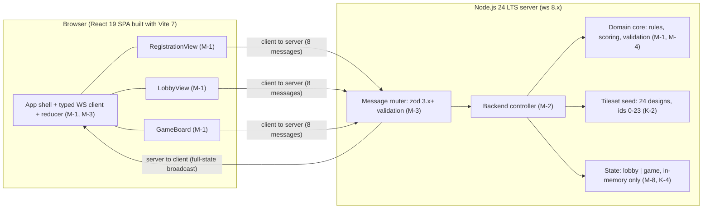

# Full-Stack Software Specification — Carcassonne (MODERNIZED)

* **Source:** `output/Carcassonne` (legacy code at pinned commit `ca2797745a863243fa6ce96af63435b0d67bf2ab`)
* **Modernization plan:** `modernization-plan.json` (decisions M-1..M-8; directives D-1..D-2)
* **Generated by:** the modernize-modeler skill from the codebase-modeler output.
   Legacy citations `path:line` point at the pre-modernization code; `Artifact.md:line`
   citations point at the source artifact; `(M-n)` references the modernization plan.

## 1. Executive Summary
* **Project Name:** Carcassonne
* **Version:** 2.0 (modernized)
* **Author(s):** Modernize Modeler multi-agent network (Planner decisions + Modernizer rendering)
* **Date:** 2026-09-16
* **Purpose:** A modernized multi-player browser implementation of the Carcassonne board game. Players register in a shared lobby, then take turns drawing tiles from a shuffled stack, placing them on a growing board, and placing meeples to claim features (roads, cities, cloisters); finished features score points immediately by majority, with remaining features scored at end of game. The functional surface is preserved from the legacy system (K-1..K-7) and rewritten per directives D-1/D-2 into the most modern JavaScript/TypeScript stack: a React 19 single-page app (M-1) talking to a Node.js 24 WebSocket server (M-2) over a zod-validated typed JSON protocol (M-3). The server keeps a single authoritative game model in memory and broadcasts the whole state to every connected browser (K-4); server-side move/turn revalidation (M-4) and structured error payloads (M-5) close the legacy trust-boundary gaps, and a Docker multi-stage image (M-7) replaces platform hosting. Source of record: repository pinned at commit `ca2797745a863243fa6ce96af63435b0d67bf2ab`.
* **Target Audience:** 2–5 human players playing together through browser clients — the lobby is capped at 5 players (kept, `src/Types/Game.elm:43-45`, `src/Backend.elm:105-110`) and every registered player is an equal actor with no host/admin role (kept K-3, `src/Views/PlayerLobbyView.elm:20-37`).

## 2. Project Scope
* **In-Scope:**
  * Player lobby: name registration with client-side non-empty validation (`src/Frontend.elm:50-62`), duplicate-name rejection and a 5-player limit enforced server-side (`src/Backend.elm:93-118`), kicking players and killing the lobby (`src/Backend.elm:125-138`), and rejoining an in-progress game on connect (`src/Backend.elm:120-123`). The functional surface is kept (K-3, K-5, K-6); the implementation is modernized to React views over the typed WebSocket protocol (M-1, M-3) with explicit rejection feedback (M-5). → modernized (M-1, M-3, M-5)
  * Game: shuffled 71-tile draw stack (`src/Types/Game.elm:120-147`), turn loop of tile placement (`src/Helpers/GameLogic.elm:323-370`), tile rotation (`src/Helpers/GameLogic.elm:21-40`), meeple placement or skip with immediate majority scoring and a 2x bonus for completed cities above 2 tiles (`src/Helpers/GameLogic.elm:383-508`), and end-of-game final scoring when no playable tile remains (`src/Helpers/GameLogic.elm:511-556`). The rule core and seed data are kept verbatim (K-1, K-2) and ported as a pure TypeScript domain layer (M-1, M-2); move/turn revalidation now also runs server-side (M-4). → rule core kept (K-1); modernized (M-4)
  * Terminate Game control that resets to the empty lobby (`src/Views/GameView.elm:743-745`, `src/Backend.elm:180-183`). → kept (K-5, K-6); transport modernized (M-3)
  * CI quality gates: the legacy elm-review lint + `lamdera make` compilation of both entry points + elm-test unit tests (`.github/workflows/test.yaml:33-46`) are replaced by ESLint 9.x + `tsc --noEmit` + Vitest 3.x (+ optional Playwright 1.x) on the modern toolchain (M-6, M-7). → replaced (M-6, M-7)
* **Out-of-Scope:**
  * Field play and field scoring — documented in `readme.md:61` and `readme.md:79` but not implemented in the legacy code: field sides carry `SideId -1` and are excluded from meeple placement and scoring. Remains out of scope: the rewrite preserves the enforced behavior (fields score 0) per K-1. → kept (K-1); A-1 accepted
  * Score track / 6+1 meeple economy — `readme.md:50-52` claims it, the code gives a flat 7 meeples and no score track (`src/Types/Game.elm:61`). Remains out of scope: the enforced code behavior (flat 7 meeples, no score track) is preserved by K-1; implementing the readme variant would invent a requirement the directive does not ask for. → kept (K-1)
  * Winner determination — `readme.md:117` claims it; `finishGame` only finalizes scores and sets `FinishedState` (`src/Helpers/GameLogic.elm:511-556`). Remains out of scope (K-1): the winner stays implicit from the displayed scores. → kept (K-1)
  * Turn timers / timeouts — none exist in the legacy code (`src/Frontend.elm:28`, `src/Backend.elm:189-191`) and the modernized server keeps this behavior explicit: no timer, a player may stall a turn (A-2 deferred; M-2 makes the behavior a documented server property). → kept; A-2 deferred
  * Chat / "advice" channel for the drawn tile — `readme.md:81-85` has no code counterpart. Remains out of scope: the drawn tile stays visible to all players via the full-state broadcast (K-4); a chat channel is a new feature the directive does not request. → kept (K-4)
  * Anything database-related: there is no DBMS, ORM, or data-access layer in the legacy repository, and none is introduced — the modernized data layer is explicitly a typed in-memory state with no datastore (M-8). → kept; modernized (M-8)
* **Assumptions & Constraints:**
  * ~~Functional surface only: all move/turn validation was client-side; the backend applied `ToBackend` messages without re-checking validity or turn ownership (`src/Helpers/GameLogic.elm:311-314`, `src/Helpers/GameLogic.elm:373-376`)~~ — lifted in the modernized system: the server revalidates move legality and turn ownership (session bound to the registered player) before applying any move, reusing the ported pure-domain checks as authoritative server-side checks (M-4; I-1 resolved). The client keeps the same checks for UI hints (K-1). → replaced (M-4)
  * The entire game (players, board, scores) lives in a single in-memory model; at most one game runs at a time (legacy `src/Backend.elm:14-15`, `src/Types.elm:11-17`). Design kept (K-4); the model is now owned by the Node.js 24 process instead of the Lamdera runtime (M-2). → modernized (M-2)
  * `src/Evergreen/` compiler-generated Lamdera state versioning (legacy `src/Evergreen/Migrate/V10.elm:3`) is retired: the modernized data layer is a single TypeScript state shape with no migration tooling and explicit in-memory restart semantics (M-8; I-5 resolved). → replaced (M-8)

## 3. System Architecture & Technology Stack
* **3.1 High-Level Architecture (modernized):** The legacy single Elm codebase split into two Lamdera entry points — a browser frontend that rendered three views and sent `ToBackend` messages (`src/Frontend.elm:17-31`) and a server-side backend that owned the one shared game model, applied messages via `GameLogic`/`TileMapper`, re-entered itself on `Random` commands for shuffling, and broadcast `ToFrontend` messages (`src/Backend.elm:18-25`, `src/Backend.elm:6`) — becomes two self-hosted TypeScript processes with the same division of labor (M-1, M-2). The browser is a React 19 SPA (Vite 7 build) whose components `RegistrationView`, `LobbyView`, `GameBoard` mirror the three legacy views (K-5), whose client state is a reducer fed by server-pushed full state (K-4), and whose typed WebSocket client class speaks the typed JSON protocol (M-3). The Node.js 24 server owns the single authoritative in-memory state (lobby phase | game phase, K-4), validates every incoming message against zod 3.x+ schemas before dispatch (M-3), revalidates every move with the ported pure-domain checks and binds sessions to registered players (M-4), shuffles the draw stack in-process with Fisher–Yates (replacing the two `Random.generate` re-entries, `src/Backend.elm:147`, `src/Backend.elm:177`), and broadcasts every full-state update to all connected clients including the acting one (M-3; A-13 resolved). Structured rejections replace silent drops (M-5). There is no database service and no HTTP API; the only runtime service is the WebSocket transport (K-4). The compiler-generated Evergreen persistence layer of the legacy architecture is absent from the modernized system (M-8).

Node map:

| Node | Element | Code Reference |
|---|---|---|
| FE | App shell: reducer-based client state + typed WS client (was the Elm frontend update loop) | modernized (M-1, M-3); was `src/Frontend.elm:17-31` |
| V1 | Registration screen (name input, error box, Kill lobby) — UI kept (K-5) | modernized (M-1); was `src/Views/PlayerRegistrationView.elm:16-37` |
| V2 | Lobby screen (roster, per-player kick, Start) — UI kept (K-5) | modernized (M-1); was `src/Views/PlayerLobbyView.elm:20-37` |
| V3 | Game board + overlays + turn controls — UI kept (K-5) | modernized (M-1); was `src/Views/GameView.elm:58-90` |
| TR | Message transport: zod-validated WS JSON protocol (was Lamdera `sendToBackend`/`broadcast`) | modernized (M-3); was `src/Types.elm:50-58` |
| BE | Backend controller: init/update/updateFromFrontend equivalent (was the Lamdera backend app) | modernized (M-2); was `src/Backend.elm:18-25` |
| GL | Game rules, SideId merging, scoring — pure domain layer, logic kept (K-1) | modernized (M-1, M-4); was `src/Helpers/GameLogic.elm:1` |
| TM | Tileset seed data (24 designs, ids 0–23) — kept verbatim (K-2) | modernized (M-8); was `src/Helpers/TileMapper.elm:9-253` |
| ST | Single shared state (lobby \| game) — one-game-at-a-time design kept (K-4) | modernized (M-8); was `src/Types.elm:11-17` |

Nodes dropped from the legacy diagram: `EV` (Evergreen state storage across redeploys, legacy `src/Evergreen/Migrate/V10.elm:3-18`) is replaced by M-8 (no cross-restart persistence); `FH` (client-side validity helpers, legacy `src/Helpers/FrontendHelpers.elm:48-110`) is folded into the domain core and reused server-side (M-4, K-1).

* **3.2 Technology Stack (current → target, rendered verbatim from `modernization-plan.json`):**
    * **Frontend:**
        * **Current:** Elm 0.19.1 browser application (elm/browser 1.0.2 + elm/html 1.0.0 virtual DOM) hosted by the Lamdera frontend runtime; three Elm views (PlayerRegistrationView, PlayerLobbyView, GameView) + hand-written Styles.elm CSS module — `elm.json:4-13`, `src/Frontend.elm:17-31`, `src/Styles.elm:1`, `Specification.md:78`.
        * **Target (M-1):** TypeScript 5.x + React 19 (react 19.x, react-dom 19.x) single-page app built with Vite 7; React components RegistrationView, LobbyView, GameBoard mirroring the three Elm views (K-5); reducer-based client state mirroring the Lamdera full-state pushes (K-4); CSS modules for the existing styling.
    * **Backend:**
        * **Current:** Elm 0.19.1 server-side app on the Lamdera backend runtime (lamdera/core 1.0.0 + lamdera/codecs 1.0.0); one shared in-memory game model broadcast to all clients; Debug.log on the client-connection hot path — `elm.json:17-18`, `src/Backend.elm:18-25`, `src/Backend.elm:40-42`, `Specification.md:79`.
        * **Target (M-2, with M-3 and M-4):** Node.js 24 LTS + TypeScript + ws 8.x WebSocket server owning one authoritative in-memory state (lobby | game); zod-validated typed JSON protocol (M-3); server-side move/turn revalidation (M-4); structured logging, no Debug.log (I-3 resolved).
    * **Database:**
        * **Current:** None — no DBMS/ORM; state lives only in the in-memory backend Model, versioned by compiler-generated Evergreen snapshots V1→V10 (platform-managed) — `src/Backend.elm:14-15`, `src/Evergreen/Migrate/V10.elm:3-18`, `DatabaseModel.md:16-20`.
        * **Target (M-8):** None (no DBMS) — a single typed in-memory state shape in TypeScript; the Evergreen snapshot/migration layer is dropped; explicit restart=new-lobby semantics.
    * **Data Processing & Analytics:** None (kept — no change from the legacy system, `Specification.md:81`).
    * **Infrastructure & DevOps:**
        * **Current:** Lamdera platform hosting with git-remote auto-deploy; GitHub Actions CI: elm-review lint + lamdera make compile of both entry points + npx elm-test — `readme.md:139-151`, `.github/workflows/test.yaml:33-46`, `Specification.md:82`.
        * **Target (M-7, with M-6):** Docker multi-stage image (Vite static build + Node 24 server) (M-7); GitHub Actions CI with ESLint 9.x, tsc --noEmit, Vitest 3.x and optional Playwright 1.x (M-6); hosting-provider choice left open.

## 4. Functional Requirements
* **User Authentication & Authorization:** No login, session identity, or role system — the identity model is kept (K-3): unique, non-empty player names, 5-player lobby cap, single PLAYER role with no host/admin (legacy `src/Backend.elm:93-138`, `src/Types/PlayerName.elm:4-5`). Modernized (M-4, M-5): the server now binds each WebSocket session to the registered player, revalidates turn ownership and move legality before applying any move (I-1 resolved; legacy gap at `src/Backend.elm:150-183`), and returns structured rejections instead of silent drops (I-2 resolved; legacy behavior at `src/Backend.elm:99-102`, `src/Backend.elm:185-186`). The situational "Kill lobby" affordance — rendered only to the client whose registration was rejected because the lobby is full (`src/Views/PlayerRegistrationView.elm:29-37`) — is kept (K-5).
* **Core Features:** One entry per use case; full step-by-step flows and actor diagrams are in `./UseCaseModel.md` and `./ActivityDiagram.md` (modernized).

| ID | Feature (acceptance criteria) | Entry point | Code Reference | Modernization |
|---|---|---|---|---|
| UC-01 | Register a player: trimmed non-empty name (legacy `src/Frontend.elm:50-62`); backend rejects duplicates and enforces the 5-player limit (legacy `src/Backend.elm:93-118`); updated roster broadcast to all clients. Modernized: rejections are explicit — duplicate name and full lobby return structured rejection payloads instead of a silent unchanged roster (M-5) | Name submit in registration view | `src/Views/PlayerRegistrationView.elm:16-26`, `src/Backend.elm:93-118` | modernized (M-3, M-5); semantics kept (K-3, K-6) |
| UC-02 | Kick a player from the lobby: every lobby client sees a kick control; kicked client is sent back to the registration screen (legacy `src/Frontend.elm:98-124`) | Kick button in lobby view | `src/Views/PlayerLobbyView.elm:30-37`, `src/Backend.elm:125-133` | modernized (M-3); semantics kept (K-6) |
| UC-03 | Start a new game: `initializeGame` builds the draw stack and starting grid (`src/Types/Game.elm:53-73`), the stack is shuffled (legacy `src/Backend.elm:147`), the first playable tile is chosen skipping unplaceables (`src/Backend.elm:44-59`), all clients switch to the game view. Modernized: the shuffle runs in-process (Fisher–Yates) instead of a platform `Random.generate` re-entry (M-2) | Start button in lobby view | `src/Views/PlayerLobbyView.elm:20-23`, `src/Backend.elm:140-148` | modernized (M-2, M-3); rules kept (K-1) |
| UC-04 | Place a tile on the board (turn step 1): inserts the tile, merges `SideId`s of adjacent features across grid and meeple dict, advances to the meeple phase (legacy `src/Helpers/GameLogic.elm:323-370`). Modernized: the server revalidates placement legality and turn ownership before applying (M-4; legacy validity was client-side only, `src/Helpers/FrontendHelpers.elm:48-110`); invalid moves are rejected with a structured error (M-5) | Board cell click (placeable overlay) | `src/Views/GameView.elm:327`, `src/Helpers/GameLogic.elm:323-370` | modernized (M-3, M-4, M-5); rule kept (K-1) |
| UC-05 | Rotate the drawn tile: `rotateLeft` permutes the four sides with an overflow guard (legacy `src/Helpers/GameLogic.elm:21-40`). Modernized: the ported `isRotatedCorrectly` check (legacy `src/Helpers/GameLogic.elm:45-95`) becomes a runtime invariant on the server rotation path (M-4) | Rotate button | `src/Views/GameView.elm:740-742`, `src/Helpers/GameLogic.elm:21-40`, `src/Helpers/GameLogic.elm:45-95` | modernized (M-3, M-4); rule kept (K-1) |
| UC-06 | Place a meeple or skip (turn step 2): places under the target `SideId` (including cloister center), scores finished features, returns finished meeples, advances the turn (legacy `src/Helpers/GameLogic.elm:383-508`), and the backend re-shuffles the draw stack after the move (legacy `src/Backend.elm:170-178`); allowed positions offered by client-side helpers (legacy `src/Helpers/FrontendHelpers.elm:27-43`). Modernized: server revalidation + structured rejection on invalid positions (M-4, M-5); re-shuffle in-process (M-2) | Meeple position click / Skip | `src/Views/GameView.elm:393`, `src/Views/GameView.elm:533`, `src/Helpers/GameLogic.elm:383-508`, `src/Backend.elm:170-178`, `src/Helpers/FrontendHelpers.elm:27-43` | modernized (M-2, M-3, M-4, M-5); rule kept (K-1) |
| UC-07 | Score a completed feature by majority: a feature scores only when finished; majority owner takes the points, ties share; completed cities above 2 tiles score 2x; final scoring at game end covers all remaining features and cloisters (legacy `src/Helpers/GameLogic.elm:256-290`, `src/Helpers/GameLogic.elm:170-203`, `src/Helpers/GameLogic.elm:430-436`, `src/Helpers/GameLogic.elm:511-556`). Ported unchanged to the pure TypeScript domain core | Triggered inside UC-06 and game end | `src/Helpers/GameLogic.elm:256-290`, `src/Helpers/GameLogic.elm:170-203`, `src/Helpers/GameLogic.elm:430-436`, `src/Helpers/GameLogic.elm:511-556` | kept (K-1) |
| UC-08 | Reconnect to an in-progress game: a player registering while the game is active receives `JoinedGame` and re-enters the game view (legacy `src/Backend.elm:120-123`, `src/Frontend.elm:125-132`). Modernized: the `JoinedGame` semantics are preserved over the WS protocol (K-6), and the full-state broadcast explicitly reaches the acting/rejoining client (M-3; A-13 resolved) | Registration during `BeGamePlayed` | `src/Backend.elm:120-123`, `src/Frontend.elm:125-132`, `readme.md:121-123` | modernized (M-3); semantics kept (K-4, K-6) |
| — (not modeled as a UC) | Terminate Game: resets the backend to the empty lobby and broadcasts `GameTerminated`; clients return to the registration form (legacy `src/Views/GameView.elm:743-745`, `src/Backend.elm:180-183`) | Terminate button on finished game | `src/Views/GameView.elm:743-745`, `src/Backend.elm:180-183` | modernized (M-3); semantics kept (K-5, K-6) |

  * **Game state machine:**
    * Backend phase: `BackendModel = BePlayerRegistration { players } | BeGamePlayed { game }` — exactly one variant holds at a time (legacy `src/Types.elm:11-17`); all `ToBackend` handlers are state-gated, and messages in the wrong state are dropped (legacy `src/Backend.elm:185-186`). Modernized: the same two-phase shape is a TypeScript discriminated union in the domain core (M-8); wrong-state messages now receive a structured rejection instead of a silent drop (M-5). → modernized (M-5, M-8); phase shape kept (K-4, K-6)
    * Frontend phase: `FrontendModel = FePlayerRegistration | FeLobby | FeGamePlayed` (legacy `src/Types.elm:20-33`). Modernized: mirrored by the React reducer's client-side phase (M-1). → modernized (M-1); shape kept (K-5)
    * Turn phase: `GameState = PlaceTileState | PlaceMeepleState | FinishedState` (legacy `src/Types/GameState.elm:4-7`). Transitions: tile placement → `PlaceMeepleState` (`src/Helpers/GameLogic.elm:367`); meeple/skip → next player's `PlaceTileState` (`src/Helpers/GameLogic.elm:502-508`); no playable tile → `FinishedState` (`src/Helpers/GameLogic.elm:552-556`). Kept verbatim in the ported domain core (K-1). → kept (K-1)
* **Third-Party Integrations:**
  * ~~Lamdera platform — hosting, client↔backend message transport, broadcast bus, `Random` command execution, connection lifecycle (legacy `src/Backend.elm:189-191`), and auto-deploy on `git push lamdera` (legacy `readme.md:139-151`)~~ → replaced by the self-hosted Node.js 24 + ws 8.x server (M-2) and Docker deployment (M-7).
  * ~~`elm-explorations/test` — unit test framework run by elm-test (legacy `elm.json:16`, `.github/workflows/test.yaml:45-46`)~~ → replaced by Vitest 3.x with ESLint 9.x, `tsc --noEmit`, and optional Playwright 1.x (M-6).
  * No payment, email, or analytics providers (kept — none existed in the legacy system, `Specification.md:106`).

## 5. Non-Functional Requirements (NFRs)
* **Performance:** No targets declared in the source (`Specification.md:109`) and none demanded by the directive — accepted (A-3). The turn loop remains pure synchronous computation in the domain core; the legacy's only asynchronous re-entries (two `Random` commands for initial shuffle and draw-stack refill, `src/Backend.elm:37-38`, `src/Backend.elm:147`, `src/Backend.elm:177`) disappear: shuffling is now an in-process synchronous operation (M-2), so the modernized server has no async rule re-entries at all.
* **Scalability:** Single-node, in-memory: one shared state serves all clients, so one concurrent game is the ceiling — design kept (K-4). The legacy question of whether the Lamdera host layer offered scaling or timeout guarantees is closed: the Lamdera host layer is retired by M-2, so scaling/timeout behavior is exactly what the code defines — a single Node.js 24 process, one concurrent game (A-4 resolved).
* **Security:** The legacy system was client-trusted: `placeTile`/`placeMeeple` "do not check whether the move is valid" and the backend re-applied them without re-checking turn ownership (`src/Helpers/GameLogic.elm:311-314`, `src/Helpers/GameLogic.elm:373-376`, `src/Helpers/FrontendHelpers.elm:48-110`), so a tampered client could place invalid moves or play out of turn — resolved (I-1): the modernized server revalidates move legality and turn ownership server-side with sessions bound to registered players (M-4). The legacy's missing error payloads — duplicate registration rejected silently via an unchanged player list (`src/Backend.elm:99-102`) and wrong-state messages dropped without reply (`src/Backend.elm:185-186`) — are resolved (I-2): the protocol carries structured rejection payloads that clients render explicitly (M-5). The legacy `Debug.log` on the client-connection hot path (`src/Backend.elm:40-42`) is resolved (I-3): the rewritten backend logs structured data only (M-2). No authentication is by design (K-3); PII exposure remains limited to free-form player names (`src/Types/PlayerName.elm:4-5`); encryption-at-rest is not applicable because the state never leaves process memory (M-8).
* **Reliability & Availability:** No uptime targets declared in the source (A-5 deferred — no SLO directive). The legacy's only recovery mechanism — the Lamdera platform's Evergreen serialization of the backend model across sessions/deploys (`src/Evergreen/Migrate/V10.elm:3-18`) with a `ModelReset` state-loss boundary (`src/Evergreen/Migrate/V10.elm:36-43`) and an opaque storage medium — is replaced by explicit semantics (A-6 resolved; M-8): state is in-process memory only, and a server restart starts a new empty lobby (K-4). No turn timers or timeouts exist in either system (A-2 deferred; M-2 documents this explicitly), so a player may stall a turn indefinitely.

## 6. Data Model & Database Schema
* **Entities & Relationships:** The legacy "data layer" was the serialized state of the Lamdera backend model, versioned by compiler-generated Evergreen snapshots (`Specification.md:115`). Modernized (M-8): the data layer is now a single typed TypeScript state shape defined once in the domain core — a discriminated union `lobby { players } | game { game }` — with no DBMS, no migration tool, and in-process memory only (restart = new lobby). Full field-level detail with citations is in `./DatabaseModel.md` (modernized). Summary:
  * `BackendModel` top-level state (legacy ADT `BePlayerRegistration { players }` / `BeGamePlayed { game }`, `src/Types.elm:11-17`, `src/Backend.elm:14-15`) → replaced by the single TypeScript state shape (M-8); one-game-at-a-time semantics kept (K-4). The per-session `FrontendModel` mirror (legacy `src/Types.elm:20-33`) → modernized to `ClientState` (M-1), shape kept (K-5).
  * `Game` record (11 fields: scores, meeples, players, current turn, tile to place, phase, last placed tile, next SideId, draw stack, grid, meeples-by-feature — legacy `src/Types/Game.elm:28-40`), composed of `TileGrid` (`src/Types/Game.elm:20-21`), `PlayerScores` (`src/Types/Game.elm:16-17`), `Meeples` (`src/Types/Game.elm:24-25`) — kept (K-1). Implicit modeling kept (K-7): features are implicit via shared SideIds (no Feature aggregate object), game finish is delivered as a full-state update push (no dedicated event), and `Player` is a name-keyed cluster of fields inside the `Game` record (legacy `src/Types/Game.elm:29-32`, `src/Types.elm:80-82`), with no standalone Player type.
  * Board values: `Tile` (four `Side`s, optional cloister, rotation — legacy `src/Types/Tile.elm:21-29`, `src/Types/Tile.elm:15-18`), `Meeple` (owner, coordinate, position — legacy `src/Types/Meeple.elm:17-23`), `Feature` enum (legacy `src/Types/Feature.elm:4-8`), `GameState` (legacy `src/Types/GameState.elm:4-7`), plus value-object type aliases `Coordinate`, `PlayerIndex`, `PlayerName`, `Score` (legacy `src/Types/Coordinate.elm:4-5`, `src/Types/PlayerIndex.elm:4-5`, `src/Types/PlayerName.elm:4-5`, `src/Types/Score.elm:4-5`) — kept (K-1), re-typed in TypeScript.
  * Seed data: 24 hand-written tile designs, ids 0–23 (`src/Helpers/TileMapper.elm:9-253`), a 71-entry draw stack (`src/Types/Game.elm:120-147`), the starting tile (tile 0 at `(0,0)`, `src/Types/Game.elm:102-104`), and a 5-color meeple table (one color per player index 0–4, black fallback for out-of-range, `src/Types/Meeple.elm:26-42`) — kept verbatim (K-2). The code-verified numbers 24/71/72 are reused everywhere; the planner's erroneous "74-tile tileset" figure is discarded.
  * Versioning: the legacy four parallel type snapshots V1 → V3 → V5 → V10 with compiler-generated migrations, including `ModelReset` state-loss boundaries (`src/Evergreen/Migrate/V3.elm:27-54`, `src/Evergreen/Migrate/V5.elm:120-156`, `src/Evergreen/Migrate/V10.elm:36-63`) and post-V10 drift (`src/Evergreen/V10/Types.elm:47`, `src/Evergreen/V10/Types.elm:66`) → replaced (M-8): the layer is dropped entirely; the single TypeScript state type is the source of truth and cannot drift from its own definition (I-5 resolved).
* **Data Flow:** Modernized (M-3): view click → React event handler → typed WS client message → server zod schema validation (M-3) → move/turn revalidation in the domain core (M-4) → mutation of the shared `Game` state → in-process shuffle for refill (M-2; replaces the legacy `Random` command re-entry, `src/Backend.elm:37-38`) → full-state broadcast over WebSocket to every connected client including the acting one (M-3; A-13 resolved) → React reducer applies the new state and re-renders (M-1, K-4; legacy `src/Frontend.elm:143-150`, `src/Backend.elm:167`). Rejected moves return a structured rejection to the acting client instead of being silently dropped (M-5; legacy drop at `src/Backend.elm:185-186`). The legacy's total types (no nullable columns; the only `Maybe` fields were `Tile.cloister` and `FrontendModel.error`, `src/Types/Tile.elm:28`, `src/Types.elm:23`) are carried into TypeScript optional/`null`-typed fields.
* See the entity-relationship-style schema in [DatabaseModel.md](./DatabaseModel.md) (modernized).

## 7. API Specification
* **Protocol:** Modernized (M-3): the legacy had no HTTP/REST/GraphQL API — the complete interface was the Lamdera message protocol defined in `src/Types.elm`, where clients sent `ToBackend`, the backend re-entered itself on `BackendMsg` (connection + shuffle re-entries), and the backend replied/broadcast `ToFrontend` (`src/Types.elm:50-86`, `Specification.md:126`). The modernized interface is a WebSocket JSON protocol: TypeScript discriminated unions for all messages, runtime validation with zod 3.x+ schemas checked server-side before dispatch, and an explicit full-state broadcast to every connected client including the acting one (A-13 resolved). The 8 client→server messages and the 8 server→client messages keep their payloads and state gating 1:1 (K-6) — names may change with the TS protocol, semantics must not.
* **Endpoints (message constructors):**

| Direction | Constructor | Payload | Code Reference | Modernization |
|---|---|---|---|---|
| client → server | `RegisterPlayer` | `PlayerName` | `src/Types.elm:51` | modernized (M-3); semantics kept (K-6); rejection added (M-5) |
| client → server | `KickPlayer` | `PlayerName` | `src/Types.elm:52` | modernized (M-3); semantics kept (K-6) |
| client → server | `KillLobby` | — | `src/Types.elm:53` | modernized (M-3); semantics kept (K-6) |
| client → server | `InitializeGame` | — | `src/Types.elm:54` | modernized (M-3); semantics kept (K-6); in-process shuffle (M-2) |
| client → server | `RotateTileLeft` | — | `src/Types.elm:55` | modernized (M-3); rotation invariant enforced (M-4); semantics kept (K-6) |
| client → server | `PlaceTile` | `Coordinate` | `src/Types.elm:56` | modernized (M-3, M-4, M-5); semantics kept (K-6) |
| client → server | `PlaceMeeple` | `MeeplePosition` | `src/Types.elm:57` | modernized (M-3, M-4, M-5); semantics kept (K-6) |
| client → server | `TerminateGame` | — | `src/Types.elm:58` | modernized (M-3); semantics kept (K-6) |
| internal | `ClientConnected` | `SessionId ClientId` | `src/Types.elm:62`, `src/Backend.elm:189-191` | modernized (M-2); `Debug.log` removed (I-3) |
| internal | `InitializeGameAndTileDrawStackShuffled` | `List SideId` | `src/Types.elm:63`, `src/Backend.elm:147` | replaced (M-2) — in-process Fisher–Yates shuffle |
| internal | `TileDrawStackShuffled` | `List SideId` | `src/Types.elm:64`, `src/Backend.elm:177` | replaced (M-2) — in-process Fisher–Yates shuffle |
| server → client | `PlayerRegistrationUpdated` | `{ players }` | `src/Types.elm:68-70` | modernized (M-3); semantics kept (K-6) |
| server → client | `PlayerKicked` | `{ players, kickedPlayer }` | `src/Types.elm:71-74` | modernized (M-3); semantics kept (K-6) |
| server → client | `LobbyIsFull` | — | `src/Types.elm:75` | modernized (M-3); semantics kept (K-6); explicit rejection (M-5) |
| server → client | `LobbyKilled` | — | `src/Types.elm:76` | modernized (M-3); semantics kept (K-6) |
| server → client | `GameInitialized` | `{ game }` | `src/Types.elm:77-79` | modernized (M-3); semantics kept (K-6) |
| server → client | `UpdateGameState` | `{ game }` | `src/Types.elm:80-82` | modernized (M-3); broadcast explicitly includes the acting client (M-3; K-4, K-6) |
| server → client | `JoinedGame` | `{ game }` | `src/Types.elm:83-85` | modernized (M-3); semantics kept (K-6) |
| server → client | `GameTerminated` | — | `src/Types.elm:86` | modernized (M-3); semantics kept (K-6) |
| server → client | `RegistrationRejected` | `{ reason }` | added by M-5 (gap: legacy silent rejection at `src/Backend.elm:99-102`) | added (M-5) |
| server → client | `InvalidMove` | `{ reason }` | added by M-5 (gap: legacy silent drop at `src/Backend.elm:185-186`) | added (M-5) |

  Requests are sent over the persistent WebSocket connection; the full-state reply/broadcast model is kept (K-4, K-6). Modernized (M-5): there are no more silent failures — a duplicate registration name yields a `RegistrationRejected` payload instead of the unchanged player list (legacy `src/Backend.elm:99-102`), and messages arriving in the wrong backend state yield a structured rejection instead of a silent drop (legacy `src/Backend.elm:185-186`, `Specification.md:151`); the React registration view's existing error box finally receives real content (K-5).

## 8. UI/UX & Design
* **Design System:** Modernized (M-1): the single hand-written Elm CSS module (`src/Styles.elm:1`) is ported to plain CSS modules in the Vite 7 React app (no component library — none existed in the legacy system, `Specification.md:153`). No Figma/wireframe links exist in the repo (A-7 accepted — no design assets and no design directive; the rewrite keeps the existing three-view UI and ported styling, K-5).
* **Screens (three views kept, K-5; modernized as React components, M-1):**
  * **Registration** (`RegistrationView`): name input, client-side error display — now populated with structured rejection payloads (M-5) — and a situational "Kill lobby" button shown only to the client that received `LobbyIsFull` — kept (K-5); was `src/Views/PlayerRegistrationView.elm:16-37`.
  * **Lobby** (`LobbyView`): player list with per-player kick controls and a Start button — kept (K-5); was `src/Views/PlayerLobbyView.elm:11-39`.
  * **Game board** (`GameBoard`): the tile grid with a placeable-cell overlay during `PlaceTileState` (`src/Views/GameView.elm:58-90`), a meeple-position overlay with Skip button during `PlaceMeepleState` (`src/Views/GameView.elm:92-157`), rotate and terminate controls (`src/Views/GameView.elm:740-745`), a sidebar with scores/meeples, and a finished-game board with final scores (`src/Views/GameView.elm:663-710`) — kept (K-5).
  * Debug SideId overlay: stays a non-interactive visual layer (`pointer-events: none`, `src/Views/GameView.elm:582`) — kept (K-5).
* **User Flows:** Kept (K-5). The end-to-end user paths are unchanged: (1) register → lobby → start game (`PR-4`/`PR-3`), (2) per-turn loop place tile → rotate → place meeple/skip → immediate scoring (`PR-1`/`PR-2`), (3) game end: no playable tile → final scoring → finished board → terminate (`PR-5`). Full step-by-step activity flows with swim lanes and edge cases are in [ActivityDiagram.md](./ActivityDiagram.md); actor and use-case detail is in [UseCaseModel.md](./UseCaseModel.md). Key UX guarantees kept: only the current player's client renders the interactive overlays (`src/Views/GameView.elm:58-90`); all other clients render the board read-only (K-4); disconnected players can rejoin via re-registration (UC-08, `src/Backend.elm:120-123`). Modernized (M-4, M-5): each flow gains a server validation step — invalid or out-of-turn moves are rejected by the server and the acting client renders the structured rejection.
* **Wireframes/Mockups:** None in the repository (A-7 accepted — no design directive; only ported styling).

## 9. Testing Strategy
* **Unit Testing:** Modernized (M-6): Vitest 3.x replaces `elm-explorations/test` (legacy `elm.json:16`) and elm-test. The pinned legacy tests are ported 1:1 — `isRotatedCorrectly` (legacy `tests/GameLogicTests.elm:14-56`), tile-placement validity (legacy `tests/GameLogicTests.elm:60-225`), and majority/tie scoring via `getFeatureOwners` (legacy `tests/MeepleTests.elm:47-58`) — plus new suites covering the ported rule surface: the M-4 server-side validity checks (`tileCanBePlaced`, `getCoordinatesToBePlacedOn`, `getMeeplePositionsToBePlacedOn`) and the M-5 rejection payloads. Coverage: an 80% line-coverage target on the ported domain core (A-8 resolved; I-4 resolved — the legacy's two test files, 296 lines against ~3,524 lines of `src/`, are replaced by broad coverage of the rule surface `src/Helpers/GameLogic.elm:1-556`).
* **Integration Testing:** Modernized (M-6): Vitest integration tests drive a real ws client against the Node server (registration, turn loop, state gating) — none existed in the legacy repo (A-9 resolved; the legacy only compile-checked the two entry points, `.github/workflows/test.yaml:39-43`). The broadcast-including-the-acting-client semantics (A-13) is verified here and in E2E (M-6).
* **End-to-End (E2E) Testing:** Modernized (M-6): a Playwright 1.x E2E smoke covers registration → lobby → turn loop → finished board — no browser test framework existed in the legacy repo (A-10 resolved).
* **Continuous quality gate:** Modernized (M-6, M-7): the GitHub Actions pipeline replaces the legacy Elm toolchain gates (elm-review lint, `lamdera make` compilation of both entry points, `npx elm-test --compiler lamdera`, `.github/workflows/test.yaml:33-46`) with ESLint 9.x lint, `tsc --noEmit`, Vitest 3.x (unit + integration), a production build, and optional Playwright 1.x; the 80% line-coverage target on the domain core is enforced in CI (A-8).

## 10. Deployment & Milestones
* **Environments:**
  * **Development:** local Node.js 24 + Vite 7 dev server with Vitest (M-1, M-6), replacing the legacy local Elm toolchain with the Lamdera compiler (legacy test command `npx elm-test --compiler lamdera`, `.github/workflows/test.yaml:46`, `Specification.md:169`). → modernized (M-6)
  * **Production:** a Docker multi-stage image — Vite static build → Node 24 LTS server serving the static assets plus the WebSocket endpoint (M-7) — replaces Lamdera platform hosting with git-remote auto-deploy (legacy `readme.md:139-151`); the hosting-provider choice is left open (M-7). Backend state is explicitly carried in process memory only: a restart starts a new empty lobby (M-8, K-4), replacing the legacy platform-managed Evergreen carry-over across redeploys (`src/Evergreen/Migrate/V10.elm:3-18`). → modernized (M-7, M-8)
  * **Staging:** deferred (A-11) — not declared in the legacy repo and no environments directive; out of scope for this rewrite.
  * **CI:** GitHub Actions on the repository running the M-6 gates (M-7), replacing the legacy pipeline (`.github/workflows/test.yaml:33-46`). → modernized (M-6, M-7)
* **Timeline & Phases:** Deferred (A-12) — no phase plan, roadmap, or release history is declared in the legacy repo and no roadmap directive was given; the modernized delivery is the rewrite itself (M-1..M-8). The only observable legacy evolutionary markers — the Evergreen state versions V1 (lobby-only state) → V3 (name-based players) → V5 (pre-index players) → V10 (meeple model redesign, `ModelReset`) (`src/Evergreen/Migrate/V3.elm:27-54`, `src/Evergreen/Migrate/V5.elm:120-156`, `src/Evergreen/Migrate/V10.elm:36-63`) — are historical: the snapshot/migration layer no longer exists in the modernized system (M-8).

## 11. Cross-References to Sibling Models
* [ClassModel.md](./ClassModel.md) (modernized) — structural model of the TypeScript domain core, the React components, the WS client class, and the server controller, with the interface seams TypeScript provides where Elm had none.
* [DatabaseModel.md](./DatabaseModel.md) (modernized) — the typed in-memory state schema: records, fields, keys, seed data (tileset/draw stack), and the explicit restart semantics that replace the Evergreen V1→V10 version history.
* [DomainModel.md](./DomainModel.md) (modernized) — domain language, entities, value objects, the `Game` aggregate, and the game rules with their enforcement status now including server-side enforcement of the previously UI-only rules.
* [UseCaseModel.md](./UseCaseModel.md) (modernized) — actors (Player, Node.js 24 server) and use cases UC-01…UC-08 with the added server validation step, structured rejections, preconditions, flows, and postconditions.
* [ActivityDiagram.md](./ActivityDiagram.md) (modernized) — the traced processes (tile placement, meeple placement with scoring, game initialization, player registration, end-of-game final scoring) as activity flows over the WS protocol.

## Modernization Decisions (this document)

| Ref | Decision | Applied to | Legacy evidence |
|---|---|---|---|
| M-1 | Rewrite the Elm browser frontend as a TypeScript SPA: React 19 (react 19.x / react-dom 19.x), Vite 7 build tool, TypeScript 5.x, one React component per legacy view, client state in a useReducer fed by typed WebSocket updates, plain CSS modules replacing Styles.elm | §1, §3.1-3.2, §4 (UC rows), §6 (frontend state), §8 (all screens), §9-§10 | `elm.json:4-13`, `src/Frontend.elm:17-31`, `src/Styles.elm:1`, `Specification.md:78` |
| M-2 | Rewrite the Elm/Lamdera backend as a Node.js 24 LTS + TypeScript WebSocket server (ws 8.x) owning the single authoritative in-memory state; in-process Fisher–Yates shuffle; structured logging, no Debug.log. Replaces: the two internal shuffle re-entries (`src/Types.elm:63`, `src/Types.elm:64`) and the Debug.log connection hot path (`src/Backend.elm:40-42`) | §2, §3.1-3.2, §4 (UC-03/UC-06), §5, §7 (internal rows), §10 | `elm.json:17-18`, `src/Backend.elm:18-25`, `src/Backend.elm:40-42`, `src/Backend.elm:147`, `src/Backend.elm:177`, `Specification.md:79` |
| M-3 | Replace the Lamdera ToBackend/ToFrontend ADT transport with a typed WebSocket JSON protocol: TypeScript discriminated unions, zod 3.x+ runtime validation server-side before dispatch, explicit full-state broadcast to every client including the acting one (A-13), typed WS client class in the frontend | §3.1, §6 (data flow), §7 (all protocol rows), §4 (UC transport) | `src/Types.elm:50-58`, `src/Types.elm:67-86`, `src/Backend.elm:6`, `Specification.md:126-151` |
| M-4 | Add server-side revalidation: the backend validates tile/meeple placement legality and turn ownership (WebSocket session bound to the registered player) before applying any move, reusing the ported pure-domain validity checks; the ported isRotatedCorrectly becomes a runtime invariant on the rotation path (closes I-1) | §2 (constraint), §4 (UC-04/UC-05/UC-06, auth), §5 (security) | `src/Helpers/GameLogic.elm:311-314`, `src/Helpers/GameLogic.elm:373-376`, `src/Helpers/FrontendHelpers.elm:48-110`, `src/Backend.elm:150-183`, `src/Helpers/GameLogic.elm:45-95`, `Specification.md:111` |
| M-5 | Add structured error/rejection payloads to the protocol (duplicate player name, lobby full, invalid move, out-of-turn); clients render explicit feedback; wrong-state messages get a rejection instead of a silent drop (closes I-2) | §4 (UC-01, state machine), §5 (security), §7 (2 added rows), §8 (registration error box) | `src/Backend.elm:99-102`, `src/Backend.elm:185-186`, `UseCaseModel.md:499`, `Specification.md:151` |
| M-6 | Replace the Elm toolchain quality gates with modern TS equivalents: Vitest 3.x unit + integration tests (real ws client), ported pinned tests, 80% line-coverage target on the domain core; ESLint 9.x; tsc --noEmit; Playwright 1.x E2E smoke (registration → lobby → turn loop) (closes I-4, A-8/A-9/A-10) | §2 (CI gates), §9 (all), §10 (CI) | `elm.json:16`, `tests/GameLogicTests.elm:1`, `tests/MeepleTests.elm:1`, `.github/workflows/test.yaml:36-46`, `Specification.md:162-164` |
| M-7 | Replace Lamdera platform hosting with a Docker multi-stage image (Vite static build + Node 24 server); modernize the GitHub Actions workflow (ESLint 9, tsc --noEmit, Vitest 3, production build; optional Playwright); hosting-provider choice left open. Replaces: git-remote auto-deploy on `git push lamdera` | §3.2 (infrastructure), §10 (production, CI) | `readme.md:139-151`, `.github/workflows/test.yaml:33-46`, `Specification.md:169-172` |
| M-8 | Retire the compiler-generated Evergreen snapshot/migration layer: a single TypeScript state shape (discriminated union: lobby phase \| game phase) defined once in the domain core; in-memory only, no DBMS; restart = new lobby; seed data ported unchanged (K-2). Replaces: the Evergreen V1→V10 snapshot layer and its state-loss/drift boundaries (closes I-5, A-6) | §2 (Evergreen constraint), §3.2 (database), §6 (versioning), §10 (production) | `src/Evergreen/Migrate/V10.elm:3`, `src/Evergreen/Migrate/V10.elm:36-43`, `src/Evergreen/V10/Types.elm:47`, `src/Evergreen/V10/Types.elm:66`, `src/Types/Game.elm:102-104`, `src/Types/Game.elm:120-147` |
| K-1 | Kept — Carcassonne rule core re-implemented as a pure TypeScript domain layer: tile draw + placement legality, SideId feature merging, meeple placement/return, majority-with-tie scoring, 2x city bonus only for completed cities above 2 tiles, cloister scoring, flat 7-meeples economy, turn machine, placeability-based game end, unplaceable tiles skipped and dropped | §2 (game), §4 (UC-07), §6 (Game record, board values, seed), §9 (ported tests) | `src/Helpers/GameLogic.elm:1-556`, `src/Helpers/FrontendHelpers.elm:27-143`, `src/Types/Game.elm:28-40`, `DomainModel.md:265-283` |
| K-2 | Kept — Tileset seed data: 24 hand-written tile designs (ids 0–23), the 71-tile draw stack, the starting tile (tile 0 at (0,0)); code-verified 24/71/72 numbers replace the erroneous "74-tile" figure everywhere | §3.2 (database), §6 (seed data) | `src/Helpers/TileMapper.elm:9-253`, `src/Types/Game.elm:102-104`, `src/Types/Game.elm:120-147`, `DatabaseModel.md:641` |
| K-3 | Kept — Player identity semantics: name-only identity (no login/session/role system), unique non-empty names, 5-player lobby cap, kick/kill-lobby affordances, single PLAYER role with no host/admin | §1 (audience), §2 (lobby), §4 (auth, UC-01/UC-02), §5 (security) | `src/Backend.elm:93-138`, `src/Types/PlayerName.elm:4-5`, `src/Types/Game.elm:43-45` |
| K-4 | Kept — Single shared authoritative game state: one in-memory model (lobby phase or game phase), at most one concurrent game, full-state broadcast to every client; non-acting clients render read-only; reconnect = re-register with the same name (JoinedGame) | §3.1-3.2, §5 (scalability), §6 (state shape, data flow), §7 (broadcast), §8 (read-only guarantee) | `src/Backend.elm:14-15`, `src/Types.elm:11-17`, `src/Frontend.elm:143-150`, `src/Backend.elm:120-123` |
| K-5 | Kept — Three-view UX flow and controls: registration (name input, error box, situational Kill-lobby), lobby (roster, per-player kick, Start), game board (placeable-cell overlay, rotate, meeple positions + Skip, terminate); debug SideId overlay stays non-interactive (pointer-events: none) | §1, §4 (terminate row), §7 (rejections rendered), §8 (all screens) | `src/Views/PlayerRegistrationView.elm:16-37`, `src/Views/PlayerLobbyView.elm:11-39`, `src/Views/GameView.elm:58-90`, `src/Views/GameView.elm:740-745` |
| K-6 | Kept — Message-surface semantics: the 8 client→server messages (RegisterPlayer, KickPlayer, KillLobby, InitializeGame, RotateTileLeft, PlaceTile, PlaceMeeple, TerminateGame) and the server→client messages (PlayerRegistrationUpdated, PlayerKicked, LobbyIsFull, LobbyKilled, GameInitialized, UpdateGameState, JoinedGame, GameTerminated) keep their payloads and state gating; names may change with the TS protocol, semantics must not | §7 (all rows), §4 (UC rows), §6 (state shape) | `src/Types.elm:50-58`, `src/Types.elm:67-86`, `src/Backend.elm:180-183` |
| K-7 | Kept — Implicit domain modeling: features are implicit via shared SideIds (no Feature aggregate object); game finish is delivered as a full-state UpdateGameState push (no dedicated event); Player is a name-keyed cluster of fields inside the Game record (no standalone Player type) | §6 (Game record) | `src/Helpers/GameLogic.elm:170-188`, `src/Types.elm:80-82`, `src/Types/Game.elm:29-32`, `DomainModel.md:331`, `DomainModel.md:337-338` |

## Resolved Assumptions & Issues

| Ref | Source | Original marker | Status | Resolution / Reason |
|---|---|---|---|---|
| A-1 | Specification.md | "Field play and field scoring — documented in readme.md:61 and readme.md:79 but not implemented (UNVERIFIED-in-code)" | accepted | Readme-only rule with no code counterpart; the rewrite preserves the enforced behavior (fields carry SideId -1 and score 0) per K-1; implementing readme-only rules would be inventing a requirement the directive does not ask for. Visible in §2 (out-of-scope) |
| A-2 | Specification.md | "Turn timers / timeouts — none exist in code (UNVERIFIED at the Lamdera host layer)" | deferred | A turn timer would change gameplay and is not requested by the directive; the new Node server (M-2) makes the behavior explicit: no timer, a player may stall a turn (legacy behavior preserved). Visible in §2 (out-of-scope) and §5 (reliability) |
| A-3 | Specification.md | "Performance: No declared targets (UNVERIFIED — nothing in the repo states latency or throughput goals)" | accepted | No targets declared in the source and none demanded by the directive; single-game scale is unchanged (K-4), so there is nothing to target. Visible in §5 (performance) |
| A-4 | Specification.md | "whether the Lamdera host layer offers any scaling or timeout guarantees is UNVERIFIED (outside the repo)" | resolved (M-2) | The Lamdera host layer is retired by M-2: scaling/timeout behavior becomes exactly what the code defines — a single process, one concurrent game (K-4) — so the platform opacity no longer exists. Visible in §5 (scalability) |
| A-5 | Specification.md | "No uptime targets declared (UNVERIFIED)" | deferred | No SLO/uptime directive; out of scope for this rewrite. Visible in §5 (reliability) |
| A-6 | Specification.md | "the concrete storage medium is UNVERIFIED from this repo" | resolved (M-8) | M-8 defines persistence explicitly: in-process memory only, no platform store, restart = new lobby; the question is no longer open. Visible in §5 (reliability) and §10 (production) |
| A-7 | Specification.md | "No Figma/wireframe links exist in the repo (UNVERIFIED)" | accepted | No design assets exist in the repo and no design directive was given; the rewrite keeps the existing three-view UI (K-5) and ported styling. Visible in §8 (design system, wireframes) |
| A-8 | Specification.md | "Coverage targets are not declared (UNVERIFIED); coverage is thin relative to the rule surface" | resolved (M-6) | M-6 declares an 80% line-coverage target on the ported domain core and adds Vitest suites over the rule surface. Visible in §9 (unit testing, CI gate) |
| A-9 | Specification.md | "no frontend-backend integration tests exist (UNVERIFIED)" | resolved (M-6) | M-6 adds server integration tests (Vitest driving a real ws client against the Node server). Visible in §9 (integration testing) |
| A-10 | Specification.md | "End-to-End (E2E) Testing: None — no browser test framework is present (UNVERIFIED)" | resolved (M-6) | M-6 adds a Playwright 1.x E2E smoke covering registration → lobby → turn loop → finished board. Visible in §9 (E2E testing) |
| A-11 | Specification.md | "Staging: not declared in the repo (UNVERIFIED)" | deferred | No environments directive; staging is out of scope for this rewrite. Visible in §10 (environments) |
| A-12 | Specification.md | "No phase plan, roadmap, or release history is declared in the repo (UNVERIFIED)" | deferred | No roadmap directive; out of scope for this rewrite. Visible in §10 (timeline) |
| A-13 | Specification.md | "Whether broadcast reaches the acting client is inferred from Lamdera broadcast semantics; not verifiable from the repo alone" | resolved (M-3, M-6) | M-3 defines the semantics explicitly: the server sends every full-state update to all connected clients including the acting one; M-6's Playwright E2E verifies it. Visible in §3.1, §7 (UpdateGameState row), §9 (integration/E2E) |
| I-1 | Specification.md | "Client-trusted rules — a tampered client could place invalid tiles or meeples (no server-side turn/validity enforcement)" | resolved (M-4, M-5) | M-4 revalidates move legality and turn ownership server-side (session bound to player, ported pure-domain checks); M-5 returns structured rejections for rejected moves. Visible in §2 (constraints), §4 (auth, UC-04/05/06), §5 (security) |
| I-2 | Specification.md | "there are no error payloads — a duplicate registration name is rejected silently (unchanged player list re-sent)" | resolved (M-5) | M-5 adds structured error/rejection payloads (duplicate name, full lobby, invalid move, out-of-turn) with explicit client-side display. Visible in §4 (UC-01), §5 (security), §7 (added rows) |
| I-3 | Specification.md | "Debug.log on client connections arriving during the lobby/registration state — in the production hot path" | resolved (M-2) | The rewritten Node backend (M-2) has no Debug.log on the connection path; structured logging only. Visible in §3.2 (backend target), §5 (security), §7 (ClientConnected row) |
| I-4 | Specification.md | "only 2 test files (296 lines) against ~3,524 lines of src; coverage is thin relative to the rule surface" | resolved (M-6) | M-6 ports the pinned tests to Vitest, targets 80% line coverage on the domain core, and adds integration/E2E tests. Visible in §9 (unit testing) |
| I-5 | DatabaseModel.md | "Live model drifted past the V10 snapshot — NoOpBackendMsg and ClearError gone; no V11 migration exists in the repo" | resolved (M-8) | M-8 drops the Evergreen snapshot/migration layer; a single TypeScript state type cannot drift from its own definition. Visible in §2 (constraints), §6 (versioning) |
