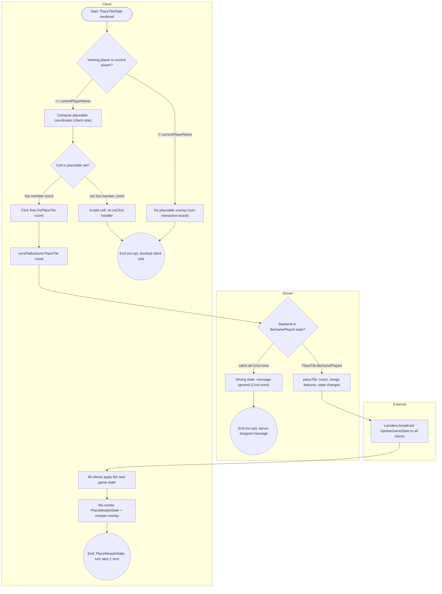
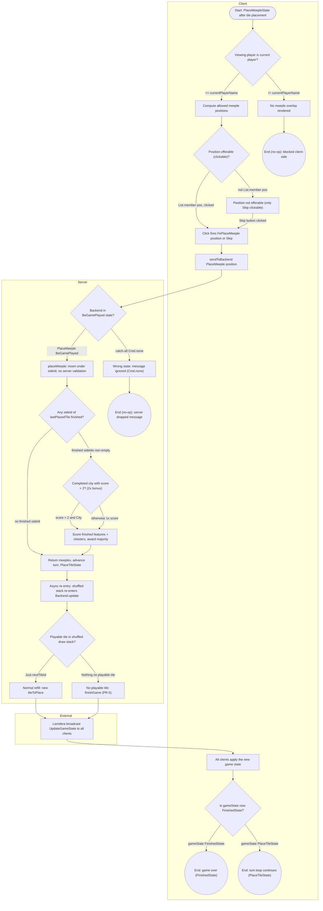
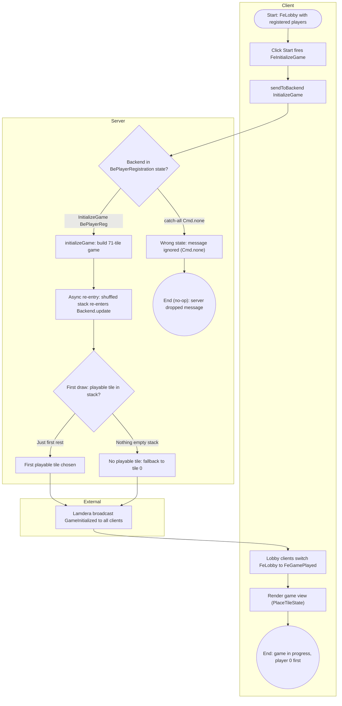
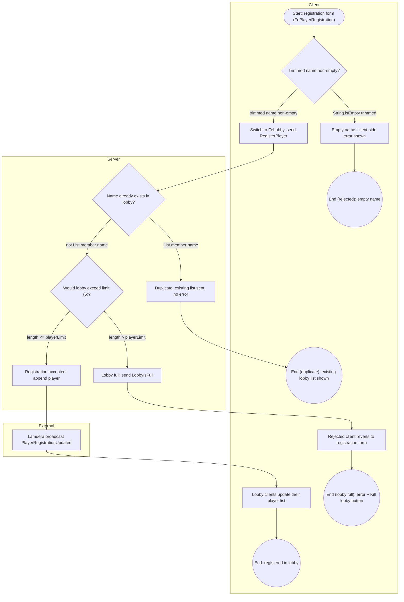
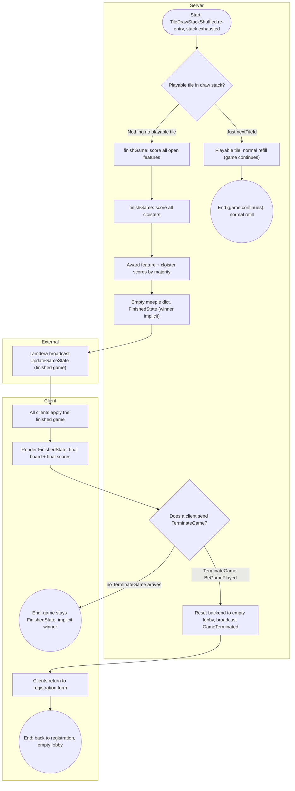

# Activity Diagrams — Carcassonne (Elm + Lamdera Full-Stack)

An activity diagram is a behavioral UML diagram that illustrates the flow of control or data from one activity to another. For this full-stack program it is invaluable for visualizing how the browser frontend, the Lamdera backend, and the Lamdera/Elm runtime (the external lane) interact to complete each end-to-end user process.

- **Repo:** `Carcassonne`, pinned at commit `ca2797745a863243fa6ce96af63435b0d67bf2ab` (read-only mirror at `.repo`).
- **Primary evidence:** `evidence/flows.json` — 5 processes, 90 nodes, 91 edges; every node and edge carries code citations. Supporting evidence: `evidence/usecases.json`, `evidence/domain.json`, `evidence/classes.json`, `evidence/db.json`. Planning context: `plan.json`.
- **Full system description:** [`./Specification.md`](./Specification.md).

## Overview: the 5 modelled processes

| ID | Process | Entry point(s) | Lanes |
| :-- | :-- | :-- | :-- |
| PR-1 | Placing a tile on the board (turn step 1) | `src/Views/GameView.elm:318-329`, `src/Backend.elm:160-168`, `src/Helpers/GameLogic.elm:323-370` | client, server, external |
| PR-2 | Placing a meeple with immediate feature scoring (turn step 2) | `src/Views/GameView.elm:524-539`, `src/Views/GameView.elm:382-396`, `src/Backend.elm:170-178`, `src/Helpers/GameLogic.elm:383-508`, `src/Backend.elm:61-84` | client, server, external |
| PR-3 | Game initialization with shuffled tile draw (lobby to game) | `src/Views/PlayerLobbyView.elm:20-23`, `src/Frontend.elm:67-68`, `src/Backend.elm:140-148`, `src/Backend.elm:44-59`, `src/Types/Game.elm:53-73` | client, server, external |
| PR-4 | Player registration and lobby join | `src/Views/PlayerRegistrationView.elm:11-46`, `src/Frontend.elm:50-62`, `src/Backend.elm:93-118` | client, server, external |
| PR-5 | End-of-game final scoring | `src/Backend.elm:61-84`, `src/Helpers/GameLogic.elm:511-556`, `src/Backend.elm:180-183` | client, server, external |

Every flow follows the same Lamdera message loop: view click -> `FrontendMsg` -> `Frontend.update` -> `sendToBackend` (`ToBackend`) -> `Backend.updateFromFrontend` -> `GameLogic` -> `broadcast` (`ToFrontend`) -> `Frontend.updateFromBackend` -> new view. The two asynchronous re-entries over the Elm Cmd channel are `Random.generate InitializeGameAndTileDrawStackShuffled` (`src/Backend.elm:147`) and `Random.generate TileDrawStackShuffled` (`src/Backend.elm:177`).

## 1. Core Elements of the Diagram

Every process diagram below uses the standard UML activity-diagram elements:

*   **Initial State (Start Node):** stadium shape `([...])` — the state the system is in when the process begins (e.g. "Start: `gameState == PlaceTileState`").
*   **Final State (End Node):** double circle `((...))` — one or more terminal states per process; no-op terminal states are modelled explicitly.
*   **Action States (Activities):** rectangles `[...]` — UI renders, message sends, backend handlers, scoring steps, broadcasts.
*   **Control Flow (Arrows):** `-->` edges; cross-lane arrows cross subgraph boundaries.
*   **Decision Nodes (Diamonds):** `{...}` — conditional branches. All **17** decisions across the 5 processes have >= 2 guarded outgoing edges — representative guards: the client-side render guard `if Set.member coord coordinatesToBePlacedOn` (`src/Views/GameView.elm:320`) and the server-side catch-all `_ -> ( model, Cmd.none )` (`src/Backend.elm:185-186`); guards appear on the arrows (short form, <= 30 chars) and in full form in the edge tables below.
*   **Forks and Joins:** none exist in this codebase. Elm `update` loops are strictly sequential — a single `case ( msg, model ) of` analysis per message (`src/Frontend.elm:44-46`, `src/Backend.elm:37-39`); the Lamdera broadcast is a single fan-out *action* on the external lane (not a concurrency fork), and the two `Random` shuffle re-entries (`src/Backend.elm:147`, `src/Backend.elm:177`) are modelled as plain action nodes whose async re-entry edge is annotated in the edge tables.

Node IDs inside the diagrams are the evidence IDs from `evidence/flows.json` (`PR-x-Ny`), so the node maps that follow each diagram are complete by construction.

## 2. Full-Stack Specifics: Swimlanes (Partitions)

Each diagram is divided into swimlanes as Mermaid `subgraph`s. **There is no database lane in this system**: all state lives in-memory in the Lamdera backend model (`BackendModel`, `src/Types.elm:11-17`); the compiler-generated Evergreen snapshots (`src/Evergreen/`) are platform-serialized state, not a database (see `evidence/db.json`). The Database partition is therefore noted in this legend instead of a fourth subgraph.

| Lane (subgraph) | System | Role in these flows |
| :-- | :-- | :-- |
| `Client` | Player's browser: `src/Views/*.elm` (render + Html event handlers) and `src/Frontend.elm` (`update` / `updateFromBackend` / `view`) | Renders the UI, applies client-side guards (turn ownership, placeable cells, name check), fires `FrontendMsg`, applies server broadcasts, re-renders |
| `Server` | Lamdera backend: `src/Backend.elm` (`updateFromFrontend` + `update`) plus `src/Helpers/GameLogic.elm`, `src/Helpers/FrontendHelpers.elm`, `src/Helpers/TileMapper.elm`, `src/Types/*` | Pattern-matches `(message, model)`, applies game rules (`placeTile`, `placeMeeple`, `initializeGame`, `finishGame`), issues `Random` cmds, handles the two shuffle re-entries |
| `External` | Lamdera platform + Elm runtime | `broadcast` / `sendToFrontend` fan-out (`src/Backend.elm:6`), `Random` cmd execution and Cmd-channel re-entry (`src/Backend.elm:37-38`) |
| `Database` | **absent** | No DBMS in this repo; state is in-memory in the backend model. No diagram contains a Database subgraph. |

## 3. Checklist for a Complete Diagram

- [x] **Clear Scope:** each of the 5 diagrams focuses on a single end-to-end process (registration, game init, tile step, meeple step, end-of-game) rather than the whole application. Low-priority flows (tile rotation, lobby kick/kill, mid-game rejoin) are excluded per `plan.json` scope and only cross-referenced.
- [x] **Defined Start and End:** every process has exactly one cited start node (`PR-x-N1`) and 2-4 terminal nodes; terminal IDs are listed in the node maps.
- [x] **Swimlanes utilized:** every node sits in `Client`, `Server`, or `External`; lane assignments come from the `lane` fields of `evidence/flows.json`.
- [x] **Guard Conditions:** all 17 decision diamonds have explicitly labeled outgoing paths (e.g. `|== currentPlayerName|`, `|catch-all Cmd.none|`); guards are reproduced verbatim in the edge tables.
- [x] **Error Handling:** failure paths are modelled, not only the happy path — client-side blocks (not your turn / invalid cell / empty name), silent server drops (`Cmd.none` catch-all, `src/Backend.elm:185-186`), duplicate-name rejection, lobby-full rejection, the first-draw fallback to tile 0, and the draw-stack-exhaustion game-over branch.
- [x] **State Changes:** significant model changes are represented as action nodes — `BePlayerRegistration` -> `BeGamePlayed` (`src/Backend.elm:140-148`), `PlaceTileState` -> `PlaceMeepleState` (`src/Helpers/GameLogic.elm:367`), turn advance (`src/Helpers/GameLogic.elm:502-508`), `FinishedState` (`src/Helpers/GameLogic.elm:552-555`), termination to an empty lobby (`src/Backend.elm:180-183`).

## 4. Tool for Creation

Diagrams are authored as **Mermaid.js** `flowchart` code blocks (one per process, five in total). Labels containing parentheses or other punctuation are double-quoted (`["..."]`, `{"..."}`); edge guards are kept to short condition text (<= 30 characters).

## 5. Process Diagrams

### PR-1 — Placing a tile on the board (turn step 1)

**Description.** The current player clicks a highlighted grid cell while in `PlaceTileState`. Validity (empty cell adjacent to the grid, matching `sideFeature` against the N/E/S/W neighbours) is enforced **only client-side** by `FrontendHelpers`; the server applies `placeTile` unconditionally (`src/Helpers/GameLogic.elm:311-322` — "Does not check whether the move is valid"). `placeTile` renumbers `sideIds`, inserts the tile, merges adjacent features across `tileGrid` and the meeple dict, and switches `gameState` to `PlaceMeepleState`; all clients converge via the Lamdera broadcast.

**Entry points:** `src/Views/GameView.elm:318-329` (cell click), `src/Backend.elm:160-168` (server handler), `src/Helpers/GameLogic.elm:323-370` (`placeTile`).
**Start:** `PR-1-N1`. **Ends:** `PR-1-N15`, `PR-1-N16`, `PR-1-N17`.

**Error paths** (visible in the diagram):

- Not the current player's turn: no placeable overlay rendered (`src/Views/GameView.elm:58`, `src/Views/GameView.elm:73-74`).
- Coordinate not in the placeable set: cell rendered without an `onClick` handler, no backend call (`src/Views/GameView.elm:331-332`, `src/Helpers/FrontendHelpers.elm:48-85`).
- Backend not in `BeGamePlayed` state: message dropped, `Cmd.none` (`src/Backend.elm:185-186`).

**Node map** (every node in the diagram above):

| Node | Element | Code Reference |
| :-- | :-- | :-- |
| `PR-1-N1` | start — `PlaceTileState` rendered in the current player's browser: board + placeable overlay + drawn tile in sidebar | `src/Views/GameView.elm:28-29`, `src/Types/GameState.elm:4-7`, `src/Views/GameView.elm:727-734` |
| `PR-1-N2` | decision — is the viewing player the current player? (`playerName == currentPlayerName`) | `src/Views/GameView.elm:58-59`, `src/Views/GameView.elm:24-26` |
| `PR-1-N3` | action — not the current player's turn: no placeable overlay rendered (`else []` branch); cells non-interactive, no message can be sent | `src/Views/GameView.elm:73-74` |
| `PR-1-N4` | action — compute placeable coordinates: `getCoordinatesToBePlacedOn` — empty cells adjacent to the grid that pass `tileCanBePlaced` (empty target cell + matching `sideFeature` per N/E/S/W neighbour) | `src/Views/GameView.elm:60-62`, `src/Helpers/FrontendHelpers.elm:89-110`, `src/Helpers/FrontendHelpers.elm:48-85` |
| `PR-1-N5` | decision — is the rendered cell in the placeable set? (`Set.member coord coordinatesToBePlacedOn`) | `src/Views/GameView.elm:318-332` |
| `PR-1-N6` | action — invalid placement: cell rendered as an empty tile **without** `onClick`; move blocked client-side, no message sent, game state unchanged | `src/Views/GameView.elm:331-332`, `src/Helpers/FrontendHelpers.elm:48-85` |
| `PR-1-N7` | action — valid placement: `onClick` fires `FrontendMsg FePlaceTile coord` | `src/Views/GameView.elm:318-329` |
| `PR-1-N8` | action — `Frontend.update`: `sendToBackend (PlaceTile coordinates)`; local model unchanged, client awaits the authoritative broadcast | `src/Frontend.elm:76-77`, `src/Types.elm:56` |
| `PR-1-N9` | decision (server) — does `(PlaceTile coordinates, model)` match `(PlaceTile _, BeGamePlayed { game })`? | `src/Backend.elm:160`, `src/Backend.elm:185-186` |
| `PR-1-N10` | action — wrong backend state: message ignored, model unchanged, `Cmd.none` (silent drop, no reply) | `src/Backend.elm:185-186` |
| `PR-1-N11` | action — `placeTile`: renumber `sideIds` (`updateSideIds nextSideId+1`), insert tile at (x,y), merge adjacent features via `replaceTileSideId` x4 and `replaceMeepleSideId` x4, `lastPlacedTile = (x,y)`, `gameState -> PlaceMeepleState`; server does NOT validate the move or the turn owner | `src/Helpers/GameLogic.elm:323-370`, `src/Helpers/GameLogic.elm:102-131`, `src/Helpers/GameLogic.elm:136-162`, `src/Backend.elm:160-168` |
| `PR-1-N12` | action — Lamdera broadcast `(UpdateGameState { game = updatedGame })` to all connected clients (single fan-out cmd) | `src/Backend.elm:167`, `src/Backend.elm:6` |
| `PR-1-N13` | action — all clients: `updateFromBackend` replaces `FeGamePlayed.game` (the single convergence point for every in-game broadcast) | `src/Frontend.elm:143-150` |
| `PR-1-N14` | action — re-render in `PlaceMeepleState`: new tile on board, meeple-placement overlay (`getMeeplePositionsToBePlacedOn`), sidebar "Now playing" + current scores | `src/Frontend.elm:168-169`, `src/Views/GameView.elm:92-157`, `src/Views/GameView.elm:122-129`, `src/Helpers/FrontendHelpers.elm:27-43`, `src/Views/GameView.elm:686-693` |
| `PR-1-N15` | end — `gameState == PlaceMeepleState`; the same player now places a meeple or skips (process PR-2) | `src/Helpers/GameLogic.elm:367`, `src/Types/GameState.elm:6` |
| `PR-1-N16` | end (no-op) — placement blocked client-side (not your turn / invalid coordinate); no `ToBackend` message was ever sent; state identical to start | `src/Views/GameView.elm:73-74`, `src/Views/GameView.elm:331-332` |
| `PR-1-N17` | end (no-op) — backend model unchanged (`Cmd.none`); client never receives a reply; UI stays on the pre-click frame | `src/Backend.elm:185-186` |

**Edge guards** (decision exits; short guard = the label on the arrow above, full guard = the evidence `guard` text):

| Edge | From -> To | Guard (evidence) | Code Reference |
| :-- | :-- | :-- | :-- |
| `PR-1-E2` | `PR-1-N2` -> `PR-1-N3` | `playerName /= currentPlayerName` (else branch of `if playerName == currentPlayerName`) | `src/Views/GameView.elm:58`, `src/Views/GameView.elm:73-74` |
| `PR-1-E3` | `PR-1-N2` -> `PR-1-N4` | `playerName == currentPlayerName` | `src/Views/GameView.elm:58-62` |
| `PR-1-E6` | `PR-1-N5` -> `PR-1-N6` | `not (Set.member coord coordinatesToBePlacedOn)` | `src/Views/GameView.elm:320`, `src/Views/GameView.elm:331-332` |
| `PR-1-E7` | `PR-1-N5` -> `PR-1-N7` | `Set.member coord coordinatesToBePlacedOn` | `src/Views/GameView.elm:320-329` |
| `PR-1-E11` | `PR-1-N9` -> `PR-1-N10` | no match: catch-all `_ -> ( model, Cmd.none )` (model is not `BeGamePlayed`) | `src/Backend.elm:185-186` |
| `PR-1-E12` | `PR-1-N9` -> `PR-1-N11` | `( PlaceTile coordinates, BeGamePlayed { game } )` matches | `src/Backend.elm:160-164` |

### PR-2 — Placing a meeple with immediate feature scoring (turn step 2)

**Description.** After `placeTile` (PR-1), the same player may drop a meeple on a side/cloister of the last-placed tile or skip. The client offers only unoccupied sides (+ cloister center); with 0 meeples left only `Skip` is offered. `placeMeeple` inserts the meeple, scores every newly **FINISHED** feature by tile count (2x bonus for completed cities with > 2 tiles), adds cloister scores, awards points to majority owners, removes finished features from the meeple dict (returning those meeples), decrements the placer's meeple count (unless `Skip`), advances `currentPlayer` and sets `PlaceTileState`. The backend then issues `Random.generate TileDrawStackShuffled` (asynchronous re-entry): the shuffled draw stack either yields a playable tile (normal refill) or — if none exists — triggers `finishGame` (PR-5). The server never validates the position or the turn owner.

**Entry points:** `src/Views/GameView.elm:524-539` (position circle), `src/Views/GameView.elm:382-396` (Skip button), `src/Backend.elm:170-178` (server handler), `src/Helpers/GameLogic.elm:383-508` (`placeMeeple`), `src/Backend.elm:61-84` (shuffle re-entry).
**Start:** `PR-2-N1`. **Ends:** `PR-2-N23`, `PR-2-N24`, `PR-2-N25`, `PR-2-N26`.

**Error paths** (visible in the diagram):

- Not the current player's turn: no meeple overlay rendered, no message (`src/Views/GameView.elm:140-141`).
- Position not offerable (side already has a meeple / `sideId -1` / 0 meeples left): only other rendered positions or the Skip button are clickable (`src/Helpers/FrontendHelpers.elm:32-43`, `src/Views/GameView.elm:538-539`).
- Backend not in `BeGamePlayed` state: message dropped, `Cmd.none` (`src/Backend.elm:185-186`).
- Draw-stack refill yields no playable tile: the game ends via `finishGame` instead of continuing (`src/Backend.elm:76-84`).

**Node map** (every node in the diagram above):

| Node | Element | Code Reference |
| :-- | :-- | :-- |
| `PR-2-N1` | start — `gameState == PlaceMeepleState` (set by `placeTile`); `lastPlacedTile` set; `currentPlayer` owns the turn | `src/Types/GameState.elm:6`, `src/Helpers/GameLogic.elm:367-369`, `src/Views/GameView.elm:92-93` |
| `PR-2-N2` | decision — is the viewing player the current player? (`playerName == currentPlayerName`); meeple overlay rendered only for the acting player | `src/Views/GameView.elm:121-122`, `src/Views/GameView.elm:24-26` |
| `PR-2-N3` | action — not the current player's turn: no meeple overlay rendered; no placement possible from this client | `src/Views/GameView.elm:140-141` |
| `PR-2-N4` | action — `getMeeplePositionsToBePlacedOn`: sides without an existing meeple + cloister center; only `[Skip]` if the player has 0 meeples left | `src/Views/GameView.elm:122-129`, `src/Helpers/FrontendHelpers.elm:27-43` |
| `PR-2-N5` | decision — is this position rendered as a clickable circle? (`List.member position positionsToBePlacedOn`) | `src/Views/GameView.elm:524-539` |
| `PR-2-N6` | action — position not offerable (side already has a meeple, `sideId == -1`, or player out of meeples): no click target; remaining options are other circles or the "Skip Meeple placement" button | `src/Views/GameView.elm:538-539`, `src/Helpers/FrontendHelpers.elm:32-43`, `src/Views/GameView.elm:382-396` |
| `PR-2-N7` | action — click: `onClick` fires `FePlaceMeeple position` (side/cloister circle) or `FePlaceMeeple Skip` (Skip button) | `src/Views/GameView.elm:533`, `src/Views/GameView.elm:393` |
| `PR-2-N8` | action — `Frontend.update`: `sendToBackend (PlaceMeeple position)`; local model unchanged, client awaits the broadcast | `src/Frontend.elm:79-80`, `src/Types.elm:57` |
| `PR-2-N9` | decision (server) — does `(PlaceMeeple position, model)` match `(PlaceMeeple _, BeGamePlayed { game })`? | `src/Backend.elm:170`, `src/Backend.elm:185-186` |
| `PR-2-N10` | action — wrong backend state: message ignored, model unchanged, `Cmd.none` (silent drop, no reply) | `src/Backend.elm:185-186` |
| `PR-2-N11` | action — `placeMeeple`: build meeple (owner = `currentPlayer`, coordinates = `lastPlacedTile`); insert under the position's `sideId` (side or cloister, default -1); `Skip` leaves the meeple dict unchanged; server does not validate position or turn owner | `src/Helpers/GameLogic.elm:384-416` |
| `PR-2-N12` | decision — do any sideIds of `lastPlacedTile` pass `isFeatureFinished`? (empty filter result = nothing scored this turn) | `src/Helpers/GameLogic.elm:418-422`, `src/Helpers/GameLogic.elm:193-203`, `src/Types/Tile.elm:42-45` |
| `PR-2-N13` | decision (per finished feature) — completed city with score > 2? (cities larger than 2 tiles give 2x points when completed before the game ends) | `src/Helpers/GameLogic.elm:431-435`, `src/Helpers/GameLogic.elm:300-308` |
| `PR-2-N14` | action — score finished features: `countFeature` (tiles sharing the `sideId`) with 2x for qualifying cities; append cloister scores (all 8 neighbours, score 9); award each score to the majority owners via `getFeatureOwners`, accumulated into `playerScores` | `src/Helpers/GameLogic.elm:418-450`, `src/Helpers/GameLogic.elm:170-188`, `src/Helpers/GameLogic.elm:211-251`, `src/Helpers/GameLogic.elm:256-290` |
| `PR-2-N15` | action — remove finished features from the meeple dict (meeples returned to owners, +1 to `playerMeeples`); placer's meeple count -1 if `position /= Skip`; `currentPlayer <- getNextPlayer` (wraps to 0); `gameState <- PlaceTileState` | `src/Helpers/GameLogic.elm:440-508`, `src/Types/Game.elm:78-84`, `src/Types/Game.elm:61` |
| `PR-2-N16` | action — async re-entry: `Random.generate TileDrawStackShuffled (Random.List.shuffle updatedGame.tileDrawStack)`; the Elm runtime executes the shuffle cmd, then the shuffled stack re-enters `Backend.update` as `BackendMsg TileDrawStackShuffled` (the turn is already advanced before the shuffle result arrives) | `src/Backend.elm:177`, `src/Backend.elm:37-38`, `src/Types.elm:64` |
| `PR-2-N17` | decision (refill re-entry) — does the shuffled draw stack yield a playable tile? (`getPlayableTileFromDrawstack` -> `(Just nextTileId, drawStack)` or `(Nothing, _)`); unplaceable tiles are skipped and dropped | `src/Backend.elm:61-63`, `src/Helpers/FrontendHelpers.elm:132-143`, `src/Helpers/FrontendHelpers.elm:120-127` |
| `PR-2-N18` | action — normal refill: `tileToPlace <- getTile nextTileId`; `tileDrawStack <-` remaining (playable) tiles | `src/Backend.elm:63-70`, `src/Helpers/TileMapper.elm:9-10` |
| `PR-2-N19` | action — game-over branch: no playable tile in the draw stack — `finishGame` scores all remaining features and cloisters, empties the meeple dict, `gameState <- FinishedState` (detailed in PR-5); same `UpdateGameState` broadcast channel | `src/Backend.elm:76-84`, `src/Helpers/GameLogic.elm:511-556` |
| `PR-2-N20` | action — Lamdera broadcast `(UpdateGameState { game = updatedGame })` to all connected clients; emitted by both the refill and the `finishGame` branch | `src/Backend.elm:73`, `src/Backend.elm:83`, `src/Backend.elm:6` |
| `PR-2-N21` | action — all clients: `updateFromBackend` replaces `FeGamePlayed.game` (new scores, new `currentPlayer`, new `tileToPlace` or finished game) | `src/Frontend.elm:143-150` |
| `PR-2-N22` | decision (client re-render) — is the received game in `FinishedState` or `PlaceTileState`? (`case game.gameState of ...`); sidebar shows final scores or the next player's "(Now playing)" | `src/Views/GameView.elm:28-29`, `src/Types/GameState.elm:4-7` |
| `PR-2-N23` | end — `gameState == FinishedState`: final board and scores rendered, no further moves possible (PR-5) | `src/Views/GameView.elm:159-194` |
| `PR-2-N24` | end — `gameState == PlaceTileState`: turn loop continues; the (next) player places the newly drawn tile (PR-1) | `src/Helpers/GameLogic.elm:502-508`, `src/Views/GameView.elm:28-90` |
| `PR-2-N25` | end (no-op) — meeple placement blocked client-side (not your turn / position not offerable and Skip not clicked); game state unchanged | `src/Views/GameView.elm:140-141`, `src/Views/GameView.elm:538-539` |
| `PR-2-N26` | end (no-op) — backend model unchanged (`Cmd.none`); client never receives a reply | `src/Backend.elm:185-186` |

**Edge guards** (decision exits plus the Skip-button exit; short guard = the label on the arrow above):

| Edge | From -> To | Guard (evidence) | Code Reference |
| :-- | :-- | :-- | :-- |
| `PR-2-E2` | `PR-2-N2` -> `PR-2-N3` | `playerName /= currentPlayerName` (else branch of `if playerName == currentPlayerName`) | `src/Views/GameView.elm:121`, `src/Views/GameView.elm:140-141` |
| `PR-2-E3` | `PR-2-N2` -> `PR-2-N4` | `playerName == currentPlayerName` | `src/Views/GameView.elm:121-129` |
| `PR-2-E6` | `PR-2-N5` -> `PR-2-N6` | `not (List.member position positionsToBePlacedOn)` | `src/Views/GameView.elm:526`, `src/Views/GameView.elm:538-539` |
| `PR-2-E7` | `PR-2-N5` -> `PR-2-N7` | `List.member position positionsToBePlacedOn` and the circle is clicked | `src/Views/GameView.elm:526-534` |
| `PR-2-E8` | `PR-2-N6` -> `PR-2-N7` | Skip button clicked (position = `Skip`; the only option when `playerMeeples[player] == 0`) | `src/Views/GameView.elm:382-396`, `src/Helpers/FrontendHelpers.elm:42-43` |
| `PR-2-E11` | `PR-2-N9` -> `PR-2-N10` | no match: catch-all `_ -> ( model, Cmd.none )` (model is not `BeGamePlayed`) | `src/Backend.elm:185-186` |
| `PR-2-E12` | `PR-2-N9` -> `PR-2-N11` | `( PlaceMeeple position, BeGamePlayed { game } )` matches | `src/Backend.elm:170-174` |
| `PR-2-E15` | `PR-2-N12` -> `PR-2-N13` | at least one sideId passes `isFeatureFinished` (filter result non-empty) | `src/Helpers/GameLogic.elm:421-422` |
| `PR-2-E16` | `PR-2-N12` -> `PR-2-N15` | no sideId passes `isFeatureFinished` (filter result empty — nothing scored, nothing returned) | `src/Helpers/GameLogic.elm:421-422`, `src/Helpers/GameLogic.elm:193-203` |
| `PR-2-E17` | `PR-2-N13` -> `PR-2-N14` | `score > 2 && getSideIdFeature sideId game.tileGrid == City` -> `( sideId, 2 * score )` | `src/Helpers/GameLogic.elm:431-432` |
| `PR-2-E18` | `PR-2-N13` -> `PR-2-N14` | otherwise -> `( sideId, score )` | `src/Helpers/GameLogic.elm:434-435` |
| `PR-2-E22` | `PR-2-N17` -> `PR-2-N18` | `( Just nextTileId, drawStack )` | `src/Backend.elm:63-64` |
| `PR-2-E23` | `PR-2-N17` -> `PR-2-N19` | `( Nothing, _ )` | `src/Backend.elm:76-77` |
| `PR-2-E28` | `PR-2-N22` -> `PR-2-N23` | `game.gameState == FinishedState` | `src/Views/GameView.elm:159` |
| `PR-2-E29` | `PR-2-N22` -> `PR-2-N24` | `game.gameState == PlaceTileState` | `src/Views/GameView.elm:29` |

Note: the unguarded edge `PR-2-E21` (`PR-2-N16 -> PR-2-N17`) is the Elm Cmd-channel re-entry: the runtime delivers the shuffled stack as `BackendMsg TileDrawStackShuffled` into `Backend.update` (`src/Backend.elm:37-38`, `src/Backend.elm:61-62`).

### PR-3 — Game initialization with shuffled tile draw (lobby to game)

**Description.** Any lobby player clicks "Start"; the backend builds the game with `initializeGame` (71-tile draw stack from `initializeDrawStack`, starting grid with tile 0 at (0,0), 7 meeples per player, `currentPlayer 0`, `PlaceTileState`), switches `BackendModel` to `BeGamePlayed` and issues `Random.generate InitializeGameAndTileDrawStackShuffled` over the shuffled draw stack (async re-entry). On re-entry, `getPlayableTileFromDrawstack` skips unplaceable tiles to pick the first playable tile (or falls back to tile 0 — "First move should be always possible"), then broadcasts `GameInitialized` so every lobby client switches to the game view.

**Entry points:** `src/Views/PlayerLobbyView.elm:20-23` ("Start" click), `src/Frontend.elm:67-68` (`Frontend.update`), `src/Backend.elm:140-148` (server handler), `src/Backend.elm:44-59` (shuffle re-entry), `src/Types/Game.elm:53-73` (`initializeGame`).
**Start:** `PR-3-N1`. **Ends:** `PR-3-N14`, `PR-3-N15`.

**Error paths** (visible in the diagram):

- Backend not in `BePlayerRegistration` state: `InitializeGame` dropped, `Cmd.none` (`src/Backend.elm:185-186`).
- First draw: no playable tile in the shuffled stack (should not happen): `tileToPlace` falls back to `getTile (Maybe.withDefault 0)` — tile 0 (`src/Backend.elm:52`, `src/Backend.elm:56-57`).

**Node map** (every node in the diagram above):

| Node | Element | Code Reference |
| :-- | :-- | :-- |
| `PR-3-N1` | start — clients in `FeLobby` (1-5 registered players; `playerLimit = 5`); backend in `BePlayerRegistration { players }`; lobby view shows the player list and a "Start" button | `src/Types.elm:25-28`, `src/Frontend.elm:165-166`, `src/Views/PlayerLobbyView.elm:11-24`, `src/Types/Game.elm:43-45` |
| `PR-3-N2` | action — a lobby player clicks "Start": `onClick` fires `FrontendMsg FeInitializeGame` | `src/Views/PlayerLobbyView.elm:20-23` |
| `PR-3-N3` | action — `Frontend.update`: `sendToBackend InitializeGame`; local model stays `FeLobby` until the broadcast arrives | `src/Frontend.elm:67-68`, `src/Types.elm:54` |
| `PR-3-N4` | decision (server) — does `(InitializeGame, model)` match `(InitializeGame, BePlayerRegistration { players })`? a second "Start" click during a running game falls through to the catch-all | `src/Backend.elm:140`, `src/Backend.elm:185-186` |
| `PR-3-N5` | action — wrong backend state: `InitializeGame` ignored, model unchanged, `Cmd.none` (silent drop) | `src/Backend.elm:185-186` |
| `PR-3-N6` | action — `initializeGame players`: 71-tile draw stack (`initializeDrawStack`), starting grid with tile 0 at (0,0), `playerScores 0` and `playerMeeples 7` per player, `currentPlayer 0`, `gameState PlaceTileState`; `BackendModel <- BeGamePlayed { game }`; `tileToPlace` is a placeholder replaced by the random first draw; doc: "Players list must not be empty" (no explicit guard for empty lists) | `src/Backend.elm:140-146`, `src/Types/Game.elm:53-73`, `src/Types/Game.elm:120-147`, `src/Types/Game.elm:102-104` |
| `PR-3-N7` | action — async re-entry: `Random.generate InitializeGameAndTileDrawStackShuffled (Random.List.shuffle game.tileDrawStack)`; the Elm runtime executes the shuffle cmd, then the shuffled stack re-enters `Backend.update` as `BackendMsg InitializeGameAndTileDrawStackShuffled` | `src/Backend.elm:147`, `src/Backend.elm:37-38`, `src/Types.elm:63` |
| `PR-3-N8` | decision (first-draw re-entry) — does the shuffled draw stack contain a tile playable anywhere? (`getPlayableTileFromDrawstack` -> `(Just first, rest)` or `(Nothing, _)`; playability = `tileCanBePlacedAnywhere` across 4 rotations); unplaceable top tiles are skipped and dropped | `src/Backend.elm:44-47`, `src/Helpers/FrontendHelpers.elm:132-143`, `src/Helpers/FrontendHelpers.elm:120-127` |
| `PR-3-N9` | action — playable first tile: `tileToPlace <- getTile first`; `tileDrawStack <-` remaining tiles (`getTile` resolves the id from the hardcoded tile table) | `src/Helpers/FrontendHelpers.elm:136-137`, `src/Backend.elm:49-54`, `src/Helpers/TileMapper.elm:9-10` |
| `PR-3-N10` | action — no playable tile (should not happen for the first draw): `tileToPlace <- getTile (Maybe.withDefault 0 maybeNextTileId)` — fallback to tile 0; code comment: "First move should be always possible" | `src/Backend.elm:52`, `src/Backend.elm:56-57` |
| `PR-3-N11` | action — Lamdera broadcast `(GameInitialized { game = updatedGame })` to all connected clients | `src/Backend.elm:58-59`, `src/Backend.elm:6` |
| `PR-3-N12` | action — all lobby clients: `updateFromBackend (GameInitialized { game }, FeLobby { playerName }) -> FeGamePlayed { playerName, debugMode = False, game }`; clients in another state hit the catch-all and stay unchanged | `src/Frontend.elm:134-141`, `src/Frontend.elm:155-156` |
| `PR-3-N13` | action — render game view: `PlaceTileState` board with placeable overlay for the first player, drawn first tile in the sidebar, "Now playing" on player 0 in the scoreboard | `src/Frontend.elm:168-169`, `src/Views/GameView.elm:28-90`, `src/Views/GameView.elm:686-693` |
| `PR-3-N14` | end — game in progress: player index 0 places the first tile (PR-1); `BeGamePlayed` / `FeGamePlayed` with `PlaceTileState` | `src/Types/Game.elm:63-67` |
| `PR-3-N15` | end (no-op) — backend model unchanged (`Cmd.none`); clients stay in the lobby | `src/Backend.elm:185-186` |

**Edge guards** (decision exits; short guard = the label on the arrow above):

| Edge | From -> To | Guard (evidence) | Code Reference |
| :-- | :-- | :-- | :-- |
| `PR-3-E4` | `PR-3-N4` -> `PR-3-N5` | no match: catch-all `_ -> ( model, Cmd.none )` (model is not `BePlayerRegistration`) | `src/Backend.elm:185-186` |
| `PR-3-E5` | `PR-3-N4` -> `PR-3-N6` | `( InitializeGame, BePlayerRegistration { players } )` matches | `src/Backend.elm:140-145` |
| `PR-3-E9` | `PR-3-N8` -> `PR-3-N9` | `( Just first, rest )` from `getPlayableTileFromDrawstack` | `src/Helpers/FrontendHelpers.elm:136-137` |
| `PR-3-E10` | `PR-3-N8` -> `PR-3-N10` | `( Nothing, _ )` from `getPlayableTileFromDrawstack` (empty stack) | `src/Helpers/FrontendHelpers.elm:142-143`, `src/Backend.elm:52` |

Note: the unguarded edge `PR-3-E8` (`PR-3-N7 -> PR-3-N8`) is the Elm Cmd-channel re-entry: the runtime delivers the shuffled stack as `BackendMsg InitializeGameAndTileDrawStackShuffled` into `Backend.update` (`src/Backend.elm:37-38`, `src/Backend.elm:44-45`).

### PR-4 — Player registration and lobby join

**Description.** A fresh client (init -> `FePlayerRegistration` on page load; the Lamdera `ClientConnected` hook sends `PlayerRegistrationUpdated` to every connecting client (`src/Backend.elm:40-42`) — the client-side handler applies it only while in `FeLobby` (`src/Frontend.elm:95-96`), all other states hit the catch-all (`src/Frontend.elm:155-156`)) submits a name. Client-side: the trimmed name must be non-empty. Server-side: duplicate names are rejected (the requesting client is sent the EXISTING player list via `sendToFrontend` with no explicit error — it simply sees the unchanged lobby), and a full lobby (`playerLimit = 5`) is rejected with `LobbyIsFull`, which kicks the requesting client back to the registration form with a "Lobby is full." error and a "Kill lobby" button. On success the player is appended and the updated list is broadcast to all clients, which re-render the lobby.

**Entry points:** `src/Views/PlayerRegistrationView.elm:11-46` (form + "Join" click), `src/Frontend.elm:50-62` (`Register` handling), `src/Backend.elm:93-118` (server handler).
**Start:** `PR-4-N1`. **Ends:** `PR-4-N13`, `PR-4-N14`, `PR-4-N15`, `PR-4-N16`.

**Error paths** (visible in the diagram):

- Empty/whitespace name: client-side error "Name cannot be empty.", no backend call (`src/Frontend.elm:56-57`).
- Duplicate name: server-side `List.member` check; the client is only sent the existing player list (`sendToFrontend`, no explicit duplicate error) (`src/Backend.elm:95-102`).
- Lobby full (more than `playerLimit = 5`): server-side length check; `LobbyIsFull` sent back, client reverts to registration with "Lobby is full." + "Kill lobby" button (`src/Backend.elm:110-118`, `src/Frontend.elm:112-115`, `src/Views/PlayerRegistrationView.elm:29-37`).

**Node map** (every node in the diagram above):

| Node | Element | Code Reference |
| :-- | :-- | :-- |
| `PR-4-N1` | start — fresh client at `FePlayerRegistration { nameInput, error = Nothing }` (`init` on page load); name input + "Join" button rendered; `NameInputChanged` keystrokes clear any previous error; a client connecting mid-lobby receives `PlayerRegistrationUpdated` from the `ClientConnected` hook and only applies the update if already in `FeLobby` | `src/Frontend.elm:34-41`, `src/Frontend.elm:47-48`, `src/Frontend.elm:162-163`, `src/Views/PlayerRegistrationView.elm:11-28`, `src/Backend.elm:40-42` |
| `PR-4-N2` | decision (client) — is the trimmed name non-empty? (`if String.isEmpty trimmedPlayerName` where `trimmedPlayerName = String.trim nameInput`); form `onSubmit` and "Join" button both produce the `Register` msg | `src/Frontend.elm:50-57`, `src/Views/PlayerRegistrationView.elm:15-27` |
| `PR-4-N3` | action — empty name: `error <- Just 'Name cannot be empty.'`; stay in the registration form; no backend call; error text rendered in the error box | `src/Frontend.elm:56-57`, `src/Views/PlayerRegistrationView.elm:40-45` |
| `PR-4-N4` | action — non-empty name: local model <- `FeLobby { playerName = trimmedName, players = [] }`; `sendToBackend (RegisterPlayer trimmedName)` — the client optimistically leaves the form before the server answers | `src/Frontend.elm:59-62`, `src/Types.elm:51` |
| `PR-4-N5` | decision (server) — does the name already exist in the lobby? (`List.member playerName players`) | `src/Backend.elm:93-99` |
| `PR-4-N6` | action — duplicate name: model unchanged; `sendToFrontend` (ONLY the requesting client) `PlayerRegistrationUpdated { players }` — the client, already in `FeLobby`, is shown the existing player list with no explicit "duplicate" error | `src/Backend.elm:99-102`, `src/Frontend.elm:95-96` |
| `PR-4-N7` | decision (server) — would the lobby exceed the limit? (`List.length newPlayers <= playerLimit` where `newPlayers = playerName :: players` and `playerLimit = 5`) | `src/Backend.elm:105-110`, `src/Types/Game.elm:43-45` |
| `PR-4-N8` | action — registration accepted: `players <- playerName :: players`; model stays `BePlayerRegistration` | `src/Backend.elm:106-111` |
| `PR-4-N9` | action — lobby full: model unchanged (players stay at the limit); `sendToFrontend` (ONLY the requesting client) `LobbyIsFull` | `src/Backend.elm:115-118` |
| `PR-4-N10` | action — Lamdera broadcast `(PlayerRegistrationUpdated { players = newPlayers })` to all connected clients | `src/Backend.elm:112`, `src/Backend.elm:6` |
| `PR-4-N11` | action — all clients in `FeLobby`: `updateFromBackend` replaces `FeLobby.players`; lobby view re-renders the (updated) player list with a red "kick" link per player and the "Start" button | `src/Frontend.elm:95-96`, `src/Frontend.elm:165-166`, `src/Views/PlayerLobbyView.elm:11-39` |
| `PR-4-N12` | action — requesting client (in `FeLobby` when `LobbyIsFull` arrives): model <- `FePlayerRegistration { nameInput = playerName, error = Just 'Lobby is full.' }`; the registration view additionally renders a "Kill lobby" button for this error (clicking it sends `KillLobby`, `src/Frontend.elm:85-86`, which empties the lobby server-side, `src/Backend.elm:135-138`) | `src/Frontend.elm:112-115`, `src/Views/PlayerRegistrationView.elm:29-37`, `src/Frontend.elm:85-86`, `src/Backend.elm:135-138` |
| `PR-4-N13` | end (rejected client-side) — "Name cannot be empty." shown; registration form stays (`FePlayerRegistration` with error) | `src/Frontend.elm:56-57` |
| `PR-4-N14` | end (duplicate name) — client stays in the lobby view showing the existing player list (the name was not added); no explicit duplicate error | `src/Backend.elm:99-102`, `src/Frontend.elm:95-96` |
| `PR-4-N15` | end — player is registered: lobby view shows the updated list; "Start" begins the game (PR-3) | `src/Views/PlayerLobbyView.elm:20-23` |
| `PR-4-N16` | end (lobby full) — "Lobby is full." error + "Kill lobby" button shown in the registration form | `src/Frontend.elm:107-115`, `src/Views/PlayerRegistrationView.elm:29-37` |

**Edge guards** (decision exits; short guard = the label on the arrow above):

| Edge | From -> To | Guard (evidence) | Code Reference |
| :-- | :-- | :-- | :-- |
| `PR-4-E2` | `PR-4-N2` -> `PR-4-N3` | `String.isEmpty (String.trim nameInput)` | `src/Frontend.elm:52-57` |
| `PR-4-E3` | `PR-4-N2` -> `PR-4-N4` | trimmed name non-empty | `src/Frontend.elm:59-62` |
| `PR-4-E6` | `PR-4-N5` -> `PR-4-N6` | `List.member playerName players` (nameExists == True) | `src/Backend.elm:95-99` |
| `PR-4-E7` | `PR-4-N5` -> `PR-4-N7` | `not (List.member playerName players)` | `src/Backend.elm:99-104` |
| `PR-4-E9` | `PR-4-N7` -> `PR-4-N8` | `List.length newPlayers <= playerLimit (5)` | `src/Backend.elm:110-111` |
| `PR-4-E10` | `PR-4-N7` -> `PR-4-N9` | `List.length newPlayers > playerLimit (5)` | `src/Backend.elm:110`, `src/Backend.elm:116-118` |

### PR-5 — End-of-game final scoring

**Description.** Triggered inside the `TileDrawStackShuffled` re-entry (issued after every turn's meeple placement, see PR-2): when `getPlayableTileFromDrawstack` yields `Nothing` — the shuffled draw stack holds no tile that can be placed in any of 4 rotations — the backend runs `finishGame` instead of refilling. `finishGame` scores ALL still-open features (every sideId present in the meeple dict, via `countFeature`) and ALL cloisters (`countCloister` per cloister tile), awards them by majority (`getFeatureOwners`), empties the meeple dict and sets `FinishedState`; the finished game is broadcast like any `UpdateGameState`. **The winner is NOT explicitly computed anywhere** — final scores are simply displayed in the sidebar, so the winner is implicit (highest score). Afterward a client may click "Terminate Game" to reset the backend to an empty lobby and return every client to the registration form.

**Entry points:** `src/Backend.elm:61-84` (re-entry + `Nothing` branch), `src/Helpers/GameLogic.elm:511-556` (`finishGame`), `src/Backend.elm:180-183` (`TerminateGame` handler).
**Start:** `PR-5-N1`. **Ends:** `PR-5-N14`, `PR-5-N15`, `PR-5-N16`.

**Error paths / alternate branches** (visible in the diagram):

- Alternate branch: the shuffled stack DOES contain a playable tile — normal refill, the game continues instead of ending (`src/Backend.elm:63-74`).
- Post-game: no winner is computed or announced; if no client terminates the game the `FinishedState` scoreboard simply remains (winner determination is display-only, `src/Views/GameView.elm:694`).

**Node map** (every node in the diagram above):

| Node | Element | Code Reference |
| :-- | :-- | :-- |
| `PR-5-N1` | start — `BeGamePlayed`; the `BackendMsg TileDrawStackShuffled` (issued after a turn's meeple placement) re-enters `Backend.update` with a shuffled draw stack; `currentPlayer` just finished placing a meeple or skipping; the async shuffle cmd has completed | `src/Backend.elm:61`, `src/Backend.elm:177`, `src/Types.elm:64` |
| `PR-5-N2` | decision — does the shuffled draw stack yield a playable tile? (`getPlayableTileFromDrawstack game.tileGrid shuffledTileDrawStack` -> `(Just nextTileId, drawStack)` or `(Nothing, _)`); the `(Nothing, _)` arm is the game-over trigger | `src/Backend.elm:62-63`, `src/Helpers/FrontendHelpers.elm:132-143` |
| `PR-5-N3` | action — alternate branch: a playable tile exists — normal refill (`tileToPlace <- getTile nextTileId`; `tileDrawStack <-` rest; broadcast `UpdateGameState`) and the game continues (PR-2 happy path) | `src/Backend.elm:63-74` |
| `PR-5-N4` | action — `finishGame` step 1: score every still-open feature — for each sideId present in the meeple dict, `(sideId, countFeature tileGrid sideId)`; unlike in-turn scoring, ALL open features are scored here (the board is done) | `src/Helpers/GameLogic.elm:514-518`, `src/Helpers/GameLogic.elm:170-188` |
| `PR-5-N5` | action — `finishGame` step 2: score every cloister — for each placed tile with a cloister sideId, `(sideId, countCloister)` = number of the 8 surrounding tiles + 1 (max 9) | `src/Helpers/GameLogic.elm:520-527`, `src/Helpers/GameLogic.elm:211-224` |
| `PR-5-N6` | action — `finishGame` step 3: award feature + cloister scores to the majority owners (`getFeatureOwners` per sideId) and accumulate into `playerScores`; ties are shared — every player with the maximum meeple count receives the full score | `src/Helpers/GameLogic.elm:529-550`, `src/Helpers/GameLogic.elm:256-290` |
| `PR-5-N7` | action — `finishGame` step 4: `meeples <- Dict.empty`; `gameState <- FinishedState`. **Unverified:** no winner is computed or stored — the finished game carries only `playerScores`; the winner is implicit (highest score) and only shown via the sidebar | `src/Helpers/GameLogic.elm:552-555`, `src/Types/GameState.elm:7` |
| `PR-5-N8` | action — Lamdera broadcast `(UpdateGameState { game = finishedGame })` to all connected clients — same channel as in-turn updates; clients cannot distinguish "finished" except via `game.gameState` | `src/Backend.elm:82-84`, `src/Backend.elm:6` |
| `PR-5-N9` | action — all clients: `updateFromBackend` replaces `FeGamePlayed.game` with the finished game (the `(UpdateGameState, FeGamePlayed)` convergence case) | `src/Frontend.elm:143-150` |
| `PR-5-N10` | action — render `FinishedState`: final board (no placeable/meeple overlay, tile preview = questionmark.png) + sidebar with final scores and remaining meeple counts per player; no further moves possible | `src/Views/GameView.elm:159-194`, `src/Views/GameView.elm:663-710` |
| `PR-5-N11` | decision (server) — does `(TerminateGame, model)` match `(TerminateGame, BeGamePlayed _)`? (client path: "Terminate Game" button -> `FeTerminateGame` -> `sendToBackend TerminateGame`); optional post-game cleanup — if no client ever clicks, the game stays in `FinishedState` | `src/Backend.elm:180`, `src/Views/GameView.elm:743-745`, `src/Frontend.elm:82-83`, `src/Types.elm:58` |
| `PR-5-N12` | action — backend model <- `BePlayerRegistration { players = [] }`; Lamdera broadcast `GameTerminated` to all connected clients; the finished game (and all scores) are discarded server-side | `src/Backend.elm:180-183` |
| `PR-5-N13` | action — all clients: `updateFromBackend (GameTerminated, FeGamePlayed _)` -> model <- `init` (`FePlayerRegistration { nameInput = '', error = Nothing }`); back to the registration form for a potential next game | `src/Frontend.elm:152-153`, `src/Frontend.elm:34-41` |
| `PR-5-N14` | end (game continues) — a playable tile was found: the turn loop continues with the newly drawn tile (PR-1/PR-2); `BeGamePlayed` with `PlaceTileState` | `src/Backend.elm:63-74` |
| `PR-5-N15` | end — game remains in `FinishedState`: final scores stay displayed; no winner announcement is made (winner = implicit highest score). **Unverified:** the claim that no winner announcement exists is based on absence of such logic in the code (checked GameView sidebar and Game type) | `src/Views/GameView.elm:159-194`, `src/Views/GameView.elm:694` |
| `PR-5-N16` | end — all clients return to the player registration form; backend is an empty lobby (`BePlayerRegistration { players = [] }`); a new game can start via PR-4 -> PR-3 | `src/Frontend.elm:152-153`, `src/Backend.elm:181` |

**Edge guards** (decision exits; short guard = the label on the arrow above):

| Edge | From -> To | Guard (evidence) | Code Reference |
| :-- | :-- | :-- | :-- |
| `PR-5-E2` | `PR-5-N2` -> `PR-5-N3` | `( Just nextTileId, drawStack )` | `src/Backend.elm:63-64` |
| `PR-5-E3` | `PR-5-N2` -> `PR-5-N4` | `( Nothing, _ )` | `src/Backend.elm:76-80` |
| `PR-5-E12` | `PR-5-N11` -> `PR-5-N15` | no `TerminateGame` msg arrives — players keep viewing the `FinishedState` scoreboard | `src/Views/GameView.elm:159-194` |
| `PR-5-E13` | `PR-5-N11` -> `PR-5-N12` | `( TerminateGame, BeGamePlayed _ )` matches | `src/Backend.elm:180-183` |

## 6. Assumptions & Unverified Items

Verified gaps surfaced by the flow analyst (from `evidence/flows.json` `gaps`, plus the per-node `unverified` notes on `PR-5-N7` and `PR-5-N15`); none of these is resolvable from the repo alone:

| # | Item | Evidence |
| :-- | :-- | :-- |
| 1 | **71-tile draw stack, not 74.** `initializeDrawStack` contains 71 tile ids (3+9+8+4+2+1+3+1+1+2+3+5+3+2+2+1+2+3+2+3+3+3+4+1 = 71), not the 74 stated in the planner brief; the evidence-based number (71) is used throughout (spot-checked in the repo). | `src/Types/Game.elm:120-147` |
| 2 | **No explicit winner determination.** `finishGame` only fills `playerScores`; the winner is implicit from the displayed scores. Flagged on nodes `PR-5-N7` and `PR-5-N15`. | `src/Helpers/GameLogic.elm:511-556`, `src/Views/GameView.elm:694` |
| 3 | **Client-only validation.** Placement validity and turn ownership are enforced ONLY client-side; the server applies `placeTile`/`placeMeeple` without re-checking ("Does not check whether the move is valid") — a malicious client could place invalid moves or play out of turn. | `src/Helpers/FrontendHelpers.elm:48-110`, `src/Views/GameView.elm:58-75`, `src/Views/GameView.elm:121-142`, `src/Helpers/GameLogic.elm:311-322`, `src/Helpers/GameLogic.elm:373-382` |
| 4 | **Broadcast-to-acting-client is inferred.** Whether Lamdera `broadcast` also reaches the acting client is inferred from Lamdera broadcast semantics and the single-`updateFromBackend` client design; it is not verifiable from the repo alone. | `src/Backend.elm:6`, `src/Frontend.elm:143-150` |
| 5 | **No visible duplicate-name error.** Duplicate-name rejection has no explicit user-visible error message — the client only receives the unchanged player list; modelled as a distinct end state (`PR-4-N14`) with this caveat. | `src/Backend.elm:99-102` |
| 6 | **No database lane.** There is no database or persistence; all state lives in-memory in the Lamdera backend model. No diagram therefore contains a Database subgraph (see Section 2). | `src/Types.elm:11-17` |

Scope note (not a defect): low-priority flows were not modelled as processes per `plan.json` scope — tile rotation (`src/Views/GameView.elm:740-742`, `src/Helpers/GameLogic.elm:21-40`, `src/Backend.elm:150-158`), lobby kick/kill (`src/Backend.elm:125-138`), and rejoining an in-progress game (`src/Backend.elm:120-123`, `src/Frontend.elm:125-132`); all remain cited where they touch the modelled flows (e.g. the "kill lobby" affordance at `PR-4-N12`, `src/Backend.elm:135-138`).
