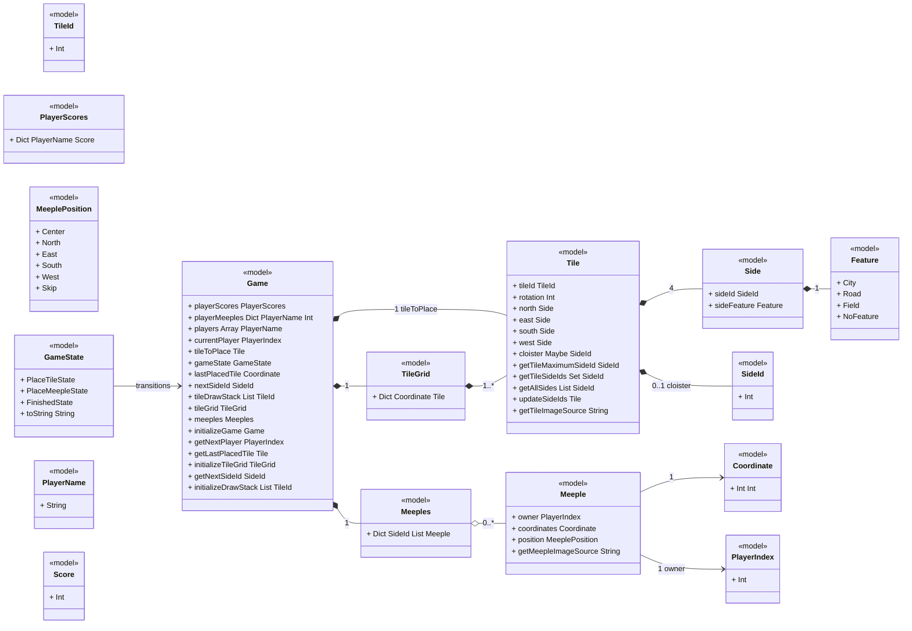
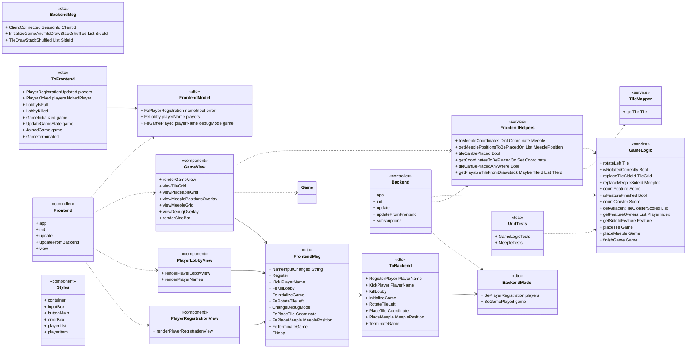

# Carcassonne — Class Model

A well-structured Class Model, represented via UML Class Diagrams (mermaid.js), is the blueprint of a full-stack application. Unlike a backend-only or frontend-only model, a full-stack class model must illustrate how data and logic flow from the server, across the network, and into the user interface. This document is the class model of the **Carcassonne** repository (pinned commit `ca2797745a863243fa6ce96af63435b0d67bf2ab`): it shows how the authoritative game state on the Lamdera server, the wire protocol, and the Elm client UI are related as classes. For the program specification and overall architecture, see [./Specification.md](./Specification.md).

**Stack (from `plan.json`).** A pure **Elm 0.19.1 + Lamdera** full-stack app. The "frontend" is a browser Elm program (`elm/browser`, `elm/html`) hosted by the Lamdera frontend runtime (`src/Frontend.elm:17-31`, `elm.json:6`); the "backend" is a server-side Elm program hosted by the Lamdera backend runtime that keeps one shared in-memory game model and broadcasts it to clients (`src/Backend.elm:18-25`, `elm.json:17-18`). **There is no database**: the only data artifacts are the compiler-generated Evergreen state snapshots/migrations under `src/Evergreen/` consumed by the Lamdera platform (`src/Evergreen/Migrate/V10.elm:3`).

**Modeling note.** Elm has no classes, inheritance, or visibility. In this model, a "class" is either a **type declaration** (record, custom/union type, newtype, type alias) or a **behavior-owning module** (`Helpers.GameLogic`, `Helpers.TileMapper`, `Helpers.FrontendHelpers`, `Frontend`, `Backend`, the three `Views.*` modules, `Styles`). The model covers **33 class elements (31 classes + 2 class groups, 30 fully detailed)** and **33 relationships**, every one cited to a line-anchored location in the pinned repo.

---

## 1. Core Elements of a Class (Elm Adaptation)

For every major class in this model, the template's core elements map to Elm as follows:

* **Class Name:** PascalCase type name or module name. Examples: `Game`, `TileMapper`, `Views.GameView`.
* **Attributes (Properties/State):** record fields with their Elm types, e.g. `+ tileGrid : TileGrid`. For custom (union) types the constructors are listed; for newtypes/aliases the wrapped target type is listed.
* **Methods (Operations/Behaviors):** the module's exported (public) functions with parameters and return type, e.g. `+ placeTile : Game, Coordinate -> Game`.
* **Visibility Modifiers:** **all members are `+` (public).** Elm has no visibility system — whatever a module exposes is public by construction (`module ... exposing (..)`); a few modules export a restricted list instead (e.g. `src/Helpers/TileMapper.elm:1` exposes only `getTile`, `src/Frontend.elm:1` exposes only `Model` and `app`). The template's `-` / `#` / `~` modifiers have no Elm counterpart and are not used in this model.

### 1.1 Class Inventory

| ID | Name | Kind | Layer | Primary File |
| :-- | :-- | :-- | :-- | :-- |
| `CL-1` | `Game` | class | model | `src/Types/Game.elm:28-40` |
| `CL-2` | `Tile` | class | model | `src/Types/Tile.elm:21-29` |
| `CL-3` | `Side` | class | model | `src/Types/Tile.elm:15-18` |
| `CL-4` | `TileId` | class | model | `src/Types/Tile.elm:7-8` |
| `CL-5` | `SideId` | class | model | `src/Types/Tile.elm:11-12` |
| `CL-6` | `TileGrid` | class | model | `src/Types/Game.elm:20-21` |
| `CL-7` | `PlayerScores` | class | model | `src/Types/Game.elm:16-17` |
| `CL-8` | `Meeples` | class | model | `src/Types/Game.elm:24-25` |
| `CL-9` | `Meeple` | class | model | `src/Types/Meeple.elm:17-23` |
| `CL-10` | `MeeplePosition` | class | model | `src/Types/Meeple.elm:8-14` |
| `CL-11` | `Feature` | class | model | `src/Types/Feature.elm:4-8` |
| `CL-12` | `GameState` | class | model | `src/Types/GameState.elm:4-7` |
| `CL-13` | `Coordinate` | class | model | `src/Types/Coordinate.elm:4-5` |
| `CL-14` | `PlayerIndex` | class | model | `src/Types/PlayerIndex.elm:4-5` |
| `CL-15` | `PlayerName` | class | model | `src/Types/PlayerName.elm:4-5` |
| `CL-16` | `Score` | class | model | `src/Types/Score.elm:4-5` |
| `CL-17` | `FrontendModel` | class | dto | `src/Types.elm:20-33` |
| `CL-18` | `BackendModel` | class | dto | `src/Types.elm:11-17` |
| `CL-19` | `FrontendMsg` | class | dto | `src/Types.elm:36-47` |
| `CL-20` | `ToBackend` | class | dto | `src/Types.elm:50-58` |
| `CL-21` | `BackendMsg` | class | dto | `src/Types.elm:61-65` |
| `CL-22` | `ToFrontend` | class | dto | `src/Types.elm:67-86` |
| `CL-23` | `GameLogic` | class | service | `src/Helpers/GameLogic.elm:1` |
| `CL-24` | `TileMapper` | class | service | `src/Helpers/TileMapper.elm:1` |
| `CL-25` | `FrontendHelpers` | class | service | `src/Helpers/FrontendHelpers.elm:1` |
| `CL-26` | `Frontend` | class | controller | `src/Frontend.elm:1` |
| `CL-27` | `Backend` | class | controller | `src/Backend.elm:1` |
| `CL-28` | `GameView` | class | component | `src/Views/GameView.elm:1` |
| `CL-29` | `PlayerLobbyView` | class | component | `src/Views/PlayerLobbyView.elm:1` |
| `CL-30` | `PlayerRegistrationView` | class | component | `src/Views/PlayerRegistrationView.elm:1` |
| `CL-31` | `Styles` | class | component | `src/Styles.elm:1` |
| `CL-32` | Evergreen Lamdera state snapshots (V1/V3/V5/V10) | class_group | model | `src/Evergreen/` (`src/Evergreen/Migrate/V10.elm:3`) |
| `CL-33` | Unit tests (GameLogicTests, MeepleTests) | class_group | service | `tests/GameLogicTests.elm:1`, `tests/MeepleTests.elm:1` |

---

## 2. Backend (Server-Side) Architecture

The backend of a full-stack application is typically the most class-heavy part, adhering to MVC or N-Tier architecture. In Carcassonne the "backend" is the single Lamdera server program (`Backend.elm`) plus the shared pure rule modules under `src/Helpers/` and `src/Types/`. There is no ORM: the authoritative state is an in-memory Elm record (`BackendModel`, `src/Backend.elm:14-15`), so the template's tiers map as follows — domain models are the shared state types, services are the pure rule modules, and the Lamdera protocol endpoint plays the controller role.

### A. Domain Models / Entities (In-Memory State, No ORM)

These classes directly represent the shared game state (there are no database tables; the Lamdera backend model is the store, and the Evergreen snapshots are its serialized versions — see `CL-32` and `evidence/db.json`).

#### CL-1 `Game` `<<model>>`

Root state record of the whole board game: players, scores, remaining meeples, turn order, the pending tile, the tile grid, the meeple placement dict and the draw stack. Owned by `Types.Game`; behavior (initialization, turn advance) lives in the same module.

Declaration: `src/Types/Game.elm:28-40`

**Attributes**

| Attribute | Type | Visibility | Code Reference |
| :-- | :-- | :--: | :-- |
| `playerScores` | `PlayerScores` (Dict PlayerName Score) | + | `src/Types/Game.elm:29` |
| `playerMeeples` | `Dict PlayerName Int` | + | `src/Types/Game.elm:30` |
| `players` | `Array PlayerName` | + | `src/Types/Game.elm:31` |
| `currentPlayer` | `PlayerIndex` | + | `src/Types/Game.elm:32` |
| `tileToPlace` | `Tile` | + | `src/Types/Game.elm:33` |
| `gameState` | `GameState` | + | `src/Types/Game.elm:34` |
| `lastPlacedTile` | `Coordinate` | + | `src/Types/Game.elm:35` |
| `nextSideId` | `SideId` | + | `src/Types/Game.elm:36` |
| `tileDrawStack` | `List TileId` | + | `src/Types/Game.elm:37` |
| `tileGrid` | `TileGrid` (Dict Coordinate Tile) | + | `src/Types/Game.elm:38` |
| `meeples` | `Meeples` (Dict SideId (List Meeple)) | + | `src/Types/Game.elm:39` |

**Methods**

| Method | Parameters | Returns | Visibility | Code Reference |
| :-- | :-- | :-- | :--: | :-- |
| `initializeGame` | `List PlayerName` | `Game` | + | `src/Types/Game.elm:53-73` |
| `getNextPlayer` | `Game` | `PlayerIndex` | + | `src/Types/Game.elm:78-84` |
| `getLastPlacedTile` | `Game` | `Tile` | + | `src/Types/Game.elm:89-94` |
| `initializeTileGrid` | — | `TileGrid` | + | `src/Types/Game.elm:102-104` |
| `getNextSideId` | `TileGrid` | `SideId` | + | `src/Types/Game.elm:109-115` |
| `initializeDrawStack` | — | `List TileId` | + | `src/Types/Game.elm:120-147` |

**Notes:** constant `playerLimit = 5` (`src/Types/Game.elm:43-45`); each player starts with 7 meeples (`src/Types/Game.elm:61`).

#### CL-2 `Tile` `<<model>>`

A physical Carcassonne tile: identity, current rotation (degrees, +90 per counter-clockwise turn) and the four cardinal sides plus an optional cloister (Mönch) side.

Declaration: `src/Types/Tile.elm:21-29`

**Attributes**

| Attribute | Type | Visibility | Code Reference |
| :-- | :-- | :--: | :-- |
| `tileId` | `TileId` (Int) | + | `src/Types/Tile.elm:22` |
| `rotation` | `Int` | + | `src/Types/Tile.elm:23` |
| `north` | `Side` | + | `src/Types/Tile.elm:24` |
| `east` | `Side` | + | `src/Types/Tile.elm:25` |
| `south` | `Side` | + | `src/Types/Tile.elm:26` |
| `west` | `Side` | + | `src/Types/Tile.elm:27` |
| `cloister` | `Maybe SideId` | + | `src/Types/Tile.elm:28` |

**Methods**

| Method | Parameters | Returns | Visibility | Code Reference |
| :-- | :-- | :-- | :--: | :-- |
| `getTileMaximumSideId` | `Tile` | `SideId` | + | `src/Types/Tile.elm:34-37` |
| `getTileSideIds` | `Tile` | `Set SideId` | + | `src/Types/Tile.elm:42-45` |
| `getAllSides` | `Tile` | `List SideId` | + | `src/Types/Tile.elm:50-57` |
| `updateSideIds` | `SideId, Tile` | `Tile` | + | `src/Types/Tile.elm:62-81` |
| `getTileImageSource` | `TileId` | `String` | + | `src/Types/Tile.elm:84-86` |

**Notes:** sideId `-1` marks a field-only side (no feature boundary) — see tile definitions, e.g. `src/Helpers/TileMapper.elm:17`.

#### CL-3 `Side` `<<model>>`

One edge of a tile: a globally-unique feature identifier (`sideId`, `-1` for open field) and the kind of feature (City/Road/Field).

Declaration: `src/Types/Tile.elm:15-18`

**Attributes**

| Attribute | Type | Visibility | Code Reference |
| :-- | :-- | :--: | :-- |
| `sideId` | `SideId` (Int) | + | `src/Types/Tile.elm:16` |
| `sideFeature` | `Feature` | + | `src/Types/Tile.elm:17` |

No exported methods.

#### CL-4 `TileId` `<<model>>`

Newtype over `Int` identifying a tile variant in the 24-tile base set (0..23).

Declaration: `src/Types/Tile.elm:7-8`

**Attributes**

| Attribute | Type | Visibility | Code Reference |
| :-- | :-- | :--: | :-- |
| (newtype target) | `Int` | + | `src/Types/Tile.elm:7-8` |

No exported methods.

#### CL-5 `SideId` `<<model>>`

Newtype over `Int` used as the global identifier of a connected feature (road/city/field/cloister chain) across the tile grid; `-1` denotes an unconnected field side.

Declaration: `src/Types/Tile.elm:11-12`

**Attributes**

| Attribute | Type | Visibility | Code Reference |
| :-- | :-- | :--: | :-- |
| (newtype target) | `Int` | + | `src/Types/Tile.elm:11-12` |

No exported methods.

#### CL-6 `TileGrid` `<<model>>`

The board: a dictionary from grid coordinates to placed tiles (1..* tiles).

Declaration: `src/Types/Game.elm:20-21`

**Attributes**

| Attribute | Type | Visibility | Code Reference |
| :-- | :-- | :--: | :-- |
| (alias target) | `Dict Coordinate Tile` | + | `src/Types/Game.elm:20-21` |

No exported methods.

#### CL-7 `PlayerScores` `<<model>>`

Running score per player.

Declaration: `src/Types/Game.elm:16-17`

**Attributes**

| Attribute | Type | Visibility | Code Reference |
| :-- | :-- | :--: | :-- |
| (alias target) | `Dict PlayerName Score` | + | `src/Types/Game.elm:16-17` |

No exported methods.

#### CL-8 `Meeples` `<<model>>`

All meeples currently on the board, keyed by feature `SideId` to the list of meeples placed on that feature (0..* meeples per feature).

Declaration: `src/Types/Game.elm:24-25`

**Attributes**

| Attribute | Type | Visibility | Code Reference |
| :-- | :-- | :--: | :-- |
| (alias target) | `Dict SideId (List Meeple)` | + | `src/Types/Game.elm:24-25` |

No exported methods.

#### CL-9 `Meeple` `<<model>>`

A placed meeple: its owner's player index, the tile coordinate it sits on and the position on that tile (center for cloisters, cardinal for sides, `Skip` = no placement).

Declaration: `src/Types/Meeple.elm:17-23`

**Attributes**

| Attribute | Type | Visibility | Code Reference |
| :-- | :-- | :--: | :-- |
| `owner` | `PlayerIndex` | + | `src/Types/Meeple.elm:18` |
| `coordinates` | `Coordinate` | + | `src/Types/Meeple.elm:19` |
| `position` | `MeeplePosition` | + | `src/Types/Meeple.elm:20` |

**Methods**

| Method | Parameters | Returns | Visibility | Code Reference |
| :-- | :-- | :-- | :--: | :-- |
| `getMeepleImageSource` | `Int` | `String` | + | `src/Types/Meeple.elm:37-42` |

**Notes:** `meepleColorDictionary` maps player index 0..4 to red/blue/green/yellow/black (`src/Types/Meeple.elm:26-34`); the record comment reserves room for expansion meeple types (`src/Types/Meeple.elm:22`).

#### CL-10 `MeeplePosition` `<<model>>`

Custom type with the six possible placements of a meeple on the last placed tile.

Declaration: `src/Types/Meeple.elm:8-14`

**Attributes (constructors)**

| Attribute | Type | Visibility | Code Reference |
| :-- | :-- | :--: | :-- |
| `Center` | (no payload) | + | `src/Types/Meeple.elm:9` |
| `North` | (no payload) | + | `src/Types/Meeple.elm:10` |
| `East` | (no payload) | + | `src/Types/Meeple.elm:11` |
| `South` | (no payload) | + | `src/Types/Meeple.elm:12` |
| `West` | (no payload) | + | `src/Types/Meeple.elm:13` |
| `Skip` | (no payload) | + | `src/Types/Meeple.elm:14` |

No exported methods. **Notes:** `Center` is used for cloister tiles (`src/Helpers/GameLogic.elm:412-413`).

#### CL-11 `Feature` `<<model>>`

Custom type with the four feature kinds a tile side can carry.

Declaration: `src/Types/Feature.elm:4-8`

**Attributes (constructors)**

| Attribute | Type | Visibility | Code Reference |
| :-- | :-- | :--: | :-- |
| `City` | (no payload) | + | `src/Types/Feature.elm:5` |
| `Road` | (no payload) | + | `src/Types/Feature.elm:6` |
| `Field` | (no payload) | + | `src/Types/Feature.elm:7` |
| `NoFeature` | (no payload) | + | `src/Types/Feature.elm:8` |

No exported methods.

#### CL-12 `GameState` `<<model>>`

Custom type driving the per-turn state machine: place tile → place meeple → finished.

Declaration: `src/Types/GameState.elm:4-7`

**Attributes (constructors)**

| Attribute | Type | Visibility | Code Reference |
| :-- | :-- | :--: | :-- |
| `PlaceTileState` | (no payload) | + | `src/Types/GameState.elm:5` |
| `PlaceMeepleState` | (no payload) | + | `src/Types/GameState.elm:6` |
| `FinishedState` | (no payload) | + | `src/Types/GameState.elm:7` |

**Methods**

| Method | Parameters | Returns | Visibility | Code Reference |
| :-- | :-- | :-- | :--: | :-- |
| `toString` | `GameState` | `String` | + | `src/Types/GameState.elm:10-20` |

#### CL-13 `Coordinate` `<<model>>`

Newtype over an `(Int, Int)` grid coordinate; `(0,0)` is the starting tile.

Declaration: `src/Types/Coordinate.elm:4-5`

**Attributes**

| Attribute | Type | Visibility | Code Reference |
| :-- | :-- | :--: | :-- |
| (newtype target) | `(Int, Int)` | + | `src/Types/Coordinate.elm:4-5` |

No exported methods.

#### CL-14 `PlayerIndex` `<<model>>`

Newtype over `Int`: positional index of a player in `Game.players` (also the `Meeple.owner`).

Declaration: `src/Types/PlayerIndex.elm:4-5`

**Attributes**

| Attribute | Type | Visibility | Code Reference |
| :-- | :-- | :--: | :-- |
| (newtype target) | `Int` | + | `src/Types/PlayerIndex.elm:4-5` |

No exported methods.

#### CL-15 `PlayerName` `<<model>>`

Newtype over `String`: the player's display name, used as key in score/meeple dicts and in lobby state.

Declaration: `src/Types/PlayerName.elm:4-5`

**Attributes**

| Attribute | Type | Visibility | Code Reference |
| :-- | :-- | :--: | :-- |
| (newtype target) | `String` | + | `src/Types/PlayerName.elm:4-5` |

No exported methods.

#### CL-16 `Score` `<<model>>`

Newtype over `Int`: points accumulated by a player.

Declaration: `src/Types/Score.elm:4-5`

**Attributes**

| Attribute | Type | Visibility | Code Reference |
| :-- | :-- | :--: | :-- |
| (newtype target) | `Int` | + | `src/Types/Score.elm:4-5` |

No exported methods.

### B. Data Access Objects (DAOs) / Repositories

**UNVERIFIED — no such layer exists in this codebase.** There are no repositories, DAOs, or data-access objects anywhere in `src/` or `tests/`. The Lamdera backend model is the single in-memory store (`src/Backend.elm:14-15`), and the only "persistence" artifacts are the compiler-generated Evergreen state snapshots and migrations consumed by the Lamdera platform, not a local datastore (`src/Evergreen/Migrate/V10.elm:3`). The closest analogs to CRUD "access" operations are `initializeGame` / `placeTile` / `placeMeeple` / `finishGame`, which mutate the in-memory `Game`/`BackendModel` state (`src/Types/Game.elm:53-73`, `src/Helpers/GameLogic.elm:323-370`, `src/Helpers/GameLogic.elm:383-508`, `src/Helpers/GameLogic.elm:511-556`). No template need for this subsection is satisfied by existing code; it is documented as absent rather than invented.

### C. Services (Business Logic Layer)

The core of the application. These pure modules own the business rules; no I/O, fully testable.

#### CL-23 `GameLogic` `<<service>>`

Core game-rule service (module `Helpers.GameLogic`). Owns all pure domain behavior on `Game`: tile rotation, rotation validation, tile placement with feature (sideId) merging, meeple placement with scoring of finished features, and end-of-game scoring. No I/O; fully testable.

Module: `src/Helpers/GameLogic.elm:1`

**Attributes:** none (stateless module; operates on `Game`/`TileGrid`/`Meeples` values).

**Methods**

| Method | Parameters | Returns | Visibility | Code Reference |
| :-- | :-- | :-- | :--: | :-- |
| `rotateLeft` | `Tile` | `Tile` | + | `src/Helpers/GameLogic.elm:21-40` |
| `isRotatedCorrectly` | `Tile` | `Bool` | + | `src/Helpers/GameLogic.elm:45-94` |
| `replaceTileSideId` | `Maybe SideId, SideId, TileGrid` | `TileGrid` | + | `src/Helpers/GameLogic.elm:102-131` |
| `replaceMeepleSideId` | `Maybe SideId, SideId, Meeples` | `Meeples` | + | `src/Helpers/GameLogic.elm:136-162` |
| `countFeature` | `TileGrid, SideId` | `Score` | + | `src/Helpers/GameLogic.elm:170-188` |
| `isFeatureFinished` | `TileGrid, SideId` | `Bool` | + | `src/Helpers/GameLogic.elm:193-203` |
| `countCloister` | `TileGrid, Coordinate` | `Score` | + | `src/Helpers/GameLogic.elm:211-224` |
| `getAdjacentTileCloisterScores` | `TileGrid, Coordinate` | `List (SideId, Score)` | + | `src/Helpers/GameLogic.elm:230-251` |
| `getFeatureOwners` | `Meeples, SideId` | `List PlayerIndex` | + | `src/Helpers/GameLogic.elm:256-290` |
| `getSideIdFeature` | `SideId, TileGrid` | `Feature` | + | `src/Helpers/GameLogic.elm:300-308` |
| `placeTile` | `Game, Coordinate` | `Game` | + | `src/Helpers/GameLogic.elm:323-370` |
| `placeMeeple` | `Game, MeeplePosition` | `Game` | + | `src/Helpers/GameLogic.elm:383-508` |
| `finishGame` | `Game` | `Game` | + | `src/Helpers/GameLogic.elm:511-556` |

**Notes:** `placeTile` switches `gameState` to `PlaceMeepleState` (`src/Helpers/GameLogic.elm:367`); `placeMeeple` back to `PlaceTileState` (`src/Helpers/GameLogic.elm:507`); cities larger than 2 tiles score double when finished mid-game (`src/Helpers/GameLogic.elm:430-432`); placing a non-`Skip` meeple decrements the player's meeple count (`src/Helpers/GameLogic.elm:493-500`).

#### CL-24 `TileMapper` `<<service>>`

Tile-catalog service (module `Helpers.TileMapper`): maps each `TileId` 0..23 to its canonical `Tile` (sides, features, cloister); unknown ids fall back to tile 0. The 24 tiles define the base-set composition.

Module: `src/Helpers/TileMapper.elm:1`

**Attributes:** none (static tile catalog).

**Methods**

| Method | Parameters | Returns | Visibility | Code Reference |
| :-- | :-- | :-- | :--: | :-- |
| `getTile` | `TileId` | `Tile` | + | `src/Helpers/TileMapper.elm:9-253` |

**Notes:** only tiles 3 and 4 carry a cloister (`src/Helpers/TileMapper.elm:49`, `src/Helpers/TileMapper.elm:59`); fallthrough `_ -> getTile 0` (`src/Helpers/TileMapper.elm:252-253`); the module exposes only `getTile` (`src/Helpers/TileMapper.elm:1`).

#### CL-25 `FrontendHelpers` `<<service>>`

Gameplay-feasibility service (module `Helpers.FrontendHelpers`): computes where the current tile can legally be placed, where a meeple may go, and draws the next playable tile from the draw stack. Shared by the `Backend` (draw stack) and the `GameView` (highlighting of legal moves).

Module: `src/Helpers/FrontendHelpers.elm:1`

**Attributes:** none (stateless module).

**Methods**

| Method | Parameters | Returns | Visibility | Code Reference |
| :-- | :-- | :-- | :--: | :-- |
| `toMeepleCoordinates` | `Meeples` | `Dict Coordinate Meeple` | + | `src/Helpers/FrontendHelpers.elm:16-22` |
| `getMeeplePositionsToBePlacedOn` | `PlayerName, Dict PlayerName Int, Meeples, Tile` | `List MeeplePosition` | + | `src/Helpers/FrontendHelpers.elm:27-43` |
| `tileCanBePlaced` | `TileGrid, Tile, Coordinate` | `Bool` | + | `src/Helpers/FrontendHelpers.elm:48-84` |
| `getCoordinatesToBePlacedOn` | `TileGrid, Tile` | `Set Coordinate` | + | `src/Helpers/FrontendHelpers.elm:89-110` |
| `tileCanBePlacedAnywhere` | `TileGrid, Tile` | `Bool` | + | `src/Helpers/FrontendHelpers.elm:120-127` |
| `getPlayableTileFromDrawstack` | `TileGrid, List TileId` | `(Maybe TileId, List TileId)` | + | `src/Helpers/FrontendHelpers.elm:132-143` |

**Notes:** `tileCanBePlaced` enforces matching `sideFeature`s on all four neighbors and an empty target cell (`src/Helpers/FrontendHelpers.elm:67-84`); `getMeeplePositionsToBePlacedOn` returns `[Skip]` when the player has no meeples left (`src/Helpers/FrontendHelpers.elm:42-43`).

### D. Controllers / Protocol Entry Points

In a REST/GraphQL app these are HTTP route handlers. In Carcassonne the entry points are the two **Lamdera protocol endpoints**: `Backend.updateFromFrontend` (server, applies `ToBackend` requests) and `Frontend.update` / `Frontend.updateFromBackend` (client, produces/consumes `ToBackend`/`ToFrontend`).

#### CL-27 `Backend` `<<controller>>`

Lamdera backend controller (module `Backend`). The single source of truth for the shared game state; applies `ToBackend` requests through `GameLogic`/`FrontendHelpers` and broadcasts state to all clients. Also owns lobby management (register/kick/kill, 5-player limit) and tile-draw-stack shuffling via `Random`.

Module: `src/Backend.elm:1`

**Attributes:** none (state lives in `Model = BackendModel`, `src/Backend.elm:14-15`).

**Methods**

| Method | Parameters | Returns | Visibility | Code Reference |
| :-- | :-- | :-- | :--: | :-- |
| `app` | — | Lamdera backend record | + | `src/Backend.elm:18-25` |
| `init` | — | `(Model, Cmd BackendMsg)` | + | `src/Backend.elm:28-34` |
| `update` | `BackendMsg, Model` | `(Model, Cmd BackendMsg)` | + | `src/Backend.elm:37-87` |
| `updateFromFrontend` | `SessionId, ClientId, ToBackend, Model` | `(Model, Cmd BackendMsg)` | + | `src/Backend.elm:90-186` |
| `subscriptions` | `a` (model ignored) | `Sub BackendMsg` | + | `src/Backend.elm:189-191` |

**Notes:** Lamdera backend endpoint record `Lamdera.backend { init, update, updateFromFrontend, subscriptions }` (`src/Backend.elm:18-25`); lobby limit enforced via `playerLimit` (`src/Backend.elm:110-118`); a late `RegisterPlayer` during a game gets `JoinedGame` with the current state (`src/Backend.elm:120-123`); when no tile from the shuffled draw stack is playable, the game is finished (`src/Backend.elm:76-84`); `subscriptions` wires `Lamdera.onConnect` to `ClientConnected` (`src/Backend.elm:189-191`).

#### CL-26 `Frontend` `<<controller>>`

Lamdera frontend controller (module `Frontend`). Implements the Elm architecture loop (`init`/`update`/`subscribe`/`view`) plus Lamdera's `updateFromBackend`; routes user intents to views and backend requests. (Client-side controller; listed here with the controllers because it is the other half of the protocol boundary.)

Module: `src/Frontend.elm:1`

**Attributes:** none (state lives in `Model = FrontendModel`, `src/Frontend.elm:13-14`).

**Methods**

| Method | Parameters | Returns | Visibility | Code Reference |
| :-- | :-- | :-- | :--: | :-- |
| `app` | — | Lamdera frontend record | + | `src/Frontend.elm:17-31` |
| `init` | — | `(Model, Cmd FrontendMsg)` | + | `src/Frontend.elm:34-41` |
| `update` | `FrontendMsg, Model` | `(Model, Cmd FrontendMsg)` | + | `src/Frontend.elm:44-89` |
| `updateFromBackend` | `ToFrontend, Model` | `(Model, Cmd FrontendMsg)` | + | `src/Frontend.elm:92-156` |
| `view` | `Model` | `Html FrontendMsg` | + | `src/Frontend.elm:159-169` |

**Notes:** Lamdera frontend endpoint record with `init`, `update`, `updateFromBackend`, `view`, `subscriptions`, `onUrlChange`, `onUrlRequest` (`src/Frontend.elm:18-31`); `subscriptions` are `Sub.none` (`src/Frontend.elm:28`); URL events map to `FNoop` (`src/Frontend.elm:29-30`); `update` validates a non-empty trimmed name before registering (`src/Frontend.elm:50-62`).

---

## 3. Cross-Boundary Data (The Network Layer)

Because the full-stack app sends data across the network, this section models the data structures used for that communication. In Carcassonne the network boundary is the **Lamdera protocol** (WebSocket-backed, codecs generated from these Elm types). The wire-facing types are the `ToBackend` / `ToFrontend` message types; the per-side screen-state machines (`BackendModel` / `FrontendModel`) and the internal message types (`BackendMsg` / `FrontendMsg`) complete the DTO set. Sensitive-leak concern is not applicable (there are no credentials or secrets in this app's state).

### Data Transfer Objects (DTOs)

Request payloads, response payloads, and the screen-state machines that wrap them.

#### CL-20 `ToBackend` `<<dto>>`

Requests a client sends to the backend over the Lamdera protocol (`sendToBackend`); the wire-facing half of a game move or lobby action.

Declaration: `src/Types.elm:50-58`

**Attributes (constructors)**

| Attribute | Type | Visibility | Code Reference |
| :-- | :-- | :--: | :-- |
| `RegisterPlayer` | payload `PlayerName` | + | `src/Types.elm:51` |
| `KickPlayer` | payload `PlayerName` | + | `src/Types.elm:52` |
| `KillLobby` | (no payload) | + | `src/Types.elm:53` |
| `InitializeGame` | (no payload) | + | `src/Types.elm:54` |
| `RotateTileLeft` | (no payload) | + | `src/Types.elm:55` |
| `PlaceTile` | payload `Coordinate` | + | `src/Types.elm:56` |
| `PlaceMeeple` | payload `MeeplePosition` | + | `src/Types.elm:57` |
| `TerminateGame` | (no payload) | + | `src/Types.elm:58` |

No exported methods.

#### CL-22 `ToFrontend` `<<dto>>`

Responses the backend broadcasts/sends to clients (`sendToFrontend` / `broadcast`): lobby updates and full game-state pushes.

Declaration: `src/Types.elm:67-86`

**Attributes (constructors)**

| Attribute | Type | Visibility | Code Reference |
| :-- | :-- | :--: | :-- |
| `PlayerRegistrationUpdated` | payload `{ players : List PlayerName }` | + | `src/Types.elm:68-70` |
| `PlayerKicked` | payload `{ players, kickedPlayer }` | + | `src/Types.elm:71-74` |
| `LobbyIsFull` | (no payload) | + | `src/Types.elm:75` |
| `LobbyKilled` | (no payload) | + | `src/Types.elm:76` |
| `GameInitialized` | payload `{ game : Game }` | + | `src/Types.elm:77-79` |
| `UpdateGameState` | payload `{ game : Game }` | + | `src/Types.elm:80-82` |
| `JoinedGame` | payload `{ game : Game }` | + | `src/Types.elm:83-85` |
| `GameTerminated` | (no payload) | + | `src/Types.elm:86` |

No exported methods.

#### CL-18 `BackendModel` `<<dto>>`

Lamdera backend state machine: either the lobby is open (player registration list) or a game is in progress (full `Game` state). This is the server-side screen/state DTO that wraps the domain entity.

Declaration: `src/Types.elm:11-17`

**Attributes (constructors)**

| Attribute | Type | Visibility | Code Reference |
| :-- | :-- | :--: | :-- |
| `BePlayerRegistration { players }` | `players : List PlayerName` | + | `src/Types.elm:12-14` |
| `BeGamePlayed { game }` | `game : Game` | + | `src/Types.elm:15-17` |

No exported methods. **Notes:** `alias Model = BackendModel` (`src/Backend.elm:14-15`).

#### CL-17 `FrontendModel` `<<dto>>`

Lamdera frontend state machine: which screen the local client is on (registration form, lobby, game) and its per-screen data. Mirrored by the Lamdera app model in `Frontend.elm`.

Declaration: `src/Types.elm:20-33`

**Attributes (constructors)**

| Attribute | Type | Visibility | Code Reference |
| :-- | :-- | :--: | :-- |
| `FePlayerRegistration { nameInput, error }` | `nameInput : String, error : Maybe String` | + | `src/Types.elm:21-24` |
| `FeLobby { playerName, players }` | `playerName : PlayerName, players : List PlayerName` | + | `src/Types.elm:25-28` |
| `FeGamePlayed { playerName, debugMode, game }` | `playerName : PlayerName, debugMode : Bool, game : Game` | + | `src/Types.elm:29-33` |

No exported methods. **Notes:** `alias Model = FrontendModel` (`src/Frontend.elm:13-14`).

#### CL-19 `FrontendMsg` `<<dto>>`

Client-side user intents of the Elm architecture loop; `Frontend.update` maps them to local state changes or `ToBackend` requests, and the views produce them from `Html` events.

Declaration: `src/Types.elm:36-47`

**Attributes (constructors)**

| Attribute | Type | Visibility | Code Reference |
| :-- | :-- | :--: | :-- |
| `NameInputChanged` | payload `String` | + | `src/Types.elm:37` |
| `Register` | (no payload) | + | `src/Types.elm:38` |
| `Kick` | payload `PlayerName` | + | `src/Types.elm:39` |
| `FeKillLobby` | (no payload) | + | `src/Types.elm:40` |
| `FeInitializeGame` | (no payload) | + | `src/Types.elm:41` |
| `FeRotateTileLeft` | (no payload) | + | `src/Types.elm:42` |
| `ChangeDebugMode` | (no payload) | + | `src/Types.elm:43` |
| `FePlaceTile` | payload `Coordinate` | + | `src/Types.elm:44` |
| `FePlaceMeeple` | payload `MeeplePosition` | + | `src/Types.elm:45` |
| `FeTerminateGame` | (no payload) | + | `src/Types.elm:46` |
| `FNoop` | (no payload) | + | `src/Types.elm:47` |

No exported methods.

#### CL-21 `BackendMsg` `<<dto>>`

Backend-internal messages: client connection notifications and shuffled tile-draw-stack results (from `Random.generate` / `Lamdera.onConnect`).

Declaration: `src/Types.elm:61-65`

**Attributes (constructors)**

| Attribute | Type | Visibility | Code Reference |
| :-- | :-- | :--: | :-- |
| `ClientConnected` | payload `SessionId ClientId` | + | `src/Types.elm:62` |
| `InitializeGameAndTileDrawStackShuffled` | payload `(List SideId)` | + | `src/Types.elm:63` |
| `TileDrawStackShuffled` | payload `(List SideId)` | + | `src/Types.elm:64` |

No exported methods.

---

## 4. Frontend (Client-Side) Architecture

The frontend is heavily component-driven in Elm's architecture pattern, but it still relies on class-like structures: typed state (`FrontendModel`), a single `update` loop, and view modules that produce typed `Html FrontendMsg` trees.

### A. UI Components / Views

The three screen components plus the shared styling helper. Each view reads its screen's state and dispatches `FrontendMsg` intents from `Html` event handlers.

#### CL-28 `GameView` `<<component>>`

Main game screen component (module `Views.GameView`). Renders the tile grid, meeple overlay, placeable-cell overlay, meeple-placement overlay, debug sideId overlay and the score sidebar; branches on `GameState`. Dispatches game-move `FrontendMsg` intents from click handlers.

Module: `src/Views/GameView.elm:1`

**Attributes:** none (pure render functions over `Game` state).

**Methods**

| Method | Parameters | Returns | Visibility | Code Reference |
| :-- | :-- | :-- | :--: | :-- |
| `renderGameView` | `PlayerName, Game, Bool (debugMode)` | `Html FrontendMsg` | + | `src/Views/GameView.elm:21-194` |
| `viewTileGrid` | `TileGrid` | `Html FrontendMsg` | + | `src/Views/GameView.elm:197-245` |
| `viewPlaceableGrid` | `TileGrid, Set Coordinate` | `Html FrontendMsg` | + | `src/Views/GameView.elm:268-317` |
| `viewMeeplePositionsOverlay` | `TileGrid, Coordinate, List MeeplePosition` | `Html FrontendMsg` | + | `src/Views/GameView.elm:335-398` |
| `viewMeepleGrid` | `TileGrid, Meeples` | `Html FrontendMsg` | + | `src/Views/GameView.elm:426-479` |
| `viewDebugOverlay` | `TileGrid` | `Html FrontendMsg` | + | `src/Views/GameView.elm:542-592` |
| `renderSideBar` | `Game, PlayerName` | `Html FrontendMsg` | + | `src/Views/GameView.elm:641-750` |

**Notes:** state read — `Game.tileGrid`, `Game.meeples`, `Game.playerMeeples`, `Game.playerScores`, `Game.currentPlayer`, `Game.players`, `Game.gameState`, `Game.lastPlacedTile`, `Game.tileToPlace` (`src/Views/GameView.elm:49`, `src/Views/GameView.elm:56`, `src/Views/GameView.elm:62`, `src/Views/GameView.elm:125-129`, `src/Views/GameView.elm:26`, `src/Views/GameView.elm:641-700`); dispatched messages — `FePlaceTile` (`src/Views/GameView.elm:327`), `FePlaceMeeple` incl. `Skip` (`src/Views/GameView.elm:393`, `src/Views/GameView.elm:533`), `FeRotateTileLeft` (`src/Views/GameView.elm:741`), `FeTerminateGame` (`src/Views/GameView.elm:744`), `ChangeDebugMode` (`src/Views/GameView.elm:747`); overlay layers render only for the current player (`src/Views/GameView.elm:58`, `src/Views/GameView.elm:121`).

#### CL-29 `PlayerLobbyView` `<<component>>`

Lobby screen component (module `Views.PlayerLobbyView`): shows registered players, a per-player kick link and the Start button.

Module: `src/Views/PlayerLobbyView.elm:1`

**Attributes:** none (pure render functions).

**Methods**

| Method | Parameters | Returns | Visibility | Code Reference |
| :-- | :-- | :-- | :--: | :-- |
| `renderPlayerLobbyView` | `String, List PlayerName` | `Html FrontendMsg` | + | `src/Views/PlayerLobbyView.elm:11-24` |
| `renderPlayerNames` | `List PlayerName` | `Html FrontendMsg` | + | `src/Views/PlayerLobbyView.elm:27-39` |

**Notes:** state read — own `PlayerName` + `List PlayerName` from `FeLobby` (`src/Frontend.elm:166`); dispatched messages — `FeInitializeGame` (`src/Views/PlayerLobbyView.elm:21`), `Kick` (`src/Views/PlayerLobbyView.elm:35`).

#### CL-30 `PlayerRegistrationView` `<<component>>`

Registration screen component (module `Views.PlayerRegistrationView`): name input form with Join button, error box, and a Kill-lobby button when the lobby is full.

Module: `src/Views/PlayerRegistrationView.elm:1`

**Attributes:** none (pure render functions).

**Methods**

| Method | Parameters | Returns | Visibility | Code Reference |
| :-- | :-- | :-- | :--: | :-- |
| `renderPlayerRegistrationView` | `PlayerName, Maybe String (error)` | `Html FrontendMsg` | + | `src/Views/PlayerRegistrationView.elm:11-46` |

**Notes:** state read — `nameInput` + `error` from `FePlayerRegistration` (`src/Frontend.elm:163`); dispatched messages — `Register` via onSubmit/onClick (`src/Views/PlayerRegistrationView.elm:16`, `src/Views/PlayerRegistrationView.elm:26`), `NameInputChanged` via onInput (`src/Views/PlayerRegistrationView.elm:21`), `FeKillLobby` only when `error == Just "Lobby is full."` (`src/Views/PlayerRegistrationView.elm:29-33`).

#### CL-31 `Styles` `<<component>>`

UI styling helper module (module `Styles`): named `Html.Attribute` lists (`container`, `inputBox`, `buttonMain`, `errorBox`, `playerList`, `playerItem`) shared by the three views.

Module: `src/Styles.elm:1`

**Attributes**

| Attribute | Type | Visibility | Code Reference |
| :-- | :-- | :--: | :-- |
| `container` | `List (Html.Attribute msg)` | + | `src/Styles.elm:7-15` |
| `inputBox` | `List (Html.Attribute msg)` | + | `src/Styles.elm:19-28` |

**Notes:** the remaining values (`buttonMain`, `errorBox`, `playerList`, `playerItem`) are listed in `src/Styles.elm:1-73` but were not individually inventoried (see Assumptions).

### B. API Clients / HTTP Services

**UNVERIFIED — no such classes exist in this codebase.** There are no HTTP client wrappers, endpoint registries, or token-injection helpers. The Lamdera runtime replaces the HTTP layer: the client sends requests via `sendToBackend` (imported at `src/Frontend.elm:4`) and the server replies via `sendToFrontend` / `broadcast` (imported at `src/Backend.elm:6`). The wire types are `ToBackend` (`CL-20`) and `ToFrontend` (`CL-22`); the protocol handlers are `Frontend.update` (`src/Frontend.elm:44-89`) and `Backend.updateFromFrontend` (`src/Backend.elm:90-186`). This template subsection is documented as absent rather than invented.

### C. State Management (Stores)

There is no Redux-style store; the global client state is the single Elm `Model` value, which is aliased to `FrontendModel` (`CL-17`) and updated exclusively by `Frontend.update` / `Frontend.updateFromBackend` (`src/Frontend.elm:44-89`, `src/Frontend.elm:92-156`). The per-screen state properties are the `FrontendModel` constructors: `nameInput`/`error` (registration), `playerName`/`players` (lobby), `playerName`/`debugMode`/`game` (game) — `src/Types.elm:21-33`. The actions/mutations are the `FrontendMsg` intents (`CL-19`) mapped in `update`.

### D. Client-Side Models

The frontend keeps a **full copy of the domain entity `Game`** (`CL-1`) inside `FeGamePlayed.game` (`src/Types.elm:29-33`), refreshed by the backend's `GameInitialized` / `UpdateGameState` / `JoinedGame` pushes applied in `Frontend.updateFromBackend` (`src/Types.elm:77-85`, `src/Frontend.elm:92-156`). There are no separate client-side mirror types for `Tile`, `Meeple`, etc. — the shared `src/Types/*` modules are imported by both sides, so the client-side model *is* the domain model (an honest deviation from the template's "map DTOs into client types" guidance, forced by the shared-language Lamdera architecture; see Assumptions).

---

## 5. Relationships and Associations

The model defines how these classes interact using standard UML notations. Because Elm has no inheritance, the applicable notations are association, directed association, aggregation, composition (record-field containment) and dependency (module import/call); **inheritance/generalization edges are absent by language fact, not by omission**.

| UML Notation | Meaning | Used In This Model (examples) |
| :-- | :-- | :-- |
| Composition (filled diamond) | "Part-of" — record field owns the value | `Game` → `TileGrid`, `Tile` → `Side` (4) |
| Aggregation (empty diamond) | "Has-a" — container reference that can be empty | `Meeples` → `Meeple` (0..* per feature) |
| Association (line) | "Knows about" | `Meeple` → `PlayerIndex` / `Coordinate`; views → `FrontendMsg` |
| Directed Association (arrow) | One-way knowledge / state flow | `GameState` → `Game` (transitions) |
| Dependency (dashed arrow) | Uses temporarily — module import/call | `Backend` → `GameLogic`, `GameView` → `FrontendHelpers` |
| Inheritance (empty triangle) | "Is-a" | **Not present** — Elm has no inheritance or subtyping |

All 33 evidence relationships (from `evidence/classes.json`, `CL-R1`..`CL-R33`):

| ID | From → To | Type | Multiplicity | Evidence (proving citation) | Description |
| :-- | :-- | :-- | :-- | :-- | :-- |
| `CL-R1` | `Game` → `TileGrid` | composition | 1 | `src/Types/Game.elm:38` | Composition: `Game` holds exactly one `TileGrid` (its board). |
| `CL-R2` | `TileGrid` → `Tile` | composition | 1..* | `src/Types/Game.elm:20-21`, `src/Types/Game.elm:102-104` | Composition: `TileGrid` is a `Dict` from `Coordinate` to `Tile`; a board holds 1..* placed tiles (starts with the single `(0,0)` tile). |
| `CL-R3` | `Game` → `Meeples` | composition | 1 | `src/Types/Game.elm:39` | Composition: `Game` holds exactly one `Meeples` dictionary of placed meeples. |
| `CL-R4` | `Meeples` → `Meeple` | aggregation | 0..* | `src/Types/Game.elm:24-25`, `src/Types/Game.elm:72` | Aggregation: `Meeples` maps feature `SideId`s to lists of `Meeple` (0..* per feature; empty dict at game start). |
| `CL-R5` | `Tile` → `Side` | composition | 4 | `src/Types/Tile.elm:24-27` | Composition: every `Tile` owns exactly four `Side` values (north, east, south, west). |
| `CL-R6` | `Tile` → `SideId` | composition (optional) | 0..1 | `src/Types/Tile.elm:28`, `src/Helpers/TileMapper.elm:49` | Optional composition: `Tile.cloister` is `Maybe SideId` — 0..1 cloister side (tiles 3 and 4 in the base set). |
| `CL-R7` | `Side` → `Feature` | composition | 1 | `src/Types/Tile.elm:17` | Composition: each `Side` carries one `Feature` describing what borders that edge. |
| `CL-R8` | `Meeple` → `PlayerIndex` | association | 1 | `src/Types/Meeple.elm:18`, `src/Helpers/GameLogic.elm:388` | Association: `Meeple.owner` references the positional index of its owner in `Game.players`. |
| `CL-R9` | `Meeple` → `Coordinate` | association | 1 | `src/Types/Meeple.elm:19`, `src/Helpers/GameLogic.elm:389` | Association: `Meeple.coordinates` references the tile coordinate it sits on (set to `Game.lastPlacedTile` at placement). |
| `CL-R10` | `Game` → `TileMapper` | dependency | 1 | `src/Types/Game.elm:5`, `src/Types/Game.elm:66`, `src/Types/Game.elm:104` | Module dependency: `Types.Game` imports `Helpers.TileMapper` and builds the initial tile/draw stack via `getTile` (starting tile at `(0,0)` is `getTile 0`). |
| `CL-R11` | `GameLogic` → `TileMapper` | dependency | 1 | `src/Helpers/GameLogic.elm:5`, `src/Helpers/GameLogic.elm:50` | Module dependency: `GameLogic` imports `getTile` and compares the rotated tile against the canonical one in `isRotatedCorrectly`. |
| `CL-R12` | `GameLogic` → `Game` | dependency | 1..* | `src/Helpers/GameLogic.elm:10`, `src/Helpers/GameLogic.elm:323`, `src/Helpers/GameLogic.elm:383`, `src/Helpers/GameLogic.elm:511` | Module dependency: `GameLogic` imports `Types.Game` and implements `Game -> Game` transformations (`placeTile`, `placeMeeple`, `finishGame`). |
| `CL-R13` | `Backend` → `GameLogic` | dependency | 1..* | `src/Backend.elm:4`, `src/Backend.elm:154`, `src/Backend.elm:164`, `src/Backend.elm:174`, `src/Backend.elm:180` | Module dependency: `Backend` applies game moves by calling `GameLogic.placeTile`, `placeMeeple`, `rotateLeft` and `finishGame`, then broadcasts the resulting state. |
| `CL-R14` | `Backend` → `FrontendHelpers` | dependency | 1..* | `src/Backend.elm:3`, `src/Backend.elm:47`, `src/Backend.elm:62` | Module dependency: `Backend` uses `getPlayableTileFromDrawstack` to pick the next tile after each shuffle (game init and post-meeple moves). |
| `CL-R15` | `Backend` → `BackendModel` | dependency | 1 | `src/Backend.elm:9`, `src/Backend.elm:14-15` | Module dependency: `Backend` imports the shared protocol types (`BackendModel`, `BackendMsg`, `ToBackend`, `ToFrontend`) and aliases `Model` to `BackendModel`. |
| `CL-R16` | `Frontend` → `FrontendModel` | dependency | 1 | `src/Frontend.elm:6`, `src/Frontend.elm:13-14` | Module dependency: `Frontend` imports the shared protocol types and aliases `Model` to `FrontendModel`. |
| `CL-R17` | `Frontend` → `GameView` | dependency | 1 | `src/Frontend.elm:8`, `src/Frontend.elm:168-169` | Module dependency: `Frontend.view` delegates the `FeGamePlayed` screen to `renderGameView`. |
| `CL-R18` | `Frontend` → `PlayerLobbyView` | dependency | 1 | `src/Frontend.elm:9`, `src/Frontend.elm:165-166` | Module dependency: `Frontend.view` delegates the `FeLobby` screen to `renderPlayerLobbyView`. |
| `CL-R19` | `Frontend` → `PlayerRegistrationView` | dependency | 1 | `src/Frontend.elm:10`, `src/Frontend.elm:162-163` | Module dependency: `Frontend.view` delegates the `FePlayerRegistration` screen to `renderPlayerRegistrationView`. |
| `CL-R20` | `FrontendMsg` → `ToBackend` | association (across the wire) | 1..* | `src/Frontend.elm:50-89` | `Frontend.update` translates user intents (`Register`, `Kick`, `FeInitializeGame`, `FeRotateTileLeft`, `FePlaceTile`, `FePlaceMeeple`, `FeTerminateGame`, `FeKillLobby`) into `ToBackend` requests via `sendToBackend`. |
| `CL-R21` | `ToFrontend` → `FrontendModel` | association (across the wire) | 1..* | `src/Frontend.elm:92-156` | `Frontend.updateFromBackend` applies `ToFrontend` messages to the client's `FrontendModel` (lobby updates, game-state pushes, screen transitions). |
| `CL-R22` | `ToBackend` → `BackendModel` | association (across the wire) | 1..* | `src/Backend.elm:90-186` | `Backend.updateFromFrontend` applies `ToBackend` requests to the shared `BackendModel` and replies via `broadcast`/`sendToFrontend`. |
| `CL-R23` | `GameView` → `FrontendHelpers` | dependency | 1..* | `src/Views/GameView.elm:5`, `src/Views/GameView.elm:62`, `src/Views/GameView.elm:129` | Module dependency: `GameView` imports `Helpers.FrontendHelpers` to highlight legal tile placements (`getCoordinatesToBePlacedOn`) and legal meeple positions (`getMeeplePositionsToBePlacedOn`). |
| `CL-R24` | `GameView` → `Game` | dependency | 1 | `src/Views/GameView.elm:13`, `src/Views/GameView.elm:21-28` | Module dependency: `GameView` imports `Types.Game` and its signature consumes the full `Game` record; it branches on `game.gameState`. |
| `CL-R25` | `PlayerLobbyView` → `FrontendMsg` | association | 0..* | `src/Views/PlayerLobbyView.elm:7`, `src/Views/PlayerLobbyView.elm:21`, `src/Views/PlayerLobbyView.elm:35` | The lobby view emits `FrontendMsg` intents (`FeInitializeGame`, `Kick`) through `Html` onClick handlers. |
| `CL-R26` | `PlayerRegistrationView` → `FrontendMsg` | association | 0..* | `src/Views/PlayerRegistrationView.elm:7`, `src/Views/PlayerRegistrationView.elm:16`, `src/Views/PlayerRegistrationView.elm:21` | The registration view emits `FrontendMsg` intents (`NameInputChanged`, `Register`, `FeKillLobby`) through input/form/button handlers. |
| `CL-R27` | `GameView` → `FrontendMsg` | association | 0..* | `src/Views/GameView.elm:11`, `src/Views/GameView.elm:327`, `src/Views/GameView.elm:533`, `src/Views/GameView.elm:741` | The game view emits game-move `FrontendMsg` intents (`FePlaceTile`, `FePlaceMeeple`, `FeRotateTileLeft`, `FeTerminateGame`, `ChangeDebugMode`) through onClick handlers. |
| `CL-R28` | `FrontendHelpers` → `GameLogic` | dependency | 1..* | `src/Helpers/FrontendHelpers.elm:4`, `src/Helpers/FrontendHelpers.elm:123-125` | Module dependency: `FrontendHelpers` imports `rotateLeft` from `GameLogic` to test all four rotations in `tileCanBePlacedAnywhere`. |
| `CL-R29` | `FrontendHelpers` → `TileMapper` | dependency | 1..* | `src/Helpers/FrontendHelpers.elm:5`, `src/Helpers/FrontendHelpers.elm:136` | Module dependency: `FrontendHelpers` imports `getTile` to materialize candidate tiles from the draw stack in `getPlayableTileFromDrawstack`. |
| `CL-R30` | `Game` → `Tile` | composition | 1 | `src/Types/Game.elm:33`, `src/Types/Game.elm:7-13` | Composition: `Game` holds the pending tile to place as a direct field (`tileToPlace`); it also pulls in `Meeple`/`Feature`/`Coordinate`/`PlayerIndex`/`PlayerName`/`Score` via its `Types.Game` imports. |
| `CL-R31` | Unit tests → `GameLogic` | dependency (test) | 1 | `tests/GameLogicTests.elm:4-6`, `tests/GameLogicTests.elm:14`, `tests/GameLogicTests.elm:60`, `tests/GameLogicTests.elm:162` | Test dependency: `GameLogicTests` imports the helper modules and pins `isRotatedCorrectly`, `tileCanBePlaced` and `getCoordinatesToBePlacedOn`. |
| `CL-R32` | Unit tests → `GameLogic` | dependency (test) | 1 | `tests/MeepleTests.elm:5`, `tests/MeepleTests.elm:12` | Test dependency: `MeepleTests` imports `getFeatureOwners` from `GameLogic` and pins majority/owner computation. |
| `CL-R33` | `GameState` → `Game` | directed (state machine) | 1..* | `src/Helpers/GameLogic.elm:367`, `src/Helpers/GameLogic.elm:507`, `src/Helpers/GameLogic.elm:555`, `src/Views/GameView.elm:28-29` | `placeTile` transitions `PlaceTileState` → `PlaceMeepleState`, `placeMeeple` transitions `PlaceMeepleState` → `PlaceTileState`, `finishGame` sets `FinishedState`; `GameView` renders per state. |

---

## 6. Best Practices for Full-Stack Class Modeling

How the template's practices are applied (or legitimately deviated from) in Carcassonne:

1. **Separation of Concerns.** `Helpers.GameLogic` is a pure, I/O-free rules module, fully unit-testable (`src/Helpers/GameLogic.elm:1`, pinned by `tests/GameLogicTests.elm:1` and `tests/MeepleTests.elm:1`); `Backend` only orchestrates the protocol, lobby and broadcasting (`src/Backend.elm:1`); the views only render and dispatch intents (`src/Views/GameView.elm:1`, `src/Views/PlayerLobbyView.elm:1`, `src/Views/PlayerRegistrationView.elm:1`). No view contains game-rule logic, and no controller touches rendering.
2. **Keep DTOs and Entities Separate.** The wire protocol uses dedicated message types `ToBackend` / `ToFrontend` (`src/Types.elm:50-58`, `src/Types.elm:67-86`) rather than passing raw internal values. **Honest caveat:** the domain entity `Game` itself crosses the wire inside `GameInitialized`/`UpdateGameState`/`JoinedGame` (`src/Types.elm:77-85`) because Lamdera's model is the shared state and the client needs the full `Game` to render — there is no server-only sensitive data to hide, so a separate `GameDTO` copy does not exist.
3. **Interface Over Implementation.** **Not applicable in Elm** — the language has no interfaces, subtyping, or dependency injection; module boundaries and the `Model`/message type aliases are the substitution seams (`src/Backend.elm:14-15`, `src/Frontend.elm:13-14`). No abstraction interfaces were modeled or invented.
4. **Don't Overcomplicate the UI Model.** The UI is modeled as exactly three screen components plus one styling helper (`src/Views/GameView.elm:1`, `src/Views/PlayerLobbyView.elm:1`, `src/Views/PlayerRegistrationView.elm:1`, `src/Styles.elm:1`) — no class box per button or input field; individual widgets live inside the views' `Html` construction (e.g. the sidebar at `src/Views/GameView.elm:641-750`).
5. **Standardize Naming Conventions.** The `Be*` / `Fe*` constructor prefixes mirror the backend/frontend halves of the same logical screen (`BePlayerRegistration`/`FePlayerRegistration`, `BeGamePlayed`/`FeGamePlayed` — `src/Types.elm:11-33`); the wire direction is encoded in `ToBackend`/`ToFrontend` (`src/Types.elm:50`, `src/Types.elm:67`); and the domain names (`Game`, `Tile`, `Meeple`, `SideId`, …) are identical on both sides because both sides import the shared `src/Types/*` modules.

---

## 7. Class Diagrams

The 31 classes are split into two `classDiagram` parts: **Part 1 — State & data types** (the `model`-layer value types) and **Part 2 — Behavior & UI modules** (services, controllers, DTOs and components). Single source of truth: every class is defined once, in the part that owns it; cross-part references (e.g. `Game`, `TileMapper` in Part 2) render as empty stub boxes and resolve to the Part 1 / service definitions. Member lines show `+` visibility and return type only; full parameter/return signatures live in the tables of Sections 2–4. Edge semantics: `*--` composition (whole/containing class on the left), `o--` aggregation, `-->` directed association, `..>` module dependency; edge labels give multiplicity/field.

### Part 1 — State & data types

**Node map (Part 1)** — every class id in the block above:

| Node | Element | Code Reference |
| :-- | :-- | :-- |
| `Game` | `CL-1` — root game state record + initialization/turn functions | `src/Types/Game.elm:28-40` |
| `Tile` | `CL-2` — physical tile (id, rotation, four sides, optional cloister) | `src/Types/Tile.elm:21-29` |
| `Side` | `CL-3` — one tile edge (feature id + feature kind) | `src/Types/Tile.elm:15-18` |
| `TileId` | `CL-4` — newtype over `Int` (tile variant 0..23) | `src/Types/Tile.elm:7-8` |
| `SideId` | `CL-5` — newtype over `Int` (global feature id, -1 = open field) | `src/Types/Tile.elm:11-12` |
| `TileGrid` | `CL-6` — type alias `Dict Coordinate Tile` (the board) | `src/Types/Game.elm:20-21` |
| `PlayerScores` | `CL-7` — type alias `Dict PlayerName Score` | `src/Types/Game.elm:16-17` |
| `Meeples` | `CL-8` — type alias `Dict SideId (List Meeple)` | `src/Types/Game.elm:24-25` |
| `Meeple` | `CL-9` — placed meeple (owner, coordinates, position) | `src/Types/Meeple.elm:17-23` |
| `MeeplePosition` | `CL-10` — six placement options (Center/North/East/South/West/Skip) | `src/Types/Meeple.elm:8-14` |
| `Feature` | `CL-11` — four feature kinds (City/Road/Field/NoFeature) | `src/Types/Feature.elm:4-8` |
| `GameState` | `CL-12` — per-turn state machine (PlaceTile/PlaceMeeple/Finished) | `src/Types/GameState.elm:4-7` |
| `Coordinate` | `CL-13` — newtype over `(Int, Int)` grid coordinate | `src/Types/Coordinate.elm:4-5` |
| `PlayerIndex` | `CL-14` — newtype over `Int` (positional player index) | `src/Types/PlayerIndex.elm:4-5` |
| `PlayerName` | `CL-15` — newtype over `String` (display name) | `src/Types/PlayerName.elm:4-5` |
| `Score` | `CL-16` — newtype over `Int` (points) | `src/Types/Score.elm:4-5` |

### Part 2 — Behavior & UI modules

**Node map (Part 2)** — every class id in the block above:

| Node | Element | Code Reference |
| :-- | :-- | :-- |
| `BackendModel` | `CL-18` — server screen/state machine (lobby vs game) | `src/Types.elm:11-17` |
| `FrontendModel` | `CL-17` — client screen/state machine (registration/lobby/game) | `src/Types.elm:20-33` |
| `FrontendMsg` | `CL-19` — client user intents (Elm loop messages) | `src/Types.elm:36-47` |
| `ToBackend` | `CL-20` — wire requests, client → server | `src/Types.elm:50-58` |
| `BackendMsg` | `CL-21` — backend-internal messages (connect, draw-stack shuffles) | `src/Types.elm:61-65` |
| `ToFrontend` | `CL-22` — wire responses, server → client | `src/Types.elm:67-86` |
| `GameLogic` | `CL-23` — core game-rule service (pure, 13 exported functions) | `src/Helpers/GameLogic.elm:1` |
| `TileMapper` | `CL-24` — tile-catalog service (only `getTile` exported) | `src/Helpers/TileMapper.elm:1` |
| `FrontendHelpers` | `CL-25` — placement-feasibility service (6 exported functions) | `src/Helpers/FrontendHelpers.elm:1` |
| `Backend` | `CL-27` — Lamdera backend controller (single source of truth) | `src/Backend.elm:1` |
| `Frontend` | `CL-26` — Lamdera frontend controller (Elm loop + protocol) | `src/Frontend.elm:1` |
| `GameView` | `CL-28` — main game screen component (7 render functions) | `src/Views/GameView.elm:1` |
| `PlayerLobbyView` | `CL-29` — lobby screen component | `src/Views/PlayerLobbyView.elm:1` |
| `PlayerRegistrationView` | `CL-30` — registration screen component | `src/Views/PlayerRegistrationView.elm:1` |
| `Styles` | `CL-31` — shared `Html.Attribute` styling helper | `src/Styles.elm:1` |
| `UnitTests` | `CL-33` — class_group: `GameLogicTests` + `MeepleTests` elm-test suites | `tests/GameLogicTests.elm:1`, `tests/MeepleTests.elm:1` |
| `Game` (stub) | `CL-1` — defined once in Part 1; referenced by `GameView ..> Game` and the `placeTile`/`placeMeeple`/`finishGame` return types | `src/Types/Game.elm:28-40` |
| `TileMapper` (self-contained) | `CL-24` — defined in this part; `Tile`/`TileId` members resolve to Part 1 | `src/Helpers/TileMapper.elm:1` |

*Note:* `Game` is intentionally not redefined in Part 2 (single source of truth — see Part 1); `TileMapper`, `GameLogic` and `FrontendHelpers` are defined here because they are the behavior-owning modules, while the value types they name (`Tile`, `TileId`, `SideId`, `Coordinate`, …) belong to Part 1. The `GameView ..> Game` and `..> TileMapper` edges are drawn to Part 1 names exactly as such.

---

## 8. Group Elements (Not Expanded)

Two elements are modeled as groups rather than individual classes; per the evidence, they are intentionally **not** expanded into the main diagrams.

### CL-32 — Evergreen Lamdera state snapshots (V1/V3/V5/V10) `class_group` `<<model>>`

Compiler-generated Lamdera "Evergreen" snapshot copies of the live types (`FrontendModel`/`BackendModel`/`FrontendMsg`/`ToBackend`/`BackendMsg`/`ToFrontend` plus the `Game`/`Tile`/`Meeple`/`Feature`/`GameState`/`Coordinate`/`PlayerName` subtrees) at versions V1, V3, V5 and V10, with per-version migration stubs in `Evergreen.Migrate`. They mirror the current types and exist for Lamdera state versioning/migration, so they are modeled as one group rather than individual classes. 27 files (3 Migrate stubs + 4 version-level Types.elm + 20 per-type subtree files) live under `src/Evergreen/`.

Evidence: `src/Evergreen/Migrate/V10.elm:3` ("This migration file was automatically generated by the lamdera compiler."), `src/Evergreen/V10/Types.elm:11-88`, `src/Evergreen/Migrate/V3.elm:1`, `src/Evergreen/Migrate/V5.elm:1`.

**Frozen-snapshot proof:** the V10 snapshot carries extra constructors not present in the live types — `FrontendMsg.ClearError` (`src/Evergreen/V10/Types.elm:47`) and `BackendMsg.NoOpBackendMsg` (`src/Evergreen/V10/Types.elm:66`) — confirming they are frozen copies, not the live definitions.

### CL-33 — Unit tests (GameLogicTests, MeepleTests) `class_group` `<<service>>`

elm-test suites pinning core rule behavior: `GameLogicTests` covers `isRotatedCorrectly` (rotation/feature consistency), `tileCanBePlaced` (neighbor feature matching) and `getCoordinatesToBePlacedOn` (legal placement set); `MeepleTests` covers `getFeatureOwners` (majority ownership, including ties).

Evidence: `tests/GameLogicTests.elm:1`, `tests/MeepleTests.elm:1`.

| Pinned behavior | Code Reference |
| :-- | :-- |
| `isRotatedCorrectly` | `tests/GameLogicTests.elm:14-16` |
| `tileCanBePlaced` | `tests/GameLogicTests.elm:60-62` |
| `getCoordinatesToBePlacedOn` | `tests/GameLogicTests.elm:162-164` |
| `getFeatureOwners` | `tests/MeepleTests.elm:12-14` |

---

## 9. Assumptions & Unverified Items

1. **Elm has no inheritance.** No generalization (empty-triangle) edges appear anywhere in this model — none exist and none were invented. The closest structural relationships are record composition (field types) and module dependencies (imports).
2. **Elm has no visibility system.** Every member is marked `+`; nothing a module exports is private. Where export lists are restricted, that is noted per class (e.g. `TileMapper` exports only `getTile`, `src/Helpers/TileMapper.elm:1`; `Frontend` exports only `Model` and `app`, `src/Frontend.elm:1`).
3. **UNVERIFIED — Data Access Objects / Repositories (template §2.B) are absent.** No DAO/repository layer exists in the repo; the in-memory Lamdera backend model (`src/Backend.elm:14-15`) plus the compiler-generated Evergreen snapshots (`src/Evergreen/Migrate/V10.elm:3`) are the closest analogs. The subsection is documented as a gap, not filled with invented elements.
4. **UNVERIFIED — API Clients / HTTP Services (template §4.B) are absent.** No HTTP client class exists; the Lamdera runtime provides `sendToBackend` (`src/Frontend.elm:4`) and `sendToFrontend`/`broadcast` (`src/Backend.elm:6`) instead.
5. **UNVERIFIED — Interfaces / abstractions (template §6.3) are absent.** Elm has no interfaces or subtyping; no interface elements were modeled.
6. **Feature connectivity is implicit, not object-shaped.** Tile-side merging on placement is handled by `SideId` rewriting (`replaceTileSideId`, `src/Helpers/GameLogic.elm:102-131`); the "feature" abstraction is the `SideId` int across tiles, so there is no dedicated feature-graph class to model.
7. **The Evergreen snapshot group (CL-32) is compiler-generated and frozen.** Its per-version type shapes were not individually inventoried; the group entry covers them as mirrors of the live types. The V10 migration performs a model reset for both frontend and backend models at that version boundary (`src/Evergreen/Migrate/V10.elm:36-43`), so V1–V10 must not be read as live code paths.
8. **Planner-named functions do not exist under those names.** `isTilePlacementValid` and `getMeeplePositions` appear nowhere in the code; the realized equivalents are `FrontendHelpers.tileCanBePlaced` / `tileCanBePlacedAnywhere` (`src/Helpers/FrontendHelpers.elm:48`, `src/Helpers/FrontendHelpers.elm:120`) and `FrontendHelpers.getMeeplePositionsToBePlacedOn` (`src/Helpers/FrontendHelpers.elm:27`). This document uses the evidence names only.
9. **`Styles` (CL-31) is not fully detailed.** Only `container` and `inputBox` were individually inventoried by the analyst; the remaining values (`buttonMain`, `errorBox`, `playerList`, `playerItem`) are attested by the module's own description and the line span `src/Styles.elm:1-73` but lack per-line citations.
10. **Server-side move validation is deliberately absent by design of the code.** `placeTile`/`placeMeeple` "do not check whether the move is valid" (`src/Helpers/GameLogic.elm:311-314`, `src/Helpers/GameLogic.elm:373-376`); placement validity is enforced client-side only via `FrontendHelpers` (`src/Helpers/FrontendHelpers.elm:48-110`). The class model reflects this as a shared service dependency (both `Backend` and `GameView` depend on `CL-25`), not as a server-side validation service, because none exists.

---

## 10. Sources & Cross-References

* **Repository:** `Carcassonne`, pinned commit `ca2797745a863243fa6ce96af63435b0d67bf2ab` (read-only; consulted only to spot-check citations). Scope: `src/` (46 `.elm` files) + `tests/`; `review/` excluded (separate elm-review tooling project); `src/Evergreen/` treated as compiler-generated snapshots.
* **Primary evidence:** `evidence/classes.json` (33 class elements + 33 relationships, analyst `02-class-analyst`, status `ok`).
* **Supporting evidence:** `evidence/domain.json`, `evidence/db.json` (confirms no database; state snapshots are the "data layer"), `evidence/flows.json`, `evidence/usecases.json`.
* **Plan context:** `plan.json` (stack/layers, risks) and `inventory.md` (file/line inventory: 55 files, 4,188 total lines).
* **Sister artifacts:** [./Specification.md](./Specification.md) (program specification and architecture overview); activity, domain, database and use-case models for this repo share the same pin and this class inventory.
* **Template:** `imobilothon2/templates/ClassModel.md` — section order and headings mirrored; wording adapted; all example tables rendered as real, cited tables.
