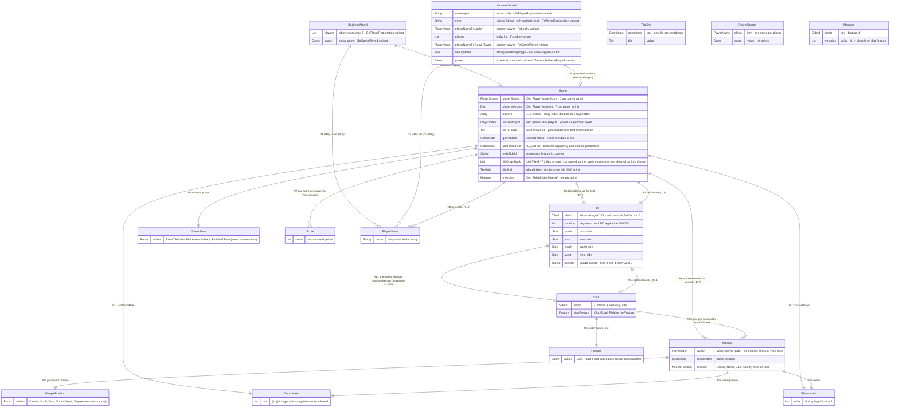

# Carcassonne — Database Model Specification

*The "database" of this application is the serialized Lamdera backend state (Elm records and custom types). No database engine exists in this repository.*

---

## 1. Project & System Overview

* **System Name:** Carcassonne — multiplayer tile-and-meeple board game (Elm 0.19 + Lamdera full-stack app)
* **Version:** Pinned commit `ca2797745a863243fa6ce96af63435b0d67bf2ab` (no version field is declared in the repo manifest `elm.json`)
* **Author/Lead Data Architect:** Codebase Modeler network — `02-db-analyst` (evidence: `evidence/db.json`), rendered by the Writer agent
* **Description:** A browser-based multiplayer Carcassonne game where up to 5 players register in a lobby, take turns placing tiles and meeples on a shared board, and are scored by majority per feature. The primary role of this "database" is the persistence shape of the single in-memory backend state: the Lamdera backend `Model` (alias of `BackendModel`, `src/Backend.elm:14-15`) plus the compiler-generated Evergreen state snapshots and migrations under `src/Evergreen/` that the Lamdera platform uses to carry that state across deploys. See the full program specification at `./Specification.md` for the behavioral context (flows, use cases, domain rules).

## 2. Database Architecture & Technology Stack

* **Database Type:** None — there is no database in this repository. The data layer is a single in-memory Elm value (the backend `Model`) whose shape is versioned by compiler-generated Evergreen snapshots; "tables" are Elm record/ADT definitions, and "columns" are record fields. (`src/Backend.elm:14-15`, `src/Types.elm:11-17`)
* **DBMS (Database Management System):** None — Lamdera in-memory backend model with platform-managed serialization; no SQL, no ORM, no connection strings. The only "connection" is the Lamdera backend registration: `Lamdera.backend { init, update, updateFromFrontend, subscriptions }` (`src/Backend.elm:18-25`). Elm's total types mean no nullable columns exist — the only `Maybe` fields are `Tile.cloister` and `FrontendModel.error` (`src/Types/Tile.elm:28`, `src/Types.elm:23`).
* **Hosting/Cloud Provider:** Lamdera platform — hosting, auto-deploy via git remote, and Evergreen state storage across redeploys (`readme.md:139-151`, `.github/workflows/test.yaml:33-34`). The concrete storage backend (Lamdera Cloud vs. local) is **UNVERIFIED** — see §11.
* **ORM / Query Builder:** None — direct Elm value composition; there is no persistence abstraction layer (`src/Backend.elm:18-25`).
* **Migration Tool:** Lamdera Evergreen — compiler-generated snapshot and migration files under `src/Evergreen/`; e.g. `src/Evergreen/Migrate/V10.elm:3` notes the file "was automatically generated by the lamdera compiler". Migration history: V1 → V3 (ModelReset), V3 → V5 (field-level), V5 → V10 (ModelReset) — see §9 seeds and §11.

## 3. Global Naming Conventions & Standards

* **Tables/Collections:** `PascalCase`, singular Elm type names for every persisted record/ADT: `Game`, `Tile`, `Meeple`, `BackendModel`, `FrontendModel` (`src/Types/Game.elm:28`, `src/Types/Tile.elm:21`, `src/Types/Meeple.elm:17`, `src/Types.elm:11`). Collection aliases are also PascalCase: `TileGrid`, `PlayerScores`, `Meeples` (`src/Types/Game.elm:16-25`).
* **Columns/Fields:** `camelCase` record fields: `playerScores`, `tileToPlace`, `lastPlacedTile` (`src/Types/Game.elm:29-39`); value-type modules expose the type via the module name (`PlayerName`, `Score`, `Coordinate`, `PlayerIndex`) (`src/Types/PlayerName.elm:4-5`, `src/Types/Score.elm:4-5`, `src/Types/Coordinate.elm:4-5`, `src/Types/PlayerIndex.elm:4-5`).
* **Primary Keys:** No database primary keys exist. Identity is provided by Elm `Dict` key types and value fields: `TileGrid` is keyed by `Coordinate` (one tile per coordinate, `src/Types/Game.elm:20-21`), `PlayerScores` is keyed by `PlayerName` (`src/Types/Game.elm:16-17`), `Meeples` is keyed by feature `SideId` (`src/Types/Game.elm:24-25`), and the tileset definition is addressed by `TileId` 0..23 with a fallback to tile 0 (`src/Helpers/TileMapper.elm:9-12`, `src/Helpers/TileMapper.elm:252-253`).
* **Foreign Keys:** No foreign-key columns. Relationships are value composition: e.g. `Meeple.owner` is a `PlayerIndex` into `Game.players` with no type-level or runtime bounds check (`src/Types/Meeple.elm:18`, `src/Types/Game.elm:31`).
* **Boolean Fields:** Plain `Bool` fields with semantic names; no `is_`/`has_` prefix convention. The only persisted `Bool` is `debugMode` (per-session) (`src/Types.elm:31`).
* **Timestamps:** No table carries `created_at`/`updated_at` — the state records contain no timestamp fields at all; temporal ordering is expressed through game turn state (`currentPlayer`, `gameState`), not clocks (`src/Types/Game.elm:28-40`).
* **Nullability:** Total types throughout; the only nullable-equivalent fields are `error : Maybe String` (`src/Types.elm:23`) and `cloister : Maybe SideId` (`src/Types/Tile.elm:28`).

## 4. Entity-Relationship Diagram (ERD)

> **Note — no DBMS:** The diagram below is the schema of the *serialized state*, not of a database. Each "entity" is an Elm record or custom type that participates in the persisted Lamdera model, each attribute is a record field, and each relationship is value composition (there is no referential enforcement — see §11).

**Link to Diagram:** Inline Mermaid `erDiagram` below (no external diagram service is used for this artifact).



### Node map

| Node | Element | Code Reference |
| :--- | :--- | :--- |
| `BackendModel` | Entity — top-level backend model (ADT: `BePlayerRegistration` / `BeGamePlayed`) | `src/Types.elm:11-17` |
| `FrontendModel` | Entity — per-session frontend model (ADT: `FePlayerRegistration` / `FeLobby` / `FeGamePlayed`) | `src/Types.elm:20-33` |
| `Game` | Entity — core game-state record | `src/Types/Game.elm:28-40` |
| `TileGrid` | Entity — placed tiles, `Dict Coordinate Tile` | `src/Types/Game.elm:20-21` |
| `PlayerScores` | Entity — `Dict PlayerName Score` | `src/Types/Game.elm:16-17` |
| `Meeples` | Entity — `Dict SideId (List Meeple)` | `src/Types/Game.elm:24-25` |
| `Tile` | Entity — placed or pending tile | `src/Types/Tile.elm:21-29` |
| `Side` | Entity — one side of a tile | `src/Types/Tile.elm:15-18` |
| `Meeple` | Entity — a player's meeple | `src/Types/Meeple.elm:17-23` |
| `Feature` | Entity — feature-kind enum (4 constructors) | `src/Types/Feature.elm:4-8` |
| `GameState` | Entity — game-phase enum (3 constructors) | `src/Types/GameState.elm:4-7` |
| `MeeplePosition` | Entity — meeple-position enum (6 constructors) | `src/Types/Meeple.elm:8-14` |
| `Score` | Entity — value type alias `Int` | `src/Types/Score.elm:4-5` |
| `Coordinate` | Entity — value type alias `(Int, Int)` | `src/Types/Coordinate.elm:4-5` |
| `PlayerIndex` | Entity — value type alias `Int` (0..4) | `src/Types/PlayerIndex.elm:4-5` |
| `PlayerName` | Entity — value type alias `String` | `src/Types/PlayerName.elm:4-5` |
| `BackendModel.players` | Attribute — lobby roster, `List PlayerName`, max 5, unique | `src/Types.elm:13` |
| `BackendModel.game` | Attribute — active `Game` (BeGamePlayed variant) | `src/Types.elm:16` |
| `FrontendModel.nameInput` | Attribute — name-input buffer, `String` (FePlayerRegistration) | `src/Types.elm:22` |
| `FrontendModel.error` | Attribute — `Maybe String`, only nullable field (FePlayerRegistration) | `src/Types.elm:23` |
| `FrontendModel.playerNameFeLobby` | Attribute — field `playerName`, `PlayerName` (FeLobby variant) | `src/Types.elm:26` |
| `FrontendModel.players` | Attribute — lobby list, `List PlayerName` (FeLobby variant) | `src/Types.elm:27` |
| `FrontendModel.playerNameFeGamePlayed` | Attribute — field `playerName`, `PlayerName` (FeGamePlayed variant) | `src/Types.elm:30` |
| `FrontendModel.debugMode` | Attribute — `Bool` debug toggle (FeGamePlayed variant) | `src/Types.elm:31` |
| `FrontendModel.game` | Attribute — `Game` mirror (FeGamePlayed variant) | `src/Types.elm:32` |
| `Game.playerScores` | Attribute — `PlayerScores` (`Dict PlayerName Score`), 0 per player at init | `src/Types/Game.elm:29` |
| `Game.playerMeeples` | Attribute — `Dict PlayerName Int`, 7 per player at init | `src/Types/Game.elm:30`, `src/Types/Game.elm:61` |
| `Game.players` | Attribute — `Array PlayerName`, 1..5, index doubles as `PlayerIndex` | `src/Types/Game.elm:31` |
| `Game.currentPlayer` | Attribute — `PlayerIndex` turn pointer, 0 at init | `src/Types/Game.elm:32`, `src/Types/Game.elm:78-84` |
| `Game.tileToPlace` | Attribute — `Tile`, placeholder until first shuffled draw | `src/Types/Game.elm:33`, `src/Backend.elm:44-59` |
| `Game.gameState` | Attribute — `GameState` phase, `PlaceTileState` at init | `src/Types/Game.elm:34` |
| `Game.lastPlacedTile` | Attribute — `Coordinate`, (0,0) at init | `src/Types/Game.elm:35` |
| `Game.nextSideId` | Attribute — `SideId` counter, max existing SideId over grid at init | `src/Types/Game.elm:36`, `src/Types/Game.elm:109-115` |
| `Game.tileDrawStack` | Attribute — `List TileId`, 71 tiles at start; consumed as the game progresses; not explicitly cleared by `finishGame` (`src/Helpers/GameLogic.elm:511-556`), so a non-empty stack is possible at game end | `src/Types/Game.elm:37`, `src/Backend.elm:76-84` |
| `Game.tileGrid` | Attribute — `TileGrid`, single center tile (0,0) at init | `src/Types/Game.elm:38`, `src/Types/Game.elm:102-104` |
| `Game.meeples` | Attribute — `Meeples` (`Dict SideId (List Meeple)`), empty at init | `src/Types/Game.elm:39` |
| `TileGrid.coordinate` | Attribute — Dict key, `Coordinate` (composite x,y), unique | `src/Types/Game.elm:20-21` |
| `TileGrid.tile` | Attribute — Dict value, `Tile` | `src/Types/Game.elm:20-21` |
| `PlayerScores.player` | Attribute — Dict key, `PlayerName`, unique | `src/Types/Game.elm:16-17` |
| `PlayerScores.score` | Attribute — Dict value, `Score` (`Int`) | `src/Types/Score.elm:4-5` |
| `Meeples.sideId` | Attribute — Dict key, feature `SideId`, unique | `src/Types/Game.elm:24-25` |
| `Meeples.meeples` | Attribute — Dict value, `List Meeple` (0..N) | `src/Types/Game.elm:24-25` |
| `Tile.tileId` | Attribute — `TileId` (`Int`), defined domain 0..23 | `src/Types/Tile.elm:22`, `src/Helpers/TileMapper.elm:252-253` |
| `Tile.rotation` | Attribute — `Int` degrees; `modBy 360` applied at 360000 | `src/Types/Tile.elm:23`, `src/Helpers/GameLogic.elm:24-31` |
| `Tile.north` | Attribute — `Side` | `src/Types/Tile.elm:24` |
| `Tile.east` | Attribute — `Side` | `src/Types/Tile.elm:25` |
| `Tile.south` | Attribute — `Side` | `src/Types/Tile.elm:26` |
| `Tile.west` | Attribute — `Side` | `src/Types/Tile.elm:27` |
| `Tile.cloister` | Attribute — `Maybe SideId`; tiles 3 and 4 carry `Just 0` | `src/Types/Tile.elm:28`, `src/Helpers/TileMapper.elm:49`, `src/Helpers/TileMapper.elm:59` |
| `Side.sideId` | Attribute — `SideId` (`Int`); -1 marks a field-only side | `src/Types/Tile.elm:16`, `src/Types/Tile.elm:62-81` |
| `Side.sideFeature` | Attribute — `Feature` kind | `src/Types/Tile.elm:17` |
| `Meeple.owner` | Attribute — `PlayerIndex` of the owner (no type-level bounds check) | `src/Types/Meeple.elm:18` |
| `Meeple.coordinates` | Attribute — `Coordinate` board position | `src/Types/Meeple.elm:19` |
| `Meeple.position` | Attribute — `MeeplePosition` | `src/Types/Meeple.elm:20` |
| `Feature.values` | Attribute (rendering note, not a stored column) — enumerates the enum constructors | `src/Types/Feature.elm:4-8` |
| `GameState.values` | Attribute (rendering note, not a stored column) — enumerates the enum constructors | `src/Types/GameState.elm:4-7` |
| `MeeplePosition.values` | Attribute (rendering note, not a stored column) — enumerates the enum constructors | `src/Types/Meeple.elm:8-14` |
| `Score.score` | Attribute — `Int` point total | `src/Types/Score.elm:4-5` |
| `Coordinate.pair` | Attribute — `(Int, Int)` grid position; negative values used | `src/Types/Coordinate.elm:4-5`, `tests/MeepleTests.elm:29` |
| `PlayerIndex.index` | Attribute — 0-based turn-order position; domain 0..4 | `src/Types/PlayerIndex.elm:4-5`, `src/Types/Game.elm:43-45` |
| `PlayerName.name` | Attribute — unique player name; uniqueness enforced at registration | `src/Types/PlayerName.elm:4-5`, `src/Backend.elm:95-101` |
| `BackendModel ||--o| Game` | Relationship R1 — backend holds exactly one active game (BeGamePlayed) | `src/Types.elm:11-17` |
| `BackendModel ||--o{ PlayerName` | Relationship R2 — lobby roster, 0..5 players, capped by `playerLimit` | `src/Types.elm:12-14`, `src/Backend.elm:110-118` |
| `FrontendModel ||--o| Game` | Relationship R3 — per-session mirror of the backend Game (FeGamePlayed) | `src/Types.elm:29-33` |
| `FrontendModel ||--o{ PlayerName` | Relationship R4 — lobby list as seen by the session (FeLobby) | `src/Types.elm:25-28` |
| `Game ||--o{ Tile` | Relationship R5 — placed tiles via `Game.tileGrid`, one tile per coordinate | `src/Types/Game.elm:38`, `src/Types/Game.elm:20-21` |
| `Game ||--o{ Meeple` | Relationship R6 — placed meeples via `Game.meeples`; total bounded by 7 × players | `src/Types/Game.elm:39`, `src/Types/Game.elm:24-25` |
| `Game ||--o{ Score` | Relationship R7 — one score per player via `Game.playerScores` | `src/Types/Game.elm:29`, `src/Types/Game.elm:16-17` |
| `Game ||--o{ PlayerName` | Relationship R8 — ordered turn roster, 1..5, indexed by `currentPlayer` | `src/Types/Game.elm:31`, `src/Types/Game.elm:78-84` |
| `Game ||--|| Tile` | Relationship R9 — `tileToPlace`, the next drawn tile | `src/Types/Game.elm:33` |
| `Game ||--|| GameState` | Relationship R10 — current phase | `src/Types/Game.elm:34` |
| `Game ||--|| Coordinate` | Relationship R11 — `lastPlacedTile` points into the `TileGrid` | `src/Types/Game.elm:35`, `src/Types/Game.elm:87-94` |
| `Game ||--|| PlayerIndex` | Relationship R12 — `currentPlayer` indexes `Game.players` | `src/Types/Game.elm:32` |
| `Tile ||--|| Side` | Relationship R13 — one named side per cardinal direction (north/east/south/west), 4 separate 1:1 links; rotation permutes them | `src/Types/Tile.elm:24-27`, `src/Helpers/GameLogic.elm:24-40` |
| `Tile |o--o| Side` | Relationship R14 — optional cloister feature, 0..1 (tileset tiles 3 and 4) | `src/Types/Tile.elm:28`, `src/Helpers/TileMapper.elm:49`, `src/Helpers/TileMapper.elm:59` |
| `Side ||--|| Feature` | Relationship R15 — `sideFeature` classifies the bordered feature | `src/Types/Tile.elm:16-17` |
| `Side ||--o{ Meeple` | Relationship R16 — meeples grouped under the feature `SideId` they occupy | `src/Types/Game.elm:24-25`, `src/Helpers/GameLogic.elm:256-262` |
| `Meeple ||--|| MeeplePosition` | Relationship R17 — placement position relative to a tile | `src/Types/Meeple.elm:20` |
| `Meeple ||--|| Coordinate` | Relationship R18 — board position of the meeple | `src/Types/Meeple.elm:19` |
| `Meeple ||--|| PlayerIndex` | Relationship R19 — owner; each player starts with 7 meeples | `src/Types/Meeple.elm:18`, `src/Types/Game.elm:61` |

### DBML quick reference (optional)

DBML is included for quick reference only. The "tables" below are Elm record/custom-type definitions from `src/Types*`, not tables in a database engine; no database exists in this repository.

```dbml
// DBML quick reference — Elm record/ADT shape of the serialized state.
// Not a DBMS schema: no engine, no referential enforcement in the code.

Table BackendModel {
  players "List PlayerName" [note: 'BePlayerRegistration; max 5 (playerLimit)']
  game "Game" [note: 'BeGamePlayed; exactly one active game']
}

Table FrontendModel {
  nameInput "String" [note: 'FePlayerRegistration']
  error "Maybe String" [note: 'FePlayerRegistration; only nullable field']
  playerName "PlayerName" [note: 'FeLobby and FeGamePlayed; this session']
  players "List PlayerName" [note: 'FeLobby']
  debugMode "Bool" [note: 'FeGamePlayed']
  game "Game" [note: 'FeGamePlayed; broadcast mirror of the backend Game']
}

Table Game {
  playerScores "PlayerScores" [note: 'Dict PlayerName Score']
  playerMeeples "Dict PlayerName Int" [note: '7 per player at start']
  players "Array PlayerName" [note: '1..5; array index doubles as PlayerIndex']
  currentPlayer "PlayerIndex"
  tileToPlace "Tile"
  gameState "GameState"
  lastPlacedTile "Coordinate"
  nextSideId "SideId"
  tileDrawStack "List TileId" [note: '71 tiles at start; reshuffled each turn']
  tileGrid "TileGrid"
  meeples "Meeples" [note: 'Dict SideId (List Meeple)']
}

Table Tile {
  tileId "TileId" [note: '0..23; unknown ids fall back to tile 0']
  rotation "Int" [note: 'mod 360 applied at >= 360000']
  north "Side"
  east "Side"
  south "Side"
  west "Side"
  cloister "Maybe SideId" [note: 'Just 0 for tiles 3 and 4']
}

Table Side {
  sideId "SideId" [note: '-1 marks a field-only side']
  sideFeature "Feature"
}

Table Meeple {
  owner "PlayerIndex"
  coordinates "Coordinate"
  position "MeeplePosition"
}

Table PlayerName { name "String" [pk, note: 'unique within the lobby'] }
Table Score { score "Int" [pk] }
Table Coordinate { x "Int" [pk], y "Int" [pk] }
Table PlayerIndex { index "Int" [pk, note: '0..4'] }
Table Feature { values "enum(City, Road, Field, NoFeature)" [pk] }
Table GameState { values "enum(PlaceTileState, PlaceMeepleState, FinishedState)" [pk] }
Table MeeplePosition { values "enum(Center, North, East, South, West, Skip)" [pk] }

Ref: Game.currentPlayer > PlayerIndex.index
Ref: Tile.north > Side.sideId
Ref: Tile.east > Side.sideId
Ref: Tile.south > Side.sideId
Ref: Tile.west > Side.sideId
Ref: Side.sideFeature > Feature.values
Ref: Meeple.owner > PlayerIndex.index
Ref: Meeple.position > MeeplePosition.values
```

## 5. Core Entities (Data Dictionary)

Sixteen serializable "tables" (Elm records, collection aliases, enums, and value-type aliases) participate in the persisted state. The two top-level models (`BackendModel`, `FrontendModel`) are algebraic types; exactly one variant is live at a time.

### 5.1. Entity: `BackendModel`
**Description:** Top-level persisted state record of the Lamdera backend (the `Model` alias, `src/Backend.elm:14-15`). Algebraic type with two variants: `BePlayerRegistration` (lobby, players only) and `BeGamePlayed` (active game). Exactly one variant holds at a time; the game is dropped when the lobby is reset (`src/Types.elm:11-17`).

| Column Name | Data Type | Constraints / Modifiers | Description | Code Reference |
| :--- | :--- | :--- | :--- | :--- |
| `players` | `List PlayerName` | NOT NULL; max 5 entries (`playerLimit`); duplicates rejected | Registered lobby players (`BePlayerRegistration` variant); starts as `[]` at backend init | `src/Types.elm:13`, `src/Backend.elm:110-118` |
| `game` | `Game` | NOT NULL; exclusive of `players` variant | The active game (`BeGamePlayed` variant) | `src/Types.elm:16` |

### 5.2. Entity: `FrontendModel`
**Description:** Per-session frontend state — the mirror of the backend view for one player. Algebraic type with three variants: `FePlayerRegistration`, `FeLobby`, `FeGamePlayed`. Persisted per Lamdera session alongside the backend model (`src/Types.elm:20-33`).

| Column Name | Data Type | Constraints / Modifiers | Description | Code Reference |
| :--- | :--- | :--- | :--- | :--- |
| `nameInput` | `String` | NOT NULL | Text buffer of the player-name input field (`FePlayerRegistration` variant) | `src/Types.elm:22` |
| `error` | `Maybe String` | Nullable (only nullable frontend field) | Registration error message shown in the lobby (`FePlayerRegistration` variant) | `src/Types.elm:23` |
| `playerName` (FeLobby) | `PlayerName` | NOT NULL | This session's player, once registered (`FeLobby` variant) | `src/Types.elm:26` |
| `players` (FeLobby) | `List PlayerName` | NOT NULL; mirrors backend roster | Lobby player list as seen by this session (`FeLobby` variant) | `src/Types.elm:27` |
| `playerName` (FeGamePlayed) | `PlayerName` | NOT NULL | This session's player during an active game (`FeGamePlayed` variant) | `src/Types.elm:30` |
| `debugMode` | `Bool` | NOT NULL | Per-session debug rendering toggle (`FeGamePlayed` variant) | `src/Types.elm:31` |
| `game` (FeGamePlayed) | `Game` | NOT NULL; replaced by `GameInitialized`/`UpdateGameState` broadcasts | Frontend copy of the `Game` record (`FeGamePlayed` variant) | `src/Types.elm:32` |

### 5.3. Entity: `Game`
**Description:** The core game-state record: player scores, remaining meeples, ordered player list, current turn, the tile about to be placed, phase, last placed tile, next feature id counter, shuffled tile draw stack, the placed-tile grid, and the meeples grouped by feature (`src/Types/Game.elm:28-40`). "Defaults" are runtime initializers from `initializeGame`, not storage-layer defaults (see §11).

| Column Name | Data Type | Constraints / Modifiers | Description | Code Reference |
| :--- | :--- | :--- | :--- | :--- |
| `playerScores` | `PlayerScores` (`Dict PlayerName Score`) | NOT NULL; default 0 per player at `initializeGame` | Score per player, keyed by name | `src/Types/Game.elm:29`, `src/Types/Game.elm:60` |
| `playerMeeples` | `Dict PlayerName Int` | NOT NULL; default 7 per player at `initializeGame` | Remaining meeple count per player, keyed by name | `src/Types/Game.elm:30`, `src/Types/Game.elm:61` |
| `players` | `Array PlayerName` | NOT NULL; 1..5 entries; must not be empty (doc comment); unique names | Ordered turn list; index doubles as `PlayerIndex` | `src/Types/Game.elm:31`, `src/Types/Game.elm:48-51` |
| `currentPlayer` | `PlayerIndex` | NOT NULL; 0..`Array.length players - 1`; default 0 at init | Index of the player whose turn it is; wraps around via `getNextPlayer` | `src/Types/Game.elm:32`, `src/Types/Game.elm:78-84` |
| `tileToPlace` | `Tile` | NOT NULL; placeholder `getTile 0`, replaced by first shuffled draw | The tile currently on the table to be placed (next draw from `tileDrawStack`) | `src/Types/Game.elm:33`, `src/Backend.elm:44-59` |
| `gameState` | `GameState` | NOT NULL; default `PlaceTileState` at init | Current phase of the turn | `src/Types/Game.elm:34`, `src/Types/GameState.elm:4-7` |
| `lastPlacedTile` | `Coordinate` | NOT NULL; default (0, 0) at init | Coordinate of the most recently placed tile; basis for meeple placement and adjacency checks | `src/Types/Game.elm:35`, `src/Helpers/GameLogic.elm:393-413` |
| `nextSideId` | `SideId` (`Int`) | NOT NULL; default = max existing SideId over the grid at init | Monotonic feature-id counter so globally connected features keep a stable id | `src/Types/Game.elm:36`, `src/Types/Game.elm:109-115` |
| `tileDrawStack` | `List TileId` | NOT NULL; 71 entries at start; consumed as the game progresses — not explicitly cleared by `finishGame` (`src/Helpers/GameLogic.elm:511-556`), so a non-empty stack is possible at game end | Shuffled remaining tile pool; reshuffled via `Random.List.shuffle` after game init and each meeple placement | `src/Types/Game.elm:37`, `src/Backend.elm:147`, `src/Backend.elm:177` |
| `tileGrid` | `TileGrid` (`Dict Coordinate Tile`) | NOT NULL; default = single center tile (0,0) = `getTile 0` | The placed tiles on the board | `src/Types/Game.elm:38`, `src/Types/Game.elm:102-104` |
| `meeples` | `Meeples` (`Dict SideId (List Meeple)`) | NOT NULL; default `Dict.empty` at init | All placed meeples grouped by the feature (SideId) they occupy | `src/Types/Game.elm:39` |

### 5.4. Entity: `TileGrid`
**Description:** Collection of placed tiles: a `Dict` keyed by board `Coordinate`; grows as tiles are placed; seeded with the center starting tile (id 0: City/Road/Field/Road sides, no cloister — the cloister tiles are ids 3 and 4) at (0,0) (`src/Helpers/TileMapper.elm:12-20`, `src/Helpers/TileMapper.elm:42-60`). Modeled as a key/value "table" (there is no per-record row shape beyond the value type) (`src/Types/Game.elm:20-21`, `src/Types/Game.elm:102-104`).

| Column Name | Data Type | Constraints / Modifiers | Description | Code Reference |
| :--- | :--- | :--- | :--- | :--- |
| `coordinate` (key) | `Coordinate` (`(Int, Int)`) | UNIQUE (Dict key) | Board position; negative coordinates allowed | `src/Types/Game.elm:20-21`, `src/Types/Coordinate.elm:4-5` |
| `tile` (value) | `Tile` | NOT NULL | The tile placed at that coordinate | `src/Types/Game.elm:20-21` |

### 5.5. Entity: `PlayerScores`
**Description:** Player score table: `Dict` keyed by `PlayerName` with `Score` (`Int`) values. Initialized to 0 per player at game start; updated at feature completion (`src/Types/Game.elm:16-17`, `src/Types/Game.elm:60`).

| Column Name | Data Type | Constraints / Modifiers | Description | Code Reference |
| :--- | :--- | :--- | :--- | :--- |
| `player` (key) | `PlayerName` (`String`) | UNIQUE (Dict key) | The scored player | `src/Types/Game.elm:16-17`, `src/Types/PlayerName.elm:4-5` |
| `score` (value) | `Score` (`Int`) | NOT NULL; default 0 at init | Accumulated points | `src/Types/Score.elm:4-5` |

### 5.6. Entity: `Meeples`
**Description:** Meeple registry grouped by feature: `Dict` keyed by `SideId` (feature id), each entry a `List` of `Meeple` on that feature. Started empty; entries are inserted when meeples are placed and removed when a feature is scored (`src/Types/Game.elm:24-25`, `src/Helpers/GameLogic.elm:256-262`, `src/Helpers/GameLogic.elm:401-413`).

| Column Name | Data Type | Constraints / Modifiers | Description | Code Reference |
| :--- | :--- | :--- | :--- | :--- |
| `sideId` (key) | `SideId` (`Int`) | UNIQUE (Dict key) | Feature id the group belongs to | `src/Types/Game.elm:24-25` |
| `meeples` (value) | `List Meeple` | 0..N entries | Meeples occupying that feature | `src/Types/Game.elm:24-25`, `src/Helpers/GameLogic.elm:401-413` |

### 5.7. Entity: `Tile`
**Description:** A placed or pending tile instance: its tileset id, current rotation (degrees), four cardinal sides (north/east/south/west), and an optional Cloister side reference. Rotation is normalized to [0,360) after 360000 degrees to prevent overflow (`src/Types/Tile.elm:21-29`, `src/Helpers/GameLogic.elm:21-40`).

| Column Name | Data Type | Constraints / Modifiers | Description | Code Reference |
| :--- | :--- | :--- | :--- | :--- |
| `tileId` | `TileId` (`Int`) | NOT NULL; defined domain 0..23; unknown ids fall back to tile 0 | Identity of this tile's tileset definition | `src/Types/Tile.elm:22`, `src/Helpers/TileMapper.elm:9-12`, `src/Helpers/TileMapper.elm:252-253` |
| `rotation` | `Int` | NOT NULL; default 0; kept in 0..359 by `modBy 360` when ≥ 360000 | Current rotation in degrees (0/90/180/270) | `src/Types/Tile.elm:23`, `src/Helpers/GameLogic.elm:24-31` |
| `north` | `Side` | NOT NULL | North side of the tile | `src/Types/Tile.elm:24` |
| `east` | `Side` | NOT NULL | East side of the tile | `src/Types/Tile.elm:25` |
| `south` | `Side` | NOT NULL | South side of the tile | `src/Types/Tile.elm:26` |
| `west` | `Side` | NOT NULL | West side of the tile | `src/Types/Tile.elm:27` |
| `cloister` | `Maybe SideId` | Nullable; `Nothing` for most tiles; `Just 0` for tileset tiles 3 and 4 | SideId of the Cloister feature on this tile, if any (2 of the 24 tileset tiles carry one) | `src/Types/Tile.elm:28`, `src/Helpers/TileMapper.elm:49`, `src/Helpers/TileMapper.elm:59` |

### 5.8. Entity: `Side`
**Description:** One side of a tile: a feature id (`SideId`; -1 marks a field side that does not belong to a named feature) and the `Feature` it borders. SideIds are renumbered globally (`updateSideIds`) so connected features across tiles share an id (`src/Types/Tile.elm:15-18`, `src/Types/Tile.elm:62-81`).

| Column Name | Data Type | Constraints / Modifiers | Description | Code Reference |
| :--- | :--- | :--- | :--- | :--- |
| `sideId` | `SideId` (`Int`) | NOT NULL; -1 = field-only side; otherwise a globally unique feature id | Feature id this side belongs to | `src/Types/Tile.elm:16`, `src/Types/Tile.elm:62-81` |
| `sideFeature` | `Feature` | NOT NULL; enum: City, Road, Field, NoFeature | The kind of feature this side borders | `src/Types/Tile.elm:17`, `src/Types/Feature.elm:4-8` |

### 5.9. Entity: `Meeple`
**Description:** A player's meeple: owning player index, board coordinate, and position (`Center`/`North`/`East`/`South`/`West`/`Skip`). The record comment notes room for expansion properties (large meeple, pig, ...) (`src/Types/Meeple.elm:17-23`).

| Column Name | Data Type | Constraints / Modifiers | Description | Code Reference |
| :--- | :--- | :--- | :--- | :--- |
| `owner` | `PlayerIndex` | NOT NULL; no type-level bounds check | `PlayerIndex` of the player who owns this meeple | `src/Types/Meeple.elm:18` |
| `coordinates` | `Coordinate` (`(Int, Int)`) | NOT NULL | Board position of the meeple | `src/Types/Meeple.elm:19`, `tests/MeepleTests.elm:29` |
| `position` | `MeeplePosition` | NOT NULL; enum: Center, North, East, South, West, Skip | Meeple placement position relative to the last placed tile | `src/Types/Meeple.elm:20`, `src/Types/Meeple.elm:8-14` |

### 5.10. Entity: `Feature`
**Description:** Enum of the kinds of Carcassonne features a tile side can border. Modeled as a row-per-constructor "lookup table" (`src/Types/Feature.elm:4-8`).

| Column Name | Data Type | Constraints / Modifiers | Description | Code Reference |
| :--- | :--- | :--- | :--- | :--- |
| `City` | enum constructor | Closed set (4 values) | City feature | `src/Types/Feature.elm:4-8` |
| `Road` | enum constructor | Closed set (4 values) | Road feature | `src/Types/Feature.elm:4-8` |
| `Field` | enum constructor | Closed set (4 values) | Field feature | `src/Types/Feature.elm:4-8` |
| `NoFeature` | enum constructor | Closed set (4 values) | No feature on this side | `src/Types/Feature.elm:4-8` |

### 5.11. Entity: `GameState`
**Description:** Enum of the current game phase: placing a tile, placing a meeple, or finished. Modeled as a row-per-constructor "lookup table" (`src/Types/GameState.elm:4-7`).

| Column Name | Data Type | Constraints / Modifiers | Description | Code Reference |
| :--- | :--- | :--- | :--- | :--- |
| `PlaceTileState` | enum constructor | Closed set (3 values) | Tile placement phase | `src/Types/GameState.elm:4-7` |
| `PlaceMeepleState` | enum constructor | Closed set (3 values) | Meeple placement phase | `src/Types/GameState.elm:4-7` |
| `FinishedState` | enum constructor | Closed set (3 values) | Game over | `src/Types/GameState.elm:4-7` |

### 5.12. Entity: `MeeplePosition`
**Description:** Enum of where a meeple is placed relative to the last placed tile (or `Skip` to decline placement). Modeled as a row-per-constructor "lookup table" (`src/Types/Meeple.elm:8-14`).

| Column Name | Data Type | Constraints / Modifiers | Description | Code Reference |
| :--- | :--- | :--- | :--- | :--- |
| `Center` | enum constructor | Closed set (6 values) | Center (cloister) placement | `src/Types/Meeple.elm:8-14` |
| `North` | enum constructor | Closed set (6 values) | North-edge placement | `src/Types/Meeple.elm:8-14` |
| `East` | enum constructor | Closed set (6 values) | East-edge placement | `src/Types/Meeple.elm:8-14` |
| `South` | enum constructor | Closed set (6 values) | South-edge placement | `src/Types/Meeple.elm:8-14` |
| `West` | enum constructor | Closed set (6 values) | West-edge placement | `src/Types/Meeple.elm:8-14` |
| `Skip` | enum constructor | Closed set (6 values) | Decline meeple placement for this turn | `src/Types/Meeple.elm:8-14` |

### 5.13. Entity: `Score`
**Description:** Value type alias: a player's accumulated points (`src/Types/Score.elm:4-5`).

| Column Name | Data Type | Constraints / Modifiers | Description | Code Reference |
| :--- | :--- | :--- | :--- | :--- |
| `score` | `Int` | NOT NULL; default 0 at `initializeGame` | Point total | `src/Types/Score.elm:4-5`, `src/Types/Game.elm:60` |

### 5.14. Entity: `Coordinate`
**Description:** Value type alias: a board grid position as an `(x, y)` integer pair; negative coordinates are used (the grid extends in all four directions from the center) (`src/Types/Coordinate.elm:4-5`, `tests/MeepleTests.elm:29`).

| Column Name | Data Type | Constraints / Modifiers | Description | Code Reference |
| :--- | :--- | :--- | :--- | :--- |
| `coordinate pair` | `(Int, Int)` | NOT NULL; any integer pair; composite key for `TileGrid` | `(x, y)` grid position | `src/Types/Coordinate.elm:4-5` |

### 5.15. Entity: `PlayerIndex`
**Description:** Value type alias: a player's position in the turn-order array (0-based). Domain is 0..4 enforced by `playerLimit = 5` (`src/Types/PlayerIndex.elm:4-5`, `src/Types/Game.elm:43-45`).

| Column Name | Data Type | Constraints / Modifiers | Description | Code Reference |
| :--- | :--- | :--- | :--- | :--- |
| `player index` | `Int` | NOT NULL; domain 0..playerLimit-1 (`playerLimit = 5`) | 0-based turn-order position | `src/Types/PlayerIndex.elm:4-5`, `src/Types/Game.elm:43-45` |

### 5.16. Entity: `PlayerName`
**Description:** Value type alias: a player's unique display name (`String`). Uniqueness across the lobby is enforced at registration by `List.member` (`src/Types/PlayerName.elm:4-5`, `src/Backend.elm:93-97`).

| Column Name | Data Type | Constraints / Modifiers | Description | Code Reference |
| :--- | :--- | :--- | :--- | :--- |
| `player name` | `String` | NOT NULL; UNIQUE within the lobby (enforced at registration) | Player's display name; the cross-record player identity | `src/Types/PlayerName.elm:4-5`, `src/Backend.elm:95-101` |

## 6. Relationships & Cardinality

All relationships are value composition inside Elm values; there are no database foreign keys and no referential actions. **On Delete:** `N/A` for every relationship — Elm has no database, so no `CASCADE`/`RESTRICT`-style semantics exist (see §11).

* **BackendModel to Game (1:1, max):** One `BackendModel` holds at most one active `Game` (the `BeGamePlayed` variant).
  * *Value composition:* `BackendModel(BeGamePlayed).game`
  * *On Delete:* N/A — value composition, no referential enforcement
  * *Code:* `src/Types.elm:11-17`
* **BackendModel to PlayerName (1:N, 0..5):** The `BePlayerRegistration` variant's `players` list is the lobby roster; capped at `playerLimit` (5) with `LobbyIsFull` on overflow.
  * *Value composition:* `BackendModel(BePlayerRegistration).players`
  * *On Delete:* N/A — value composition, no referential enforcement
  * *Code:* `src/Types.elm:12-14`, `src/Backend.elm:110-118`
* **FrontendModel to Game (1:1, max):** The `FeGamePlayed` variant mirrors the backend `Game` for the session (broadcasts of `GameInitialized`/`UpdateGameState` replace it).
  * *Value composition:* `FrontendModel(FeGamePlayed).game`
  * *On Delete:* N/A — value composition, no referential enforcement
  * *Code:* `src/Types.elm:29-33`
* **FrontendModel to PlayerName (1:N, 0..5):** The `FeLobby` variant's `players` list mirrors the lobby roster for the session.
  * *Value composition:* `FrontendModel(FeLobby).players`
  * *On Delete:* N/A — value composition, no referential enforcement
  * *Code:* `src/Types.elm:25-28`
* **Game to Tile (1:N):** `Game.tileGrid` maps each `Coordinate` to a `Tile`; one tile per coordinate, growing over the game.
  * *Value composition:* `Game.tileGrid`
  * *Junction "table":* `TileGrid` (`Dict Coordinate Tile`)
  * *On Delete:* N/A — dropping the `Game` variant drops the whole grid
  * *Code:* `src/Types/Game.elm:38`, `src/Types/Game.elm:20-21`
* **Game to Meeple (1:N):** `Game.meeples` maps each feature `SideId` to its 0..N `Meeple` list; total meeple count is bounded by 7 × number of players.
  * *Value composition:* `Game.meeples`
  * *Junction "table":* `Meeples` (`Dict SideId (List Meeple)`)
  * *On Delete:* N/A — value composition, no referential enforcement
  * *Code:* `src/Types/Game.elm:39`, `src/Types/Game.elm:24-25`
* **Game to Score (1:N):** `Game.playerScores` maps each `PlayerName` to a `Score`.
  * *Value composition:* `Game.playerScores`
  * *Junction "table":* `PlayerScores` (`Dict PlayerName Score`)
  * *On Delete:* N/A — value composition, no referential enforcement
  * *Code:* `src/Types/Game.elm:29`, `src/Types/Game.elm:16-17`
* **Game to PlayerName (1:N, 1..5):** `Game.players` is the ordered roster that `currentPlayer` indexes into.
  * *Value composition:* `Game.players`
  * *On Delete:* N/A — value composition, no referential enforcement
  * *Code:* `src/Types/Game.elm:31`, `src/Types/Game.elm:78-84`
* **Game to Tile — tileToPlace (1:1):** `Game.tileToPlace` is the next drawn tile awaiting placement/rotation.
  * *Value composition:* `Game.tileToPlace`
  * *On Delete:* N/A — value composition, no referential enforcement
  * *Code:* `src/Types/Game.elm:33`
* **Game to GameState (1:1):** `Game.gameState` selects the current phase.
  * *Value composition:* `Game.gameState`
  * *On Delete:* N/A — value composition, no referential enforcement
  * *Code:* `src/Types/Game.elm:34`
* **Game to Coordinate — lastPlacedTile (1:1):** `Game.lastPlacedTile` points into the `TileGrid` at the most recent placement.
  * *Value composition:* `Game.lastPlacedTile`
  * *On Delete:* N/A — the coordinate is not enforced to exist in the grid at the type level
  * *Code:* `src/Types/Game.elm:35`, `src/Types/Game.elm:87-94`
* **Game to PlayerIndex — currentPlayer (1:1):** `Game.currentPlayer` is a `PlayerIndex` into `Game.players`.
  * *Value composition:* `Game.currentPlayer`
  * *On Delete:* N/A — no type-level bounds check against `Array.length players`
  * *Code:* `src/Types/Game.elm:32`
* **Tile to Side (4 separate 1:1 links):** Each tile has exactly four named sides (`north`/`east`/`south`/`west`); rotation permutes them rather than reordering storage.
  * *Value composition:* `Tile.north`, `Tile.east`, `Tile.south`, `Tile.west`
  * *On Delete:* N/A — sides exist only inside their `Tile`
  * *Code:* `src/Types/Tile.elm:24-27`, `src/Helpers/GameLogic.elm:24-40`
* **Tile to Side — cloister (0..1):** `Tile.cloister` is `Maybe SideId`: 0..1 cloister feature per tile (tileset tiles 3 and 4 have `cloister = Just 0`).
  * *Value composition:* `Tile.cloister`
  * *On Delete:* N/A — value composition, no referential enforcement
  * *Code:* `src/Types/Tile.elm:28`, `src/Helpers/TileMapper.elm:49`, `src/Helpers/TileMapper.elm:59`
* **Side to Feature (1:1):** `Side.sideFeature` classifies the feature the side borders; `sideId` groups sides into the same connected feature.
  * *Value composition:* `Side.sideFeature`
  * *On Delete:* N/A — value composition, no referential enforcement
  * *Code:* `src/Types/Tile.elm:16-17`
* **Side (feature SideId) to Meeple (1:N):** The `Meeples` dict groups 0..N meeples under the `SideId` of the feature they occupy; `getFeatureOwners` reports distinct owners per feature id.
  * *Value composition:* `Meeples` key (`SideId`)
  * *Junction "table":* `Meeples` (`Dict SideId (List Meeple)`)
  * *On Delete:* N/A — entries are removed when a feature is scored (`src/Helpers/GameLogic.elm:401-413`)
  * *Code:* `src/Types/Game.elm:24-25`, `src/Helpers/GameLogic.elm:256-262`
* **Meeple to MeeplePosition (1:1):** `Meeple.position` is its placement relative to a tile.
  * *Value composition:* `Meeple.position`
  * *On Delete:* N/A — value composition, no referential enforcement
  * *Code:* `src/Types/Meeple.elm:20`
* **Meeple to Coordinate (1:1):** `Meeple.coordinates` is its board position.
  * *Value composition:* `Meeple.coordinates`
  * *On Delete:* N/A — no type-level guarantee the coordinate is occupied in the grid
  * *Code:* `src/Types/Meeple.elm:19`
* **Meeple to PlayerIndex — owner (1:1 from the owner side):** `Meeple.owner` is the `PlayerIndex` of its owner; each player starts with 7 meeples (`playerMeeples`).
  * *Value composition:* `Meeple.owner`
  * *On Delete:* N/A — an index with no bounds check at the type level
  * *Code:* `src/Types/Meeple.elm:18`, `src/Types/Game.elm:61`

## 7. Indexing & Performance Strategy

There are no database indexes. The lookup structures are Elm `Dict`s (red-black trees) inside the state records; "indexes" below are those keying structures. All are unique by construction (Dict keys), and none support full-text search.

* **Primary Key "indexes":** The Dict keyings of the collection types — each `Dict` key is unique by construction and serves the role a primary key would play.
* **Foreign Key "indexes":** Not applicable — there are no foreign-key columns; cross-record lookups go through value fields (e.g. `Meeple.owner`, `Game.currentPlayer`).
* **Unique indexes:** Same as primary — Dict uniqueness is the only uniqueness mechanism (e.g. `PlayerName` in `PlayerScores`).
* **Composite indexes:** `Coordinate` is a composite (x, y) pair and is the key of `TileGrid` — the only composite keying in the schema.
* **Text Search:** None — no column requires or supports full-text search.

| Key / Index | Table ("on") | Keyed Column(s) | Structure | Usage / Code Reference |
| :--- | :--- | :--- | :--- | :--- |
| TileGrid primary key | `TileGrid` | `Coordinate` (composite x, y) | Elm Dict (RBTree), unique | One tile per coordinate; neighbor-adjacency placement checks — `src/Types/Game.elm:20-21`, `src/Helpers/GameLogic.elm:350` |
| PlayerScores primary key | `PlayerScores` | `PlayerName` | Elm Dict (RBTree), unique | One score row per player — `src/Types/Game.elm:16-17` |
| Meeples primary key | `Meeples` | `SideId` (feature id) | Elm Dict (RBTree), unique | One feature id maps to its 0..N meeples — `src/Types/Game.elm:24-25`, `src/Helpers/GameLogic.elm:401-413` |
| playerMeeples primary key | `Game.playerMeeples` | `PlayerName` | Elm Dict (RBTree), unique | Remaining-meeple counts per player — `src/Types/Game.elm:30`, `src/Helpers/GameLogic.elm:480` |
| players turn-order key | `Game.players` | `PlayerIndex` + `PlayerName` (composite: index positions the name) | `Array` (O(1) index access), unique names | Positional player identity; `currentPlayer` is an index into it — `src/Types/Game.elm:31-32`, `src/Types/Game.elm:43-45`, `src/Backend.elm:110` |
| Tile natural key | `Tile` | `TileId` (0..23) | Value field; lookup via `getTile` with fallback to tile 0 | Tileset definition identity; every `TileId` is resolvable — `src/Types/Tile.elm:22`, `src/Helpers/TileMapper.elm:9-12`, `src/Helpers/TileMapper.elm:252-253` |
| PlayerName lobby key | `BackendModel` lobby | `PlayerName` | `List` membership check (`List.member`) at registration; `Kick` targets a name | Lobby-level player identity; duplicate names rejected — `src/Backend.elm:95-101`, `src/Backend.elm:125-133` |
| tileGrid lookup index | `TileGrid` | `Coordinate` | Elm Dict (RBTree), O(log n) point lookups | 8-neighborhood adjacency checks, last-placed-tile retrieval, feature-connectivity scans — `src/Helpers/GameLogic.elm:198-201`, `src/Helpers/GameLogic.elm:232-240`, `src/Helpers/GameLogic.elm:333-350`, `src/Types/Game.elm:89-94` |
| meeples lookup index | `Meeples` | `SideId` | Elm Dict (RBTree), O(log n) point lookups | Feature-owner queries (`getFeatureOwners`) and meeple insert/removal on the last-placed tile's feature ids — `src/Helpers/GameLogic.elm:256-262`, `src/Helpers/GameLogic.elm:401-413`, `tests/MeepleTests.elm:14-70` |
| meepleColorDictionary lookup | (not persisted) | `PlayerIndex` (0..4) | Elm Dict (RBTree); static constant data | Player-index-to-color mapping (0=red, 1=blue, 2=green, 3=yellow, 4=black; unknown → black) used to pick a meeple image; **not** part of the persisted state — `src/Types/Meeple.elm:26-42` |

## 8. Security & Data Compliance

This data layer has **no security or compliance mechanisms**; the absence was verified by a full-file scan of `src/` and `tests/`. Each template concern is answered honestly below.

* **Data Encryption at Rest:** Not present in this repository. The state's persistence medium is platform-managed (Lamdera), and no encryption configuration, key material, or store settings exist in the repo (see §11 — the concrete storage backend is UNVERIFIED).
* **Row-Level Security (RLS):** Not applicable — there is no database and no per-row access control. Every connected client receives the same broadcast `Game` state; the only access gate is the single shared backend model (`src/Backend.elm:18-25`), and there are no authorization rules anywhere in the code.
* **PII (Personally Identifiable Information):** Limited to free-form player names — `PlayerName = String` (`src/Types/PlayerName.elm:4-5`). There is no authentication beyond player-name uniqueness enforced at registration (`src/Backend.elm:95-101`), and no name is ever hashed or restricted.
* **Audit Log:** None — no audit or event-log structure exists in the persisted state.
* **Soft Deletes vs. Hard Deletes:** Not applicable at the storage layer (no rows, no retention policy, no GDPR-style right-to-be-forgotten surface). At the state level, the whole game is discarded wholesale when the backend returns to the lobby (the single ADT variant swap `BeGamePlayed` → `BePlayerRegistration`, `src/Types.elm:11-17`), and the Evergreen `ModelReset` migrations (V1→V3, V5→V10) discard all previously persisted state at the migration boundary (`src/Evergreen/Migrate/V3.elm:27-54`, `src/Evergreen/Migrate/V10.elm:36-63`).

## 9. Seed Data & Environments

All seed data in this system is **code-embedded** (Elm constants and initializers); there are no seed scripts, fixtures files, or dummy-data generators in the repo.

| Seed | Purpose | Counts | Code Reference |
| :--- | :--- | :--- | :--- |
| Tileset (24 unique tiles) | Immutable tile-definition lookup (`TileId` → `Tile`): `getTile` defines tile ids 0..23 (each with 4 sides and optional cloister); unknown ids fall back to tile 0. This is the immutable reference data behind every `Tile` instance | 24 defined tiles (ids 0-23); 2 carry a cloister (ids 3, 4) | `src/Helpers/TileMapper.elm:9-253` |
| Tile draw stack composition | Initial shuffled tile pool for a game: 71 `TileId` entries built by `initializeDrawStack`, shuffled via `Random.List.shuffle` at game start and after each meeple placement | 71 tile instances across 24 unique tile ids | `src/Types/Game.elm:120-147`, `src/Backend.elm:147`, `src/Backend.elm:177` |
| Starting tile grid | Initial `TileGrid` state: a single center starting tile (tile id 0: City/Road/Field/Road sides, no cloister; the cloister tiles are ids 3 and 4) at coordinate (0,0) | 1 tile at (0,0) | `src/Types/Game.elm:102-104`, `src/Helpers/TileMapper.elm:12-20` |
| `initializeGame` defaults | Fresh `Game` record per new game: 0 score and 7 meeples per player, `currentPlayer` 0, phase `PlaceTileState`, `lastPlacedTile` (0,0), `nextSideId` from grid max, empty meeples dict; `tileToPlace` is a `getTile 0` placeholder replaced by the first random draw | 7 meeples/player, 0 score/player | `src/Types/Game.elm:53-73`, `src/Backend.elm:44-59` |
| Backend initial state | Backend process init state: `BePlayerRegistration` with an empty player list (the app always starts in the lobby) | 0 players | `src/Backend.elm:28-34` |
| Meeple color table | Display constant for meeple rendering: static player-index-to-color mapping (0=red, 1=blue, 2=green, 3=yellow, 4=black; unknown → black). Not persisted state | 5 entries (one per allowed player index) | `src/Types/Meeple.elm:26-42` |

### Tile draw stack composition (`initializeDrawStack`)

The 71-entry draw pool, per tile id (code-verified count; see §11 for the planner's "74-tile" discrepancy):

| Tile ID | Copies in draw stack | Code Reference |
| :--- | ---: | :--- |
| 0 | 3 | `src/Types/Game.elm:120-147` |
| 1 | 9 | `src/Types/Game.elm:120-147` |
| 2 | 8 | `src/Types/Game.elm:120-147` |
| 3 | 4 | `src/Types/Game.elm:120-147` |
| 4 | 2 | `src/Types/Game.elm:120-147` |
| 5 | 1 | `src/Types/Game.elm:120-147` |
| 6 | 3 | `src/Types/Game.elm:120-147` |
| 7 | 1 | `src/Types/Game.elm:120-147` |
| 8 | 1 | `src/Types/Game.elm:120-147` |
| 9 | 2 | `src/Types/Game.elm:120-147` |
| 10 | 3 | `src/Types/Game.elm:120-147` |
| 11 | 5 | `src/Types/Game.elm:120-147` |
| 12 | 3 | `src/Types/Game.elm:120-147` |
| 13 | 2 | `src/Types/Game.elm:120-147` |
| 14 | 2 | `src/Types/Game.elm:120-147` |
| 15 | 1 | `src/Types/Game.elm:120-147` |
| 16 | 2 | `src/Types/Game.elm:120-147` |
| 17 | 3 | `src/Types/Game.elm:120-147` |
| 18 | 2 | `src/Types/Game.elm:120-147` |
| 19 | 3 | `src/Types/Game.elm:120-147` |
| 20 | 3 | `src/Types/Game.elm:120-147` |
| 21 | 3 | `src/Types/Game.elm:120-147` |
| 22 | 4 | `src/Types/Game.elm:120-147` |
| 23 | 1 | `src/Types/Game.elm:120-147` |
| **Total** | **71** | `src/Types/Game.elm:120-147` |

### Environments

* **Development/Local:** No dummy-data generator exists (the template's "Faker.js-style" population does not apply). Test code constructs state directly (e.g. `tests/MeepleTests.elm:29`); the same code-embedded seed data above is what every environment runs.
* **Staging:** No staging environment, snapshot, or anonymization tooling exists in the repo — **UNVERIFIED** (see §11).
* **Production Seed:** Minimal essential data, identical to dev: the code-embedded tileset and initializers, with the backend starting in the empty lobby (`src/Backend.elm:28-34`).
* **State versioning (deployment migration history):** The Lamdera platform persists the backend model across deploys via Evergreen snapshots. History: V1 (lobby only) → V3 (`ModelReset` — no data carried over; the whole game domain was added) → V5 (field-level `ModelUnchanged` migration; snapshot diff adds `TerminateGame` messages) → V10 (`ModelReset` — no V5 game data survived; the meeple model was redesigned to feature-keyed grouping). Snapshots: `src/Evergreen/V1/Types.elm:7-49`, `src/Evergreen/Migrate/V3.elm:27-54`, `src/Evergreen/V3/Types/Game.elm:21-41`, `src/Evergreen/Migrate/V5.elm:36-43`, `src/Evergreen/V5/Types/Game.elm:30-41`, `src/Evergreen/Migrate/V10.elm:36-63`, `src/Evergreen/V10/Types/Game.elm:26-38`. Note: the live model has drifted past the V10 snapshot (see §11).

## 10. Future Scalability Considerations

No scaling mechanisms (sharding, replicas, caching) exist in the code; the items below are observations grounded in the evidence, not planned work.

* **Single shared model is the bottleneck:** The entire game — players, grid, scores, draw stack — lives in one in-memory `BackendModel` held by a single backend process (`src/Backend.elm:14-15`). Any horizontal scaling would first require splitting that state; no such seam exists in the code.
* **Hardcoded player cap:** `playerLimit = 5` is a module constant in the data layer (`src/Types/Game.elm:43-45`), mirroring the physical game; raising it would ripple into the lobby cap (`src/Backend.elm:110-118`) and the meeple color table (`src/Types/Meeple.elm:26-42`), which only defines 5 entries.
* **State-loss boundaries:** `ModelReset` migrations (V1→V3, V5→V10) discard all previously persisted state at the migration boundary (`src/Evergreen/Migrate/V3.elm:27-54`, `src/Evergreen/Migrate/V10.elm:36-63`); the next schema change that cannot be expressed as a field-level migration (like V3→V5, `src/Evergreen/Migrate/V5.elm:36-43`) would again reset in-flight games. A restart with no recoverable snapshot likewise loses the game — the concrete storage backend is UNVERIFIED (see §11).
* **Random draw via commands:** Draw-stack shuffling runs through `Random.generate` commands in the backend (`src/Backend.elm:147`, `src/Backend.elm:177`); the 71-tile pool is re-shuffled in full each turn rather than being an incrementally consumed queue, which is fine at this scale but is a state-mutation path to keep in mind for any persistence work.

## 11. Assumptions & Unverified Items

Every item below is an **UNVERIFIED** item carried over from the evidence (`evidence/db.json` gaps), with its rationale. Cross-reference the behavioral context in `./Specification.md`.

| # | UNVERIFIED Item | Rationale / Evidence |
| :--- | :--- | :--- |
| 1 | **Exact persistence medium** | There is no `lamdera`/platform directory or store config in the repo. "The Lamdera platform serializes the backend model across sessions/deploys" is stated in the planner scope note and implied by the Evergreen headers (`src/Evergreen/Migrate/V10.elm:3-18`) and the `lamdera/core` + `lamdera/codecs` dependencies (`elm.json:17-18`), but the concrete storage backend (Lamdera Cloud vs. local) is unverified. |
| 2 | **No security/compliance mechanisms** | Absence verified by full-file scan of `src/` and `tests/`: no authentication beyond player-name uniqueness (`src/Backend.elm:95-101`), no authorization rules, no audit log, no encryption-at-rest configuration. PII exposure is limited to free-form player names (`PlayerName = String`, `src/Types/PlayerName.elm:4-5`). |
| 3 | **Planner "74-tile tileset" claim is wrong** | The planner scope note claims a 74-tile tileset; the code defines **24** unique tile definitions (ids 0..23, `src/Helpers/TileMapper.elm:9-253`) and a **71**-entry draw stack (`src/Types/Game.elm:120-147`). The code-verified numbers (24 / 71) are rendered throughout this document; the "74" figure is unverified. |
| 4 | **Live model drifted past the V10 snapshot** | `NoOpBackendMsg` (present in `src/Evergreen/V10/Types.elm:66`) and `ClearError` (present in `src/Evergreen/V10/Types.elm:47`) no longer exist in the current `BackendMsg` (`src/Types.elm:61-64`) / `FrontendMsg` (`src/Types.elm:36-47`). No V11 migration exists in the repo, so these post-V10 deletions are unversioned; the V10 snapshot is the newest available but not fully up to date. |
| 5 | **`on_delete` / referential-action semantics are inapplicable** | Elm has no database; all "foreign keys" are value composition with no runtime referential enforcement (e.g. `Meeple.owner` is an index with no bounds check at the type level, `src/Types/Meeple.elm:18`). All "On Delete" entries in §6 are therefore `N/A`. |
| 6 | **Column "defaults" are runtime initializers, not storage defaults** | The `Game` record defaults come from `initializeGame` (`src/Types/Game.elm:53-73`), a runtime function, not a storage layer; `tileToPlace`'s documented placeholder (`getTile 0`, comment at `src/Types/Game.elm:65-66`) is always overwritten by the first shuffled draw (`src/Backend.elm:44-59`). |
