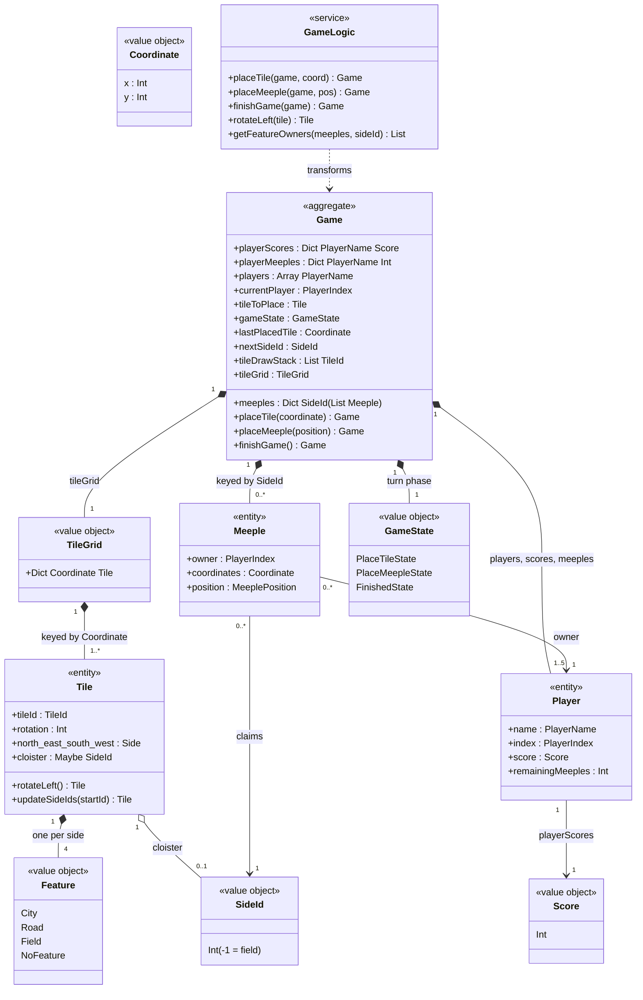

# Domain Model — Carcassonne

Repository: `Carcassonne` @ `ca2797745a863243fa6ce96af63435b0d67bf2ab`
Companion documents: [`./Specification.md`](./Specification.md)

This document is the domain model of the Carcassonne networked board game, rendered strictly from the analyst evidence (`evidence/domain.json`, cross-checked against `classes.json`, `flows.json`, `usecases.json`, `db.json` and spot-checked against the pinned source). Every element carries a backticked code citation. Items whose documented (readme) rule has no code counterpart are marked **UNVERIFIED** and are never presented as enforced; see [Assumptions & Unverified Items](#10-assumptions--unverified-items).

---

## 1. Introduction and Scope

- **System Name:** Carcassonne (Elm 0.19.1 + Lamdera — a browser multiplayer implementation of the Carcassonne tile-placement board game) `elm.json:6`, `elm.json:17-18`, `src/Backend.elm:18-25`
- **Purpose:** Let up to 5 named players play a full Carcassonne game in synchronized browsers: draw and place tiles, connect features through shared SideIds, claim features with meeples, score finished features by majority, and settle all remaining features at game end. `src/Types/Game.elm:28-40`, `src/Helpers/GameLogic.elm:323-508`, `src/Backend.elm:160-183`
- **Scope:**
  - **In scope:** the game domain — the `Game` aggregate and its parts (tiles, meeples, players, scores, draw stack, turn-phase state machine), the tileset catalog, the placement/claiming/scoring rules and their enforcement points, the lobby/registration context, domain events (state flips broadcast to clients), and the domain services. `src/Types/`, `src/Helpers/GameLogic.elm:1-556`, `src/Helpers/TileMapper.elm:9-253`, `src/Backend.elm:93-186`
  - **Deliberately excluded:** rendering/HTML details and styling (see `ClassModel.md`), the Lamdera wire protocol message surface (see `ClassModel.md` / `Flows.md`), the compiler-generated Evergreen state snapshots under `src/Evergreen/` (mirrors, not design — `src/Evergreen/Migrate/V10.elm:3`), persistence (there is no database in this repo; the game state lives only in the in-memory backend model — `src/Backend.elm:14-15`, see `DatabaseModel.md`), and the separate `review/` elm-review tooling project. `inventory.md`, `src/Evergreen/Migrate/V10.elm:3`

## 2. Ubiquitous Language (Glossary)

Shared vocabulary of the domain. Each term as it is used in this system, with its definition in code.

| # | Term | Definition in this system | Code Reference |
| :-- | :-- | :-- | :-- |
| 1 | **Tile** | A square map piece with four sides (north/east/south/west), each carrying a `SideId` and a `Feature`, plus an optional central cloister (`Maybe SideId`); a tile also carries its `TileId` (tileset design, used for rendering) and a rotation in degrees | `src/Types/Tile.elm:21-29`, `readme.md:97-103` |
| 2 | **Tileset** | The canonical collection of 24 tile designs (`TileId` 0–23) whose copy counts define the 72-tile game set: 71 tiles in the draw stack plus the single starting tile (Tile 0, city center with road) | `src/Helpers/TileMapper.elm:9-253`, `src/Types/Game.elm:102-104`, `src/Types/Game.elm:120-147` |
| 3 | **Feature** | The terrain kind on a tile side: `City`, `Road`, `Field`, or `NoFeature`; sides of the same `Feature` are the same connected feature when their `SideIds` are equal | `src/Types/Feature.elm:4-8`, `src/Helpers/TileMapper.elm:12-20` |
| 4 | **SideId** | A unique integer identifying one feature instance on the board; equal `SideIds` on touching tile sides mean the features are connected (merged into one); `-1` marks a field side, which has no identity; allocated sequentially from `nextSideId` when a tile is placed | `src/Types/Tile.elm:11-12`, `src/Types/Tile.elm:62-81`, `src/Helpers/GameLogic.elm:102-131`, `readme.md:101` |
| 5 | **Meeple** | A player figure claiming a feature: recorded with its owner (`PlayerIndex`), the board coordinate it sits on, and a placement position (`North`/`East`/`South`/`West`/`Center`); its claim is keyed by the `SideId` of the feature it occupies | `src/Types/Meeple.elm:17-23`, `readme.md:105-112` |
| 6 | **Player** | Identified only by a string name; seat order in the `Game.players` array (`PlayerIndex`) determines turn order and meeple color (red/blue/green/yellow/black for seats 0–4) | `readme.md:89-91`, `src/Types/Game.elm:31`, `src/Types/Meeple.elm:26-34` |
| 7 | **Game** | One live game instance: the tile grid, all placed meeples, per-player scores and meeple counts, the current player, the tile to be placed, the turn phase, the last placed tile, the next `SideId`, and the draw stack | `src/Types/Game.elm:28-40` |
| 8 | **TileGrid** | The board itself: a mapping from board coordinate to placed tile; the first (starting) tile occupies `(0, 0)` | `src/Types/Game.elm:20-21`, `src/Types/Game.elm:102-104` |
| 9 | **Coordinate** | A board cell as an `(x, y)` integer pair; the starting tile is at `(0, 0)` | `src/Types/Coordinate.elm:4-5`, `src/Types/Game.elm:104` |
| 10 | **Draw stack** | The list of tiles not yet placed (`List TileId`), shuffled at game start and after every turn; the first tile that can be placed in some rotation becomes the current player's `tileToPlace` | `src/Types/Game.elm:37`, `src/Types/Game.elm:120-147`, `src/Backend.elm:140-148`, `src/Backend.elm:170-178` |
| 11 | **Turn** | One player's complete action sequence: place the drawn tile, then optionally place a meeple on it (or skip), after which the turn passes to the next player in seat order, wrapping around | `readme.md:56-62`, `src/Helpers/GameLogic.elm:367`, `src/Helpers/GameLogic.elm:502-508`, `src/Types/Game.elm:78-84` |
| 12 | **GameState (turn phase)** | The three phases of the turn machine: `PlaceTileState` (current player must place the drawn tile), `PlaceMeepleState` (they may place a meeple on the just placed tile), `FinishedState` (no playable tile remains; final scoring has run) | `src/Types/GameState.elm:4-7`, `readme.md:113-117` |
| 13 | **Last placed tile** | The tile the current player just placed (its cell tracked as `lastPlacedTile`); it anchors meeple placement, `SideId` merging, and cloister-completion checks | `src/Types/Game.elm:35`, `src/Types/Game.elm:89-94` |
| 14 | **Cloister** | An optional center feature of a tile, stored as `Maybe SideId`; a completed cloister (all 8 surrounding cells filled) is worth 9 points; at game end it is worth 1 per adjacent tile plus 1 for itself | `src/Types/Tile.elm:28`, `src/Types/Tile.elm:52-57`, `src/Helpers/GameLogic.elm:211-251` |
| 15 | **Finished feature** | A feature whose every open side is bordered by an already placed tile; only finished features score during play (when the placing of a tile or meeple completes them) | `src/Helpers/GameLogic.elm:193-203`, `src/Helpers/GameLogic.elm:418-422` |
| 16 | **Majority** | The ownership rule for scoring: the player with the most meeples on a finished feature takes its points; if several players tie for the most, every tied player scores | `src/Helpers/GameLogic.elm:256-290`, `tests/MeepleTests.elm:47-58`, `readme.md:66-68` |
| 17 | **Score** | A player's total points (`Int`), credited in `placeMeeple` and `finishGame` when features finish | `src/Types/Score.elm:4-5`, `src/Types/Game.elm:29` |
| 18 | **Lobby** | The pre-game room: players register by name (unique and non-empty, at most 5), a player may kick another, the lobby can be killed, and `InitializeGame` starts the game | `src/Types.elm:11-17`, `src/Backend.elm:93-148` |

*Rule of thumb applied:* any term that means something specific to this game (a "feature" here is not a software feature; a "meeple" has a precise record shape) is defined above so frontend, backend, and business team use the same word. The full term list lives in this table; the class diagram in [Section 5](#5-domain-relationships) visualizes the core concepts only.

## 3. Bounded Contexts

The domain is divided into two logically distinct sub-domains, switched through the `BackendModel`/`FrontendModel` constructors of the single Lamdera process:

- **Context A — Carcassonne game** (the core domain): handles tile placement with `SideId` merging, meeple claiming/return, majority scoring of finished features, cloister scoring, the turn state machine, draw-stack dealing, and game finish.
  - Boundaries: `src/Types/`, `src/Helpers/GameLogic.elm`, `src/Helpers/TileMapper.elm`, `src/Helpers/FrontendHelpers.elm`, the game flow in `src/Backend.elm` (`InitializeGame`, `PlaceTile`, `PlaceMeeple`, `RotateTileLeft`, `TileDrawStackShuffled`), `tests/`. `src/Types/Game.elm:28-40`, `src/Helpers/GameLogic.elm:323-370`, `src/Helpers/GameLogic.elm:383-508`
  - Backend state carrier: `BeGamePlayed { game : Game }`. `src/Types.elm:15-17`

- **Context B — Player lobby / registration** (a supporting pre-game context): handles player registration (unique non-empty names, 5-player limit), kicking, lobby kill, and rejoining an in-progress game by registering the same name.
  - Boundaries: `src/Backend.elm:93-138`, `src/Views/PlayerRegistrationView.elm`, `src/Views/PlayerLobbyView.elm`, the `FePlayerRegistration`/`FeLobby` frontend states in `src/Frontend.elm`, and `src/Types.elm` (`BackendModel`/`FrontendModel`). `src/Backend.elm:93-138`, `src/Types.elm:11-17`, `src/Types.elm:20-33`
  - Backend state carrier: `BePlayerRegistration { players : List PlayerName }`. `src/Types.elm:12-14`

**Context map.** The two contexts are two exclusive variants of one state record — exactly one is active at a time (`BePlayerRegistration` vs `BeGamePlayed`), so the contexts communicate by transformation, not by integration contracts: the lobby hands over its registered names to `initializeGame`, and a late registration during `BeGamePlayed` re-enters the game context via `JoinedGame`. `src/Types.elm:11-17`, `src/Backend.elm:140-148`, `src/Backend.elm:120-123`

## 4. Core Domain Elements

Domain-Driven Design concepts of the game domain (with the lobby context's elements noted where they attach).

### 4.1. Entities

Objects with a distinct identity running through time and different states.

- **Game** (the live game instance; every game action returns a new `Game` with grid, meeples, scores, turn state, and draw stack mutated as one unit) `src/Types/Game.elm:28-40`
  - **Identity (ID):** the live in-memory Lamdera backend model — there is no persistence and no explicit game id (see [Assumptions & Unverified Items](#10-assumptions--unverified-items)). `src/Backend.elm:14-34`
  - **Attributes:** `playerScores : Dict PlayerName Score`, `playerMeeples : Dict PlayerName Int`, `players : Array PlayerName`, `currentPlayer : PlayerIndex`, `tileToPlace : Tile`, `gameState : GameState`, `lastPlacedTile : Coordinate`, `nextSideId : SideId`, `tileDrawStack : List TileId`, `tileGrid : TileGrid`, `meeples : Dict SideId (List Meeple)`. `src/Types/Game.elm:28-40`
  - **Behaviors/Methods:**
    - `initializeGame` — builds the starting grid (Tile 0 at `(0,0)`), 7-meeples-per-player, and the draw stack. `src/Types/Game.elm:53-73`
    - `placeTile` — inserts the tile, merges neighboring `SideIds`, advances the phase. `src/Helpers/GameLogic.elm:323-370`
    - `placeMeeple` — places/skips a meeple, scores finished features, returns finished meeples, advances the turn. `src/Helpers/GameLogic.elm:383-508`
    - `finishGame` — final settlement, clears meeples, sets `FinishedState`. `src/Helpers/GameLogic.elm:511-556`
    - `rotateLeft` (on `tileToPlace`) — rotates the drawn tile 90° counter-clockwise. `src/Backend.elm:150-158`
    - draw next playable tile from stack — reshuffle + deal. `src/Backend.elm:44-74`

- **Tile** (a map piece: one of 24 canonical designs that, once placed, occupies a board `Coordinate`; its sides are re-keyed with fresh `SideIds` and merged with neighbors on placement) `src/Types/Tile.elm:21-29`
  - **Identity (ID):** `TileId` (tileset design) before placement; `Coordinate` (board cell) once placed, with the `TileId` retained for rendering. `src/Types/Tile.elm:22`, `src/Types/Game.elm:102-104`
  - **Attributes:** `tileId : TileId`, `rotation : Int`, `north/east/south/west : Side { sideId, sideFeature }`, `cloister : Maybe SideId`. `src/Types/Tile.elm:21-29`
  - **Behaviors/Methods:**
    - `rotateLeft` — physically rotates the four sides. `src/Helpers/GameLogic.elm:21-40`
    - `updateSideIds` — re-keys the tile's `SideIds` from a starting value. `src/Types/Tile.elm:62-81`
    - `isRotatedCorrectly` — test-only rotation check, never called from app code. `src/Helpers/GameLogic.elm:45-95`, `tests/GameLogicTests.elm:14-56`

- **Meeple** (a placed player figure; its identity is the feature claim it makes — the `SideId` it is stored under — plus owner and board position) `src/Types/Meeple.elm:17-23`
  - **Identity (ID):** feature claim: stored under the `SideId` of the feature it occupies in `Game.meeples`, with owner/coordinates/position. `src/Types/Game.elm:24-25`, `src/Types/Game.elm:39`
  - **Attributes:** `owner : PlayerIndex`, `coordinates : Coordinate`, `position : MeeplePosition`. `src/Types/Meeple.elm:17-23`
  - **Behaviors/Methods:**
    - claim a side of the last placed tile (`placeMeeple` insert). `src/Helpers/GameLogic.elm:397-416`
    - re-keyed on feature merge (`replaceMeepleSideId`). `src/Helpers/GameLogic.elm:136-162`
    - returned to owner when its feature finishes. `src/Helpers/GameLogic.elm:470-492`
    - cleared at game end. `src/Helpers/GameLogic.elm:554`

- **Player** (a participant identified only by name; there is **no standalone `Player` type in code** — the player exists as entries in the `Game` record: `players` array, `playerScores`, `playerMeeples`) `readme.md:89-91`, `src/Types/Game.elm:29-32`
  - **Identity (ID):** `PlayerName` (unique string); seat index (`PlayerIndex`) in `Game.players` for turn order and meeple color. `src/Types/Game.elm:31`, `src/Types/Meeple.elm:26-34`
  - **Attributes:** `name : PlayerName`, `index : PlayerIndex` (position in `players` array), `score : Score` (in `playerScores`), `remainingMeeples : Int` (in `playerMeeples`). `src/Types/Game.elm:29-32`
  - **Behaviors/Methods:**
    - register in lobby. `src/Backend.elm:93-118`
    - kick. `src/Backend.elm:125-133`
    - score credited on finished features. `src/Helpers/GameLogic.elm:444-464`, `src/Helpers/GameLogic.elm:529-550`
    - meeple count decremented on placement / incremented on return. `src/Helpers/GameLogic.elm:482-500`

### 4.2. Value Objects

Objects that describe characteristics but have no conceptual identity; in Elm all of these are immutable by construction (closed types / `Int`/`String`/tuple aliases, updated only by building new values).

| Value Object | Attributes | Immutability Evidence | Code Reference |
| :-- | :-- | :-- | :-- |
| **Feature** | `City`, `Road`, `Field`, `NoFeature` | Closed Elm type; immutable by construction, used only as equality-compared data | `src/Types/Feature.elm:4-8`, `src/Helpers/GameLogic.elm:431` |
| **Side** | `sideId : SideId`, `sideFeature : Feature` | Elm record; updated only by constructing new records | `src/Types/Tile.elm:15-18`, `src/Helpers/GameLogic.elm:109-115` |
| **SideId** | `Int` (`-1` reserved for fields) | `type alias` to `Int`; every update builds new tiles/dicts | `src/Types/Tile.elm:11-12`, `src/Helpers/GameLogic.elm:102-131` |
| **Coordinate** | `x : Int`, `y : Int` | `type alias` to `(Int, Int)`; Elm tuple values are immutable | `src/Types/Coordinate.elm:4-5` |
| **PlayerIndex** | `Int` (0-based seat number) | `type alias` to `Int`; immutable Elm value | `src/Types/PlayerIndex.elm:4-5` |
| **PlayerName** | `String` (unique in the lobby, non-empty) | `type alias` to `String`; immutable Elm value | `src/Types/PlayerName.elm:4-5`, `readme.md:89-91` |
| **Score** | `Int` | `type alias` to `Int`; scores updated by building a new `Dict` | `src/Types/Score.elm:4-5`, `src/Helpers/GameLogic.elm:444-464` |
| **TileId** | `Int` (0–23) | `type alias` to `Int`; immutable Elm value | `src/Types/Tile.elm:7-8` |
| **MeeplePosition** | `Center`, `North`, `East`, `South`, `West`, `Skip` | Closed Elm type; immutable by construction | `src/Types/Meeple.elm:8-14` |

*Equality note (template rule of thumb):* two value objects with equal payloads are interchangeable — e.g., two `Coordinate`s with the same `(x, y)` key the same grid cell, and two `SideId`s with the same integer denote the same connected feature. `src/Types/Coordinate.elm:4-5`, `src/Helpers/GameLogic.elm:102-131`

### 4.3. Aggregates and Aggregate Root

- **Aggregate Root: `Game`** — the `Game` record is the single aggregate root of the game context: placing a tile rewrites the grid, re-keys meeples, and advances the turn phase and `SideId` counter in one step; placing a meeple rewrites meeples, scores, meeple counts, current player, and phase in one step. No part can be mutated independently. `src/Helpers/GameLogic.elm:364-370`, `src/Helpers/GameLogic.elm:502-508`
  - **Child Entities / Value Objects:**
    - `Tile` — placed tiles in `tileGrid`. `src/Types/Game.elm:38`
    - `Meeple` — placed meeples in `meeples`. `src/Types/Game.elm:39`
    - `Player` — players via `players` / `playerScores` / `playerMeeples`. `src/Types/Game.elm:29-32`
    - `Coordinate` — as grid keys. `src/Types/Game.elm:20-21`
    - `Score` — per-player totals. `src/Types/Score.elm:4-5`
  - **Consistency evidence:** `placeTile` updates `tileGrid` + `meeples` + `nextSideId` + `gameState` + `lastPlacedTile` together (`src/Helpers/GameLogic.elm:323-370`); `placeMeeple` updates `meeples` + `playerScores` + `playerMeeples` + `currentPlayer` + `gameState` together (`src/Helpers/GameLogic.elm:383-508`).
  - *Rule of thumb in this codebase:* external objects hold references only to the root — the backend mutates the `Game` record as a whole (`BeGamePlayed { game }`) and broadcasts the complete record to clients; no client or module holds a direct handle to an internal tile or meeple. `src/Types.elm:15-17`, `src/Backend.elm:58`
  - **Lobby context aggregate:** the lobby has no separate aggregate object — its only state is the `BePlayerRegistration { players : List PlayerName }` record, mutated by register/kick/kill handlers. `src/Types.elm:12-14`, `src/Backend.elm:93-138`

## 5. Domain Relationships

How the entities and the aggregate interact, with standard multiplicities (evidence rows DM-R1…DM-R6):

| # | Relationship | From → To | Cardinality | Meaning | Code Reference |
| :-- | :-- | :-- | :-- | :-- | :-- |
| R1 | Game contains placed Tiles | `Game` → `Tile` | 1:N | A game holds the placed tiles, keyed by board coordinate | `src/Types/Game.elm:38` |
| R2 | Game contains placed Meeples | `Game` → `Meeple` | 1:N | A game holds all placed meeples, keyed by the `SideId` of the feature they claim | `src/Types/Game.elm:24-25`, `src/Types/Game.elm:39` |
| R3 | Game seats Players | `Game` → `Player` | 1:N (1–5) | A game seats 1–5 players with per-player scores and meeple counts | `src/Types/Game.elm:29-32`, `src/Types/Game.elm:43-45` |
| R4 | Meeple claims a feature (`SideId`) | `Meeple` → `SideId` | 1:1 | A placed meeple belongs to exactly one feature instance, identified by the `SideId` key it is stored under | `src/Types/Game.elm:24-25`, `src/Helpers/GameLogic.elm:397-416` |
| R5 | Tiles form connected features via SideId | `Tile` → `Tile` | M:N (N:N) | Tiles whose touching sides share a `SideId` form one connected feature; placing a tile merges the adjacent sides' `SideIds` into the new tile's `SideId` across the whole grid and meeple index | `src/Helpers/GameLogic.elm:331-362`, `src/Helpers/GameLogic.elm:102-131`, `src/Helpers/GameLogic.elm:136-162` |
| R6 | Player owns Meeples | `Player` → `Meeple` | 1:N | Each meeple records its owner's `PlayerIndex`; a player's remaining meeple count is tracked in `playerMeeples` | `src/Types/Meeple.elm:18`, `src/Types/Game.elm:30` |

Supporting associations used by the diagram: `Tile` → `TileGrid` (a grid cell holds one tile, `src/Types/Game.elm:20-21`); `Tile` → `Feature` (one `Feature` per side, `src/Types/Tile.elm:15-18`); `Tile` → `SideId` (optional cloister, `src/Types/Tile.elm:28`); `Player` → `Score` (`src/Types/Game.elm:29`); `Game` → `GameState` (`src/Types/Game.elm:34`); service dependencies `GameLogic ..> Game` and `GameLogic ..> TileMapper` (`src/Helpers/GameLogic.elm:10`, `src/Helpers/GameLogic.elm:5`).

### Class diagram (core domain)

**Node map** (covers every node id in the diagram above):

| Node | Element | Code Reference |
| :-- | :-- | :-- |
| `Game` | Aggregate root — the live game instance (record `Game`) | `src/Types/Game.elm:28-40` |
| `TileGrid` | The board — `Dict Coordinate Tile`, starting tile at `(0,0)` | `src/Types/Game.elm:20-21` |
| `Tile` | Entity — map piece with 4 sides, optional cloister, rotation | `src/Types/Tile.elm:21-29` |
| `Feature` | Value object — closed enum `City`/`Road`/`Field`/`NoFeature` | `src/Types/Feature.elm:4-8` |
| `Meeple` | Entity — placed player figure `{ owner, coordinates, position }` | `src/Types/Meeple.elm:17-23` |
| `Player` | Entity (implicit) — name + seat index + score + meeple count entries in `Game` | `src/Types/Game.elm:29-32` |
| `Score` | Value object — player's total points (`Int`) | `src/Types/Score.elm:4-5` |
| `Coordinate` | Value object — board cell `(Int, Int)` | `src/Types/Coordinate.elm:4-5` |
| `SideId` | Value object — feature-instance integer (`-1` = field) | `src/Types/Tile.elm:11-12` |
| `GameState` | Value object — turn-phase enum `PlaceTileState`/`PlaceMeepleState`/`FinishedState` | `src/Types/GameState.elm:4-7` |
| `GameLogic` | Domain service — module `Helpers.GameLogic` (pure `Game → Game` transformations) | `src/Helpers/GameLogic.elm:1-556` |

## 6. Business Rules & Invariants

The critical logic that must always remain true. Rules whose documented (readme) statement has no code counterpart are marked **UNVERIFIED — not enforced in code** and are listed for completeness only; they are never presented as enforced.

| # | Rule (business statement) | Enforced by | Status |
| :-- | :-- | :-- | :-- |
| RL1 | A tile must be placed adjacent to the existing board, on an empty orthogonally adjacent cell, with all touching sides matching the neighboring features | `src/Helpers/FrontendHelpers.elm:48-85` (`tileCanBePlaced`), `src/Helpers/FrontendHelpers.elm:89-110` (`getCoordinatesToBePlacedOn`); **UI-enforced only** — clickable cells are limited to valid coordinates and shown only to the current player (`src/Views/GameView.elm:58-75`, `src/Views/GameView.elm:318-333`); the backend `placeTile` explicitly does not re-validate (`src/Helpers/GameLogic.elm:311-315`) | ENFORCED (UI only) |
| RL2 | If the drawn tile cannot be placed anywhere, a new tile is drawn (unplaceable tiles are skipped and silently dropped from the draw stack — they are never re-inserted and can never be placed) | `src/Helpers/FrontendHelpers.elm:120-143` (`tileCanBePlacedAnywhere` + `getPlayableTileFromDrawstack`), consumed at game start (`src/Backend.elm:44-59`) and after each meeple phase (`src/Backend.elm:61-74`) | ENFORCED (code; readme divergence — see Assumptions) |
| RL3 | A drawn tile's rotation must match its canonical tileset rotation (features aligned with the rotation) | `src/Helpers/GameLogic.elm:21-40` — `rotateLeft` rotates the actual side data, so the invariant holds by construction; `isRotatedCorrectly` (`src/Helpers/GameLogic.elm:45-95`) verifies rotations 0/90/180/270 against the tileset and is pinned by tests (`tests/GameLogicTests.elm:14-56`) but is never invoked from app code | ENFORCED (by construction; runtime check unused) |
| RL4 | Features connect: sides of the same feature on touching tiles are unified under a single `SideId` when a tile is placed | `src/Helpers/GameLogic.elm:331-362` (`placeTile` reads each neighbor's facing `SideId`, then `replaceTileSideId`/`replaceMeepleSideId` rewrite the grid and meeple index); new `SideIds` allocated via `updateSideIds` (`src/Types/Tile.elm:62-81`) and `nextSideId` (`src/Helpers/GameLogic.elm:329, 366`) | ENFORCED (code) |
| RL5 | Points are counted immediately only for cities, roads, or cloisters that have been finished | `src/Helpers/GameLogic.elm:193-203` (`isFeatureFinished`) applied as the filter over the last placed tile's `SideIds` in `placeMeeple` (`src/Helpers/GameLogic.elm:418-422`); open/unmerged features do not score | ENFORCED (code) |
| RL6 | Completed roads and cities score per tile, with the 2× bonus for larger cities completed before the game ends | `src/Helpers/GameLogic.elm:426-435` (`countFeature` = number of tiles with that `SideId`, `src/Helpers/GameLogic.elm:170-188`; doubled when `score > 2` and `getSideIdFeature == City`, `src/Helpers/GameLogic.elm:431-432`) — the 2× bonus applies **only above 2 tiles**; `readme.md:71` states a flat 2 points per tile for every completed city, which the code does not enforce for 1–2 tile cities | ENFORCED (code; readme divergence — see Assumptions) |
| RL7 | A completed cloister (all adjacent tiles filled) scores 9 points immediately | `src/Helpers/GameLogic.elm:211-224` (`countCloister` counts the 8 neighbors + self), `src/Helpers/GameLogic.elm:230-251` (`getAdjacentTileCloisterScores` awards 9 where `countCloister == 9`), appended to the finished-feature scores in `placeMeeple` (`src/Helpers/GameLogic.elm:438`) | ENFORCED (code) |
| RL8 | When the game ends, incomplete roads/cities score 1 per tile and incomplete cloisters score per adjacent tile (+1 for itself) | `src/Helpers/GameLogic.elm:511-527` (`finishGame`: feature scores via `countFeature` for every `SideId` in the meeple index; cloister scores via `countCloister` for every cloister in the grid) | ENFORCED (code) |
| RL9 | Most meeples on the feature wins; on a tie all tied players score | `src/Helpers/GameLogic.elm:256-290` (`getFeatureOwners` returns every player with the maximum count), consumed in `placeMeeple` (`src/Helpers/GameLogic.elm:444-464`) and `finishGame` (`src/Helpers/GameLogic.elm:529-550`); tie case pinned by tests (`tests/MeepleTests.elm:47-58`) | ENFORCED (code) |
| RL10 | Once a feature side is claimed, no more meeples may be placed on it | `src/Helpers/FrontendHelpers.elm:27-43` (`getMeeplePositionsToBePlacedOn` filters out positions whose `SideId` already has meeples, `Dict.get sideId meeples == Nothing`); **UI-enforced only** — only open positions render as clickable circles (`src/Views/GameView.elm:524-539`); the backend `placeMeeple` does not re-validate (`src/Helpers/GameLogic.elm:373-382`) | ENFORCED (UI only) |
| RL11 | Players have a limited meeple pool (7); used meeples come back when their feature is scored; with no meeples left a player must skip | `src/Types/Game.elm:61` (`initializeGame` sets `playerMeeples` to 7); `src/Helpers/GameLogic.elm:493-500` (decrement on placement, no decrement on `Skip`); `src/Helpers/GameLogic.elm:470-492` (return meeples of finished features to their owners); `src/Helpers/FrontendHelpers.elm:28-43` (only `[Skip]` is offered when the count is 0) | ENFORCED (code) |
| RL12 | Each turn consists of placing a tile, then optionally a meeple, then the next player plays (wrapping from last to first) | `placeTile` sets `gameState = PlaceMeepleState` (`src/Helpers/GameLogic.elm:367`); `placeMeeple` sets `gameState = PlaceTileState` and `currentPlayer = getNextPlayer` (`src/Helpers/GameLogic.elm:502-508`, `src/Types/Game.elm:78-84`); the new current player's tile is dealt when the previous turn's stack is reshuffled (`src/Backend.elm:170-178`) | ENFORCED (code) |
| RL13 | When there are no more tiles that can be placed, the game is finished and remaining features are scored | `src/Helpers/FrontendHelpers.elm:132-143` (`getPlayableTileFromDrawstack` returns `Nothing` when no tile fits); `src/Backend.elm:76-84` (calls `finishGame` and broadcasts the final state); `src/Helpers/GameLogic.elm:552-556` (`gameState = FinishedState`, meeples cleared) — the code ends as soon as no remaining tile is placeable, which can be before the stack is exhausted, whereas `readme.md:74` phrases the end condition as "once all of the tiles have been drawn" | ENFORCED (code; readme divergence — see Assumptions) |
| RL14 | A lobby holds at most 5 uniquely named players (names non-empty) | `src/Types/Game.elm:43-45` (`playerLimit = 5`); `src/Backend.elm:95-102` (duplicate name rejected); `src/Backend.elm:110-118` (`LobbyIsFull` when the limit is exceeded); `src/Frontend.elm:50-57` (empty names rejected client-side) | ENFORCED (code) |
| RL15 | At the end of the game a field scores 3 points for each finished city touching it | — | **UNVERIFIED — not enforced in code.** Documented in `readme.md:79` only: field sides carry `SideId -1`, which is excluded from the scored `SideId` set (`src/Types/Tile.elm:42-45`) and scores 0 (`src/Helpers/GameLogic.elm:172-173`); `finishGame` scores only meeple-index `SideIds` and cloisters (`src/Helpers/GameLogic.elm:511-527`); no field-completion or 3-points-per-city logic exists anywhere |
| RL16 | Players may claim fields with meeples (a meeple can be placed on the city, road, cloister, and field of the just placed tile) | — | **UNVERIFIED — not enforced in code.** Documented in `readme.md:61` only: the placement UI explicitly excludes field sides (`SideId -1`) from meeple placement (`src/Helpers/FrontendHelpers.elm:33-40`), so fields are unclaimable in this system and no field meeple can exist to score |
| RL17 | Placement is disabled while debug mode shows the `SideId` overlay | — | **UNVERIFIED — not enforced in code.** Documented in `readme.md:129` only: the debug overlay is a non-interactive layer (`pointer-events: none`, `src/Views/GameView.elm:542-590`, line 582) and the clickable placement overlays remain active while debug mode is on (`src/Views/GameView.elm:64-75`, `src/Views/GameView.elm:131-142`, `src/Views/GameView.elm:318-333`) |

## 7. Domain Events

Significant occurrences the rest of the system reacts to. In this codebase, "events" are the `ToFrontend` state flips the Lamdera backend sends (per-client `sendToFrontend`) or broadcasts (`broadcast`) to all clients; game-phase events are delivered as whole-`Game` pushes rather than dedicated event objects.

| Event (past tense) | Trigger | Subscribers | Code Reference |
| :-- | :-- | :-- | :-- |
| **PlayerRegistered** — a player's name is registered in the lobby (also re-sent to the registering client on new connections and on duplicate-name rejection, and broadcast to all clients when another player registers; a full lobby is rejected) | `RegisterPlayer` accepted in `BePlayerRegistration` (`src/Backend.elm:105-113`); also sent on connect (`src/Backend.elm:40-42`) and on duplicate rejection (`src/Backend.elm:99-102`) | Frontend lobby handler (`PlayerRegistrationUpdated`) — `src/Frontend.elm:95-96` | `src/Backend.elm:93-118`, `src/Types.elm:67-70` |
| **PlayerKicked** — a lobby player has been kicked; the kicked client drops back to name registration | `KickPlayer` handled in `BePlayerRegistration` (`src/Backend.elm:125-133`) | Frontend lobby handler (`PlayerKicked`) — `src/Frontend.elm:98-105` | `src/Backend.elm:125-133`, `src/Types.elm:71-74` |
| **LobbyKilled** — the lobby has been dissolved; all clients return to name registration | `KillLobby` handled in `BePlayerRegistration` (`src/Backend.elm:135-138`) | Frontend lobby handler (`LobbyKilled`) — `src/Frontend.elm:117-123` | `src/Backend.elm:135-138`, `src/Types.elm:76` |
| **GameInitialized** — the game has started: the `Game` aggregate is created, the draw stack shuffled, and the first playable tile dealt; clients move from lobby to the game view | `InitializeGame` handled in `BePlayerRegistration` (`src/Backend.elm:140-148`) followed by the shuffled-stack draw (`src/Backend.elm:44-59`) | Frontend lobby handler (`GameInitialized`) — `src/Frontend.elm:134-141` | `src/Backend.elm:140-148`, `src/Types.elm:77-79` |
| **TileRotated** — the current player rotated the drawn tile 90° counter-clockwise; delivered as a full state update | `RotateTileLeft` handled in `BeGamePlayed` (`src/Backend.elm:150-158`) | Frontend game handler (`UpdateGameState`) — `src/Frontend.elm:143-150` | `src/Backend.elm:150-158` |
| **TilePlaced** — the current player placed the tile: the grid grew, neighboring `SideIds` merged, and the turn entered the meeple phase; delivered as a full state update | `PlaceTile` handled in `BeGamePlayed` (`src/Backend.elm:160-168`) | Frontend game handler (`UpdateGameState`) — `src/Frontend.elm:143-150` | `src/Backend.elm:160-168`, `src/Helpers/GameLogic.elm:323-370` |
| **TileDrawn** — after the previous player placed or skipped a meeple, the stack was reshuffled and the next playable tile was dealt to the new current player (the drawn tile is visible to all clients) | `PlaceMeeple` handled in `BeGamePlayed` (`src/Backend.elm:170-178`) triggering the shuffled draw (`src/Backend.elm:61-74`) | Frontend game handler (`UpdateGameState`) — `src/Frontend.elm:143-150` | `src/Backend.elm:170-178`, `src/Backend.elm:61-74` |
| **GameFinished** — no playable tile remained: final scoring ran, all meeples were cleared, and the state became `Finished`; there is **no dedicated event** — score changes ride inside the `Game` record of `UpdateGameState` | `getPlayableTileFromDrawstack` returned `Nothing` (`src/Backend.elm:76-84`) → `finishGame` (`src/Helpers/GameLogic.elm:511-556`) | Frontend game handler (`UpdateGameState`) — `src/Frontend.elm:143-150` | `src/Backend.elm:76-84`, `src/Helpers/GameLogic.elm:511-556` |
| **GameTerminated** — a client requested termination (Terminate Game sidebar button): the backend discards the game and resets to an empty lobby; clients return to name registration | `TerminateGame` handled in `BeGamePlayed` (`src/Backend.elm:180-183`) | Frontend game handler (`GameTerminated`) — `src/Frontend.elm:152-153` | `src/Backend.elm:180-183`, `src/Types.elm:86`, `src/Views/GameView.elm:743-745` |

## 8. Domain Services

Operations that do not conceptually belong to any single entity or value object.

- **GameLogic** (module `Helpers.GameLogic`) — the core domain service: tile rotation, feature-finished detection, feature/cloister scoring, majority-owner computation, meeple placement and return, turn-state transitions, and end-of-game settlement.
  - **Responsibilities:** `rotateLeft`, `isRotatedCorrectly` (test-only), `SideId` merging (`replaceTileSideId`/`replaceMeepleSideId`), `countFeature`/`countCloister`, `isFeatureFinished`, `getFeatureOwners`, `getSideIdFeature`, `placeTile`, `placeMeeple`, `finishGame`. `src/Helpers/GameLogic.elm:1-556`

- **TileMapper** (module `Helpers.TileMapper`) — the canonical tileset service: maps a `TileId` (0–23) to its `Tile` design (sides with `SideIds` and `Features`, optional cloister); unknown ids fall back to the starting tile.
  - **Responsibilities:** hand-written tile definitions for the 24 base-game designs; the single source of truth for tile geometry, consumed by game initialization (`src/Types/Game.elm:66, 104`), rotation validation (`src/Helpers/GameLogic.elm:50`), and draw-stack dealing (`src/Helpers/FrontendHelpers.elm:136`). `src/Helpers/TileMapper.elm:9-253`

- **FrontendHelpers** (module `Helpers.FrontendHelpers`) — the playability query service (imported **by the backend** as well, so it is shared server/client logic, not frontend-only): which board coordinates a tile can be placed on, whether a tile is placeable in any rotation, which tile of the shuffled stack is the next playable one, and which meeple positions are still open on the last placed tile.
  - **Responsibilities:** `getMeeplePositionsToBePlacedOn`, `tileCanBePlaced`, `getCoordinatesToBePlacedOn`, `tileCanBePlacedAnywhere`, `getPlayableTileFromDrawstack`, `toMeepleCoordinates` (rendering). `src/Helpers/FrontendHelpers.elm:27-143`

## 9. Cross-Cutting Invariant Notes

- **Client-trusted rules:** `placeTile`/`placeMeeple` carry the explicit doc "Does not check whether the move is valid" (`src/Helpers/GameLogic.elm:311-322`, `src/Helpers/GameLogic.elm:373-382`), and `ToBackend` messages carry no check against `currentPlayer` (`src/Types.elm:50-58`) — placement, claiming, and turn ownership are enforced only by the UI-side helpers and views; a tampered client could send out-of-turn or invalid moves.
- **No persistence:** the whole `Game` aggregate lives only in the backend process memory; a server restart with no Evergreen snapshot loses the game (`src/Backend.elm:14-34`, `src/Evergreen/Migrate/V10.elm:3-18`).
- **Determinism at the edges:** the draw stack is the only randomized input, injected by the Lamdera platform executing `Random.generate Random.List.shuffle` (`src/Backend.elm:147, 177`); all rule logic is pure (`src/Helpers/GameLogic.elm:1-556`).

## 10. Assumptions & Unverified Items

Every divergence, gap, and assumption discovered by the analysts, with rationale. Items marked **UNVERIFIED** have no verified code counterpart and must not be treated as system behavior.

1. **Field scoring not implemented (UNVERIFIED).** `readme.md:79` documents 3 points per touching finished city at game end, but field sides carry `SideId -1`, excluded from the scored `SideId` set (`src/Types/Tile.elm:42-45`) and scoring 0 (`src/Helpers/GameLogic.elm:172-173`); `finishGame` scores only meeple-index `SideIds` and cloisters (`src/Helpers/GameLogic.elm:511-527`). **Rationale:** fields are unclaimable and unscorable in this system; the rule exists only in the readme.
2. **Field meeple claiming not implemented (UNVERIFIED).** `readme.md:61` says a meeple can be placed on the field of the just placed tile, but the placement UI explicitly excludes field sides (`SideId -1`) from meeple placement (`src/Helpers/FrontendHelpers.elm:33-40`). **Rationale:** no field meeple can ever exist, so the readme rule and the companion field-scoring rule (item 1) are both dead.
3. **Debug-mode placement block not implemented (UNVERIFIED).** `readme.md:129` claims tiles/meeples cannot be placed while debug mode is on, but the debug overlay is `pointer-events: none` (`src/Views/GameView.elm:542-590`, line 582) while the clickable placement overlays remain active (`src/Views/GameView.elm:64-75`, `src/Views/GameView.elm:131-142`, `src/Views/GameView.elm:318-333`). **Rationale:** debug mode is a read-only visual layer.
4. **2× city bonus threshold diverges from the readme (UNVERIFIED as written).** `readme.md:71` states a flat 2 points per tile for every completed city; the code applies 2× only when the city has more than 2 tiles (`src/Helpers/GameLogic.elm:431-432`: `score > 2 && getSideIdFeature == City`). **Rationale:** the code's comment ("Cities that are larger than 2 tiles give 2x points if they are completed before the game ends") is the enforced behavior; the readme is stricter.
5. **Game-end condition diverges from the readme (UNVERIFIED as written).** `readme.md:74` ends the game "once all of the tiles have been drawn"; the code ends as soon as no remaining tile is placeable, which can be before the stack is exhausted (`src/Helpers/FrontendHelpers.elm:132-143`, `src/Backend.elm:76-84`). **Rationale:** the code's placeability check is the enforced condition.
6. **No winner determination (UNVERIFIED).** `readme.md:117` says "Score is counted and winner is determined", but `finishGame` (`src/Helpers/GameLogic.elm:511-556`) only finalizes scores and sets `FinishedState`; no winner object, message, or comparison exists — the winner is implicit from the displayed scores (`src/Views/GameView.elm:694`).
7. **No persistence and no explicit game identity.** There is no `GameId`, no repository, and no reload/resume of a game; the `Game` aggregate lives only in the backend process memory (`src/Backend.elm:14-34`). The Lamdera platform serializes the backend model across sessions/deploys (implied by `src/Evergreen/Migrate/V10.elm:3-18`), but the concrete storage backend is outside the repo and **UNVERIFIED**.
8. **Feature instances are implicit via `SideId`.** A feature (city/road) is not an object: it exists only as a `SideId` shared across tile sides, with size and ownership computed on demand (`src/Helpers/GameLogic.elm:170-188`, `src/Helpers/GameLogic.elm:256-290`). There is no Feature aggregate and no finished-feature event object.
9. **`isRotatedCorrectly` is unused at runtime (UNVERIFIED as a runtime control).** It is defined and unit-tested (`src/Helpers/GameLogic.elm:45-95`, `tests/GameLogicTests.elm:14-56`) but never called from app code; rotation integrity is maintained only by construction via `rotateLeft` (`src/Helpers/GameLogic.elm:21-40`).
10. **Tileset is 24 designs / 72 tiles, not 74 (UNVERIFIED "74").** `initializeDrawStack` lists 71 copies of the 24 designs (`src/Types/Game.elm:120-147`) plus the starting tile (`src/Types/Game.elm:102-104`); the planner's "74-tile" figure has no code counterpart. Unknown `TileIds` silently fall back to the starting tile (`src/Helpers/TileMapper.elm:252-253`).
11. **Backend does not re-validate placement/claiming or turn ownership.** Placement validity and turn rules are enforced only by UI-side helpers and views (`src/Helpers/FrontendHelpers.elm:48-110`, `src/Views/GameView.elm:58-75`); `placeTile`/`placeMeeple` explicitly skip validation (`src/Helpers/GameLogic.elm:311-322`, `src/Helpers/GameLogic.elm:373-382`). **Rationale:** trust boundary is the browser client; a second player's client could send `PlaceTile`/`PlaceMeeple` out of turn.
12. **Meeple economy diverges from the readme.** `readme.md:50` says "6 meeples + 1 meeple that goes on the score track"; the code initializes a flat 7 meeples per player with no score track (`src/Types/Game.elm:61`). The code value is modeled.
13. **The advice rule has no channel (UNVERIFIED).** `readme.md:81-85` describes players commenting on the drawn tile; there is no chat/comment message — the drawn tile is visible to all clients only incidentally as part of the whole-`Game` broadcast (`src/Backend.elm:73`).
14. **`GameFinished` is not a dedicated event.** It is delivered as the regular `UpdateGameState` full-state push; score changes ride inside the `Game` record (`src/Backend.elm:76-84`, `src/Types.elm:80-82`).
15. **The `Player` entity is implicit (assumption).** No standalone `Player` type exists; the player is modeled as a `PlayerName`-keyed cluster of fields in the `Game` record (`src/Types/Game.elm:29-32`), matching the readme's "Just identified by string name" (`readme.md:89-91`). This document's `Player` entity is therefore an analytical grouping, not a code type.
16. **No turn timers or timeouts.** Frontend subscriptions are `Sub.none` (`src/Frontend.elm:28`); the only backend subscription is `Lamdera.onConnect` (`src/Backend.elm:189-191`), so a player may stall a turn indefinitely; whether the Lamdera host layer imposes any timeout is **UNVERIFIED** (outside the repo).
17. **Dropped unplaceable tiles diverge from the readme (UNVERIFIED as written).** `readme.md:60` says an unplaceable drawn tile is "shuffle[d] back" and a new one drawn, but the code skips unplaceable tiles and silently drops them from the draw stack — `getPlayableTileFromDrawstack` recurses on `rest` alone and the backend stores the returned remainder as the new stack (`src/Helpers/FrontendHelpers.elm:132-143`, `src/Backend.elm:53`, `src/Backend.elm:69`). **Rationale:** a dropped tile is never re-inserted and can never be placed; the code's discard behavior is the enforced one.
