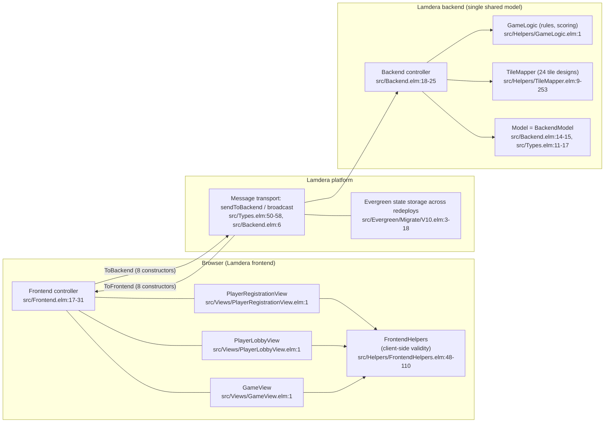

# Carcassonne — Program Specification

## 1. Executive Summary
* **Project Name:** Carcassonne
* **Version:** 1.0
* **Author(s):** Codebase Modeler multi-agent network (analyst evidence + writer rendering)
* **Date:** 2026-09-14
* **Purpose:** A multi-player browser implementation of the Carcassonne board game. Players register in a shared lobby, then take turns drawing tiles from a shuffled stack, placing them on a growing board, and placing meeples to claim features (roads, cities, cloisters, monasteries); finished features score points immediately by majority, with remaining features scored at end of game. The system keeps a single authoritative game model in a shared in-memory backend and broadcasts the whole state to every connected browser, so all clients always see the same board. Source of record: repository pinned at commit `ca2797745a863243fa6ce96af63435b0d67bf2ab`.
* **Target Audience:** 2–5 human players playing together through browser clients — the lobby is capped at 5 players (`src/Types/Game.elm:43-45`, `src/Backend.elm:105-110`) and every registered player is an equal actor with no host/admin role (evidence `usecases.json` UC-A1, `src/Views/PlayerLobbyView.elm:20-37`).

## 2. Project Scope
* **In-Scope:**
  * Player lobby: name registration with client-side non-empty validation (`src/Frontend.elm:50-62`), duplicate-name rejection and a 5-player limit enforced server-side (`src/Backend.elm:93-118`), kicking players and killing the lobby (`src/Backend.elm:125-138`), and rejoining an in-progress game on connect (`src/Backend.elm:120-123`).
  * Game: shuffled 71-tile draw stack (`src/Types/Game.elm:120-147`), turn loop of tile placement (`src/Helpers/GameLogic.elm:323-370`), tile rotation (`src/Helpers/GameLogic.elm:21-40`), meeple placement or skip with immediate majority scoring and a 2x bonus for completed cities above 2 tiles (`src/Helpers/GameLogic.elm:383-508`), and end-of-game final scoring when no playable tile remains (`src/Helpers/GameLogic.elm:511-556`).
  * Terminate Game control that resets to the empty lobby (`src/Views/GameView.elm:743-745`, `src/Backend.elm:180-183`).
  * CI quality gates: elm-review lint, compilation of both entry points, and elm-test unit tests (`.github/workflows/test.yaml:33-46`).
* **Out-of-Scope:**
  * Field play and field scoring — documented in `readme.md:61` and `readme.md:79` but not implemented: field sides carry `SideId -1` and are excluded from meeple placement and scoring (UNVERIFIED-in-code; evidence `domain.json` RL15/RL16).
  * Score track / 6+1 meeple economy — `readme.md:50-52` claims it, the code gives a flat 7 meeples and no score track (`src/Types/Game.elm:61`).
  * Winner determination — `readme.md:117` claims it; `finishGame` only finalizes scores and sets `FinishedState` (`src/Helpers/GameLogic.elm:511-556`).
  * Turn timers / timeouts — none exist in code (UNVERIFIED at the Lamdera host layer).
  * Chat / "advice" channel for the drawn tile — `readme.md:81-85` has no code counterpart.
  * Anything database-related: there is no DBMS, ORM, or data-access layer in this repository.
* **Assumptions & Constraints:**
  * Functional surface only — all move/turn validation is client-side; the backend applies `ToBackend` messages without re-checking validity or turn ownership (`src/Helpers/GameLogic.elm:311-314`, `src/Helpers/GameLogic.elm:373-376`). A tampered client could place invalid tiles or meeples.
  * The entire game (players, board, scores) lives in the in-memory Lamdera backend model; a single `BackendModel` is the whole shared state (`src/Backend.elm:14-15`), so at most one game runs at a time.
  * `src/Evergreen/` is compiler-generated Lamdera state versioning, not hand-written logic (`src/Evergreen/Migrate/V10.elm:3`).

## 3. System Architecture & Technology Stack
* **3.1 High-Level Architecture:** The architecture is a single Elm codebase split into two Lamdera entry points: a browser frontend (`src/Frontend.elm:17-31`) that renders three views and sends `ToBackend` messages, and a server-side backend (`src/Backend.elm:18-25`) that owns the one shared game model, applies `ToBackend` messages via `GameLogic`/`TileMapper`, re-enters itself on `Random` commands for shuffling, and broadcasts `ToFrontend` messages to every connected client (`src/Backend.elm:6`). The Lamdera platform additionally persists the backend model across redeploys using compiler-generated Evergreen snapshots (`src/Evergreen/Migrate/V10.elm:3-18`). There is no database service, no HTTP API, and no third-party runtime service beyond the platform itself.

Node map:

| Node | Element | Code Reference |
|---|---|---|
| FE | Frontend Elm app / update loop | `src/Frontend.elm:17-31` |
| V1 | Registration screen (name input, error, Kill lobby) | `src/Views/PlayerRegistrationView.elm:16-37` |
| V2 | Lobby screen (player list, Start, Kick) | `src/Views/PlayerLobbyView.elm:20-37` |
| V3 | Game board + overlays + turn controls | `src/Views/GameView.elm:28-29,327,533,741` |
| FH | Client-side placement/meeple-position validation shared by backend too | `src/Helpers/FrontendHelpers.elm:48-110` |
| TR | Lamdera transport: `sendToBackend`, `broadcast`, `sendToFrontend` | `src/Types.elm:50-58`, `src/Backend.elm:6` |
| EV | Evergreen compiler-generated state snapshots/migrations | `src/Evergreen/Migrate/V10.elm:3-18` |
| BE | Backend app: init/update/updateFromFrontend | `src/Backend.elm:18-25` |
| GL | Game rules, SideId merging, scoring | `src/Helpers/GameLogic.elm:1` |
| TM | Hand-written tileset data (24 designs, ids 0–23) | `src/Helpers/TileMapper.elm:9-253` |
| ST | Single shared backend state record | `src/Backend.elm:14-15`, `src/Types.elm:11-17` |

* **3.2 Technology Stack:**
    * **Frontend:** Elm 0.19.1 browser application (`elm/browser` + `elm/html` virtual DOM) built and served by the Lamdera frontend runtime — `elm.json:6`, `elm.json:9`, `elm.json:12`, `src/Frontend.elm:17-31`; styling via `src/Styles.elm:1`.
    * **Backend:** Elm 0.19.1 server-side application on the Lamdera backend runtime (`lamdera/core` + `lamdera/codecs`) — `elm.json:17-18`, `src/Backend.elm:18-25`. Shuffling uses Elm `Random` commands executed by the backend (`src/Backend.elm:147`, `src/Backend.elm:177`).
    * **Database:** None in this repository. State lives only in the in-memory Lamdera backend `Model` (`src/Backend.elm:14-15`); the only persistence-related artifacts are compiler-generated Evergreen state snapshots and migrations consumed by the Lamdera platform (`src/Evergreen/Migrate/V10.elm:3-18`). No SQL, no ORM, no connection strings.
    * **Data Processing & Analytics:** None.
    * **Infrastructure & DevOps:** Lamdera platform hosting with git-remote auto-deploy (`readme.md:139-151`) and a GitHub Actions pipeline running elm-review, compilation of both entry points, and elm-test (`.github/workflows/test.yaml:33-46`). Testing toolchain: `elm-explorations/test` (`elm.json:16`). Code linting: elm-review (`review/` tooling project, `.github/workflows/test.yaml:36-37`).
## 4. Functional Requirements
* **User Authentication & Authorization:** None. There is no login, session identity, or role system: the only identity control is unique, non-empty player names in the lobby (`src/Backend.elm:95-101`, `src/Types/PlayerName.elm:4-5`). There is a single PLAYER role; the "Kill lobby" affordance is situational — rendered only to the client whose registration was rejected because the lobby is full (`src/Views/PlayerRegistrationView.elm:29-37`). The backend message handlers carry no sender-identity check (`src/Backend.elm:125-133`, `src/Backend.elm:140-148`).
* **Core Features:** One entry per use case; full step-by-step flows and actor diagrams are in `./UseCaseModel.md` and `./ActivityDiagram.md`.

| ID | Feature (acceptance criteria) | Entry point | Code Reference |
|---|---|---|---|
| UC-01 | Register a player: trimmed non-empty name (`src/Frontend.elm:50-62`); backend rejects duplicates and enforces the 5-player limit (`src/Backend.elm:93-118`); updated roster broadcast to all clients | Name submit in registration view | `src/Views/PlayerRegistrationView.elm:16-26`, `src/Backend.elm:93-118` |
| UC-02 | Kick a player from the lobby: every lobby client sees a kick control; kicked client is sent back to the registration screen (`src/Frontend.elm:98-124`) | Kick button in lobby view | `src/Views/PlayerLobbyView.elm:30-37`, `src/Backend.elm:125-133` |
| UC-03 | Start a new game: `initializeGame` builds the draw stack and starting grid (`src/Types/Game.elm:53-73`), `Random.generate` shuffles it (`src/Backend.elm:147`), the first playable tile is chosen skipping unplaceables (`src/Backend.elm:44-59`), all clients switch to the game view | Start button in lobby view | `src/Views/PlayerLobbyView.elm:20-23`, `src/Backend.elm:140-148` |
| UC-04 | Place a tile on the board (turn step 1): inserts the tile, merges `SideId`s of adjacent features across grid and meeple dict, advances to the meeple phase; validity is checked client-side only (`src/Helpers/FrontendHelpers.elm:48-110`) | Board cell click (placeable overlay) | `src/Views/GameView.elm:327`, `src/Helpers/GameLogic.elm:323-370` |
| UC-05 | Rotate the drawn tile: `rotateLeft` permutes the four sides with an overflow guard; correctness cross-checked against the canonical tileset definition (exercised only by unit tests) | Rotate button | `src/Views/GameView.elm:740-742`, `src/Helpers/GameLogic.elm:21-40`, `src/Helpers/GameLogic.elm:45-95` |
| UC-06 | Place a meeple or skip (turn step 2): places under the target `SideId` (including cloister center), scores finished features, returns finished meeples, advances the turn, re-shuffles the draw stack; allowed positions offered by client-side helpers | Meeple position click / Skip | `src/Views/GameView.elm:393,533`, `src/Helpers/GameLogic.elm:383-508`, `src/Helpers/FrontendHelpers.elm:27-43` |
| UC-07 | Score a completed feature by majority: a feature scores only when finished; majority owner takes the points, ties share; completed cities above 2 tiles score 2x; final scoring at game end covers all remaining features and cloisters | Triggered inside UC-06 and game end | `src/Helpers/GameLogic.elm:256-290`, `src/Helpers/GameLogic.elm:170-203`, `src/Helpers/GameLogic.elm:430-436`, `src/Helpers/GameLogic.elm:511-556` |
| UC-08 | Reconnect to an in-progress game: a player registering while the game is active receives `JoinedGame` and re-enters the game view (advertised in the readme for disconnected players) | Registration during `BeGamePlayed` | `src/Backend.elm:120-123`, `src/Frontend.elm:125-132`, `readme.md:121-123` |
| — (not modeled as a UC) | Terminate Game: resets the backend to the empty lobby and broadcasts `GameTerminated`; clients return to the registration form | Terminate button on finished game | `src/Views/GameView.elm:743-745`, `src/Backend.elm:180-183` |

  * **Game state machine:**
    * Backend phase: `BackendModel = BePlayerRegistration { players } | BeGamePlayed { game }` — exactly one variant holds at a time (`src/Types.elm:11-17`); all `ToBackend` handlers are state-gated, and messages in the wrong state are dropped (`src/Backend.elm:185-186`).
    * Frontend phase: `FrontendModel = FePlayerRegistration | FeLobby | FeGamePlayed` (`src/Types.elm:20-33`).
    * Turn phase: `GameState = PlaceTileState | PlaceMeepleState | FinishedState` (`src/Types/GameState.elm:4-7`). Transitions: tile placement → `PlaceMeepleState` (`src/Helpers/GameLogic.elm:367`); meeple/skip → next player's `PlaceTileState` (`src/Helpers/GameLogic.elm:502-508`); no playable tile → `FinishedState` (`src/Helpers/GameLogic.elm:552-556`).
* **Third-Party Integrations:**
  * Lamdera platform — hosting, client↔backend message transport, broadcast bus, `Random` command execution, connection lifecycle (`src/Backend.elm:189-191`), and auto-deploy on `git push lamdera` (`readme.md:139-151`).
  * `elm-explorations/test` — unit test framework run by elm-test (`elm.json:16`, `.github/workflows/test.yaml:45-46`).
  * No payment, email, or analytics providers.

## 5. Non-Functional Requirements (NFRs)
* **Performance:** No declared targets (UNVERIFIED — nothing in the repo states latency or throughput goals). The turn loop is pure synchronous Elm computation; the only asynchronous re-entries are two `Random` commands (initial shuffle and draw-stack refill after each turn) — `src/Backend.elm:37-38`, `src/Backend.elm:147`, `src/Backend.elm:177`.
* **Scalability:** Single-node, in-memory: one shared `BackendModel` serves all clients, so one concurrent game is the ceiling (`src/Backend.elm:14-15`); whether the Lamdera host layer offers any scaling or timeout guarantees is UNVERIFIED (outside the repo).
* **Security:** Client-trusted rules — `placeTile`/`placeMeeple` explicitly "do not check whether the move is valid" and the backend re-applies them without re-checking turn ownership (`src/Helpers/GameLogic.elm:311-314`, `src/Helpers/GameLogic.elm:373-376`, `src/Helpers/FrontendHelpers.elm:48-110`), so a tampered client could place invalid moves or play out of turn. No encryption, authorization rules, or audit log exist in the data layer; PII exposure is limited to free-form player names (`src/Types/PlayerName.elm:4-5`). Debug code runs in the production connection path: `Debug.log` on client connections arriving during the lobby/registration state (`src/Backend.elm:40-42`); no `Debug.log` path exists for connections during an active game.
* **Reliability & Availability:** No uptime targets declared (UNVERIFIED). The whole game exists in backend process memory; the only recovery mechanism is the Lamdera platform's Evergreen serialization of the backend model across sessions/deploys (`src/Evergreen/Migrate/V10.elm:3-18`) — the concrete storage medium is UNVERIFIED from this repo. The V10 migration performs a `ModelReset` for both models, discarding previously persisted state at that boundary (`src/Evergreen/Migrate/V10.elm:36-43`). No turn timers or timeouts exist (`src/Frontend.elm:28`, `src/Backend.elm:189-191`), so a player may stall a turn indefinitely.

## 6. Data Model & Database Schema
* **Entities & Relationships:** There is no database — the "data layer" is the serialized state of the Lamdera backend model, versioned by compiler-generated Evergreen snapshots. Full record/column/key/migration detail with line citations is in `./DatabaseModel.md`. Summary:
  * `BackendModel` (top-level state, ADT): `BePlayerRegistration { players }` / `BeGamePlayed { game }` — `src/Types.elm:11-17`, `src/Backend.elm:14-15`.
  * `FrontendModel` (per-session mirror, ADT): `FePlayerRegistration` / `FeLobby` / `FeGamePlayed` — `src/Types.elm:20-33`.
  * `Game` record (11 fields: scores, meeples, players, current turn, tile to place, phase, last placed tile, next SideId, draw stack, grid, meeples-by-feature) — `src/Types/Game.elm:28-40`; composed of `TileGrid` (`src/Types/Game.elm:20-21`), `PlayerScores` (`src/Types/Game.elm:16-17`), `Meeples` (`src/Types/Game.elm:24-25`).
  * Board values: `Tile` (four `Side`s, optional cloister, rotation — `src/Types/Tile.elm:21-29`, `src/Types/Tile.elm:15-18`), `Meeple` (owner, coordinate, position — `src/Types/Meeple.elm:17-23`), `Feature` enum (`src/Types/Feature.elm:4-8`), `GameState` (`src/Types/GameState.elm:4-7`), plus value-object type aliases `Coordinate`, `PlayerIndex`, `PlayerName`, `Score` (`src/Types/Coordinate.elm:4-5`, `src/Types/PlayerIndex.elm:4-5`, `src/Types/PlayerName.elm:4-5`, `src/Types/Score.elm:4-5`).
  * Seed data: 24 hand-written tile designs, ids 0–23 (`src/Helpers/TileMapper.elm:9-253`), a 71-entry draw stack (`src/Types/Game.elm:120-147`), the starting tile (`src/Types/Game.elm:102-104`), and a 5-color meeple table (one color per player index 0–4, black fallback for out-of-range, `src/Types/Meeple.elm:26-42`). Note: the "74-tile tileset" figure that appears in planning notes is not the code's number — the code has 24 designs and a 71-tile draw stack (72 total including the starting tile).
  * Versioning: four parallel type snapshots V1 → V3 → V5 → V10 with compiler-generated migrations; V1→V3 and V5→V10 are `ModelReset`, V3→V5 is field-level (`src/Evergreen/Migrate/V3.elm:27-54`, `src/Evergreen/Migrate/V5.elm:120-156`, `src/Evergreen/Migrate/V10.elm:36-63`, `src/Evergreen/Migrate/V10.elm:3`).
* **Data Flow:** View click → `FrontendMsg` → frontend `update` → `sendToBackend` (`ToBackend`) → backend `updateFromFrontend` (state-gated) → `GameLogic` mutation of the shared `Game` → `Random` command re-entry for shuffle/refill (`src/Backend.elm:37-38`) → `broadcast` `ToFrontend` to all clients → frontend applies the new `Game` and re-renders (`src/Frontend.elm:143-150`, `src/Backend.elm:167`). Elm's total types mean no nullable columns exist; the only `Maybe` fields are `Tile.cloister` and `FrontendModel.error` (`src/Types/Tile.elm:28`, `src/Types.elm:23`).
* *(Tip: See the entity-relationship-style schema in [DatabaseModel.md](./DatabaseModel.md).)*

## 7. API Specification
* **Protocol:** There is no HTTP/REST/GraphQL API. The complete interface is the Lamdera message protocol defined in `src/Types.elm`: clients send `ToBackend`, the backend re-enters itself on `BackendMsg` (connection + shuffle re-entries), and the backend replies/broadcasts `ToFrontend` (`src/Types.elm:50-86`).
* **Endpoints (message constructors):**

| Direction | Constructor | Payload | Code Reference |
|---|---|---|---|
| client → server | `RegisterPlayer` | `PlayerName` | `src/Types.elm:51` |
| client → server | `KickPlayer` | `PlayerName` | `src/Types.elm:52` |
| client → server | `KillLobby` | — | `src/Types.elm:53` |
| client → server | `InitializeGame` | — | `src/Types.elm:54` |
| client → server | `RotateTileLeft` | — | `src/Types.elm:55` |
| client → server | `PlaceTile` | `Coordinate` | `src/Types.elm:56` |
| client → server | `PlaceMeeple` | `MeeplePosition` | `src/Types.elm:57` |
| client → server | `TerminateGame` | — | `src/Types.elm:58` |
| internal | `ClientConnected` | `SessionId ClientId` | `src/Types.elm:62`, `src/Backend.elm:189-191` |
| internal | `InitializeGameAndTileDrawStackShuffled` | `List SideId` | `src/Types.elm:63`, `src/Backend.elm:147` |
| internal | `TileDrawStackShuffled` | `List SideId` | `src/Types.elm:64`, `src/Backend.elm:177` |
| server → client | `PlayerRegistrationUpdated` | `{ players }` | `src/Types.elm:67-70` |
| server → client | `PlayerKicked` | `{ players, kickedPlayer }` | `src/Types.elm:71-74` |
| server → client | `LobbyIsFull` | — | `src/Types.elm:75` |
| server → client | `LobbyKilled` | — | `src/Types.elm:76` |
| server → client | `GameInitialized` | `{ game }` | `src/Types.elm:77-79` |
| server → client | `UpdateGameState` | `{ game }` | `src/Types.elm:80-82` |
| server → client | `JoinedGame` | `{ game }` | `src/Types.elm:83-85` |
| server → client | `GameTerminated` | — | `src/Types.elm:86` |

  Requests are fire-and-forget with broadcast or targeted replies; there are no error payloads — e.g. a duplicate registration name is rejected silently (the client simply receives the unchanged player list, `src/Backend.elm:99-102`), and messages arriving in the wrong backend state are dropped (`src/Backend.elm:185-186`).
## 8. UI/UX & Design
* **Design System:** No component library or design-token file — styling is a single hand-written Elm CSS module (`src/Styles.elm:1`). No Figma/wireframe links exist in the repo (UNVERIFIED).
* **Screens (three views, switched by `FrontendModel` phase, `src/Frontend.elm:162-169`):**
  * **Registration** (`FePlayerRegistration`): name input, client-side error display, and a situational "Kill lobby" button shown only to the client that received `LobbyIsFull` — `src/Views/PlayerRegistrationView.elm:16-37`.
  * **Lobby** (`FeLobby`): player list with per-player kick controls and a Start button — `src/Views/PlayerLobbyView.elm:11-39`.
  * **Game board** (`FeGamePlayed`): the tile grid with a placeable-cell overlay during `PlaceTileState` (`src/Views/GameView.elm:58-90`), a meeple-position overlay with Skip button during `PlaceMeepleState` (`src/Views/GameView.elm:92-157`), rotate and terminate controls (`src/Views/GameView.elm:740-745`), a sidebar with scores/meeples, and a finished-game board with final scores (`src/Views/GameView.elm:159-194,663-710`).
* **User Flows:** The end-to-end user paths are: (1) register → lobby → start game (`PR-4`/`PR-3`), (2) per-turn loop place tile → rotate → place meeple/skip → immediate scoring (`PR-1`/`PR-2`), (3) game end: no playable tile → final scoring → finished board → terminate (`PR-5`). Full step-by-step activity flows with swim lanes and edge cases are in [ActivityDiagram.md](./ActivityDiagram.md); actor and use-case detail is in [UseCaseModel.md](./UseCaseModel.md). Key UX guarantees: only the current player's client renders the interactive overlays (`src/Views/GameView.elm:58-59,121-122`); all other clients render the board read-only; disconnected players can rejoin via re-registration (UC-08, `src/Backend.elm:120-123`).
* **Wireframes/Mockups:** None in the repository (UNVERIFIED).

## 9. Testing Strategy
* **Unit Testing:** `elm-explorations/test` (`elm.json:16`) with two test files, 296 lines total against ~3,524 lines of `src/` (plan.json): `tests/GameLogicTests.elm` (225 lines) covers `isRotatedCorrectly` (`tests/GameLogicTests.elm:14-56`) and tile-placement validity (`tests/GameLogicTests.elm:60-225`); `tests/MeepleTests.elm` (71 lines) covers majority/tie scoring via `getFeatureOwners` (`tests/MeepleTests.elm:47-58`, `tests/MeepleTests.elm:12`). Coverage targets are not declared (UNVERIFIED); coverage is thin relative to the rule surface (`src/Helpers/GameLogic.elm:1-556`).
* **Integration Testing:** None in the repo — the two entry points are compile-checked by CI (`.github/workflows/test.yaml:39-43`) but no frontend-backend integration tests exist (UNVERIFIED).
* **End-to-End (E2E) Testing:** None — no browser test framework is present (UNVERIFIED).
* **Continuous quality gate:** GitHub Actions (`github/workflows/test.yaml`): installs and runs elm-review (`.github/workflows/test.yaml:30-37`), compiles the frontend and backend entry points with `lamdera make` (`.github/workflows/test.yaml:39-43`), and runs `npx elm-test --compiler lamdera` (`.github/workflows/test.yaml:45-46`).

## 10. Deployment & Milestones
* **Environments:**
  * **Development:** local Elm toolchain with the Lamdera compiler (tests run with `--compiler lamdera`, `.github/workflows/test.yaml:46`).
  * **Production:** the Lamdera platform — add the `lamdera` git remote and push; the app is automatically deployed and updated on every push (`readme.md:139-151`), with backend state carried across redeploys by the platform's Evergreen mechanism (`src/Evergreen/Migrate/V10.elm:3-18`).
  * **Staging:** not declared in the repo (UNVERIFIED).
  * **CI:** GitHub Actions on the repository (`.github/workflows/test.yaml:33-46`).
* **Timeline & Phases:** No phase plan, roadmap, or release history is declared in the repo (UNVERIFIED). The only observable evolutionary markers are the Evergreen state versions V1 (lobby-only state) → V3 (name-based players) → V5 (pre-index players) → V10 (meeple model redesign, `ModelReset`) — `src/Evergreen/Migrate/V3.elm:27-54`, `src/Evergreen/Migrate/V5.elm:120-156`, `src/Evergreen/Migrate/V10.elm:36-63` — plus the note that the live model has drifted past the latest V10 snapshot without a V11 in the repo (evidence `db.json` gaps).

## 11. Cross-References to Sibling Models
* [ClassModel.md](./ClassModel.md) — structural model of the Elm records, ADTs, and module boundaries (`Game`, `Tile`, `Meeple`, the view/frontend/backend modules, and their composition/dependency relationships).
* [DatabaseModel.md](./DatabaseModel.md) — the serialized-state "schema": records, fields, keys, seed data (tileset/draw stack), and the Evergreen V1→V10 version history.
* [DomainModel.md](./DomainModel.md) — domain language, entities, value objects, the `Game` aggregate, and the 17 game rules with their enforcement status (including the three readme-only rules not enforced in code).
* [UseCaseModel.md](./UseCaseModel.md) — actors (Player, Lamdera platform) and use cases UC-01…UC-08 with preconditions, flows, and postconditions.
* [ActivityDiagram.md](./ActivityDiagram.md) — the five traced processes (tile placement, meeple placement with scoring, game initialization, player registration, end-of-game final scoring) as activity flows.

## 12. Assumptions & Unverified Items
Consolidated from the `gaps` of all five evidence files and the planner risk register (plan.json `risks`); each item was checked against the code at commit `ca2797745a863243fa6ce96af63435b0d67bf2ab`:

| # | Item | Status / Evidence |
|---|---|---|
| 1 | Tileset size: planning notes say "74 tiles"; the code has 24 designs and a 71-tile draw stack (72 with the starting tile) | Code value used; `src/Types/Game.elm:120-147`, `src/Helpers/TileMapper.elm:9-253` (spot-verified: stack sums to 71) |
| 2 | Field scoring ("3 points per touching completed city", `readme.md:79`) | Not enforced in code — fields carry `SideId -1` and are excluded from scoring (`src/Helpers/GameLogic.elm:511-556` has no Field case; `src/Types/Feature.elm:4-8`) |
| 3 | Meeple economy: "6 meeples + 1 score-track meeple" (`readme.md:50-52`) | Not implemented — flat 7 meeples, no score track (`src/Types/Game.elm:61`) |
| 4 | Meeples may be placed on fields (`readme.md:61`) | Not enforced — field sides excluded from meeple positions (`src/Helpers/FrontendHelpers.elm:27-43`) |
| 5 | Debug mode blocks tile/meeple placement (`readme.md:129`) | Not enforced — the debug overlay is `pointer-events:none` and overlays render unconditionally (`src/Views/GameView.elm:582`) |
| 6 | Winner determination (`readme.md:117`) | No winner calculation/announcement in code; the winner is implicit from the displayed scores (`src/Helpers/GameLogic.elm:511-556`, `src/Views/GameView.elm:694`) |
| 7 | Advice/comment channel for the drawn tile (`readme.md:81-85`) | No chat/comment channel exists; the tile is visible only via the whole-Game broadcast (`src/Backend.elm:73`) |
| 8 | Server-side validation of moves/turns | Absent by design — `placeTile`/`placeMeeple` "do not check whether the move is valid" and handlers carry no sender/turn check (`src/Helpers/GameLogic.elm:311-314,373-376`, `src/Backend.elm:185-186`) |
| 9 | Turn timers / timeouts | None in code (`src/Frontend.elm:28`, `src/Backend.elm:189-191`); whether the Lamdera host layer imposes any timeout is UNVERIFIED (outside the repo) |
| 10 | Persistence medium of Evergreen state | No platform/store config in the repo; "the Lamdera platform serializes the backend model" is implied by the Evergreen headers and `lamdera/codecs` dependency but the concrete storage backend is UNVERIFIED (`src/Evergreen/Migrate/V10.elm:3,18`, `elm.json:17-18`) |
| 11 | V10 snapshot drift | The live model has drifted past the V10 snapshot (`NoOpBackendMsg`, `ClearError` gone) with no V11 migration in the repo (`src/Evergreen/V10/Types.elm:47,66` vs `src/Types.elm:36-47,61-64`) |
| 12 | Whether `broadcast` also reaches the acting client | Inferred from Lamdera broadcast semantics; not verifiable from the repo alone |
| 13 | Duplicate-name rejection feedback | No explicit user-visible error — the client only receives the unchanged player list (`src/Backend.elm:99-102`) |
| 14 | `isRotatedCorrectly` runtime enforcement | Defined and unit-tested but never called from app code (`src/Helpers/GameLogic.elm:45-95`, `tests/GameLogicTests.elm:14-56`) |
| 15 | Debug.log in the production hot path | Present on client connections arriving during the lobby/registration state (`src/Backend.elm:40-42`); no `Debug.log` path exists for connections during an active game — treated as a quality finding, not a declared requirement |
| 16 | Terminate Game feature | Exists in code but was not among the 8 planned use cases; recorded here as an in-scope control (`src/Backend.elm:180-183`) |
