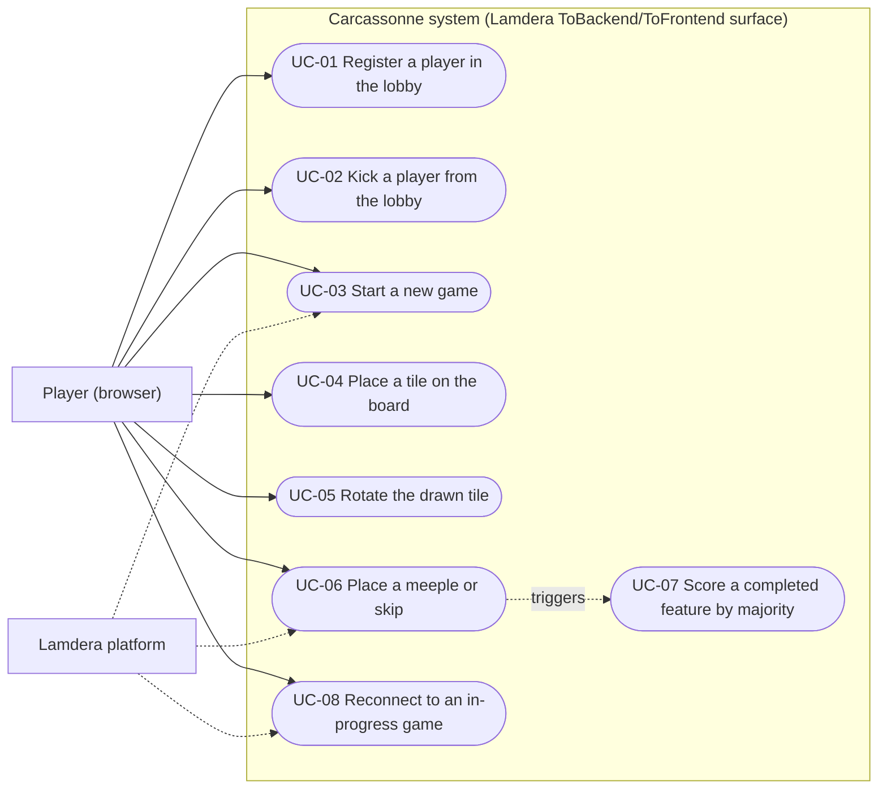

# Use-Case Model: Carcassonne (Elm + Lamdera full-stack game)

Repository: `.repo` at commit `ca2797745a863243fa6ce96af63435b0d67bf2ab`. This document bridges the user-facing requirements (readme.md) and the technical implementation (Elm frontend via `src/Frontend.elm`, Elm backend via `src/Backend.elm`, message surface in `src/Types.elm`), covering both the frontend (view interactions) and the backend (shared in-memory game model and Lamdera broadcast replies). Companion artifacts: [./Specification.md](./Specification.md), `ActivityDiagram.md`, `ClassModel.md`, `DatabaseModel.md`, `DomainModel.md`.

---

## 1. Introduction

### 1.1 Purpose

To capture the functional requirements of the **Carcassonne** multiplayer browser game and describe how players interact with the system: lobby registration and management, game start, the tile/meeple turn loop, majority scoring, and reconnection to an in-progress game — as implemented end-to-end through the Lamdera `ToBackend`/`ToFrontend` message surface.

### 1.2 Scope

**In scope:** the 8 lobby/game use cases (UC-01…UC-08) driven through the Lamdera message surface — `src/Frontend.elm`, `src/Backend.elm`, `src/Types.elm`, `src/Views/`, `src/Helpers/GameLogic.elm`, `src/Helpers/FrontendHelpers.elm`, `src/Types/Game.elm`, `src/Types/GameState.elm`.

**Out of scope:** legacy Evergreen/V1–V10 state snapshots (compiler-generated Lamdera artifacts, `src/Evergreen/`), tile asset data, debug-mode internals, and the un-modeled Terminate Game feature (see `Assumptions & Unverified Items`).

### 1.3 Definitions, Acronyms, and Abbreviations

| Term | Definition | Code Reference |
| :--- | :--- | :--- |
| **Feature** | A connected region on the board (`City`, `Road`, `Field` — the `Feature` type has no cloister variant); cloisters are tracked separately via `Tile.cloister : Maybe SideId`; connectivity is tracked by shared `SideId` values across adjacent tile sides. | `src/Types/Feature.elm:1-8`, `src/Types/Tile.elm:28`, `src/Helpers/GameLogic.elm:326-362` |
| **SideId** | Identifier shared by connected feature sides; merged across adjacent tiles (and the meeple dictionary) when a tile is placed; `-1` means "no feature". | `src/Types/Tile.elm:1-57`, `src/Helpers/GameLogic.elm:331-362` |
| **Meeple** | A player figure claiming a feature side or cloister; owned by a player index, placed at a coordinate. | `src/Types/Meeple.elm:1-23` |
| **Cloister** | The monastic building on some tiles; claimed via the `Center` meeple position; scores 9 when its 3×3 neighbourhood is complete. | `src/Types/Tile.elm:42-57`, `src/Helpers/GameLogic.elm:211-251` |
| **Draw stack** | The list of tile ids not yet on the board; shuffled by a Lamdera `Random` command before each first draw and after each meeple placement. | `src/Types/Game.elm:120-147`, `src/Backend.elm:177` |
| **GameState** | The turn phase: `PlaceTileState`, `PlaceMeepleState`, `FinishedState`. | `src/Types/GameState.elm:4-7` |
| **Lobby (BePlayerRegistration)** | Backend phase before a game starts; holds the list of registered player names (limit 5). | `src/Types.elm:11-14`, `src/Backend.elm:28-34` |
| **BeGamePlayed** | Backend phase holding the single shared `Game` model. | `src/Types.elm:15-17` |
| **ToBackend / ToFrontend** | The Lamdera message enums forming the system boundary (client→server / server→client). | `src/Types.elm:50-58`, `src/Types.elm:67-86` |
| **Lamdera** | External Elm server runtime hosting the backend, delivering client messages, executing backend `Random` commands, and fanning out broadcasts. | `src/Backend.elm:6`, `src/Backend.elm:189-191` |
| **UC** | Use Case. **S/E/A + n** = main-flow step / exception / alternative flow number within a UC. | — |

---

## 2. System Boundary & Actors

The system boundary is the Lamdera message surface in `src/Types.elm`: clients send `ToBackend` messages (`src/Types.elm:50-58`), the backend replies via targeted `sendToFrontend` or `broadcast` of `ToFrontend` messages (`src/Types.elm:67-86`, `src/Backend.elm:6`), and reports new client connections via `Lamdera.onConnect` (`src/Backend.elm:189-191`).

| Message | Direction | Carries | Used by UC | Code Reference |
| :--- | :--- | :--- | :--- | :--- |
| `RegisterPlayer PlayerName` | ToBackend | name to register | UC-01, UC-08 | `src/Types.elm:51` |
| `KickPlayer PlayerName` | ToBackend | name to remove | UC-02 | `src/Types.elm:52` |
| `KillLobby` | ToBackend | — | (out of scope; lobby reset only) | `src/Types.elm:53` |
| `InitializeGame` | ToBackend | — | UC-03 | `src/Types.elm:54` |
| `RotateTileLeft` | ToBackend | — | UC-05 | `src/Types.elm:55` |
| `PlaceTile Coordinate` | ToBackend | board coordinate | UC-04 | `src/Types.elm:56` |
| `PlaceMeeple MeeplePosition` | ToBackend | side/center/skip position | UC-06 | `src/Types.elm:57` |
| `TerminateGame` | ToBackend | — | (out of scope — see unverified items) | `src/Types.elm:58` |
| `PlayerRegistrationUpdated { players }` | ToFrontend | full lobby roster | UC-01, UC-08 | `src/Types.elm:68-70` |
| `PlayerKicked { players, kickedPlayer }` | ToFrontend | updated roster + kicked name | UC-02 | `src/Types.elm:71-74` |
| `LobbyIsFull` | ToFrontend | — | UC-01 (E3) | `src/Types.elm:75` |
| `LobbyKilled` | ToFrontend | — | (out of scope) | `src/Types.elm:76` |
| `GameInitialized { game }` | ToFrontend | new `Game` | UC-03 | `src/Types.elm:77-79` |
| `UpdateGameState { game }` | ToFrontend | full `Game` (single convergence point for in-game updates) | UC-04, UC-05, UC-06, UC-07 | `src/Types.elm:80-82`, `src/Frontend.elm:143-150` |
| `JoinedGame { game }` | ToFrontend | current `Game` (targeted) | UC-08 | `src/Types.elm:83-85` |
| `GameTerminated` | ToFrontend | — | (out of scope) | `src/Types.elm:86` |

### 2.1 Primary Actors

* **Player (browser)** (*UC-A1*, human): A human player operating the Elm frontend in a Lamdera-connected browser. There is **no host/admin role in the code**: every name in the lobby gets a kick control (`src/Views/PlayerLobbyView.elm:30-37`), every lobby client gets the Start button (`src/Views/PlayerLobbyView.elm:20-23`), and the backend handlers carry no sender-identity check (`src/Backend.elm:125-133`, `src/Backend.elm:140-148`). The "Kill lobby" button is situational, not a role: it is rendered only for the client whose registration was rejected because the lobby is full (`src/Views/PlayerRegistrationView.elm:29-37`). Single role modeled: `PLAYER`.

### 2.2 Secondary / System Actors

* **Lamdera platform** (*UC-A2*, external system): The external server runtime. It delivers `ToBackend` messages from clients to the backend (`src/Frontend.elm:4`, `src/Types.elm:50-58`), broadcasts `ToFrontend` messages to all connected clients via `broadcast` (`src/Backend.elm:58, 73, 83, 112, 132, 137, 157, 167, 182`), sends targeted replies via `sendToFrontend` (`src/Backend.elm:42, 101, 117, 122`), executes the backend `Random` commands (`Random.generate` / `Random.List.shuffle`) (`src/Backend.elm:147, 177`), and reports new client connections via `Lamdera.onConnect` (`src/Backend.elm:189-191`). Roles: broadcast bus, random executor, connection lifecycle.

---

## 3. Use-Case Diagram

**Diagram Description:** The **Player (browser)** is the only primary actor; every use case is initiated by a player action in the Elm frontend (a name entry, a lobby control, a board/tile/meeple click). The **Lamdera platform** is a secondary/external actor: it executes the backend `Random` shuffle commands used by UC-03 (first draw) and UC-06 (post-turn refill) and delivers the targeted `JoinedGame` reply in UC-08, so dashed associations mark its supporting role. All eight use cases sit inside the system boundary, which is the `ToBackend`/`ToFrontend` message surface (`src/Types.elm:50-58`, `src/Types.elm:67-86`); UC-07 is system-internal (no player action of its own — it is triggered by UC-06 or by draw-stack exhaustion).

| Node | Element | Code Reference |
| :--- | :--- | :--- |
| `P` | Actor: Player (browser) | `src/Views/PlayerLobbyView.elm:20-37` |
| `L` | Actor: Lamdera platform | `src/Backend.elm:6` |
| `SB` | System boundary: Carcassonne (Lamdera message surface) | `src/Types.elm:50-58` |
| `UC01` | UC-01: Register a player in the lobby | `src/Backend.elm:93-118` |
| `UC02` | UC-02: Kick a player from the lobby | `src/Backend.elm:125-133` |
| `UC03` | UC-03: Start a new game | `src/Backend.elm:140-148` |
| `UC04` | UC-04: Place a tile on the board | `src/Helpers/GameLogic.elm:323-370` |
| `UC05` | UC-05: Rotate the drawn tile | `src/Helpers/GameLogic.elm:21-40` |
| `UC06` | UC-06: Place a meeple or skip | `src/Helpers/GameLogic.elm:383-508` |
| `UC07` | UC-07: Score a completed feature by majority | `src/Helpers/GameLogic.elm:256-290` |
| `UC08` | UC-08: Reconnect to an in-progress game | `src/Backend.elm:120-123` |

---

## 4. Use-Case Specifications

### UC-01: Register a player in the lobby

**1. Brief Description**
Player submits a name in the registration view; the frontend validates non-empty locally and sends `RegisterPlayer`; the backend deduplicates, enforces the 5-player limit, and broadcasts `PlayerRegistrationUpdated` to every client.

**2. Actors**
* **Primary:** Player (browser) (UC-A1)
* **Secondary:** Lamdera platform (UC-A2)

**3. Pre-conditions**
* *Backend:* Backend is in the lobby phase (`BePlayerRegistration`). `src/Types.elm:11-14`, `src/Backend.elm:28-34`
* *Frontend:* The player's browser is connected to the Lamdera app (connection subscription registered). `src/Backend.elm:189-191`

**4. Post-conditions**
* *System State:* The new name is in the lobby list (when accepted) and every client received `PlayerRegistrationUpdated`. `src/Backend.elm:110-113`
* *System State:* The registering client's frontend moved from `FePlayerRegistration` to `FeLobby`. `src/Frontend.elm:60-61`

**5. Main Success Scenario (Happy Path)**

| # | Lane | Step | Code Reference |
| :- | :--- | :--- | :--- |
| 1 | **Actor** | Player types a name into the registration text field. | `src/Views/PlayerRegistrationView.elm:17-24` |
| 2 | **Frontend** | Frontend stores each keystroke in `nameInput` and clears any previous error. | `src/Frontend.elm:47-48` |
| 3 | **Actor** | Player clicks the "Join" button (or submits the form). | `src/Views/PlayerRegistrationView.elm:16`, `src/Views/PlayerRegistrationView.elm:25-28` |
| 4 | **Frontend** | Frontend trims the name; if non-empty it switches its own model to `FeLobby` and sends `RegisterPlayer` to the backend. | `src/Frontend.elm:50-62` |
| 5 | **Backend** | Backend checks `List.member` for a duplicate name; if new, it prepends the name to the players list. | `src/Backend.elm:95-108` |
| 6 | **External (Lamdera)** | Backend broadcasts `PlayerRegistrationUpdated` with the full roster to all connected clients. | `src/Backend.elm:111-113`, `src/Types.elm:68-70` |
| 7 | **Frontend** | Every client in the lobby view refreshes its displayed player list from the broadcast. | `src/Frontend.elm:95-96`, `src/Views/PlayerLobbyView.elm:18-19` |

**6. Alternative Flows (Extensions)**
* *(none in evidence)*

**7. Exceptions (Error Flows)**
* **1a (at step 4, Frontend). Name is empty after trimming:** Frontend shows the error "Name cannot be empty." and does not contact the backend. `src/Frontend.elm:56-57`, `src/Views/PlayerRegistrationView.elm:40-45`
* **2a (at step 5, Backend). Name already exists in the lobby:** Backend keeps the model unchanged and replies with the existing roster; the registering client stays in its lobby view but its own name is absent from the roster and **no error message is displayed** (the lobby view has no error surface), so the duplicate registration is silently rejected. `src/Backend.elm:99-102`, `src/Frontend.elm:95-96`, `src/Views/PlayerLobbyView.elm:11-24`
* **3a (at step 5, Backend). Lobby already holds `playerLimit` (5) players:** Backend rejects the addition and sends `LobbyIsFull` to the registering client only; the frontend shows "Lobby is full." and offers a "Kill lobby" button. `src/Backend.elm:110-118`, `src/Types/Game.elm:43-45`, `src/Frontend.elm:107-115`, `src/Views/PlayerRegistrationView.elm:29-37`

**8. Special Requirements (Non-Functional Requirements)**
* **Capacity:** Lobby capacity is exactly 5 players (`playerLimit = 5`). `src/Types/Game.elm:43-45`, `src/Backend.elm:110`
* **Validation:** `PlayerName` is a plain `String`; the only server-side validation is duplicate rejection — there is no length/format validation. `src/Types/PlayerName.elm:4-5`, `src/Backend.elm:95-98`
* **Optimistic UI:** The client switches to the lobby view optimistically before the backend accepts; a rejected client still renders the lobby (see 2a and UC-03-A1). `src/Frontend.elm:60-61`, `src/Frontend.elm:165-166`

---

### UC-02: Kick a player from the lobby

**1. Brief Description**
A player in the lobby removes another player (or themselves) from the lobby list; the backend filters the name out and broadcasts `PlayerKicked`; the kicked client is reset to the registration screen.

**2. Actors**
* **Primary:** Player (browser) (UC-A1)
* **Secondary:** Lamdera platform (UC-A2)

**3. Pre-conditions**
* *Backend/Frontend:* Backend is in the lobby phase (`BePlayerRegistration`) and the acting client has the lobby view rendered. `src/Types.elm:11-14`, `src/Frontend.elm:165-166`

**4. Post-conditions**
* *System State:* The kicked name is removed from the lobby list and all clients received `PlayerKicked` with the updated roster. `src/Backend.elm:129-133`, `src/Types.elm:71-74`
* *System State:* The kicked client's frontend reset to the registration init state (name input cleared, no error). `src/Frontend.elm:98-100`, `src/Frontend.elm:34-41`

**5. Main Success Scenario (Happy Path)**

| # | Lane | Step | Code Reference |
| :- | :--- | :--- | :--- |
| 1 | **Actor** | A player clicks the red "kick" label next to a name in the lobby roster. | `src/Views/PlayerLobbyView.elm:30-37` |
| 2 | **Frontend** | Frontend sends `KickPlayer <name>` to the backend with no local model change. | `src/Frontend.elm:64-65` |
| 3 | **Backend** | Backend filters the name out of the players list. | `src/Backend.elm:125-130` |
| 4 | **External (Lamdera)** | Backend broadcasts `PlayerKicked {kickedPlayer, players}` to all connected clients. | `src/Backend.elm:132`, `src/Types.elm:71-74` |
| 5 | **Frontend** | Clients whose local `playerName` differs from `kickedPlayer` update their roster; the kicked client resets to the registration init state. | `src/Frontend.elm:98-105` |

**6. Alternative Flows (Extensions)**
* **1a (at step 1, Actor). Self-kick to leave the lobby:** A player clicks "kick" on their own name to leave the lobby: the roster control is rendered for every name including one's own, so self-kick is the only way a player exits the lobby on their own. `src/Views/PlayerLobbyView.elm:30-37`, `src/Frontend.elm:98-100`

**7. Exceptions (Error Flows)**
* **3a (at step 3, Backend). Kick of an absent name is a no-op:** `KickPlayer` for a name not present in the lobby changes nothing — `List.filter` removes nothing, the model is unchanged and the unchanged roster is still broadcast. `src/Backend.elm:125-133`

**8. Special Requirements (Non-Functional Requirements)**
* **No authorization:** No server-side check that the sender is a lobby member or that the target differs from the sender; any connected client can kick any name. `src/Backend.elm:125-133`
* **State discard:** Kicking discards all lobby client state for the kicked player (`FeLobby` → init, name input reset). `src/Frontend.elm:98-100`, `src/Frontend.elm:34-41`

---

### UC-03: Start a new game

**1. Brief Description**
Start button sends `InitializeGame`; backend runs `initializeGame`, issues `Random.List.shuffle` of the draw stack, resolves the first playable tile from the shuffled stack (`getPlayableTileFromDrawstack`), and broadcasts `GameInitialized`; every lobby client switches to the game view.

**2. Actors**
* **Primary:** Player (browser) (UC-A1)
* **Secondary:** Lamdera platform (UC-A2)

**3. Pre-conditions**
* *Backend:* Backend is in the lobby phase (`BePlayerRegistration`) with a non-empty roster; `initializeGame` documents that the players list must not be empty. `src/Types.elm:11-14`, `src/Types/Game.elm:48-52`

**4. Post-conditions**
* *System State:* Backend model is `BeGamePlayed` holding the new `Game` (all clients share it). `src/Backend.elm:146`, `src/Types.elm:15-17`
* *System State:* Every client switched to `FeGamePlayed` and renders the board in `PlaceTileState` with the shuffled first tile to place. `src/Frontend.elm:134-141`, `src/Views/GameView.elm:28-29`

**5. Main Success Scenario (Happy Path)**

| # | Lane | Step | Code Reference |
| :- | :--- | :--- | :--- |
| 1 | **Actor** | A player in the lobby clicks the "Start" button. | `src/Views/PlayerLobbyView.elm:20-23` |
| 2 | **Frontend** | Frontend sends `InitializeGame` to the backend. | `src/Frontend.elm:67-68` |
| 3 | **Backend** | Backend builds the new game via `initializeGame`: zeroed scores, 7 meeples per player, players array, `currentPlayer` 0, starting tile (0,0), `PlaceTileState`, full draw stack. | `src/Backend.elm:140-144`, `src/Types/Game.elm:53-73`, `src/Types/Game.elm:102-104` |
| 4 | **Backend** | Backend issues a `Random` command to shuffle the draw stack (`Random.List.shuffle`). | `src/Backend.elm:147` |
| 5 | **External (Lamdera)** | Lamdera executes the shuffle and delivers the result to the backend as `InitializeGameAndTileDrawStackShuffled`. | `src/Types.elm:63`, `src/Backend.elm:44` |
| 6 | **Backend** | Backend walks the shuffled stack with `getPlayableTileFromDrawstack`, skipping tiles that fit nowhere (in any rotation), and sets the first playable tile as `tileToPlace`. | `src/Backend.elm:46-54`, `src/Helpers/FrontendHelpers.elm:132-143`, `src/Helpers/FrontendHelpers.elm:120-127` |
| 7 | **External (Lamdera)** | Backend broadcasts `GameInitialized {game}` to all connected clients. | `src/Backend.elm:58`, `src/Types.elm:77-79` |
| 8 | **Frontend** | Each client in the lobby view switches to `FeGamePlayed` and renders the game board (tile grid, sidebar with scores/meeples, drawn tile, Rotate button). | `src/Frontend.elm:134-141`, `src/Views/GameView.elm:21-27`, `src/Views/GameView.elm:641-749` |

**6. Alternative Flows (Extensions)**
* **1a (at step 1, Actor). Rejected registrant can still start:** Any client holding the lobby view can start the game, including a client whose registration was just rejected (the frontend switched to `FeLobby` optimistically); the backend applies `InitializeGame` to the stored roster with no sender check, so the rejected client is not a game player but can trigger the start. `src/Views/PlayerLobbyView.elm:20-23`, `src/Frontend.elm:60-62`, `src/Backend.elm:140-144`

**7. Exceptions (Error Flows)**
* **6a (at step 6, Backend). No placeable first tile (cannot happen with the fresh stack):** If no tile in the shuffled stack is placeable anywhere (the code comments "First move should be always possible"), `tileToPlace` falls back to tile 0 via `Maybe.withDefault` and the draw stack is emptied. `src/Backend.elm:46-54`, `src/Helpers/FrontendHelpers.elm:142-143`

**8. Special Requirements (Non-Functional Requirements)**
* **Meeple economy:** Each player starts with 7 meeples. `src/Types/Game.elm:61`
* **Tile set:** 71 tiles in the draw stack plus 1 starting tile (72 total). `src/Types/Game.elm:120-147`, `src/Types/Game.elm:102-104`
* **Draw order:** Unplaceable tiles are consumed from the stack in shuffled order without re-shuffling; the stack is only re-shuffled after each meeple placement. `src/Helpers/FrontendHelpers.elm:134-140`, `src/Backend.elm:177`

---

### UC-04: Place a tile on the board

**1. Brief Description**
Frontend highlights placeable coordinates for the drawn tile; click sends `PlaceTile <coordinate>`; backend `placeTile` stamps new `SideId`s, inserts the tile, merges adjacent `SideId`s (tiles and meeples), sets `PlaceMeepleState` and `lastPlacedTile`; state is broadcast to all clients.

**2. Actors**
* **Primary:** Player (browser) (UC-A1)
* **Secondary:** Lamdera platform (UC-A2)

**3. Pre-conditions**
* *Backend:* Game state is `PlaceTileState`. `src/Types/GameState.elm:5`, `src/Helpers/GameLogic.elm:507`
* *Frontend:* The acting player is the current player (`game.currentPlayer`) — enforced only in the client UI; the backend does not check the sender. `src/Views/GameView.elm:58-75`, `src/Backend.elm:160-168`
* *Backend:* `tileToPlace` is the drawn tile, guaranteed placeable in some rotation by the draw step. `src/Types/Game.elm:33`, `src/Helpers/FrontendHelpers.elm:132-143`

**4. Post-conditions**
* *System State:* The tile occupies the clicked coordinate and connected features across adjacent tiles share a single `SideId` (tiles and meeple entries updated). `src/Helpers/GameLogic.elm:347-362`
* *System State:* `GameState` is `PlaceMeepleState`, `lastPlacedTile` is the clicked coordinate, `nextSideId` advanced past the tile's maximum side id. `src/Helpers/GameLogic.elm:364-370`, `src/Types/GameState.elm:6`
* *System State:* All clients received `UpdateGameState` and re-rendered. `src/Backend.elm:166-167`, `src/Frontend.elm:143-150`

**5. Main Success Scenario (Happy Path)**

| # | Lane | Step | Code Reference |
| :- | :--- | :--- | :--- |
| 1 | **Frontend** | Frontend computes placeable coordinates for the drawn tile in its current rotation: empty cells adjacent to the board whose shared edge features match (`tileCanBePlaced`), and renders them as highlighted clickable cells for the current player only. | `src/Views/GameView.elm:58-75`, `src/Helpers/FrontendHelpers.elm:89-110`, `src/Helpers/FrontendHelpers.elm:48-84` |
| 2 | **Actor** | The current-turn player clicks one of the highlighted cells. | `src/Views/GameView.elm:318-329` |
| 3 | **Frontend** | Frontend sends `PlaceTile <coordinate>` to the backend. | `src/Frontend.elm:76-77` |
| 4 | **Backend** | Backend stamps the tile's side ids (offset by `nextSideId + 1`, leaving -1 sides untouched) via `updateSideIds`. | `src/Helpers/GameLogic.elm:326-329`, `src/Types/Tile.elm:62-81` |
| 5 | **Backend** | Backend reads the side ids of the north/east/south/west neighbours, inserts the tile into the grid, and rewrites those neighbour `SideId`s to the tile's matching edge ids (`replaceTileSideId`), doing the same merge on the meeples dictionary (`replaceMeepleSideId`). | `src/Helpers/GameLogic.elm:331-362`, `src/Helpers/GameLogic.elm:102-131`, `src/Helpers/GameLogic.elm:136-162` |
| 6 | **Backend** | Backend sets `gameState` to `PlaceMeepleState`, records `lastPlacedTile`, and advances `nextSideId` to the tile's maximum side id. | `src/Helpers/GameLogic.elm:364-370`, `src/Types/Tile.elm:34-37` |
| 7 | **External (Lamdera)** | Backend broadcasts `UpdateGameState {game}` to all connected clients. | `src/Backend.elm:160-168`, `src/Types.elm:80-82` |
| 8 | **Frontend** | Each client replaces its game state; the current player now sees the meeple-placement overlay on the last placed tile (UC-06). | `src/Frontend.elm:143-150`, `src/Views/GameView.elm:92-142` |

**6. Alternative Flows (Extensions)**
* **1a (at step 1, Frontend). No valid cell in the current rotation:** If the drawn tile's current rotation has no valid cell, `getCoordinatesToBePlacedOn` is empty, no cells are highlighted, and the player must rotate the tile (UC-05) back to a placeable orientation before any click is possible. `src/Helpers/FrontendHelpers.elm:89-110`, `src/Views/GameView.elm:59-70`, `src/Views/GameView.elm:318-332`

**7. Exceptions (Error Flows)**
* **2a (at step 2, Frontend). Not the current player's turn:** A non-current player cannot place: the placeable overlay (and its clickable cells) is rendered only when the client's `playerName` equals the current player's name. `src/Views/GameView.elm:58-75`
* **4a (at step 4, Backend). No server-side re-validation:** `placeTile` documents "Does not check whether the move is valid", so a crafted or stale `PlaceTile` message places the tile at any coordinate (`Dict.insert` overwrites an occupied cell). `src/Helpers/GameLogic.elm:311-314`, `src/Backend.elm:160-168`, `src/Helpers/GameLogic.elm:347-354`

**8. Special Requirements (Non-Functional Requirements)**
* **Client-trusted validation:** Move validity is enforced only in the client UI: edge-feature matching in `tileCanBePlaced` plus rendering of clickable cells only for valid coordinates. `src/Helpers/FrontendHelpers.elm:48-84`, `src/Views/GameView.elm:320-329`
* **Feature tracking:** Feature connectivity is tracked purely by `SideId` rewriting across the grid; the tile's own sides keep their relative ids. `src/Helpers/GameLogic.elm:326-362`

---

### UC-05: Rotate the drawn tile

**1. Brief Description**
Rotate button sends `RotateTileLeft`; backend applies `rotateLeft` to `tileToPlace` (sides shift counterclockwise, `rotation += 90` with a `modBy 360` overflow guard) and broadcasts `UpdateGameState`; the sidebar re-renders the tile with a CSS rotation transform.

**2. Actors**
* **Primary:** Player (browser) (UC-A1)
* **Secondary:** Lamdera platform (UC-A2)

**3. Pre-conditions**
* *Backend:* Backend is in the game phase (`BeGamePlayed`); the `RotateTileLeft` handler matches that model only. `src/Types.elm:15-17`, `src/Backend.elm:150`

**4. Post-conditions**
* *System State:* `tileToPlace` is rotated 90 degrees counterclockwise (rotation increased by 90, or normalized via `modBy 360` after the overflow guard). `src/Helpers/GameLogic.elm:21-40`
* *System State:* All clients received `UpdateGameState` and re-render the board and sidebar tile. `src/Backend.elm:156-157`, `src/Frontend.elm:143-150`

**5. Main Success Scenario (Happy Path)**

| # | Lane | Step | Code Reference |
| :- | :--- | :--- | :--- |
| 1 | **Actor** | The player clicks the "Rotate Tile" button in the sidebar. | `src/Views/GameView.elm:740-742` |
| 2 | **Frontend** | Frontend sends `RotateTileLeft` to the backend. | `src/Frontend.elm:70-71` |
| 3 | **Backend** | Backend applies `rotateLeft` to `tileToPlace`: north←east, west←north, south←west, east←south, and `rotation += 90` (with a `modBy 360` reset once rotation reaches 360000 or more). | `src/Backend.elm:150-158`, `src/Helpers/GameLogic.elm:21-40` |
| 4 | **External (Lamdera)** | Backend broadcasts `UpdateGameState {game}` to all connected clients. | `src/Backend.elm:156-157` |
| 5 | **Frontend** | Each client re-renders the board and the sidebar tile image using a CSS transform of the negated rotation. | `src/Frontend.elm:143-150`, `src/Views/GameView.elm:727-734` |

**6. Alternative Flows (Extensions)**
* **1a (at step 1, Actor). Rotate during the meeple phase:** Player clicks Rotate during `PlaceMeepleState`: the backend still rotates the stored `tileToPlace`, but the sidebar shows only a placeholder image (questionmark.png) and the tile will be replaced by the next drawn tile after the meeple step anyway. `src/Views/GameView.elm:727-734`, `src/Backend.elm:150-158`, `src/Backend.elm:61-74`

**7. Exceptions (Error Flows)**
* **2a (at step 2, Backend). Rotation message in the lobby phase:** `RotateTileLeft` received while the backend is in the lobby phase (`BePlayerRegistration`) matches no handler and is ignored (fallthrough to the no-op case). `src/Backend.elm:150`, `src/Backend.elm:185-186`

**8. Special Requirements (Non-Functional Requirements)**
* **Overflow guard:** Once `tile.rotation >= 360000` the rotation is normalized with `modBy 360` to prevent integer overflow on long games. `src/Helpers/GameLogic.elm:23-31`
* **No turn gating:** Rotation is not turn-gated: the button is rendered for every player and the backend applies `RotateTileLeft` from any client. `src/Views/GameView.elm:740-742`, `src/Backend.elm:150-158`
* **Unenforced invariant:** `isRotatedCorrectly` (side-feature consistency per rotation angle) exists but is used only by unit tests, not at runtime. `src/Helpers/GameLogic.elm:45-94`, `tests/GameLogicTests.elm:14-56`

---

### UC-06: Place a meeple or skip

**1. Brief Description**
Frontend offers claimable positions on the last placed tile (or only Skip when the player has no meeples left); click sends `PlaceMeeple <position>`; backend `placeMeeple` inserts the meeple by `SideId` (Center maps to the cloister `SideId`), scores finished features (UC-07), advances the turn to `PlaceTileState`; the backend then re-shuffles the draw stack and draws the next placeable tile (or finishes the game).

**2. Actors**
* **Primary:** Player (browser) (UC-A1)
* **Secondary:** Lamdera platform (UC-A2)

**3. Pre-conditions**
* *Backend:* Game state is `PlaceMeepleState` (set by `placeTile` after every tile placement). `src/Types/GameState.elm:6`, `src/Helpers/GameLogic.elm:367`
* *Frontend:* The acting player is the current player — enforced only in the client UI (overlay rendered for the current player only); the backend attributes the meeple to `game.currentPlayer` regardless of the sender. `src/Views/GameView.elm:121-142`, `src/Helpers/GameLogic.elm:386-391`

**4. Post-conditions**
* *System State:* `currentPlayer` advanced to the next player (wrap-around) and `gameState` is `PlaceTileState`. `src/Helpers/GameLogic.elm:502-508`, `src/Types/Game.elm:78-84`
* *System State:* Finished features on the last placed tile are scored to their majority owners, their `SideId`s removed from the meeples dict, and meeples returned to owners' pools. `src/Helpers/GameLogic.elm:418-500`
* *System State:* A new `tileToPlace` is drawn from the re-shuffled stack (or the game is finished if the stack is exhausted); all clients received the new state. `src/Backend.elm:177`, `src/Backend.elm:61-84`, `src/Frontend.elm:143-150`

**5. Main Success Scenario (Happy Path)**

| # | Lane | Step | Code Reference |
| :- | :--- | :--- | :--- |
| 1 | **Frontend** | Frontend computes claimable positions on the last placed tile: all sides whose `SideId` has no meeple yet and is not -1, plus `Center` when the tile has a cloister; offered only while the player still has meeples, otherwise only Skip. Clickable circles are rendered. | `src/Views/GameView.elm:121-142`, `src/Helpers/FrontendHelpers.elm:27-43`, `src/Views/GameView.elm:524-536` |
| 2 | **Actor** | The current-turn player clicks one of the position circles. | `src/Views/GameView.elm:533` |
| 3 | **Frontend** | Frontend sends `PlaceMeeple <position>` to the backend. | `src/Frontend.elm:79-80` |
| 4 | **Backend** | Backend constructs the meeple (owner = `currentPlayer`, coordinates = `lastPlacedTile`) and inserts it under the matching `SideId`: North/East/South/West use the tile's edge `SideId`s; `Center` uses the cloister `SideId` (default -1). | `src/Helpers/GameLogic.elm:383-413`, `src/Types/Meeple.elm:17-23` |
| 5 | **Backend** | Backend collects the last placed tile's unique `SideId`s (incl. cloister), keeps the finished ones (`isFeatureFinished`), counts each (`countFeature`), doubles cities with score > 2, and appends finished-cloister scores. (Scoring detail: UC-07.) | `src/Helpers/GameLogic.elm:418-438`, `src/Types/Tile.elm:42-45`, `src/Helpers/GameLogic.elm:193-203`, `src/Helpers/GameLogic.elm:170-189` |
| 6 | **Backend** | Backend removes the finished `SideId`s from the meeples dict (returning meeples), adds each finished feature's score to its majority owner(s) (`getFeatureOwners`), and updates meeple counts: +1 per returned meeple, -1 for the current player when a meeple was actually placed. | `src/Helpers/GameLogic.elm:440-500`, `src/Helpers/GameLogic.elm:256-290` |
| 7 | **Backend** | Backend advances `currentPlayer` via `getNextPlayer` and sets `gameState` to `PlaceTileState`. | `src/Helpers/GameLogic.elm:502-508`, `src/Types/Game.elm:78-84` |
| 8 | **Backend** | Backend issues a `Random` command to re-shuffle the remaining draw stack. | `src/Backend.elm:177` |
| 9 | **External (Lamdera)** | Lamdera delivers the shuffled stack to the backend as `TileDrawStackShuffled`. | `src/Types.elm:64`, `src/Backend.elm:61` |
| 10 | **Backend** | Backend picks the next placeable tile from the stack via `getPlayableTileFromDrawstack` (skipping unplaceable ones in shuffled order) and sets it as `tileToPlace`. | `src/Backend.elm:62-74`, `src/Helpers/FrontendHelpers.elm:132-143` |
| 11 | **External (Lamdera)** | Backend broadcasts `UpdateGameState {game}` to all connected clients. | `src/Backend.elm:72-73` |
| 12 | **Frontend** | Each client re-renders the board; the next player sees the tile-placement overlay for the newly drawn tile. | `src/Frontend.elm:143-150`, `src/Views/GameView.elm:58-75` |

**6. Alternative Flows (Extensions)**
* **2a (at step 2, Actor). Skip meeple placement:** Player clicks the "Skip Meeple placement" button: `FePlaceMeeple Skip` is sent; `placeMeeple` leaves the meeples dictionary unchanged for `Skip`, skips the -1 meeple-count decrement, and otherwise advances the turn and draws exactly like the main flow. `src/Views/GameView.elm:382-395`, `src/Helpers/GameLogic.elm:415-416`, `src/Helpers/GameLogic.elm:493-500`
* **1b (at step 1, Frontend). No meeples left:** The player has no meeples left (`playerMeeples == 0`): only `[Skip]` is offered and no position circles are rendered, so the turn can only be continued by skipping. `src/Helpers/FrontendHelpers.elm:29-31`, `src/Helpers/FrontendHelpers.elm:42-43`

**7. Exceptions (Error Flows)**
* **1a (at step 1, Frontend). Occupied/no-feature sides are never offered:** A feature side already occupied by a meeple (or an edge with no feature, `SideId == -1`) is never offered: positions are filtered by "no meeple under this `SideId`" and "`SideId /= -1`"; the backend itself does not check, so a crafted `PlaceMeeple` for an occupied `SideId` would overwrite that feature's existing meeple list (`Dict.insert` replaces the value). `src/Helpers/FrontendHelpers.elm:32-40`, `src/Helpers/GameLogic.elm:400-413`
* **10a (at step 10, Backend). No placeable tile remains:** No placeable tile remains in the (re-shuffled) draw stack (`Nothing` case): the backend calls `finishGame`, which scores all remaining features and cloisters, empties the meeples dict, and sets `FinishedState`; the finished game is broadcast (see UC-07). `src/Backend.elm:76-84`, `src/Helpers/GameLogic.elm:511-556`

**8. Special Requirements (Non-Functional Requirements)**
* **Meeple economy:** Players start with 7 meeples; the Skip option is always available in the UI regardless of meeple count. `src/Types/Game.elm:61`, `src/Views/GameView.elm:382-395`
* **No turn check:** No turn check in the backend `PlaceMeeple` handler; the meeple's owner is always `game.currentPlayer`, never the sending client. `src/Backend.elm:170-178`, `src/Helpers/GameLogic.elm:386-391`
* **Shuffle rule:** The draw stack is re-shuffled after every meeple placement (Skip included), per the readme rule "if it can not be placed, shuffle it back and draw a new one". `src/Backend.elm:177`, `readme.md:60-61`

---

### UC-07: Score a completed feature by majority

**1. Brief Description**
System-internal scoring, triggered by a player's meeple placement/skip (UC-06, steps 4–6) or by `finishGame` at game end: when a feature touched by the last placed tile is finished (or at game end), its size in tiles is awarded to the player(s) with the most meeples on it; ties award the full score to every tied player.

**2. Actors**
* **Primary:** Player (browser) (UC-A1) — the acting player of UC-06 whose meeple step (or skip) triggers mid-game scoring; the player does not act directly on this use case.
* **Secondary:** Lamdera platform (UC-A2) — fans the resulting `UpdateGameState` out to all clients.

**3. Pre-conditions**
* *Backend:* A `SideId` is under evaluation: either a side/cloister of the last placed tile after a meeple step (mid-game), or any `SideId` still holding meeples at game end. `src/Helpers/GameLogic.elm:418-422`, `src/Helpers/GameLogic.elm:514-518`

**4. Post-conditions**
* *System State:* The majority owner(s)' totals in `playerScores` are increased by the feature score (mid-game) or by all remaining feature/cloister scores (game end). `src/Helpers/GameLogic.elm:444-464`, `src/Helpers/GameLogic.elm:529-550`
* *System State:* Mid-game: the scored `SideId`s are removed from the meeples dict and their meeples returned to owners. Game end: the meeples dict is emptied and `gameState` is `FinishedState`. `src/Helpers/GameLogic.elm:440-442`, `src/Helpers/GameLogic.elm:551-556`

**5. Main Success Scenario (Happy Path)**

| # | Lane | Step | Code Reference |
| :- | :--- | :--- | :--- |
| 1 | **Backend** | After the meeple step, backend collects the unique `SideId`s of the last placed tile (edges plus cloister, -1 excluded) via `getTileSideIds`. | `src/Helpers/GameLogic.elm:418-422`, `src/Types/Tile.elm:42-57` |
| 2 | **Backend** | Backend keeps only the finished `SideId`s: for every tile of the feature, each side carrying the `SideId` must have a placed neighbour tile (`isFeatureFinished`). | `src/Helpers/GameLogic.elm:422`, `src/Helpers/GameLogic.elm:193-203` |
| 3 | **Backend** | Backend counts the feature's size as the number of grid tiles sharing the `SideId` (`countFeature`) and doubles the score when it is a city with score > 2 (completed before the game ends). | `src/Helpers/GameLogic.elm:423-436`, `src/Helpers/GameLogic.elm:170-189` |
| 4 | **Backend** | Backend appends scores for cloisters completed around the last placed tile: a cloister scoring 9 when its 3×3 neighbourhood is complete. | `src/Helpers/GameLogic.elm:437-438`, `src/Helpers/GameLogic.elm:230-251`, `src/Helpers/GameLogic.elm:211-224` |
| 5 | **Backend** | Backend determines the owner(s) via `getFeatureOwners`: meeples under the `SideId` are counted per player index and every player reaching the maximum count is kept (ties share). | `src/Helpers/GameLogic.elm:449-451`, `src/Helpers/GameLogic.elm:256-290` |
| 6 | **Backend** | Backend adds the feature score to each owner's total in `playerScores` (one entry per tied owner). | `src/Helpers/GameLogic.elm:444-464` |
| 7 | **Backend** | Backend returns the feature's meeples to their owners' pools (+1 each) and removes the scored `SideId`s from the meeples dict. | `src/Helpers/GameLogic.elm:440-442`, `src/Helpers/GameLogic.elm:470-492` |

**6. Alternative Flows (Extensions)**
* **1a (at step 1, Backend). Game-end variant:** When the draw stack is exhausted, `finishGame` scores every remaining feature `SideId` (`countFeature`) and every cloister (`countCloister`) with no 2× city bonus, sets meeples to empty and `gameState` to `FinishedState`, and the result is broadcast as `UpdateGameState`. `src/Backend.elm:76-84`, `src/Helpers/GameLogic.elm:511-556`, `src/Helpers/GameLogic.elm:211-224`
* **5a (at step 5, Backend). Tie on the maximum meeple count:** `getFeatureOwners` returns all tied players, so each tied player receives the full feature score (the score is not divided). `src/Helpers/GameLogic.elm:288-290`, `src/Helpers/GameLogic.elm:446-451`

**7. Exceptions (Error Flows)**
* **2a (at step 2, Backend). Unfinished features are not scored:** The `SideId` is filtered out by `isFeatureFinished` and its meeples remain on the board for a later turn. `src/Helpers/GameLogic.elm:422`, `src/Helpers/GameLogic.elm:193-203`
* **5b (at step 5, Backend). Finished feature with no meeples scores nobody:** `getFeatureOwners` yields an empty owner list and no score entry is produced. `src/Helpers/GameLogic.elm:256-264`, `src/Helpers/GameLogic.elm:288-290`

**8. Special Requirements (Non-Functional Requirements)**
* **2× city bonus:** Applies only to mid-game completion with score strictly greater than 2; `finishGame` applies no bonus. `src/Helpers/GameLogic.elm:430-436`, `src/Helpers/GameLogic.elm:511-556`
* **Cloister value:** A completed cloister always scores 9 tiles. `src/Helpers/GameLogic.elm:250-251`, `src/Helpers/GameLogic.elm:211-224`
* **Tie rule:** Tied majorities each receive the full score rather than splitting it. `src/Helpers/GameLogic.elm:288-290`

---

### UC-08: Reconnect to an in-progress game

**1. Brief Description**
A player whose browser was disconnected (or a fresh browser) registers a name while the backend already holds a running game; the backend returns the model unchanged, sends `JoinedGame {game}` to that client only, and the client switches from the lobby view to the shared game view.

**2. Actors**
* **Primary:** Player (browser) (UC-A1)
* **Secondary:** Lamdera platform (UC-A2)

**3. Pre-conditions**
* *Backend:* Backend is in the game phase (`BeGamePlayed`) — a game was started by the lobby. `src/Types.elm:15-17`, `src/Backend.elm:140-148`

**4. Post-conditions**
* *System State:* The reconnecting client renders the shared game as `FeGamePlayed`. `src/Frontend.elm:125-132`
* *System State:* The backend model is unchanged: the re-entered name is **NOT** added to the game's player roster. `src/Backend.elm:120-123`, `src/Types/Game.elm:28-40`

**5. Main Success Scenario (Happy Path)**

| # | Lane | Step | Code Reference |
| :- | :--- | :--- | :--- |
| 1 | **Actor** | The (reconnecting) player enters a name in the registration view and clicks "Join". | `src/Views/PlayerRegistrationView.elm:17-28`, `src/Frontend.elm:50-57` |
| 2 | **Frontend** | Frontend switches to the lobby view and sends `RegisterPlayer <name>` to the backend. | `src/Frontend.elm:60-62` |
| 3 | **Backend** | Backend, being in `BeGamePlayed`, returns the model unchanged and sends `JoinedGame {game}` to that client only. | `src/Backend.elm:120-123` |
| 4 | **External (Lamdera)** | Lamdera delivers the targeted `JoinedGame` message to the reconnecting client. | `src/Types.elm:83-85`, `src/Backend.elm:122` |
| 5 | **Frontend** | Client switches from `FeLobby` to `FeGamePlayed` with the current shared game (debugMode off) and renders the live board. | `src/Frontend.elm:125-132`, `src/Views/GameView.elm:21-27` |

**6. Alternative Flows (Extensions)**
* **2a (at step 2, Backend). Still in the lobby phase:** If the backend is still in the lobby phase, `RegisterPlayer` is handled as a normal registration (UC-01) instead; a freshly connected client also receives the current roster via the `ClientConnected` subscription (ignored by its registration screen until it registers a name). `src/Backend.elm:93-118`, `src/Backend.elm:40-42`, `src/Backend.elm:189-191`

**7. Exceptions (Error Flows)**
* **3a (at step 3, Backend). Re-entered name is not a game player:** The re-entered name is not part of the game roster: scores and meeple pools are keyed by the original player names, so the reconnected client sees the game under its local display name but the backend never associates it with a game player. `src/Backend.elm:120-123`, `src/Types/Game.elm:29-31`, `src/Frontend.elm:125-132`
* **3b (at step 3, Backend). No identity check on reconnection:** Any client registering a name during the game receives the full shared game state (`JoinedGame`) unconditionally. `src/Backend.elm:120-123`

**8. Special Requirements (Non-Functional Requirements)**
* **Documented behaviour:** "If somebody got disconnected, they can re-enter their name and they can continue playing." `readme.md:121-123`
* **Passive reconnection:** The client cannot act on the game until its name matches `game.currentPlayer` (turn check is client-side only, as in UC-04/UC-06). `src/Views/GameView.elm:58-75`, `src/Views/GameView.elm:121-142`

---

## 5. Traceability Matrix

No issue tracker exists in this repository, so requirement IDs come from `plan.json` (`top_use_cases`) and `readme.md`.

| Use Case ID | Use Case Name | Requirement Source | Evidence Entry |
| :--- | :--- | :--- | :--- |
| UC-01 | Register a player in the lobby | `plan.json` top_use_cases[UC-01]; `readme.md:60-61` (lobby rules) | `src/Backend.elm:93-118` |
| UC-02 | Kick a player from the lobby | `plan.json` top_use_cases[UC-02] | `src/Backend.elm:125-133` |
| UC-03 | Start a new game | `plan.json` top_use_cases[UC-03] | `src/Backend.elm:140-148` |
| UC-04 | Place a tile on the board | `plan.json` top_use_cases[UC-04]; `readme.md:60-61` (placement rule) | `src/Helpers/GameLogic.elm:323-370` |
| UC-05 | Rotate the drawn tile | `plan.json` top_use_cases[UC-05] | `src/Helpers/GameLogic.elm:21-40` |
| UC-06 | Place a meeple or skip | `plan.json` top_use_cases[UC-06]; `readme.md:60-61` (shuffle rule) | `src/Helpers/GameLogic.elm:383-508` |
| UC-07 | Score a completed feature by majority | `plan.json` top_use_cases[UC-07]; `readme.md:79` (scoring rules — see unverified items) | `src/Helpers/GameLogic.elm:256-290` |
| UC-08 | Reconnect to an in-progress game | `plan.json` top_use_cases[UC-08]; `readme.md:121-123` | `src/Backend.elm:120-123` |

---

## 6. Appendix

### 6.1 Message-surface appendix

The complete boundary table (all `ToBackend`/`ToFrontend` constructors with line references) is in Section 2. In-game convergence point: the single `(UpdateGameState, FeGamePlayed)` case in `Frontend.updateFromBackend` is where every in-game server broadcast is applied. `src/Frontend.elm:143-150`

### 6.2 View → use case mapping

| View (wireframe surface) | Use cases served | Code Reference |
| :--- | :--- | :--- |
| Registration form (`PlayerRegistrationView`) | UC-01, UC-08; "Lobby is full." + "Kill lobby" (out-of-scope `KillLobby` affordance) | `src/Views/PlayerRegistrationView.elm:16-45` |
| Lobby roster (`PlayerLobbyView`) | UC-02 (kick labels), UC-03 (Start button) | `src/Views/PlayerLobbyView.elm:11-37` |
| Game board + sidebar (`GameView`) | UC-04 (placeable cells), UC-05 (Rotate Tile), UC-06 (meeple circles + Skip button), UC-07 (score sidebar), Terminate Game button (out of scope) | `src/Views/GameView.elm:21-749` |

### 6.3 Assumptions & Unverified Items

* **Client-only validation (systemic, UNVERIFIED-safe to assert as a code fact):** ALL move/turn validation is client-side only — the backend applies any `ToBackend` message without a sender check (`src/Backend.elm:150-183`): `placeTile`/`placeMeeple` document "Does not check whether the move is valid" (`src/Helpers/GameLogic.elm:311-314`, `src/Helpers/GameLogic.elm:373-376`), the meeple owner is always `game.currentPlayer` (`src/Helpers/GameLogic.elm:386-391`), and any connected client can kick any name or start the game (`src/Backend.elm:125-133`, `src/Backend.elm:140-148`). A tampered client can place invalid tiles/meeples.
* **No turn timers:** No turn timers or timeouts exist in the code (frontend subscriptions are `Sub.none`, `src/Frontend.elm:28`; the only backend subscription is `Lamdera.onConnect`, `src/Backend.elm:189-191`), so a player may stall a turn indefinitely; **UNVERIFIED** whether the Lamdera host layer imposes any timeout (outside the repo).
* **Readme discrepancy — meeple count:** The readme says "6 meeples + 1 on the score track" (`readme.md:50`) while the code initializes 7 meeples per player with no separate score-track meeple (`src/Types/Game.elm:61`); the code value was modeled.
* **Duplicate-name rejection has no explicit user-visible error:** the backend replies with the unchanged roster and the lobby view has no error surface, so a duplicate registration is silently rejected (UC-01-E2).
* **Terminate Game is out of scope:** the Terminate Game feature exists — `src/Views/GameView.elm:743-745`, `src/Frontend.elm:82-83`, `src/Backend.elm:180-183` (resets to the empty lobby and broadcasts `GameTerminated`) — but is not among the 8 planned use cases and was not modeled as a UC. Similarly, the `KillLobby` message (`src/Types.elm:53`, handler `src/Backend.elm:135-138`) and the `LobbyKilled` reply (`src/Types.elm:76`) are out of scope.
* **No host/admin role:** no host/admin role exists in code; the "Kill lobby" affordance is situational (rendered only to the client that received `LobbyIsFull`, `src/Views/PlayerRegistrationView.elm:29-37`); a single `PLAYER` role was modeled.
* **Tile-set count:** the planner scope note said "74-tile set"; the code builds a 71-tile draw stack (`src/Types/Game.elm:120-147`) plus 1 starting tile (`src/Types/Game.elm:102-104`), i.e. 72 tiles total; the code value was modeled.
* **Debug-mode claim:** `readme.md:129` claims tiles/meeples cannot be placed while debug mode is on; the code does not block placement — the debug overlay is `pointer-events:none` (`src/Views/GameView.elm:582` and the placeable/meeples overlays render unconditionally (`src/Views/GameView.elm:58-75`, `src/Views/GameView.elm:121-142`).
* **Rotation invariant unenforced at runtime:** `isRotatedCorrectly` is exercised only by unit tests (`tests/GameLogicTests.elm:14-56`); no runtime enforcement of rotation correctness exists in the app.
* **UC-07 is a derived use case:** it has no own `ToBackend` entry; it is triggered by UC-06 (steps 4–6) or by draw-stack exhaustion (`finishGame`, `src/Helpers/GameLogic.elm:511-556`). The actor row in UC-07 reflects the acting player of UC-06, not a direct player action on scoring.
